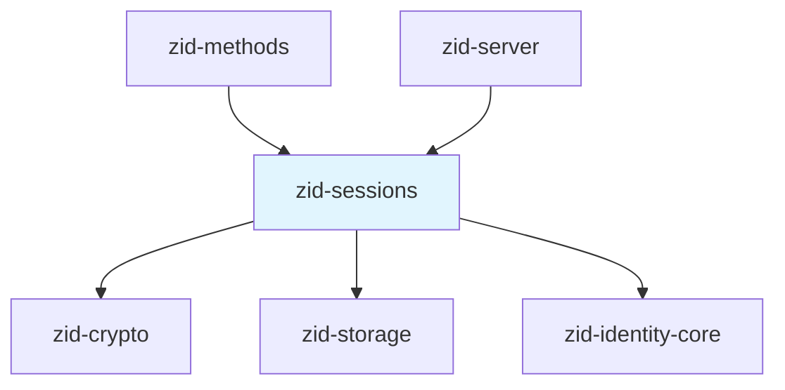
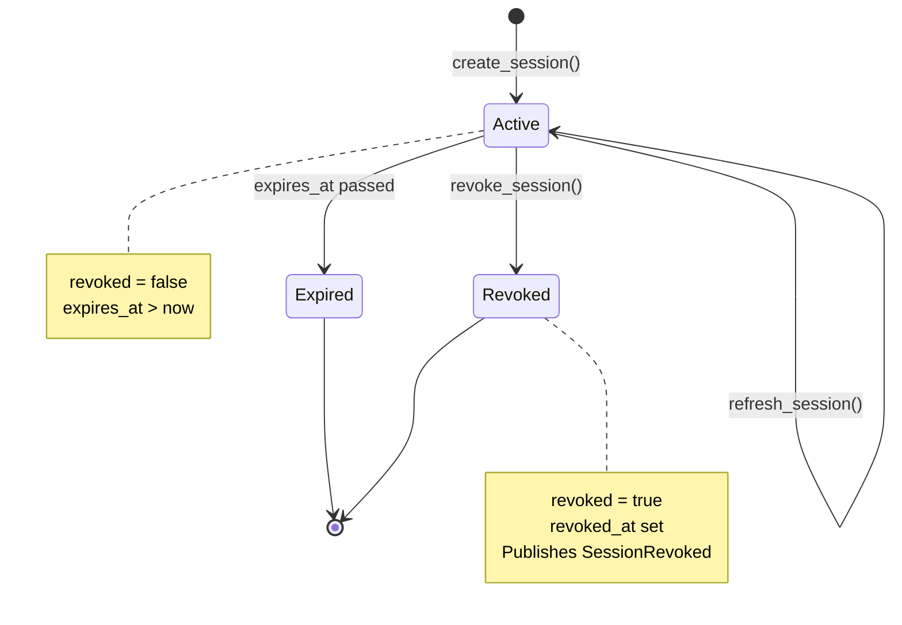
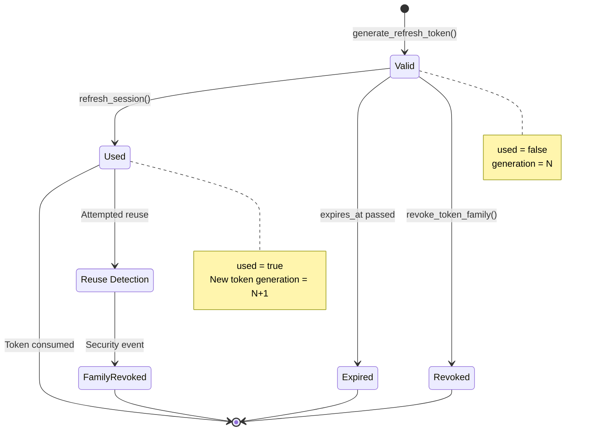
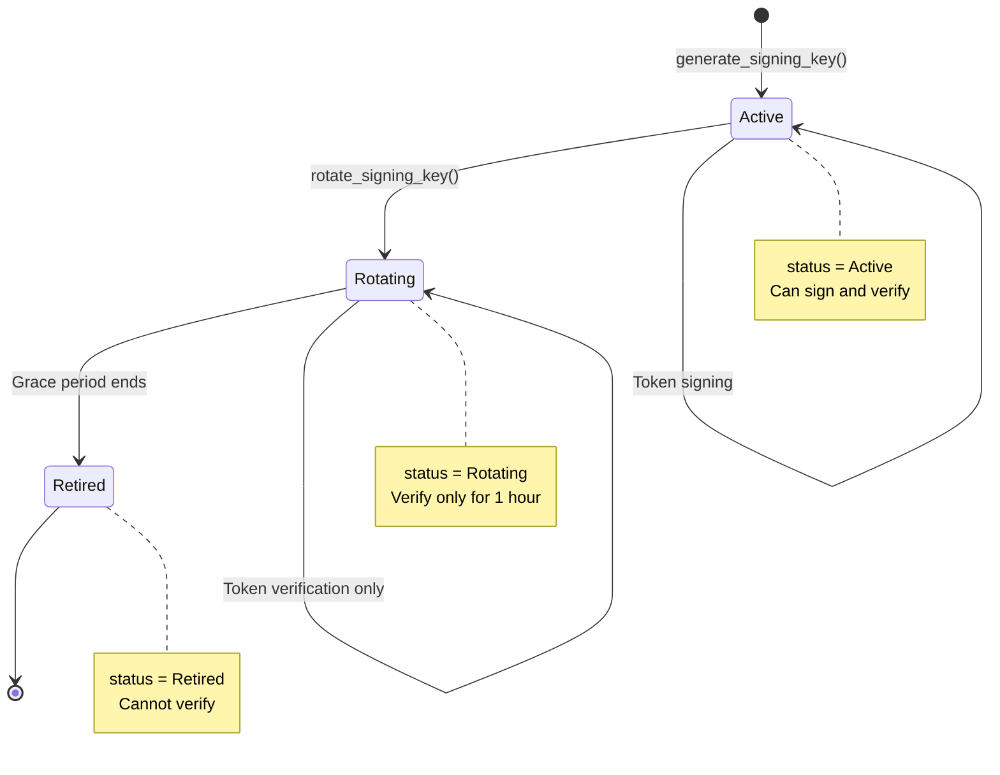
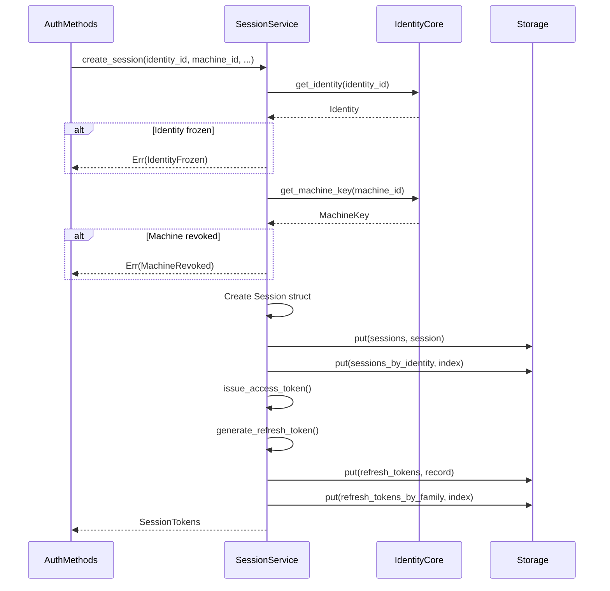
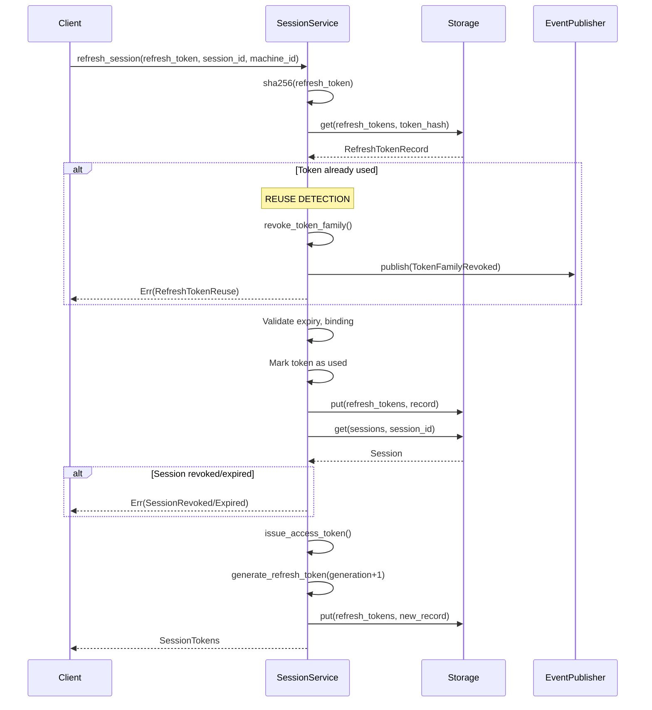
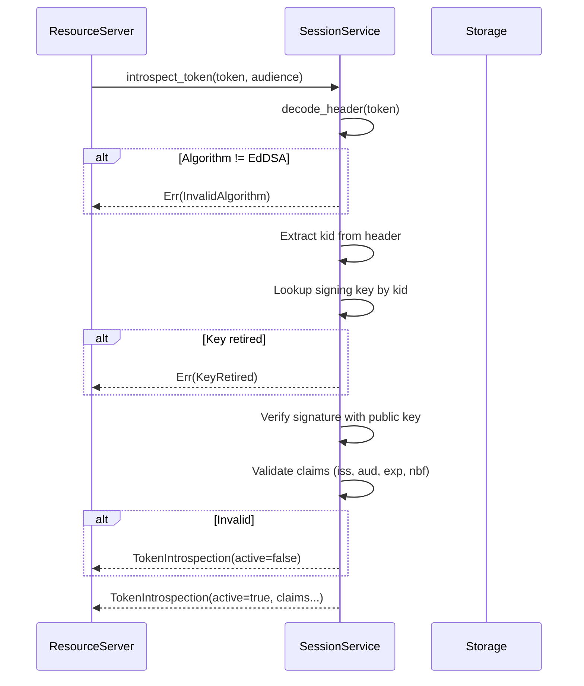
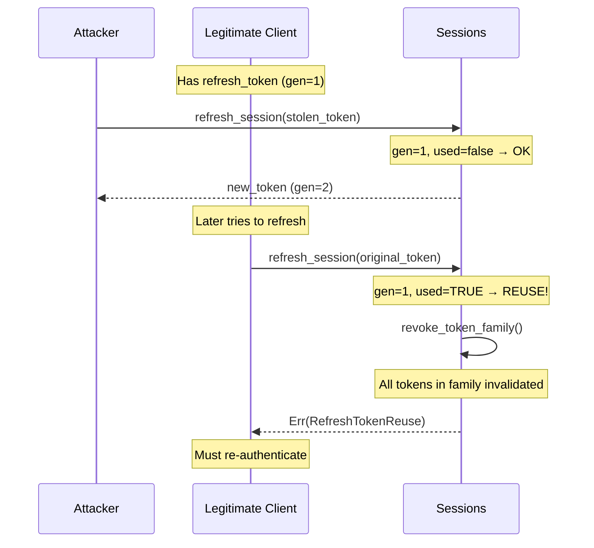

# zid-sessions Specification v0.1

## 1. Overview

The `zid-sessions` crate provides session management and JWT token operations for Zero-Auth. It handles session creation, token issuance/refresh, revocation, and token introspection with refresh token rotation and reuse detection.

### 1.1 Purpose and Responsibilities

- **Session Management**: Create, refresh, and revoke authenticated sessions
- **JWT Issuance**: Issue Ed25519-signed access tokens (EdDSA algorithm)
- **Refresh Tokens**: Generate and validate refresh tokens with rotation
- **Token Families**: Track token generations for reuse detection
- **Key Management**: Manage JWT signing keys with rotation support
- **Introspection**: Validate and introspect tokens for resource servers
- **JWKS**: Expose public keys for external token verification

### 1.2 Key Design Decisions

- **EdDSA Signing**: JWT tokens signed with Ed25519 (not RS256 or ES256)
- **Refresh Token Rotation**: Each refresh issues new token, old token invalidated
- **Token Family Tracking**: Reuse detection revokes entire token family
- **Encrypted Key Storage**: Private keys encrypted with service master key
- **Machine Binding**: Sessions and tokens bound to specific machine

### 1.3 Position in Dependency Graph



---

## 2. Public Interface

### 2.1 SessionManager Trait

```rust
#[async_trait]
pub trait SessionManager: Send + Sync {
    /// Create a new session and issue initial tokens
    async fn create_session(
        &self,
        identity_id: Uuid,
        machine_id: Uuid,
        namespace_id: Uuid,
        mfa_verified: bool,
        capabilities: Vec<String>,
        scope: Vec<String>,
    ) -> Result<SessionTokens>;

    /// Refresh a session using a refresh token
    async fn refresh_session(
        &self,
        refresh_token: String,
        session_id: Uuid,
        machine_id: Uuid,
    ) -> Result<SessionTokens>;

    /// Revoke a specific session
    async fn revoke_session(&self, session_id: Uuid) -> Result<()>;

    /// Revoke all sessions for an identity
    async fn revoke_all_sessions(&self, identity_id: Uuid) -> Result<()>;

    /// Revoke a token family (security event)
    async fn revoke_token_family(&self, token_family_id: Uuid) -> Result<()>;

    /// Get session information
    async fn get_session(&self, session_id: Uuid) -> Result<Session>;

    /// Verify and introspect a JWT token
    async fn introspect_token(
        &self,
        token: String,
        audience: Option<String>,
    ) -> Result<TokenIntrospection>;

    /// Get JWKS for public key distribution
    async fn get_jwks(&self) -> Result<JwksResponse>;

    /// Rotate JWT signing key (admin operation)
    async fn rotate_signing_key(&self) -> Result<String>;
}
```

### 2.2 EventPublisher Trait

```rust
#[async_trait]
pub trait EventPublisher: Send + Sync {
    async fn publish_revocation_event(&self, event: RevocationEvent) -> Result<()>;
}

/// No-op implementation for testing
pub struct NoOpEventPublisher;
```

### 2.3 SessionService

```rust
pub struct SessionService<S: Storage, I: IdentityCore, E: EventPublisher> {
    storage: Arc<S>,
    identity_core: Arc<I>,
    event_publisher: Arc<E>,
    issuer: String,
    default_audience: Vec<String>,
    access_token_ttl: u64,   // Default: 900 (15 min)
    refresh_token_ttl: u64,  // Default: 2592000 (30 days)
    signing_keys: Arc<RwLock<HashMap<String, JwtSigningKey>>>,
    current_key_id: Arc<RwLock<String>>,
    service_master_key: Zeroizing<[u8; 32]>,
}

impl<S: Storage, I: IdentityCore> SessionService<S, I, NoOpEventPublisher> {
    pub fn new(
        storage: Arc<S>,
        identity_core: Arc<I>,
        service_master_key: [u8; 32],
        issuer: String,
        default_audience: Vec<String>,
    ) -> Self;
}

impl<S: Storage, I: IdentityCore, E: EventPublisher> SessionService<S, I, E> {
    pub fn with_event_publisher(
        storage: Arc<S>,
        identity_core: Arc<I>,
        event_publisher: Arc<E>,
        service_master_key: [u8; 32],
        issuer: String,
        default_audience: Vec<String>,
        access_token_ttl: u64,
        refresh_token_ttl: u64,
    ) -> Self;

    /// Initialize with signing key (call on startup)
    pub async fn initialize(&self) -> Result<()>;
}
```

### 2.4 Types

#### Session

```rust
pub struct Session {
    pub session_id: Uuid,
    pub identity_id: Uuid,
    pub machine_id: Uuid,
    pub namespace_id: Uuid,
    pub token_family_id: Uuid,
    pub created_at: u64,
    pub expires_at: u64,
    pub last_activity_at: u64,
    pub revoked: bool,
    pub revoked_at: Option<u64>,
    pub revoked_reason: Option<String>,
}
```

#### RefreshTokenRecord

```rust
pub struct RefreshTokenRecord {
    pub token_hash: [u8; 32],
    pub session_id: Uuid,
    pub machine_id: Uuid,
    pub token_family_id: Uuid,
    pub generation: u32,          // Increments each refresh
    pub created_at: u64,
    pub expires_at: u64,
    pub used: bool,               // For reuse detection
    pub used_at: Option<u64>,
    pub revoked: bool,
    pub revoked_at: Option<u64>,
    pub revoked_reason: Option<String>,
}
```

#### JwtSigningKey

```rust
pub struct JwtSigningKey {
    pub key_id: [u8; 16],
    pub epoch: u64,
    pub private_key_encrypted: Vec<u8>,  // XChaCha20-Poly1305
    pub private_key_nonce: [u8; 24],
    pub public_key: [u8; 32],            // Ed25519
    pub created_at: u64,
    pub expires_at: Option<u64>,
    pub status: KeyStatus,
}

#[repr(u8)]
pub enum KeyStatus {
    Active = 0x01,
    Rotating = 0x02,
    Retired = 0x03,
}
```

#### TokenClaims

```rust
pub struct TokenClaims {
    // Standard JWT claims
    pub iss: String,              // Issuer
    pub sub: String,              // Subject (identity_id)
    pub aud: Vec<String>,         // Audience
    pub iat: u64,                 // Issued at
    pub exp: u64,                 // Expiration
    pub nbf: u64,                 // Not before
    pub jti: String,              // JWT ID

    // Zero-Auth custom claims
    pub machine_id: String,
    pub namespace_id: String,
    pub session_id: String,
    pub mfa_verified: bool,
    pub capabilities: Vec<String>,
    pub scope: Vec<String>,
    pub revocation_epoch: u64,    // Machine key epoch
}
```

#### SessionTokens

```rust
pub struct SessionTokens {
    pub access_token: String,
    pub refresh_token: String,
    pub session_id: Uuid,
    pub expires_in: u64,          // Seconds until access token expires
    pub token_type: String,       // "Bearer"
}
```

#### TokenIntrospection

```rust
pub struct TokenIntrospection {
    // Standard OAuth2 introspection
    pub active: bool,
    pub scope: Option<String>,
    pub client_id: Option<String>,
    pub username: Option<String>,
    pub token_type: Option<String>,
    pub exp: Option<u64>,
    pub iat: Option<u64>,
    pub nbf: Option<u64>,
    pub sub: Option<String>,
    pub aud: Option<Vec<String>>,
    pub iss: Option<String>,
    pub jti: Option<String>,

    // Zero-Auth specific
    pub identity_id: Uuid,
    pub machine_id: Uuid,
    pub namespace_id: Uuid,
    pub session_id: Uuid,
    pub mfa_verified: bool,
    pub capabilities: Vec<String>,
    pub scopes: Vec<String>,
    pub revocation_epoch: u64,
    pub issued_at: u64,
    pub expires_at: u64,
}
```

#### JWKS Types

```rust
pub struct JwksResponse {
    pub keys: Vec<JsonWebKey>,
}

pub struct JsonWebKey {
    pub kty: String,              // "OKP"
    pub use_: Option<String>,     // "sig"
    pub alg: Option<String>,      // "EdDSA"
    pub kid: Option<String>,      // Key ID
    pub crv: String,              // "Ed25519"
    pub x: String,                // Base64url public key
}
```

#### Revocation Events

Internal events used by the session service to communicate with the event publisher. These are transformed into the canonical `RevocationEvent` type (defined in `zid-identity-core`) before being published to the integrations subsystem.

> **Note**: This is an internal type for session-to-publisher communication. The canonical event type for external delivery is defined in `zid-identity-core`.

```rust
pub struct RevocationEvent {
    pub event_type: RevocationEventType,
    pub identity_id: Uuid,
    pub session_id: Option<Uuid>,
    pub machine_id: Option<Uuid>,
    pub token_family_id: Option<Uuid>,
    pub timestamp: u64,
    pub reason: Option<String>,
}

pub enum RevocationEventType {
    SessionRevoked,
    AllSessionsRevoked,
    TokenFamilyRevoked,
    MachineRevoked,
    IdentityFrozen,
}
```

### 2.5 Helper Functions

```rust
/// Generate N random bytes
pub fn generate_random_bytes<const N: usize>() -> [u8; N];

/// URL-safe base64 encoding (no padding)
pub fn base64_url_encode(data: &[u8]) -> String;

/// URL-safe base64 decoding
pub fn base64_url_decode(data: &str) -> Result<Vec<u8>, String>;

/// SHA-256 hash
pub fn sha256(data: &[u8]) -> [u8; 32];
```

### 2.6 Error Types

```rust
pub enum SessionError {
    SessionNotFound(Uuid),
    SessionExpired { session_id: Uuid, expired_at: u64 },
    SessionRevoked { reason: String },
    IdentityFrozen,
    MachineRevoked,
    TokenExpired,
    InvalidToken,
    InvalidAlgorithm { found: String },
    MissingKeyId,
    UnknownKeyId(String),
    KeyRetired { kid: String, retired_at: Option<u64> },
    RefreshTokenExpired,
    RefreshTokenReuse { token_family_id: Uuid, generation: u32 },
    RefreshTokenNotFound,
    SessionBindingMismatch,
    MachineBindingMismatch,
    TokenFamilyRevoked,
    TokenGenerationFailed { retry_allowed: bool, retry_until: u64, original_error: String },
    InvalidAudience,
    IdentityNotActive,
    StaleRevocationEpoch { token_epoch: u64, machine_epoch: u64, message: String },
    JwtEncodingError(jsonwebtoken::errors::Error),
    StorageError(StorageError),
    IdentityCoreError(IdentityCoreError),
    CryptoError(CryptoError),
    SerializationError(String),
    Other(String),
}

pub type Result<T> = std::result::Result<T, SessionError>;
```

---

## 3. State Machines

### 3.1 Session Lifecycle



### 3.2 Refresh Token Lifecycle



### 3.3 JWT Signing Key Lifecycle



---

## 4. Control Flow

### 4.1 Session Creation



### 4.2 Token Refresh with Rotation



### 4.3 Token Introspection



---

## 5. Data Structures

### 5.1 Storage Schema

| Column Family | Key | Value | Description |
|---------------|-----|-------|-------------|
| `sessions` | `session_id` | `Session` | Session records |
| `sessions_by_identity` | `(identity_id, session_id)` | `()` | Index |
| `sessions_by_token_hash` | `token_hash` | `session_id` | Access token lookup |
| `refresh_tokens` | `token_hash` | `RefreshTokenRecord` | Refresh tokens |
| `refresh_tokens_by_family` | `(family_id, generation)` | `token_hash` | Family index |
| `signing_keys` | `key_id` | `JwtSigningKey` | JWT signing keys |

### 5.2 JWT Token Format

```
Header:
{
  "alg": "EdDSA",
  "typ": "JWT",
  "kid": "key_epoch_0"
}

Payload:
{
  "iss": "https://auth.example.com",
  "sub": "550e8400-e29b-41d4-a716-446655440000",
  "aud": ["https://api.example.com"],
  "iat": 1705320000,
  "exp": 1705320900,
  "nbf": 1705320000,
  "jti": "unique-token-id",
  "machine_id": "...",
  "namespace_id": "...",
  "session_id": "...",
  "mfa_verified": true,
  "capabilities": ["AUTHENTICATE", "SIGN"],
  "scope": ["namespace:*:*"],
  "revocation_epoch": 0
}

Signature: Ed25519(header + payload)
```

### 5.3 JWKS Format

```json
{
  "keys": [
    {
      "kty": "OKP",
      "use": "sig",
      "alg": "EdDSA",
      "kid": "key_epoch_0",
      "crv": "Ed25519",
      "x": "<base64url-encoded-public-key>"
    }
  ]
}
```

### 5.4 Refresh Token Format

- 32 random bytes, base64url encoded (no padding)
- Stored as SHA-256 hash (never store raw token)
- Length: 43 characters

---

## 6. Security Considerations

### 6.1 Token Security

| Aspect | Implementation |
|--------|----------------|
| Algorithm | EdDSA (Ed25519) only, strict validation |
| Key storage | Private key encrypted with XChaCha20-Poly1305 |
| Key rotation | Graceful rotation with 1-hour overlap |
| Token binding | Machine ID in claims, verified on refresh |

### 6.2 Refresh Token Rotation

```
Token Family Tracking:
- Each session has a token_family_id
- Each refresh token has a generation number
- On refresh: old token marked used, new token generation = N+1
- On reuse detection: entire family revoked
```

### 6.3 Reuse Detection Flow



### 6.4 Validation Requirements

| Check | When | Error |
|-------|------|-------|
| Algorithm = EdDSA | Token verify | InvalidAlgorithm |
| Key ID present | Token verify | MissingKeyId |
| Key not retired | Token verify | KeyRetired |
| Issuer matches | Token verify | InvalidToken |
| Audience matches | Token verify | InvalidAudience |
| Not expired | Token verify | TokenExpired |
| Session binding | Refresh | SessionBindingMismatch |
| Machine binding | Refresh | MachineBindingMismatch |
| Identity not frozen | Create/Refresh | IdentityFrozen |
| Machine not revoked | Create/Refresh | MachineRevoked |

### 6.5 Revocation Epoch

- Each machine key has an `epoch` counter
- Token includes `revocation_epoch` claim
- Resource servers can check epoch against current machine epoch
- Stale epoch indicates key was rotated, token may be compromised

---

## 7. Dependencies

### 7.1 Internal Crate Dependencies

| Crate | Purpose |
|-------|---------|
| `zid-crypto` | Timestamps, key decryption |
| `zid-storage` | Persistent storage |
| `zid-identity-core` | Identity/machine lookup |

### 7.2 External Dependencies

| Crate | Version | Purpose |
|-------|---------|---------|
| `jsonwebtoken` | 9 | JWT encoding/decoding |
| `ed25519-dalek` | 2 | Ed25519 keys |
| `sha2` | 0.10 | SHA-256 hashing |
| `rand` | 0.8 | Random generation |
| `zeroize` | 1.7 | Secure memory clearing |
| `serde` | 1.0 | Serialization |
| `serde_json` | 1.0 | JSON serialization |
| `bincode` | 1.3 | Binary serialization |
| `uuid` | 1.0 | UUID handling |
| `tokio` | 1 | Async runtime |
| `async-trait` | 0.1 | Async trait support |
| `thiserror` | 1.0 | Error types |
| `tracing` | 0.1 | Logging |
| `base64` | 0.21 | Base64 encoding |

---

## 8. Constants Reference

```rust
// Token TTLs
const SESSION_TOKEN_EXPIRY_SECONDS: u64 = 900;   // 15 minutes (access token)
const REFRESH_TOKEN_EXPIRY_SECONDS: u64 = 2_592_000; // 30 days

// Key rotation grace period
const KEY_ROTATION_GRACE_PERIOD: u64 = 3600;     // 1 hour

// Key status codes
const KEY_STATUS_ACTIVE: u8 = 0x01;
const KEY_STATUS_ROTATING: u8 = 0x02;
const KEY_STATUS_RETIRED: u8 = 0x03;

// Token sizes
const REFRESH_TOKEN_BYTES: usize = 32;
const TOKEN_HASH_SIZE: usize = 32;
const KEY_ID_SIZE: usize = 16;

// JWKS constants
const JWK_KEY_TYPE: &str = "OKP";
const JWK_ALGORITHM: &str = "EdDSA";
const JWK_CURVE: &str = "Ed25519";
const JWK_USE: &str = "sig";
```
