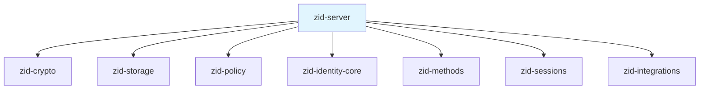
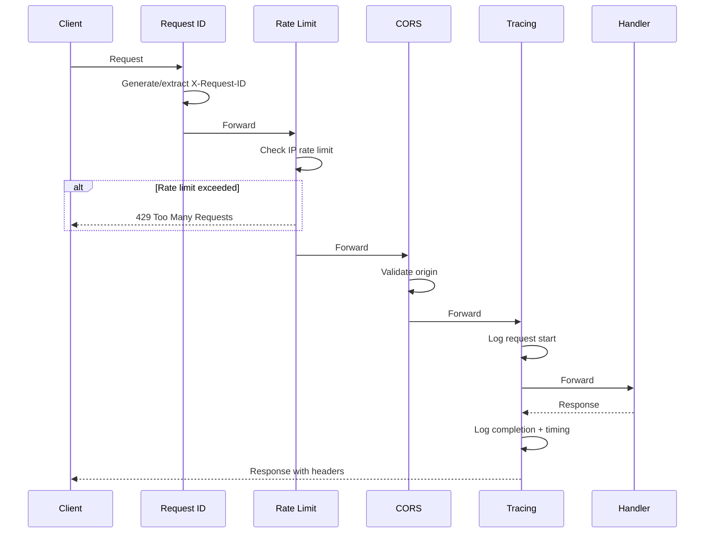
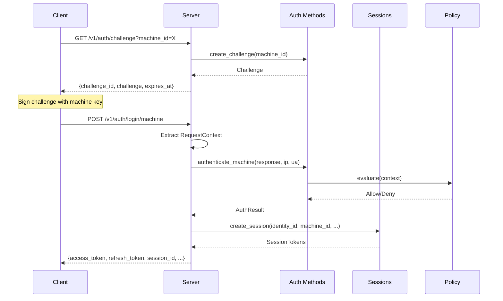
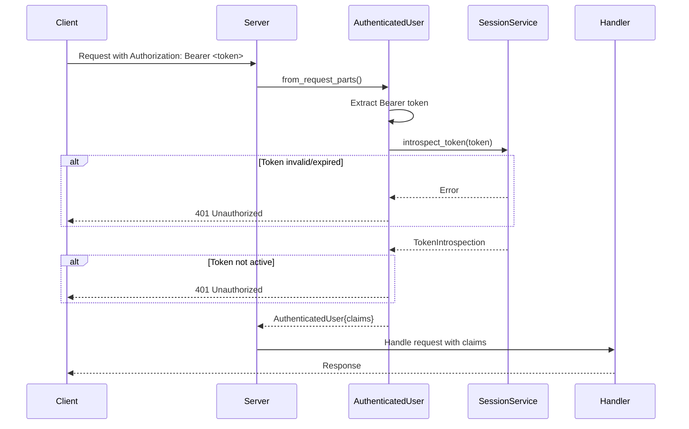

# zid-server Specification v0.1

## 1. Overview

The `zid-server` crate provides the HTTP API server for Zero-Auth. It exposes RESTful endpoints for identity management, authentication, session management, and service integrations using the Axum web framework.

### 1.1 Purpose and Responsibilities

- **API Gateway**: RESTful HTTP endpoints for all Zero-Auth operations
- **Request Handling**: Extract request context (IP, User-Agent) for audit and policy
- **Authentication**: JWT token validation via `AuthenticatedUser` extractor
- **Authorization**: Policy enforcement through middleware and handler checks
- **Rate Limiting**: IP-based rate limiting via policy engine middleware
- **Error Handling**: Consistent error response format with error codes
- **Integrations**: SSE streaming and mTLS service authentication
- **Health Checks**: Liveness and readiness probes for orchestration

### 1.2 Key Design Decisions

- **Axum Framework**: Type-safe extractors, tower middleware ecosystem
- **Shared State**: `AppState` holds all service instances (Arc-wrapped)
- **JWT Verification**: Tokens verified through session service introspection
- **Trusted Proxy**: X-Forwarded-For only trusted from configured proxy IPs
- **CORS Configuration**: Configurable allowed origins with credentials support
- **Graceful Shutdown**: SIGTERM/SIGINT handling for container orchestration

### 1.3 Position in Dependency Graph



---

## 2. Public Interface

### 2.1 Configuration

```rust
pub struct Config {
    pub bind_address: SocketAddr,           // Default: 127.0.0.1:9999
    pub database_path: PathBuf,             // Default: ./data/zid.db
    pub service_master_key: [u8; 32],       // Required in prod, random in dev
    pub jwt_issuer: String,                 // Default: https://zid.cypher.io
    pub jwt_audience: String,               // Default: zero-vault
    pub access_token_expiry: u64,           // Default: 900 (15 min)
    pub refresh_token_expiry: u64,          // Default: 2592000 (30 days)
    pub oauth_google: Option<OAuthProviderConfig>,
    pub oauth_x: Option<OAuthProviderConfig>,
    pub oauth_epic: Option<OAuthProviderConfig>,
    pub cors_allowed_origins: Vec<String>,  // Default: http://localhost:3000
    pub trusted_proxies: Vec<IpAddr>,       // Default: empty
}

pub struct OAuthProviderConfig {
    pub client_id: String,
    pub client_secret: String,     // Redacted in Debug output
    pub redirect_uri: String,
}

pub enum RunMode {
    Dev,   // Allows random service_master_key
    Prod,  // Requires SERVICE_MASTER_KEY env var
}
```

### 2.2 Application State

```rust
pub struct AppState {
    pub config: Config,
    pub storage: Arc<RocksDbStorage>,
    pub identity_service: Arc<IdentityService>,
    pub auth_service: Arc<AuthMethodsService<...>>,
    pub session_service: Arc<SessionService<...>>,
    pub integrations_service: Arc<IntegrationsService<...>>,
    pub policy_engine: Arc<PolicyEngine>,
}

impl AppState {
    pub async fn new(config: Config) -> Result<Self>;
}
```

### 2.3 Extractors

#### AuthenticatedUser

```rust
/// Extracts and validates JWT from Authorization header
pub struct AuthenticatedUser {
    pub claims: JwtClaims,
}

pub struct JwtClaims {
    pub sub: String,           // identity_id
    pub machine_id: String,
    pub mfa_verified: bool,
}

impl JwtClaims {
    pub fn identity_id(&self) -> Result<Uuid, ApiError>;
    pub fn machine_id(&self) -> Result<Uuid, ApiError>;
    pub fn require_mfa(&self) -> Result<(), ApiError>;
}
```

#### RequestContext

```rust
/// Extracts request metadata for audit and policy
pub struct RequestContext {
    pub ip_address: String,
    pub user_agent: String,
}

impl RequestContext {
    pub fn from_parts(parts: &Parts, trusted_proxies: &[IpAddr]) -> Self;
}
```

### 2.4 Error Types

```rust
pub enum ApiError {
    InvalidRequest(String),     // 400
    Unauthorized,               // 401
    Forbidden(String),          // 403
    NotFound(String),           // 404
    Conflict(String),           // 409
    RateLimited,                // 429
    IdentityFrozen,             // 403 IDENTITY_FROZEN
    MachineRevoked,             // 403 MACHINE_REVOKED
    MfaRequired,                // 403 MFA_REQUIRED
    ChallengeExpired,           // 400 CHALLENGE_EXPIRED
    InvalidSignature,           // 400 INVALID_SIGNATURE
    Internal(anyhow::Error),    // 500
}

pub struct ErrorResponse {
    pub error: ErrorDetails,
}

pub struct ErrorDetails {
    pub code: String,           // e.g., "INVALID_REQUEST"
    pub message: String,
    pub details: Option<Value>, // Additional context
}
```

---

## 3. API Endpoints

### 3.1 Health Endpoints

| Method | Path | Auth | Description |
|--------|------|------|-------------|
| GET | `/health` | None | Liveness probe |
| GET | `/ready` | None | Readiness probe (checks DB) |

#### Responses

```json
// GET /health
{
  "status": "ok",
  "version": "0.1.0",
  "timestamp": 1705320000
}

// GET /ready
{
  "status": "ready",
  "database": "connected",
  "timestamp": 1705320000
}
```

### 3.2 Authentication Endpoints

| Method | Path | Auth | Description |
|--------|------|------|-------------|
| GET | `/v1/auth/challenge` | None | Get challenge for machine auth |
| POST | `/v1/auth/login/machine` | None | Machine key login |
| POST | `/v1/auth/login/email` | None | Email+password login |
| POST | `/v1/auth/login/wallet` | None | Wallet signature login |
| GET | `/v1/auth/oauth/:provider` | None | Initiate OAuth login |
| POST | `/v1/auth/oauth/:provider/callback` | None | Complete OAuth login |
| POST | `/v1/auth/refresh` | None | Refresh session tokens |
| POST | `/v1/auth/introspect` | JWT | Introspect token |

#### Request/Response Examples

```json
// GET /v1/auth/challenge?machine_id=<uuid>
Response:
{
  "challenge_id": "550e8400-...",
  "challenge": "<base64-encoded>",
  "expires_at": "2026-01-21T10:00:00Z"
}

// POST /v1/auth/login/machine
Request:
{
  "challenge_id": "550e8400-...",
  "machine_id": "660f9511-...",
  "signature": "<hex-encoded-64-bytes>"
}

Response:
{
  "access_token": "eyJ...",
  "refresh_token": "...",
  "session_id": "770a8622-...",
  "machine_id": "660f9511-...",
  "expires_at": "2026-01-21T10:15:00Z"
}

// POST /v1/auth/login/email
Request:
{
  "email": "user@example.com",
  "password": "SecurePass123!",
  "machine_id": "660f9511-...",  // Optional
  "mfa_code": "123456"           // If MFA enabled
}

Response:
{
  "access_token": "eyJ...",
  "refresh_token": "...",
  "session_id": "770a8622-...",
  "machine_id": "660f9511-...",
  "expires_at": "2026-01-21T10:15:00Z",
  "warning": "Consider enrolling a real device..."  // If virtual machine
}

// POST /v1/auth/refresh
Request:
{
  "refresh_token": "...",
  "session_id": "770a8622-...",
  "machine_id": "660f9511-..."
}
```

### 3.3 Identity Endpoints

| Method | Path | Auth | Description |
|--------|------|------|-------------|
| POST | `/v1/identity` | None | Create identity (self-sovereign) |
| GET | `/v1/identity/:identity_id` | JWT | Get identity details |
| POST | `/v1/identity/freeze` | JWT | Freeze identity |
| POST | `/v1/identity/unfreeze` | JWT | Unfreeze identity |
| POST | `/v1/identity/recovery` | JWT | Neural key recovery |
| POST | `/v1/identity/rotation` | JWT+MFA | Neural key rotation |

#### Request/Response Examples

```json
// POST /v1/identity
Request:
{
  "identity_id": "550e8400-...",
  "identity_signing_public_key": "<hex-32-bytes>",
  "authorization_signature": "<hex-64-bytes>",
  "machine_key": {
    "machine_id": "660f9511-...",
    "signing_public_key": "<hex-32-bytes>",
    "encryption_public_key": "<hex-32-bytes>",
    "capabilities": ["AUTHENTICATE", "SIGN"],
    "device_name": "MacBook Pro",
    "device_platform": "macos"
  },
  "namespace_name": "Personal",
  "created_at": 1705320000
}

Response:
{
  "identity_id": "550e8400-...",
  "machine_id": "660f9511-...",
  "namespace_id": "550e8400-...",
  "created_at": "2026-01-21T10:00:00Z"
}

// GET /v1/identity/:identity_id
Response:
{
  "identity_id": "550e8400-...",
  "identity_signing_public_key": "<hex-32-bytes>",
  "status": "active",
  "created_at": "2026-01-21T10:00:00Z"
}

// POST /v1/identity/freeze
Request:
{
  "approver_machine_ids": ["660f9511-..."],
  "approval_signatures": ["<hex-64-bytes>"],
  "reason": "security_incident"
}
```

### 3.4 Machine Endpoints

| Method | Path | Auth | Description |
|--------|------|------|-------------|
| POST | `/v1/machines/enroll` | JWT | Enroll new machine |
| GET | `/v1/machines` | JWT | List machines |
| DELETE | `/v1/machines/:machine_id` | JWT | Revoke machine |

#### Request/Response Examples

```json
// POST /v1/machines/enroll
Request:
{
  "machine_id": "770a8622-...",
  "namespace_id": "550e8400-...",  // Optional, defaults to personal
  "signing_public_key": "<hex-32-bytes>",
  "encryption_public_key": "<hex-32-bytes>",
  "capabilities": ["AUTHENTICATE"],
  "device_name": "iPhone 15",
  "device_platform": "ios",
  "authorization_signature": "<hex-64-bytes>"
}

Response:
{
  "machine_id": "770a8622-...",
  "namespace_id": "550e8400-...",
  "enrolled_at": "2026-01-21T10:00:00Z"
}

// GET /v1/machines?namespace_id=<uuid>
Response:
{
  "machines": [
    {
      "machine_id": "660f9511-...",
      "device_name": "MacBook Pro",
      "device_platform": "macos",
      "created_at": "2026-01-21T10:00:00Z",
      "last_used_at": "2026-01-21T14:30:00Z",
      "revoked": false
    }
  ]
}

// DELETE /v1/machines/:machine_id
Request:
{
  "reason": "Device lost"
}
Response: 204 No Content
```

### 3.5 Namespace Endpoints

| Method | Path | Auth | Description |
|--------|------|------|-------------|
| POST | `/v1/namespaces` | JWT | Create namespace |
| GET | `/v1/namespaces` | JWT | List namespaces |
| GET | `/v1/namespaces/:namespace_id` | JWT | Get namespace |
| PATCH | `/v1/namespaces/:namespace_id` | JWT | Update namespace |
| POST | `/v1/namespaces/:namespace_id/deactivate` | JWT | Deactivate |
| POST | `/v1/namespaces/:namespace_id/reactivate` | JWT | Reactivate |
| DELETE | `/v1/namespaces/:namespace_id` | JWT | Delete namespace |
| GET | `/v1/namespaces/:namespace_id/members` | JWT | List members |
| POST | `/v1/namespaces/:namespace_id/members` | JWT | Add member |
| PATCH | `/v1/namespaces/:namespace_id/members/:identity_id` | JWT | Update member |
| DELETE | `/v1/namespaces/:namespace_id/members/:identity_id` | JWT | Remove member |

### 3.6 MFA Endpoints

| Method | Path | Auth | Description |
|--------|------|------|-------------|
| POST | `/v1/mfa/setup` | JWT | Setup MFA (returns QR code) |
| DELETE | `/v1/mfa` | JWT | Disable MFA |

### 3.7 Credential Endpoints

| Method | Path | Auth | Description |
|--------|------|------|-------------|
| POST | `/v1/credentials/email` | JWT | Add email credential |
| POST | `/v1/credentials/oauth/:provider` | JWT | Initiate OAuth link |
| POST | `/v1/credentials/oauth/:provider/callback` | JWT | Complete OAuth link |

### 3.8 Session Endpoints

| Method | Path | Auth | Description |
|--------|------|------|-------------|
| POST | `/v1/session/revoke` | JWT | Revoke session |
| POST | `/v1/session/revoke-all` | JWT+MFA | Revoke all sessions |
| GET | `/.well-known/jwks.json` | None | JWKS endpoint |

#### JWKS Response

```json
{
  "keys": [
    {
      "kty": "OKP",
      "kid": "key_epoch_0",
      "alg": "EdDSA",
      "use": "sig",
      "crv": "Ed25519",
      "x": "<base64url-public-key>"
    }
  ]
}
```

### 3.9 Integration Endpoints

| Method | Path | Auth | Description |
|--------|------|------|-------------|
| POST | `/v1/integrations/register` | mTLS | Register service |
| GET | `/v1/events/stream` | mTLS | SSE event stream |

#### mTLS Authentication

```
Required Headers (set by reverse proxy):
- X-Client-Cert-Fingerprint: <sha256-hex>
  OR
- X-Client-Cert: <pem-encoded>
```

---

## 4. Middleware Stack

### 4.1 Middleware Order (Last Added = First Executed)



### 4.2 Request ID Middleware

```rust
/// Generates or extracts X-Request-ID header
/// Logs request start and completion with timing
pub async fn request_id_middleware(
    State(state): State<Arc<AppState>>,
    mut req: Request<Body>,
    next: Next,
) -> Result<Response<Body>, StatusCode>;
```

### 4.3 Rate Limit Middleware

```rust
/// Enforces IP-based rate limits using policy engine
/// Returns 429 with Retry-After header when exceeded
pub async fn rate_limit_middleware(
    State(state): State<Arc<AppState>>,
    req: Request<Body>,
    next: Next,
) -> Result<Response<Body>, StatusCode>;
```

Response headers on success:
- `X-RateLimit-Limit`: Maximum attempts allowed
- `X-RateLimit-Remaining`: Remaining attempts
- `X-RateLimit-Reset`: Unix timestamp when limit resets

---

## 5. Control Flow

### 5.1 Authentication Flow



### 5.2 Authenticated Request Flow



### 5.3 Client IP Extraction

```mermaid
flowchart TD
    A[Request arrives] --> B{Has ConnectInfo?}
    B -->|No| C[Return "unknown"]
    B -->|Yes| D{Direct IP in trusted_proxies?}
    D -->|No| E[Return direct IP]
    D -->|Yes| F{Has X-Forwarded-For?}
    F -->|No| G{Has X-Real-IP?}
    F -->|Yes| H[Parse rightmost IP]
    G -->|No| E
    G -->|Yes| I[Return X-Real-IP]
    H -->|Valid| J[Return forwarded IP]
    H -->|Invalid| G
```

---

## 6. Security Considerations

### 6.1 Authentication

| Aspect | Implementation |
|--------|----------------|
| JWT Verification | Full signature verification via session service |
| Token Binding | Machine ID in claims, verified against session |
| MFA Requirement | `require_mfa()` check for sensitive operations |
| Revocation Check | Token introspection validates session state |

### 6.2 Request Security

| Aspect | Implementation |
|--------|----------------|
| IP Extraction | X-Forwarded-For only from trusted proxies |
| Rate Limiting | IP-based via policy engine |
| CORS | Configurable origins, credentials allowed |
| Request ID | Propagated for tracing |

### 6.3 mTLS for Integrations

| Aspect | Implementation |
|--------|----------------|
| Certificate Source | Only from proxy headers, never request body |
| Fingerprint Validation | BLAKE3 hash of certificate |
| Service Binding | Fingerprint must match registered service |

### 6.4 Operations Requiring MFA

| Endpoint | Reason |
|----------|--------|
| POST /v1/identity/rotation | Neural key rotation |
| POST /v1/session/revoke-all | Mass session revocation |

### 6.5 Error Information Disclosure

```rust
// Internal errors never expose details to client
ApiError::Internal(err) => {
    tracing::error!("Internal error: {:?}", err);
    (500, "INTERNAL_ERROR", "An internal error occurred", None)
}
```

---

## 7. Environment Variables

| Variable | Required | Default | Description |
|----------|----------|---------|-------------|
| `RUN_MODE` | No | `prod` | `dev` or `prod` |
| `BIND_ADDRESS` | No | `127.0.0.1:9999` | Server bind address |
| `DATABASE_PATH` | No | `./data/zid.db` | RocksDB path |
| `SERVICE_MASTER_KEY` | Prod only | Random in dev | 32-byte hex key |
| `JWT_ISSUER` | No | `https://zid.cypher.io` | JWT issuer claim |
| `JWT_AUDIENCE` | No | `zero-vault` | JWT audience claim |
| `ACCESS_TOKEN_EXPIRY_SECONDS` | No | `900` | Access token TTL |
| `REFRESH_TOKEN_EXPIRY_SECONDS` | No | `2592000` | Refresh token TTL |
| `CORS_ALLOWED_ORIGINS` | No | `http://localhost:3000` | Comma-separated |
| `TRUSTED_PROXIES` | No | (empty) | Comma-separated IPs |
| `OAUTH_GOOGLE_CLIENT_ID` | No | — | Google OAuth |
| `OAUTH_GOOGLE_CLIENT_SECRET` | No | — | Google OAuth |
| `OAUTH_GOOGLE_REDIRECT_URI` | No | — | Google OAuth |
| `OAUTH_X_CLIENT_ID` | No | — | X OAuth |
| `OAUTH_X_CLIENT_SECRET` | No | — | X OAuth |
| `OAUTH_X_REDIRECT_URI` | No | — | X OAuth |
| `OAUTH_EPIC_CLIENT_ID` | No | — | Epic OAuth |
| `OAUTH_EPIC_CLIENT_SECRET` | No | — | Epic OAuth |
| `OAUTH_EPIC_REDIRECT_URI` | No | — | Epic OAuth |

---

## 8. Dependencies

### 8.1 Internal Crate Dependencies

| Crate | Purpose |
|-------|---------|
| `zid-crypto` | Signature verification, timestamps |
| `zid-storage` | RocksDB storage backend |
| `zid-policy` | Rate limiting, policy evaluation |
| `zid-identity-core` | Identity and machine operations |
| `zid-methods` | Authentication methods |
| `zid-sessions` | Session and token management |
| `zid-integrations` | Service registration, SSE |

### 8.2 External Dependencies

| Crate | Version | Purpose |
|-------|---------|---------|
| `axum` | 0.7 | Web framework |
| `tower-http` | 0.5 | CORS, tracing layers |
| `tokio` | 1 | Async runtime |
| `tokio-stream` | 0.1 | Stream utilities |
| `futures` | 0.3 | Future utilities |
| `serde` | 1.0 | Serialization |
| `serde_json` | 1.0 | JSON serialization |
| `tracing` | 0.1 | Structured logging |
| `tracing-subscriber` | 0.3 | Log formatting |
| `thiserror` | 1.0 | Error types |
| `anyhow` | 1.0 | Error handling |
| `uuid` | 1.0 | UUID handling |
| `chrono` | 0.4 | Timestamps |
| `hex` | 0.4 | Hex encoding |
| `base64` | 0.21 | Base64 encoding |
| `rand` | 0.8 | Random generation |

---

## 9. Router Configuration

```rust
Router::new()
    // Health checks
    .route("/health", get(health_check))
    .route("/ready", get(readiness_check))
    
    // Identity management
    .route("/v1/identity", post(create_identity))
    .route("/v1/identity/:identity_id", get(get_identity))
    .route("/v1/identity/freeze", post(freeze_identity))
    .route("/v1/identity/unfreeze", post(unfreeze_identity))
    .route("/v1/identity/recovery", post(recovery_ceremony))
    .route("/v1/identity/rotation", post(rotation_ceremony))
    
    // Machine management
    .route("/v1/machines/enroll", post(enroll_machine))
    .route("/v1/machines", get(list_machines))
    .route("/v1/machines/:machine_id", delete(revoke_machine))
    
    // Namespaces
    .route("/v1/namespaces", post(create_namespace))
    .route("/v1/namespaces", get(list_namespaces))
    .route("/v1/namespaces/:namespace_id", get(get_namespace))
    .route("/v1/namespaces/:namespace_id", patch(update_namespace))
    .route("/v1/namespaces/:namespace_id/deactivate", post(deactivate))
    .route("/v1/namespaces/:namespace_id/reactivate", post(reactivate))
    .route("/v1/namespaces/:namespace_id", delete(delete_namespace))
    .route("/v1/namespaces/:namespace_id/members", get(list_members))
    .route("/v1/namespaces/:namespace_id/members", post(add_member))
    .route("/v1/namespaces/:namespace_id/members/:identity_id", patch(update_member))
    .route("/v1/namespaces/:namespace_id/members/:identity_id", delete(remove_member))
    
    // Authentication
    .route("/v1/auth/challenge", get(get_challenge))
    .route("/v1/auth/login/machine", post(login_machine))
    .route("/v1/auth/login/email", post(login_email))
    .route("/v1/auth/login/wallet", post(login_wallet))
    .route("/v1/auth/oauth/:provider", get(oauth_initiate))
    .route("/v1/auth/oauth/:provider/callback", post(oauth_complete))
    
    // MFA
    .route("/v1/mfa/setup", post(setup_mfa))
    .route("/v1/mfa", delete(disable_mfa))
    
    // Credentials
    .route("/v1/credentials/email", post(add_email_credential))
    .route("/v1/credentials/oauth/:provider", post(initiate_oauth_link))
    .route("/v1/credentials/oauth/:provider/callback", post(complete_oauth_link))
    
    // Sessions
    .route("/v1/auth/refresh", post(refresh_session))
    .route("/v1/session/revoke", post(revoke_session))
    .route("/v1/session/revoke-all", post(revoke_all_sessions))
    .route("/v1/auth/introspect", post(introspect_token))
    .route("/.well-known/jwks.json", get(jwks_endpoint))
    
    // Integrations
    .route("/v1/integrations/register", post(register_service))
    .route("/v1/events/stream", get(event_stream))
    
    // Middleware (reverse order of execution)
    .layer(TraceLayer::new_for_http())
    .layer(CorsLayer::...)
    .layer(rate_limit_middleware)
    .layer(request_id_middleware)
    .with_state(state)
```
