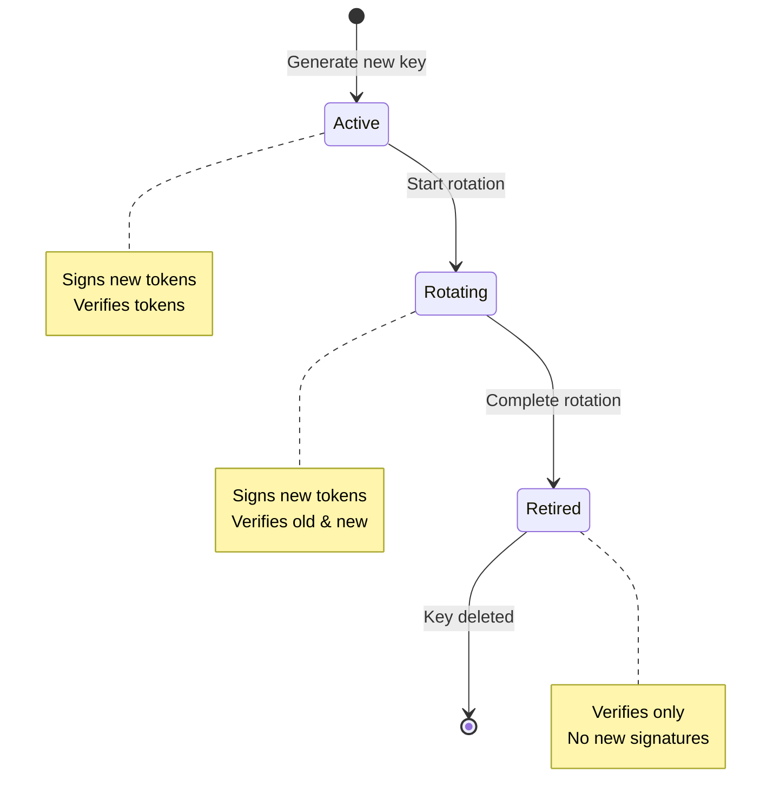

# Cryptographic Primitives Specification v0.1

## 1. Overview

This document specifies the cryptographic primitives, algorithms, and binary formats used throughout Zero-Auth. All implementations MUST conform to these specifications to ensure interoperability and security.

### 1.1 Design Principles

- **Modern Algorithms**: Use well-vetted, modern cryptographic primitives
- **Quantum Resistance Preparation**: Key sizes and algorithms chosen to provide long-term security
- **Domain Separation**: All derivations use unique domain strings to prevent cross-protocol attacks
- **Memory Safety**: Sensitive data is zeroized immediately after use

---

## 2. Cryptographic Libraries

| Primitive | Library | Version | Algorithm |
|-----------|---------|---------|-----------|
| Signing | `ed25519-dalek` | 2.0 | Ed25519 (RFC 8032) |
| Key Exchange | `x25519-dalek` | 2.0 | X25519 (RFC 7748) |
| AEAD Encryption | `chacha20poly1305` | 0.10 | XChaCha20-Poly1305 |
| Key Derivation | `hkdf` + `sha2` | 0.12 | HKDF-SHA256 (RFC 5869) |
| Fast Hashing | `blake3` | 1.5 | BLAKE3 |
| Password Hashing | `argon2` | 0.5 | Argon2id (RFC 9106) |
| Secret Sharing | `sharks` | 0.5 | Shamir over GF(256) |
| EVM Signatures | `k256` | 0.13 | SECP256k1 ECDSA |
| Ethereum Hashing | `sha3` | 0.10 | Keccak-256 |
| JWT Signing | `jsonwebtoken` | 9.2 | EdDSA (Ed25519) |
| Webhook MAC | `hmac` + `sha2` | 0.12 | HMAC-SHA256 |
| Secure Memory | `zeroize` | 1.7 | Memory zeroization |
| CSPRNG | `getrandom` | 0.2 | OS/Browser RNG (WASM compatible) |

---

## 3. Cryptographic Constants

### 3.1 Key and Signature Sizes

#### Classical Cryptography

| Constant | Value | Description |
|----------|-------|-------------|
| `NEURAL_KEY_SIZE` | 32 bytes | Root secret size (256 bits) |
| `PUBLIC_KEY_SIZE` | 32 bytes | Ed25519/X25519 public keys |
| `PRIVATE_KEY_SIZE` | 32 bytes | Ed25519/X25519 private keys |
| `SIGNATURE_SIZE` | 64 bytes | Ed25519 signatures |
| `NONCE_SIZE` | 24 bytes | XChaCha20-Poly1305 nonce (192 bits) |
| `TAG_SIZE` | 16 bytes | AEAD authentication tag (128 bits) |
| `HKDF_OUTPUT_SIZE` | 32 bytes | HKDF-SHA256 output |

#### Post-Quantum Cryptography (NIST Level 3)

| Constant | Value | Description |
|----------|-------|-------------|
| `ML_DSA_65_PUBLIC_KEY_SIZE` | 1,952 bytes | ML-DSA-65 public key |
| `ML_DSA_65_SECRET_KEY_SIZE` | 4,032 bytes | ML-DSA-65 secret key |
| `ML_DSA_65_SIGNATURE_SIZE` | 3,309 bytes | ML-DSA-65 signature |
| `ML_DSA_65_SEED_SIZE` | 32 bytes | ML-DSA-65 seed for keygen |
| `ML_KEM_768_PUBLIC_KEY_SIZE` | 1,184 bytes | ML-KEM-768 encapsulation key |
| `ML_KEM_768_SECRET_KEY_SIZE` | 2,400 bytes | ML-KEM-768 decapsulation key |
| `ML_KEM_768_CIPHERTEXT_SIZE` | 1,088 bytes | ML-KEM-768 ciphertext |
| `ML_KEM_768_SHARED_SECRET_SIZE` | 32 bytes | ML-KEM-768 shared secret |
| `ML_KEM_768_SEED_SIZE` | 64 bytes | ML-KEM-768 seed (d || z) |

### 3.2 Timing Constants

| Constant | Value | Description |
|----------|-------|-------------|
| `CHALLENGE_EXPIRY_SECONDS` | 60 | Authentication challenge lifetime |
| `SESSION_TOKEN_EXPIRY_SECONDS` | 900 | Access token lifetime (15 min) |
| `REFRESH_TOKEN_EXPIRY_SECONDS` | 2,592,000 | Refresh token lifetime (30 days) |
| `APPROVAL_EXPIRY_SECONDS` | 900 | Approval ceremony lifetime (15 min) |
| `OPERATION_EXPIRY_SECONDS` | 3,600 | Operation ceremony lifetime (1 hour) |

### 3.3 Shamir Secret Sharing

| Constant | Value | Description |
|----------|-------|-------------|
| `SHAMIR_THRESHOLD` | 3 | Minimum shards to reconstruct |
| `SHAMIR_TOTAL_SHARES` | 5 | Total shards generated |

### 3.4 MFA Constants

| Constant | Value | Description |
|----------|-------|-------------|
| `MFA_BACKUP_CODES_COUNT` | 10 | Backup codes per identity |
| `TOTP_DIGITS` | 6 | TOTP code length |
| `TOTP_STEP` | 30 | TOTP time step in seconds |
| `TOTP_ALGORITHM` | SHA-256 | Improved security over RFC 6238 default |

---

## 4. Domain Separation Strings

All domain strings follow the format: `cypher:{service}:{purpose}:v{version}`

### 4.1 Identity and Machine Keys

| Domain String | Purpose | Concatenated With |
|---------------|---------|-------------------|
| `cypher:id:identity:v1` | Identity Signing Key derivation | `identity_id` |
| `cypher:shared:machine:v1` | Machine seed derivation | `identity_id \|\| machine_id \|\| epoch` |
| `cypher:shared:machine:sign:v1` | Machine signing key (Ed25519) | `machine_id` |
| `cypher:shared:machine:encrypt:v1` | Machine encryption key (X25519) | `machine_id` |
| `cypher:shared:machine:pq-sign:v1` | Machine PQ signing key (ML-DSA-65) | `machine_id` |
| `cypher:shared:machine:pq-kem:v1` | Machine PQ KEM key (ML-KEM-768) | `machine_id` |

### 4.2 Session and MFA

| Domain String | Purpose | Concatenated With |
|---------------|---------|-------------------|
| `cypher:id:jwt:v1` | JWT signing key seed | `key_epoch` |
| `cypher:id:mfa-kek:v1` | MFA KEK derivation | `identity_id` |
| `cypher:id:mfa-totp:v1` | MFA TOTP AAD | `identity_id` |

### 4.3 Recovery

| Domain String | Purpose | Concatenated With |
|---------------|---------|-------------------|
| `cypher:share-backup-kek:v1` | Recovery share backup KEK | `identity_id` |
| `cypher:share-backup:v1` | Recovery share backup AAD | `identity_id \|\| share_index` |

### 4.4 Vault (Future)

| Domain String | Purpose | Concatenated With |
|---------------|---------|-------------------|
| `cypher:vault:svk:v1` | Shared Vault Key derivation | `cell_id \|\| vault_id` |
| `cypher:vault:vdek:v1` | Vault Data Encryption Key | `cell_id \|\| vault_id \|\| vdek_epoch` |
| `cypher:vault:signing:v1` | Signing key client share | `cell_id \|\| vault_id \|\| key_id \|\| scheme \|\| chain_id` |

---

## 5. Key Derivation Hierarchy

### 5.1 Full Derivation Tree

```
NeuralKey (32 bytes, client-generated via CSPRNG)
│
├─── Identity Signing Key (Ed25519)
│    │
│    │   Derivation:
│    │     ikm = neural_key.as_bytes()
│    │     info = "cypher:id:identity:v1" || identity_id.as_bytes()
│    │     seed = HKDF-SHA256-Expand(ikm, info, 32)
│    │     keypair = Ed25519::from_seed(seed)
│    │
│    └─── Purpose: Signs machine enrollments, key rotations, recovery approvals
│
├─── Machine Keys (per machine_id, epoch)
│    │
│    │   Machine Seed Derivation:
│    │     ikm = neural_key.as_bytes()
│    │     info = "cypher:shared:machine:v1" || identity_id || machine_id || epoch.to_le_bytes()
│    │     machine_seed = HKDF-SHA256-Expand(ikm, info, 32)
│    │
│    ├─── Machine Signing Key (Ed25519)
│    │    │
│    │    │   Derivation:
│    │    │     ikm = machine_seed
│    │    │     info = "cypher:shared:machine:sign:v1" || machine_id
│    │    │     seed = HKDF-SHA256-Expand(ikm, info, 32)
│    │    │     keypair = Ed25519::from_seed(seed)
│    │    │
│    │    └─── Purpose: Signs authentication challenges
│    │
│    └─── Machine Encryption Key (X25519)
│         │
│         │   Derivation:
│         │     ikm = machine_seed
│         │     info = "cypher:shared:machine:encrypt:v1" || machine_id
│         │     seed = HKDF-SHA256-Expand(ikm, info, 32)
│         │     keypair = X25519::from_bytes(seed)
│         │
│         └─── Purpose: ECDH key agreement, data encryption
│
└─── MFA KEK
     │
     │   Derivation:
     │     ikm = neural_key.as_bytes()
     │     info = "cypher:id:mfa-kek:v1" || identity_id
     │     kek = HKDF-SHA256-Expand(ikm, info, 32)
     │
     └─── Purpose: Encrypts MFA TOTP secrets at rest
```

### 5.2 HKDF Implementation

```rust
use hkdf::Hkdf;
use sha2::Sha256;

fn derive_key(ikm: &[u8], info: &[u8]) -> [u8; 32] {
    let hk = Hkdf::<Sha256>::new(None, ikm);
    let mut output = [0u8; 32];
    hk.expand(info, &mut output)
        .expect("HKDF output length is valid");
    output
}
```

---

## 6. Encryption Specification

### 6.1 XChaCha20-Poly1305

Used for all symmetric encryption:

```rust
use chacha20poly1305::{
    aead::{Aead, KeyInit},
    XChaCha20Poly1305, XNonce,
};

fn encrypt(
    key: &[u8; 32],
    plaintext: &[u8],
    nonce: &[u8; 24],
    aad: &[u8],
) -> Vec<u8> {
    let cipher = XChaCha20Poly1305::new(key.into());
    let nonce = XNonce::from_slice(nonce);
    
    cipher.encrypt(nonce, aead::Payload { msg: plaintext, aad })
        .expect("encryption failure")
}

fn decrypt(
    key: &[u8; 32],
    ciphertext: &[u8],
    nonce: &[u8; 24],
    aad: &[u8],
) -> Result<Vec<u8>, Error> {
    let cipher = XChaCha20Poly1305::new(key.into());
    let nonce = XNonce::from_slice(nonce);
    
    cipher.decrypt(nonce, aead::Payload { msg: ciphertext, aad })
        .map_err(|_| Error::DecryptionFailed)
}
```

### 6.2 Ciphertext Format

```
┌────────────────────────────────────────────────────┐
│                    Ciphertext                      │
├────────────────────────────────────────────────────┤
│  Encrypted data (variable length)                  │
│  ...                                               │
├────────────────────────────────────────────────────┤
│  Poly1305 tag (16 bytes)                           │
└────────────────────────────────────────────────────┘

Total size = plaintext_len + 16 bytes
```

---

## 7. Password Hashing (Argon2id)

### 7.1 Parameters

| Parameter | Value | Description |
|-----------|-------|-------------|
| `MEMORY_COST` | 65,536 (64 MiB) | Memory usage |
| `TIME_COST` | 3 | Iterations |
| `PARALLELISM` | 1 | Threads |
| `OUTPUT_LENGTH` | 32 | Hash output size |
| `VERSION` | 0x13 | Argon2 v1.3 |

### 7.2 Implementation

```rust
use argon2::{Argon2, Algorithm, Params, Version};

fn hash_password(password: &[u8], salt: &[u8; 32]) -> [u8; 32] {
    let params = Params::new(65536, 3, 1, Some(32))
        .expect("valid params");
    let argon2 = Argon2::new(Algorithm::Argon2id, Version::V0x13, params);
    
    let mut output = [0u8; 32];
    argon2.hash_password_into(password, salt, &mut output)
        .expect("hashing failure");
    output
}
```

---

## 8. Shamir Secret Sharing

### 8.1 Configuration

- **Threshold**: 3 shares required
- **Total Shares**: 5 shares generated
- **Field**: GF(256) (Galois Field with 256 elements)

### 8.2 Neural Shard Format

```
┌─────────────────────────────────────────────────────┐
│              Neural Shard (33 bytes)                │
├─────────────────────────────────────────────────────┤
│  Share Index (1 byte)    │ X-coordinate in GF(256) │
├─────────────────────────────────────────────────────┤
│  Share Data (32 bytes)   │ Y-coordinates           │
└─────────────────────────────────────────────────────┘
```

### 8.3 Storage Model (2+1 Split)

```
Neural Key (32 bytes)
    │
    └── split_neural_key() → 5 Neural Shards
            │
            ├── Shards 0,1: Encrypted on device (with passphrase-derived KEK)
            │               - Each: 33 bytes plaintext + 16 bytes tag = 49 bytes
            │
            └── Shards 2,3,4: Given to user (hex-encoded, 66 characters each)
                              - Store in separate secure locations
                              - Any 1 + device = 3 shards = threshold

Login:
    Passphrase → KEK → Decrypt(Shard 0, Shard 1)
    User provides 1 of {Shard 2, 3, 4}
    combine_shards([0, 1, user]) → Neural Key
```

---

## 9. Binary Message Formats

### 9.1 Identity Creation Authorization (137 bytes)

```
Offset  Size  Field
------  ----  -----
0       1     Version (0x01)
1       16    Identity ID (UUID, big-endian)
17      32    Identity Signing Public Key
49      16    Machine ID (UUID, big-endian)
65      32    Machine Signing Public Key
97      32    Machine Encryption Public Key
129     8     Created At (Unix timestamp, big-endian u64)
------  ----
Total:  137 bytes

Signature = Ed25519_Sign(ISK_private, message[0:137])
```

### 9.2 Machine Enrollment Authorization (109 bytes)

```
Offset  Size  Field
------  ----  -----
0       1     Version (0x01)
1       16    Machine ID (UUID, big-endian)
17      16    Namespace ID (UUID, big-endian)
33      32    Machine Signing Public Key
65      32    Machine Encryption Public Key
97      4     Capabilities (bitflags, big-endian u32)
101     8     Created At (Unix timestamp, big-endian u64)
------  ----
Total:  109 bytes

Signature = Ed25519_Sign(ISK_private, message[0:109])
```

### 9.3 Challenge (Variable, ~130 bytes)

```rust
#[derive(Serialize, Deserialize)]
pub struct Challenge {
    pub challenge_id: Uuid,      // 16 bytes as string
    pub machine_id: Uuid,        // 16 bytes as string
    pub nonce: [u8; 32],         // 32 bytes, hex-encoded
    pub issued_at: u64,          // 8 bytes
    pub expires_at: u64,         // 8 bytes
    pub entity_type: EntityType, // ~10 bytes
}

// Canonicalization for signing:
canonical_bytes = serde_json::to_vec(&challenge)
signature = Ed25519_Sign(machine_signing_key, blake3(canonical_bytes))
```

### 9.4 Recovery Approval (73 bytes)

```
Offset  Size  Field
------  ----  -----
0       1     Version (0x01)
1       16    Identity ID (UUID, big-endian)
17      16    Recovery Machine ID (UUID, big-endian)
33      32    Recovery Signing Key (Ed25519 public key)
65      8     Timestamp (Unix timestamp, big-endian u64)
------  ----
Total:  73 bytes

Signature = Ed25519_Sign(machine_signing_key, message[0:73])
```

### 9.5 Neural Key Rotation Approval (57 bytes)

```
Offset  Size  Field
------  ----  -----
0       1     Version (0x01)
1       16    Identity ID (UUID, big-endian)
17      32    New Identity Signing Public Key (Ed25519)
49      8     Timestamp (Unix timestamp, big-endian u64)
------  ----
Total:  57 bytes

Signature = Ed25519_Sign(machine_signing_key, message[0:57])
```

---

## 10. Machine Key Capabilities

### 10.1 Capability Bitflags

```rust
bitflags! {
    pub struct MachineKeyCapabilities: u32 {
        const AUTHENTICATE     = 0b0000_0001;  // Can authenticate (login)
        const SIGN             = 0b0000_0010;  // Can sign messages
        const ENCRYPT          = 0b0000_0100;  // Can encrypt/decrypt data
        const SVK_UNWRAP       = 0b0000_1000;  // Can unwrap Shared Vault Keys
        const MLS_MESSAGING    = 0b0001_0000;  // Can participate in MLS
        const VAULT_OPERATIONS = 0b0010_0000;  // Can perform vault operations
    }
}
```

### 10.2 Predefined Capability Sets

| Name | Value | Capabilities |
|------|-------|--------------|
| `FULL_DEVICE` | `0x3F` | All capabilities |
| `SERVICE_MACHINE` | `0x07` | AUTHENTICATE \| SIGN \| ENCRYPT |
| `READ_ONLY` | `0x05` | AUTHENTICATE \| ENCRYPT |

---

## 11. JWT Specification

### 11.1 Algorithm

- **Algorithm**: EdDSA with Ed25519
- **Key ID (kid)**: `za-{epoch}` (e.g., `za-0`, `za-1`)

### 11.2 Claims

```json
{
  "iss": "https://zid.cypher.io",
  "sub": "<identity_id>",
  "aud": "zero-vault",
  "exp": 1706288400,
  "iat": 1706287500,
  "nbf": 1706287500,
  "jti": "<session_id>",
  "machine_id": "<machine_id>",
  "namespace_id": "<namespace_id>",
  "capabilities": ["AUTHENTICATE", "SIGN", "ENCRYPT"],
  "mfa_verified": false,
  "revocation_epoch": 0
}
```

### 11.3 Key Rotation



---

## 12. EVM Wallet Authentication

### 12.1 Message Format (EIP-191)

```
\x19Ethereum Signed Message:\n{message_length}{message}

Where message = JSON:
{
  "challenge_id": "<uuid>",
  "wallet_address": "0x...",
  "identity_id": "<uuid>",
  "timestamp": 1706287500,
  "action": "authenticate"
}
```

### 12.2 Signature Verification

```rust
use k256::ecdsa::{RecoveryId, Signature, VerifyingKey};
use sha3::{Digest, Keccak256};

fn verify_wallet_signature(
    message: &[u8],
    signature: &[u8; 65],
    expected_address: &[u8; 20],
) -> Result<bool> {
    // EIP-191 prefix
    let prefixed = format!(
        "\x19Ethereum Signed Message:\n{}",
        message.len()
    );
    let mut hasher = Keccak256::new();
    hasher.update(prefixed.as_bytes());
    hasher.update(message);
    let hash = hasher.finalize();
    
    // Extract r, s, v from signature
    let r_s = &signature[0..64];
    let v = signature[64];
    let recovery_id = RecoveryId::from_byte(v - 27)?;
    
    let sig = Signature::try_from(r_s)?;
    let recovered_key = VerifyingKey::recover_from_prehash(&hash, &sig, recovery_id)?;
    
    // Derive address from public key
    let public_key_bytes = recovered_key.to_encoded_point(false);
    let mut hasher = Keccak256::new();
    hasher.update(&public_key_bytes.as_bytes()[1..]); // Skip 0x04 prefix
    let address_hash = hasher.finalize();
    let recovered_address = &address_hash[12..32];
    
    Ok(recovered_address == expected_address)
}
```

---

## 13. HMAC for Webhooks

### 13.1 Signature Generation

```rust
use hmac::{Hmac, Mac};
use sha2::Sha256;

type HmacSha256 = Hmac<Sha256>;

fn sign_webhook_payload(secret: &[u8], payload: &[u8]) -> [u8; 32] {
    let mut mac = HmacSha256::new_from_slice(secret)
        .expect("HMAC can accept any key size");
    mac.update(payload);
    mac.finalize().into_bytes().into()
}
```

### 13.2 Verification Header

```
X-Zero-Auth-Signature: sha256=<hex-encoded-signature>
X-Zero-Auth-Timestamp: <unix-timestamp>
```

---

## 14. Security Recommendations

### 14.1 Nonce Generation

All nonces MUST be generated using a CSPRNG. For WASM compatibility, use `getrandom`:

```rust
fn generate_nonce() -> Result<[u8; 24], getrandom::Error> {
    let mut nonce = [0u8; 24];
    getrandom::getrandom(&mut nonce)?;
    Ok(nonce)
}
```

**Note:** `getrandom` provides WASM-compatible cryptographic random number generation. In browser environments with the `js` feature enabled, it uses `crypto.getRandomValues()`. This is preferred over `rand::thread_rng()` which is not available in WASM.

### 14.2 Zeroization

All sensitive data MUST be zeroized after use:

```rust
use zeroize::Zeroize;

let mut secret = derive_key(...);
// Use secret
secret.zeroize(); // Explicitly clear
```

Or use `ZeroizeOnDrop`:

```rust
#[derive(Zeroize, ZeroizeOnDrop)]
struct SensitiveData {
    key: [u8; 32],
}
// Automatically zeroized when dropped
```

### 14.3 Timing Attacks

Use constant-time comparison for secrets:

```rust
use subtle::ConstantTimeEq;

fn verify_tag(computed: &[u8], received: &[u8]) -> bool {
    computed.ct_eq(received).into()
}
```

---

## 15. Algorithm Migration Path

### 15.1 Current → Post-Quantum

| Current | PQ Alternative | Status |
|---------|----------------|--------|
| Ed25519 | ML-DSA-65 (Dilithium-3) | **Implemented** (optional) |
| X25519 | ML-KEM-768 (Kyber-768) | **Implemented** (optional) |
| BLAKE3 | SHA-3 or BLAKE3 (quantum-safe) | No change needed |

### 15.2 PQ-Hybrid Key Derivation

When using `KeyScheme::PqHybrid`, machine keys include both classical and post-quantum keys:

```
NeuralKey (32 bytes)
    │
    └─► derive_machine_keypair_with_scheme(..., KeyScheme::PqHybrid)
            │
            ├─► Classical keys (always present):
            │       ├── Ed25519 (signing)      → OpenMLS compatible
            │       └── X25519 (encryption)    → OpenMLS compatible
            │
            └─► Post-quantum keys (PqHybrid only):
                    ├── ML-DSA-65 (signing)    → FIPS 204, NIST Level 3
                    └── ML-KEM-768 (encryption)→ FIPS 203, NIST Level 3
```

Post-quantum support is always available in `zid-crypto` - no feature flags required.

### 15.3 Version Negotiation

Domain strings include version (`v1`, `v2`, etc.) to support algorithm migration while maintaining backward compatibility.
