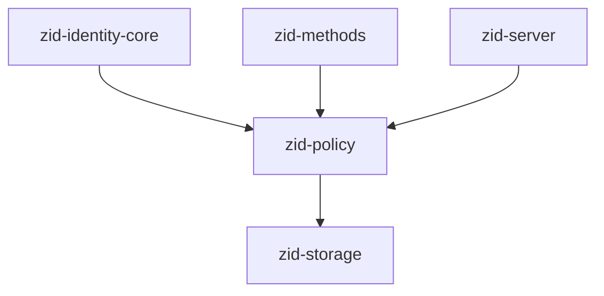
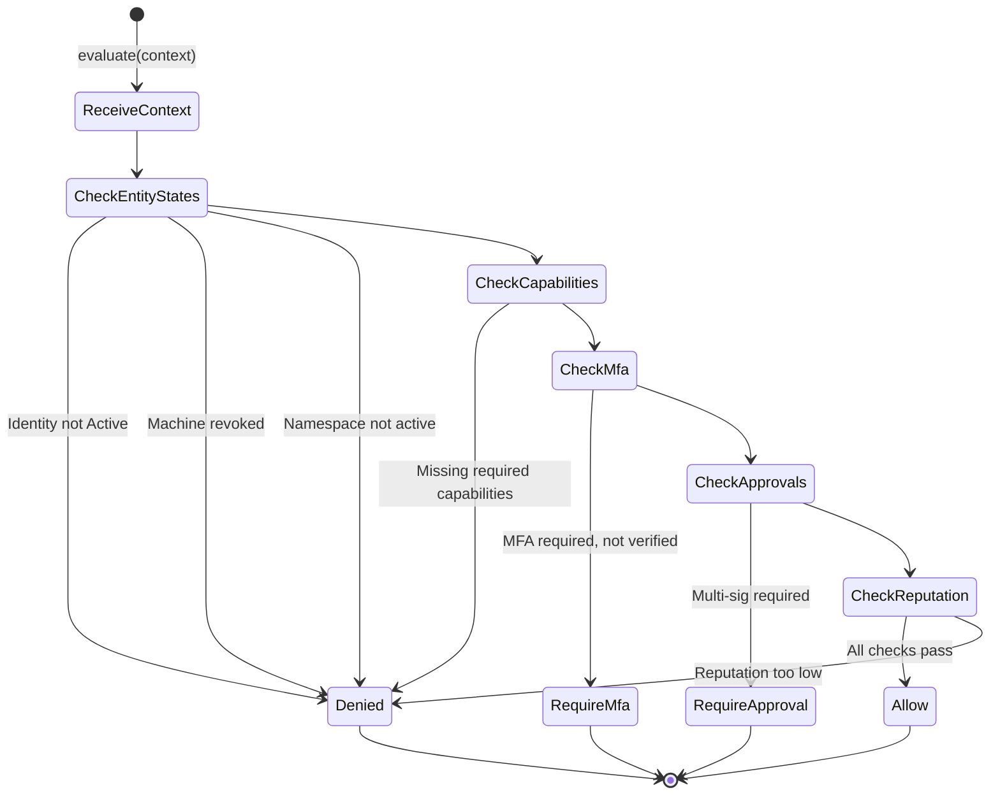
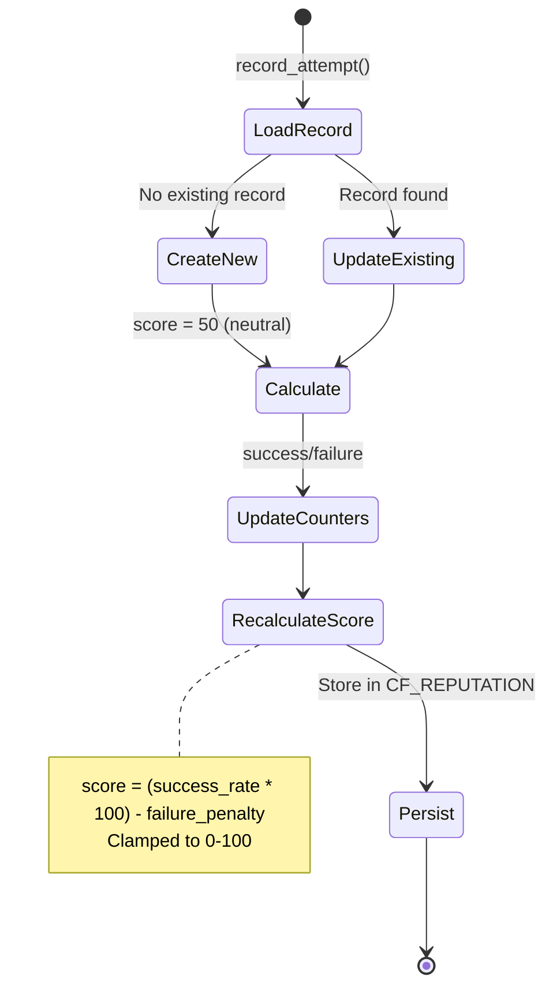
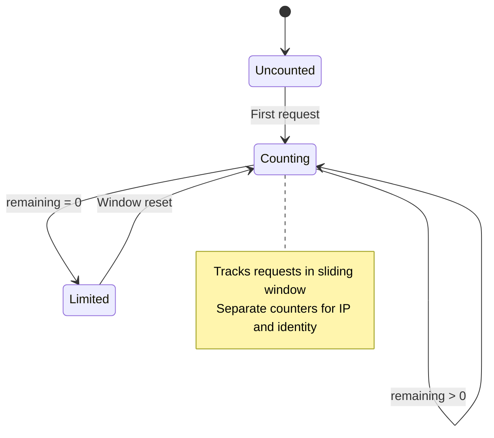
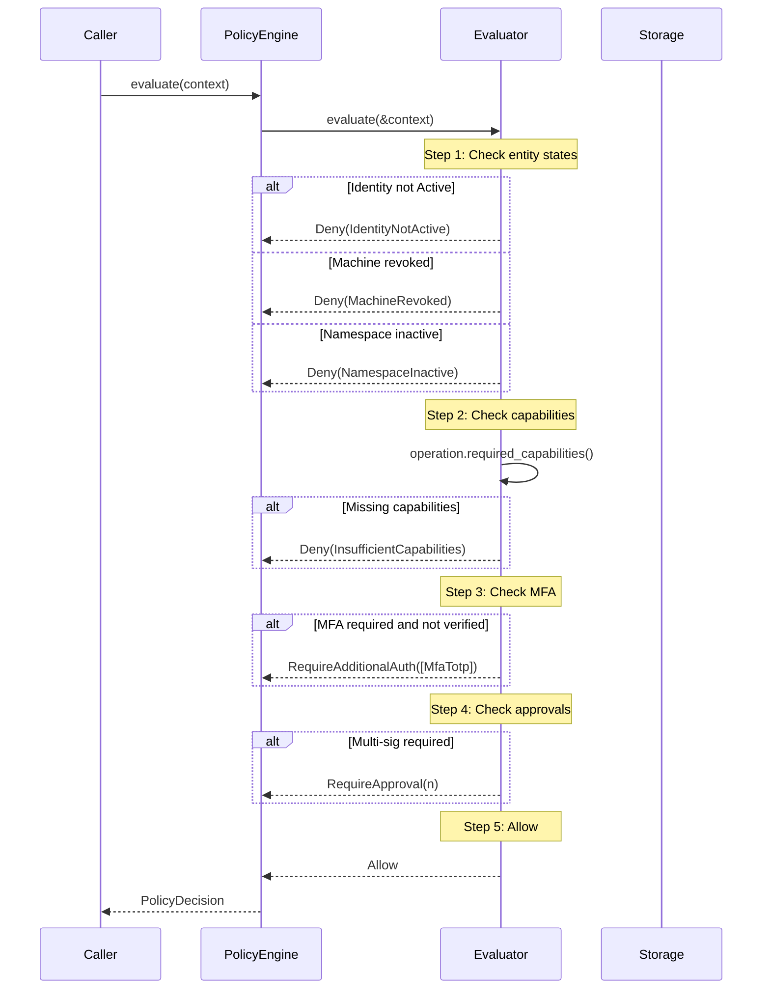
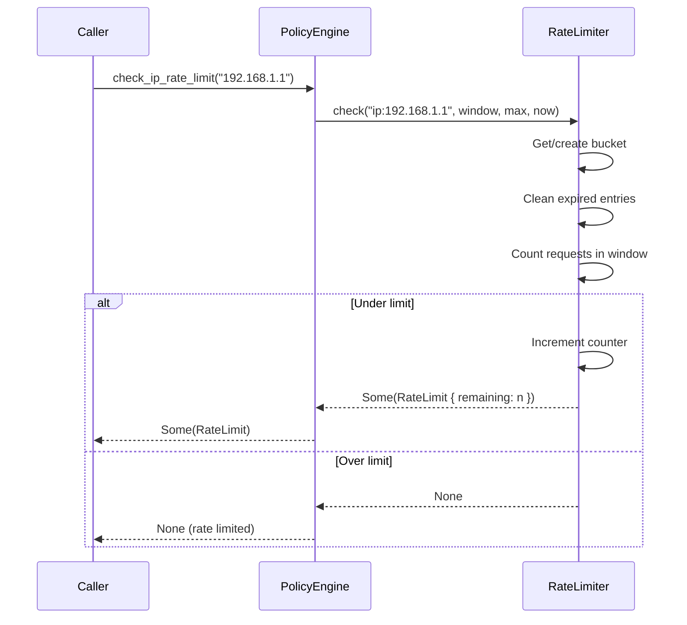
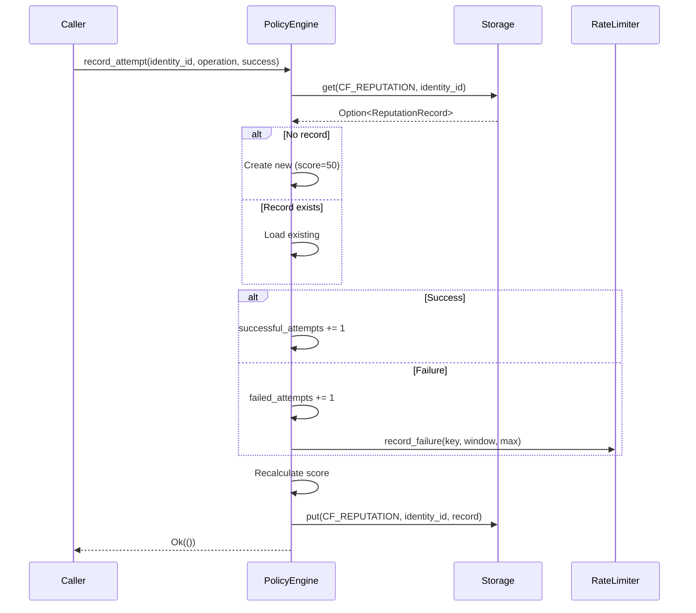

# zid-policy Specification v0.1.1

## 1. Overview

The `zid-policy` crate provides the policy engine for Zero-ID, handling rate limiting, reputation tracking, and authorization decisions for all operations.

### 1.1 Purpose and Responsibilities

- **Policy Evaluation**: Evaluate authorization decisions for operations
- **Rate Limiting**: IP-based and identity-based request limiting
- **Reputation Tracking**: Track success/failure history per identity
- **Capability Checking**: Validate machine key capabilities against operation requirements
- **Entity State Validation**: Check identity, machine, and namespace status

### 1.2 Position in Dependency Graph



---

## 2. Public Interface

### 2.1 PolicyEngine Trait

```rust
#[async_trait]
pub trait PolicyEngine: Send + Sync {
    /// Evaluate policy for an operation
    async fn evaluate(&self, context: PolicyContext) -> Result<PolicyDecision>;

    /// Record operation attempt (for rate limiting and reputation)
    async fn record_attempt(
        &self,
        identity_id: Uuid,
        operation: Operation,
        success: bool,
    ) -> Result<()>;

    /// Get reputation score for an identity
    async fn get_reputation(&self, identity_id: Uuid) -> Result<i32>;

    /// Check rate limit for an IP address
    fn check_ip_rate_limit(&self, ip_address: &str) -> Option<RateLimit>;

    /// Check rate limit for an identity
    fn check_identity_rate_limit(&self, identity_id: Uuid) -> Option<RateLimit>;
}
```

### 2.2 PolicyEngineImpl

```rust
pub struct PolicyEngineImpl<S: Storage> {
    storage: Arc<S>,
    rate_limiter: Arc<RateLimiter>,
    config: RateLimitConfig,
}

impl<S: Storage> PolicyEngineImpl<S> {
    /// Create with default configuration
    pub fn new(storage: Arc<S>) -> Self;
    
    /// Create with custom rate limit configuration
    pub fn with_config(storage: Arc<S>, config: RateLimitConfig) -> Self;
    
    /// Get current configuration
    pub fn config(&self) -> &RateLimitConfig;
}
```

### 2.3 Types

#### PolicyContext

```rust
#[derive(Debug, Clone)]
pub struct PolicyContext {
    // Identity & Auth
    pub identity_id: Uuid,
    pub machine_id: Option<Uuid>,
    pub namespace_id: Uuid,
    pub auth_method: AuthMethod,
    pub mfa_verified: bool,

    // Operation
    pub operation: Operation,
    pub resource: Option<Resource>,

    // Request Context
    pub ip_address: String,
    pub user_agent: String,
    pub timestamp: u64,

    // Reputation
    pub reputation_score: i32,
    pub recent_failed_attempts: u32,

    // Entity States (populated by caller)
    pub identity_status: Option<IdentityStatus>,
    pub machine_revoked: Option<bool>,
    pub machine_capabilities: Option<u32>,
    pub namespace_active: Option<bool>,
}
```

#### PolicyDecision

```rust
#[derive(Debug, Clone)]
pub struct PolicyDecision {
    pub verdict: Verdict,
    pub required_factors: Vec<AuthFactor>,
    pub required_approvals: u8,
    pub rate_limit: Option<RateLimit>,
    pub audit_tags: Vec<String>,
    pub reason: String,
}

#[repr(u8)]
pub enum Verdict {
    Allow = 0x01,
    Deny = 0x02,
    RequireAdditionalAuth = 0x03,
    RequireApproval = 0x04,
    RateLimited = 0x05,
}
```

#### Operation

```rust
#[repr(u16)]
pub enum Operation {
    // Authentication (0x01xx)
    Login = 0x0100,
    RefreshToken = 0x0101,

    // Identity Management (0x02xx)
    CreateIdentity = 0x0200,
    DisableIdentity = 0x0201,
    FreezeIdentity = 0x0202,
    UnfreezeIdentity = 0x0203,

    // Machine Keys (0x03xx)
    EnrollMachine = 0x0300,
    RevokeMachine = 0x0301,

    // Neural Key (0x04xx)
    RotateNeuralKey = 0x0400,
    RecoverNeuralKey = 0x0401,
    InitiateRecovery = 0x0402,

    // Credentials (0x05xx)
    ChangePassword = 0x0500,
    ResetPassword = 0x0501,
    AttachEmail = 0x0502,
    AttachWallet = 0x0503,

    // MFA (0x06xx)
    EnableMfa = 0x0600,
    DisableMfa = 0x0601,
    VerifyMfa = 0x0602,

    // Sessions (0x07xx)
    RevokeSession = 0x0700,
    RevokeAllSessions = 0x0701,
}

impl Operation {
    /// Check if operation is high-risk
    pub fn is_high_risk(&self) -> bool;
    
    /// Check if operation requires MFA
    pub fn requires_mfa(&self) -> bool;
    
    /// Get required approval count
    pub fn required_approvals(&self) -> u8;
    
    /// Get required machine capabilities
    pub fn required_capabilities(&self) -> u32;
}
```

#### AuthMethod

```rust
#[repr(u8)]
pub enum AuthMethod {
    MachineKey = 0x01,
    EmailPassword = 0x02,
    OAuth = 0x03,
    EvmWallet = 0x04,
}
```

#### AuthFactor

```rust
#[repr(u8)]
pub enum AuthFactor {
    Password = 0x01,
    MfaTotp = 0x02,
    MfaBackupCode = 0x03,
    MachineKey = 0x04,
    WalletSignature = 0x05,
    EmailVerification = 0x06,
}
```

#### IdentityStatus

```rust
#[repr(u8)]
pub enum IdentityStatus {
    Active = 0x01,
    Disabled = 0x02,
    Frozen = 0x03,
    Deleted = 0x04,
}
```

#### Resource

```rust
pub enum Resource {
    Identity(Uuid),
    Machine(Uuid),
    Session(Uuid),
    Namespace(Uuid),
}
```

#### RateLimitConfig

```rust
#[derive(Debug, Clone)]
pub struct RateLimitConfig {
    pub ip_window_seconds: u64,        // Default: 60
    pub ip_max_requests: u32,          // Default: 100
    pub identity_window_seconds: u64,  // Default: 3600
    pub identity_max_requests: u32,    // Default: 1000
    pub failure_window_seconds: u64,   // Default: 900
    pub failure_max_attempts: u32,     // Default: 5
}
```

#### RateLimit

```rust
#[derive(Debug, Clone)]
pub struct RateLimit {
    pub window_seconds: u64,
    pub max_attempts: u32,
    pub remaining: u32,
    pub reset_at: u64,
}
```

#### ReputationRecord

```rust
#[derive(Debug, Clone)]
pub struct ReputationRecord {
    pub identity_id: Uuid,
    pub score: i32,                  // 0-100
    pub successful_attempts: u32,
    pub failed_attempts: u32,
    pub last_updated: u64,
}
```

#### Machine Key Capabilities

```rust
pub mod capabilities {
    pub const AUTHENTICATE: u32 = 0x01;  // Can authenticate
    pub const SIGN: u32 = 0x02;          // Can sign messages
    pub const DECRYPT: u32 = 0x04;       // Can decrypt
    pub const ENROLL: u32 = 0x08;        // Can enroll machines
    pub const REVOKE: u32 = 0x10;        // Can revoke machines
    pub const APPROVE: u32 = 0x20;       // Can approve ceremonies
}
```

### 2.4 Error Types

```rust
#[derive(Debug, thiserror::Error)]
pub enum PolicyError {
    #[error("Policy denied: {0}")]
    Denied(String),
    
    #[error("Rate limited")]
    RateLimited(RateLimit),
    
    #[error("MFA required")]
    MfaRequired(Vec<AuthFactor>),
    
    #[error("Approval required: {0} approvals needed")]
    ApprovalRequired(u8),
    
    #[error("Insufficient capabilities: required {required:#x}, have {have:#x}")]
    InsufficientCapabilities { required: u32, have: u32 },
    
    #[error("Storage error: {0}")]
    Storage(#[from] StorageError),
}
```

---

## 3. State Machines

### 3.1 Policy Evaluation Flow



### 3.2 Reputation Tracking Flow



### 3.3 Rate Limiter State



---

## 4. Control Flow

### 4.1 Policy Evaluation



### 4.2 Rate Limit Check



### 4.3 Reputation Recording



---

## 5. Data Structures

### 5.1 Storage Schema

| Column Family | Key | Value | Description |
|---------------|-----|-------|-------------|
| `reputation` | `identity_id: Uuid` | `ReputationRecord` | Reputation scores |

### 5.2 Reputation Calculation

```rust
fn calculate_reputation(successful: u32, failed: u32) -> i32 {
    if successful == 0 && failed == 0 {
        return 50; // Neutral starting score
    }

    let total = successful + failed;
    let success_rate = (successful as f64) / (total as f64);

    // Scale to 0-100, with penalties for high failure rates
    let base_score = (success_rate * 100.0) as i32;

    // Apply penalties for absolute number of failures
    let failure_penalty = (failed as i32).min(50);

    (base_score - failure_penalty).clamp(0, 100)
}
```

### 5.3 Operation Capability Requirements

| Operation | Required Capabilities |
|-----------|----------------------|
| Login | `AUTHENTICATE` |
| RefreshToken | `AUTHENTICATE` |
| CreateIdentity | `AUTHENTICATE \| SIGN` |
| DisableIdentity | `AUTHENTICATE \| SIGN` |
| FreezeIdentity | `AUTHENTICATE \| SIGN` |
| UnfreezeIdentity | `AUTHENTICATE \| SIGN \| APPROVE` |
| EnrollMachine | `AUTHENTICATE \| SIGN \| ENROLL` |
| RevokeMachine | `AUTHENTICATE \| SIGN \| REVOKE` |
| RotateNeuralKey | `AUTHENTICATE \| SIGN \| APPROVE` |
| RecoverNeuralKey | `AUTHENTICATE \| SIGN \| APPROVE` |
| ChangePassword | `AUTHENTICATE \| SIGN` |
| EnableMfa | `AUTHENTICATE \| SIGN` |
| DisableMfa | `AUTHENTICATE \| SIGN` |
| RevokeSession | `AUTHENTICATE \| SIGN` |
| RevokeAllSessions | `AUTHENTICATE \| SIGN \| REVOKE` |

### 5.4 Operation Properties

| Operation | High-Risk | Requires MFA | Required Approvals |
|-----------|-----------|--------------|-------------------|
| DisableIdentity | Yes | Yes | 0 |
| FreezeIdentity | Yes | No | 0 |
| RotateNeuralKey | Yes | Yes | 2 |
| DisableMfa | Yes | Yes | 0 |
| RevokeAllSessions | Yes | Yes | 0 |
| UnfreezeIdentity | No | No | 2 |

---

## 6. Security Considerations

### 6.1 Rate Limiting Strategy

| Resource | Window | Max Requests | Purpose |
|----------|--------|--------------|---------|
| IP address | 60s | 100 | Prevent DDoS |
| Identity | 3600s | 1000 | Prevent abuse |
| Failures | 900s | 5 | Prevent brute force |

### 6.2 Entity State Validation

Policy evaluation checks:
1. **Identity Status**: Must be `Active` for most operations
2. **Machine Revoked**: Revoked machines cannot authenticate
3. **Namespace Active**: Operations require active namespace

### 6.3 Capability Enforcement

- Machine key capabilities are checked against operation requirements
- Missing capabilities result in immediate denial
- Capabilities are bitflags allowing combination checks

### 6.4 Reputation Impact

- Reputation affects trust level but doesn't directly block operations
- Low reputation may trigger additional verification requirements
- Reputation persists across server restarts (stored in RocksDB)

---

## 7. Dependencies

### 7.1 Internal Crate Dependencies

| Crate | Purpose |
|-------|---------|
| `zid-storage` | Persistent reputation storage |

### 7.2 External Dependencies

| Crate | Version | Purpose |
|-------|---------|---------|
| `async-trait` | 0.1 | Async trait support |
| `serde` | 1.0 | Serialization |
| `thiserror` | 1.0 | Error types |
| `uuid` | 1.6 | UUID handling |
| `tracing` | 0.1 | Logging |

---

## 8. Usage Examples

### 8.1 Policy Evaluation

```rust
let context = PolicyContext {
    identity_id,
    machine_id: Some(machine_id),
    namespace_id,
    auth_method: AuthMethod::MachineKey,
    mfa_verified: false,
    operation: Operation::EnrollMachine,
    resource: None,
    ip_address: "192.168.1.1".to_string(),
    user_agent: "zid-client/1.0".to_string(),
    timestamp: current_timestamp(),
    reputation_score: 75,
    recent_failed_attempts: 0,
    identity_status: Some(IdentityStatus::Active),
    machine_revoked: Some(false),
    machine_capabilities: Some(capabilities::AUTHENTICATE | capabilities::SIGN | capabilities::ENROLL),
    namespace_active: Some(true),
};

let decision = policy_engine.evaluate(context).await?;

match decision.verdict {
    Verdict::Allow => { /* proceed */ },
    Verdict::Deny => { /* return error */ },
    Verdict::RequireAdditionalAuth => { /* request MFA */ },
    Verdict::RequireApproval => { /* request multi-sig */ },
    Verdict::RateLimited => { /* return 429 */ },
}
```

### 8.2 Rate Limit Checking

```rust
// Check IP rate limit before processing
if policy_engine.check_ip_rate_limit(&ip_address).is_none() {
    return Err(ApiError::TooManyRequests);
}

// Check identity rate limit after authentication
if policy_engine.check_identity_rate_limit(identity_id).is_none() {
    return Err(ApiError::TooManyRequests);
}
```

### 8.3 Recording Attempts

```rust
// Record successful login
policy_engine.record_attempt(identity_id, Operation::Login, true).await?;

// Record failed login
policy_engine.record_attempt(identity_id, Operation::Login, false).await?;
```
