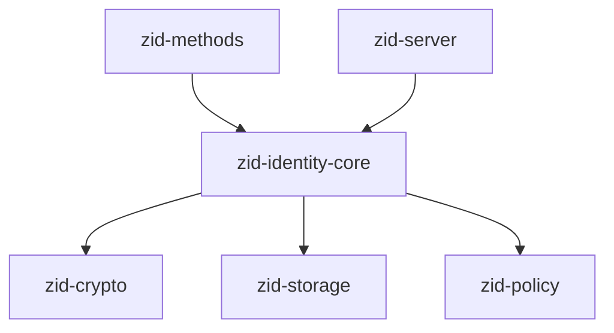
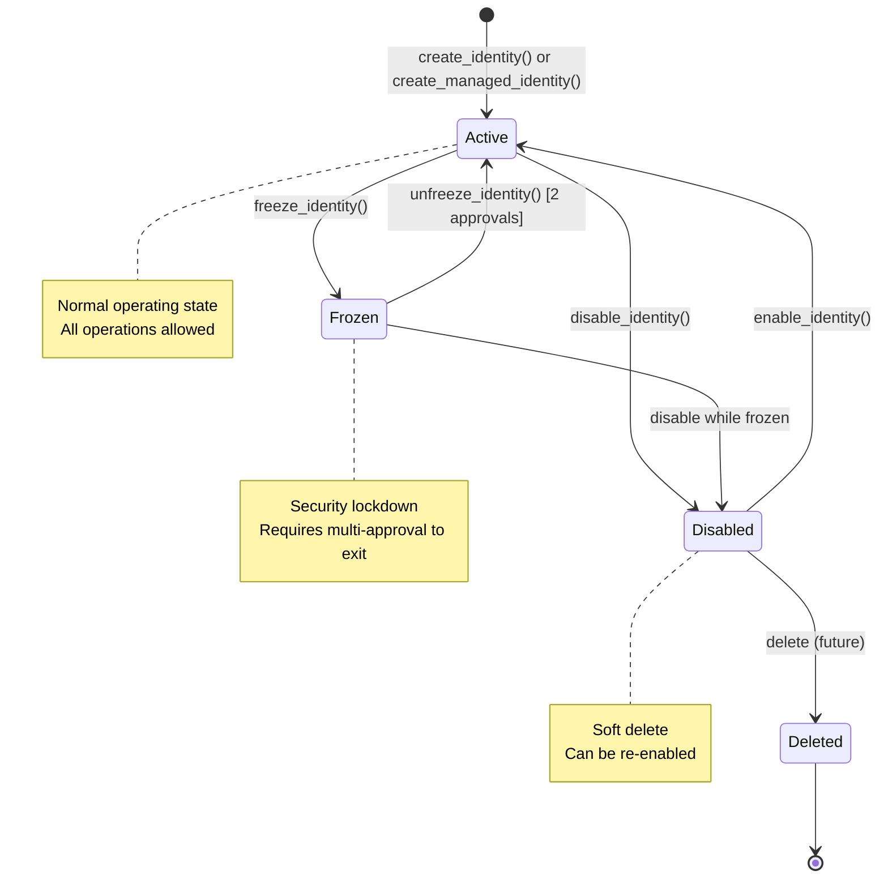
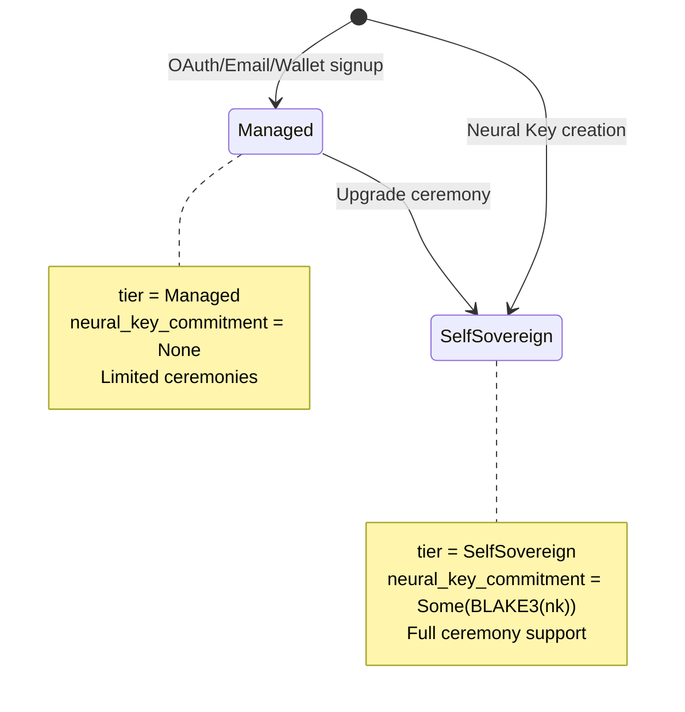
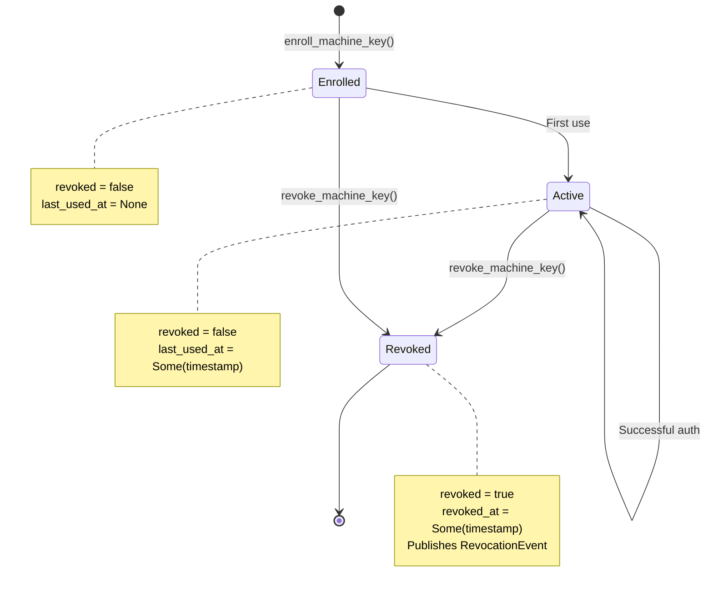
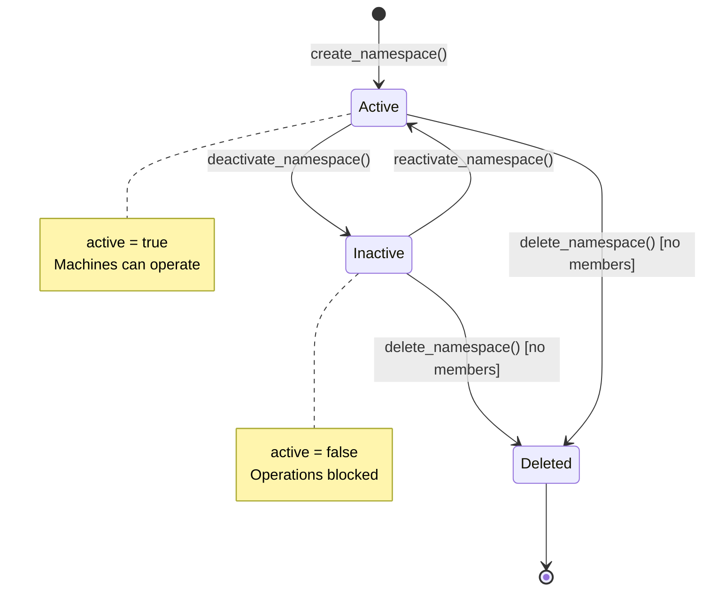
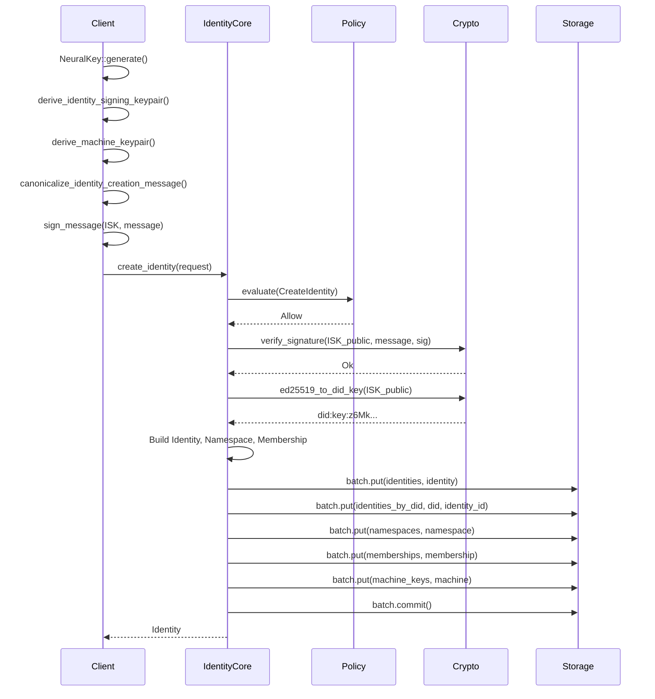
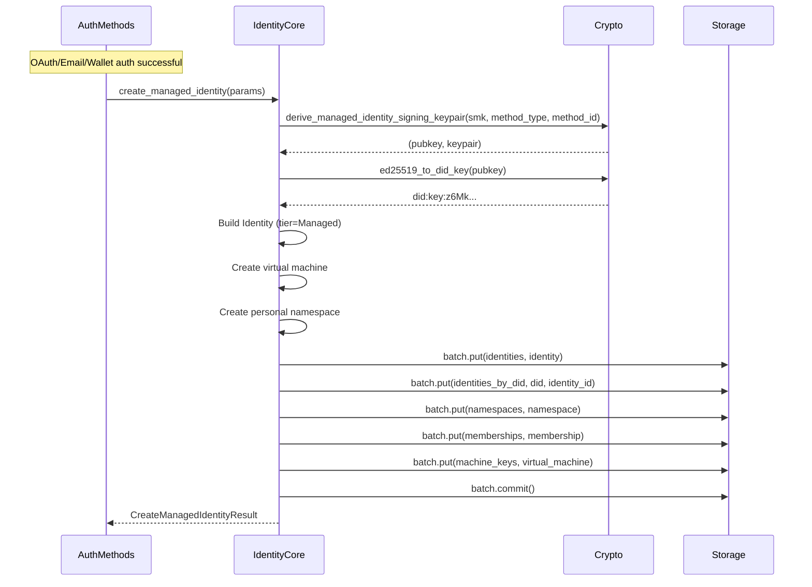
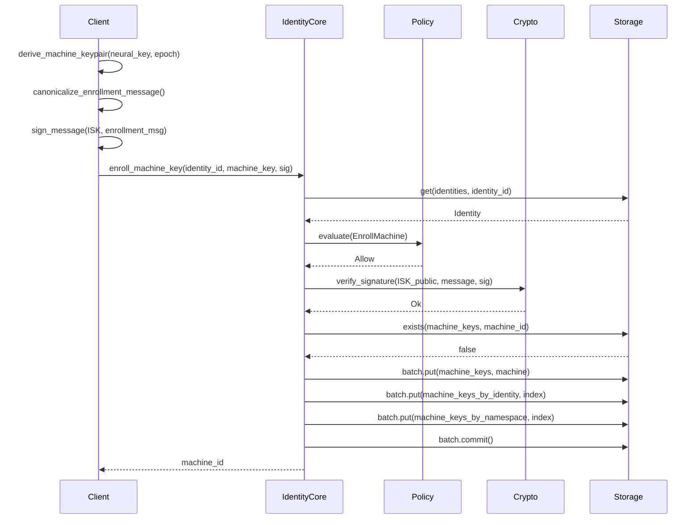
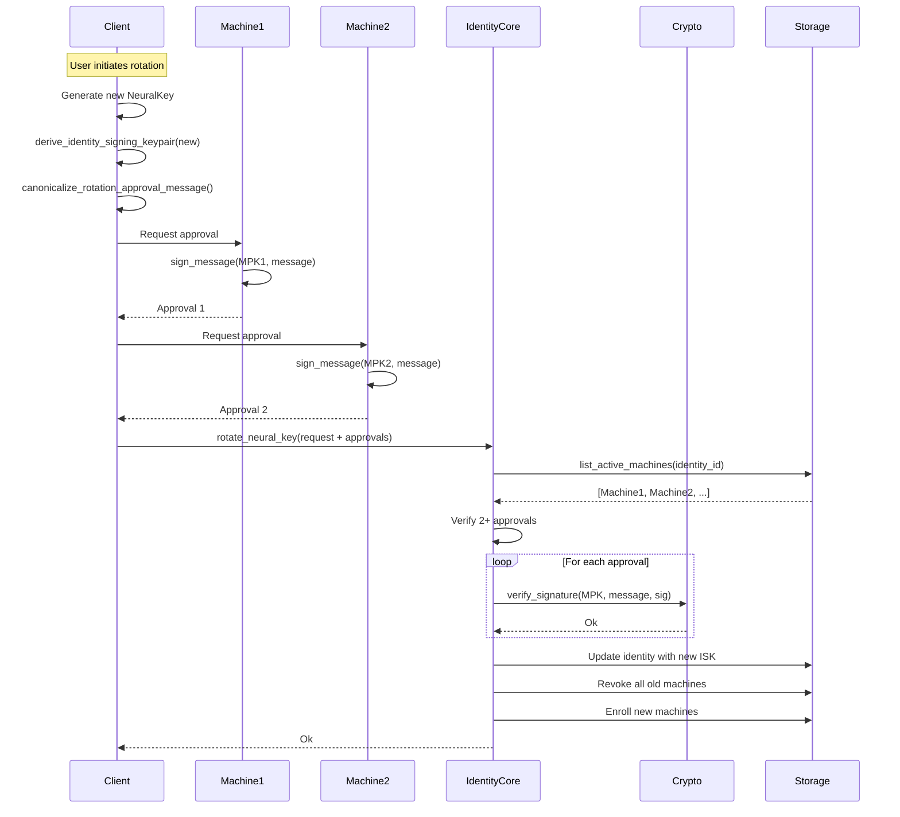
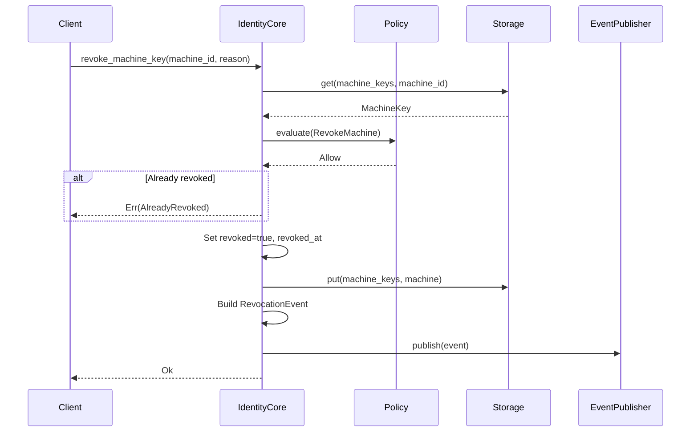

# zid-identity-core Specification v0.1.1

## 1. Overview

The `zid-identity-core` crate is the foundational subsystem for cryptographic identity management. It handles identity creation, machine key enrollment, namespace management, and sensitive ceremonies like Neural Key rotation and recovery.

### 1.1 Purpose and Responsibilities

- **Identity Lifecycle**: Create, disable, freeze, and manage identity records
- **Identity Tiers**: Support for both Managed and Self-Sovereign identities
- **Machine Key Registry**: Enroll, list, and revoke machine keys
- **Namespace Management**: Create and manage organizational namespaces
- **Membership Management**: Control who belongs to which namespaces
- **Ceremonies**: Multi-approval operations for sensitive actions
- **Event Publishing**: Publish revocation events for downstream consumers
- **DID Management**: Generate and index `did:key` identifiers

### 1.2 Position in Dependency Graph



---

## 2. Public Interface

### 2.1 IdentityCore Trait

```rust
#[async_trait]
pub trait IdentityCore: Send + Sync {
    // ===========================================
    // Identity CRUD
    // ===========================================
    
    /// Create a new identity with Neural Key authorization (self-sovereign)
    async fn create_identity(&self, request: CreateIdentityRequest) -> Result<Identity>;

    /// Create a managed identity with server-derived keys
    async fn create_managed_identity(
        &self,
        params: CreateManagedIdentityParams,
    ) -> Result<CreateManagedIdentityResult>;

    /// Get identity by ID
    async fn get_identity(&self, identity_id: Uuid) -> Result<Identity>;

    /// Get identity by DID (did:key:...)
    async fn get_identity_by_did(&self, did: &str) -> Result<Identity>;

    /// Disable an identity (soft delete)
    async fn disable_identity(&self, identity_id: Uuid) -> Result<()>;

    /// Re-enable a disabled identity
    async fn enable_identity(&self, identity_id: Uuid) -> Result<()>;

    /// Freeze an identity (security lockdown)
    async fn freeze_identity(
        &self,
        identity_id: Uuid,
        reason: FreezeReason,
        approvals: Vec<Approval>,
    ) -> Result<()>;

    /// Unfreeze an identity (requires ceremony)
    async fn unfreeze_identity(
        &self,
        identity_id: Uuid,
        approvals: Vec<Approval>,
    ) -> Result<()>;

    // ===========================================
    // Machine Key Management
    // ===========================================

    /// Enroll a new Machine Key for an identity
    async fn enroll_machine_key(
        &self,
        identity_id: Uuid,
        machine_key: MachineKey,
        authorization_signature: Vec<u8>,
        mfa_verified: bool,
        ip_address: String,
        user_agent: String,
    ) -> Result<Uuid>;

    /// Get Machine Key by ID
    async fn get_machine_key(&self, machine_id: Uuid) -> Result<MachineKey>;

    /// List all Machine Keys for an identity in a namespace
    async fn list_machines(
        &self,
        identity_id: Uuid,
        namespace_id: Uuid,
    ) -> Result<Vec<MachineKey>>;

    /// Revoke a Machine Key
    async fn revoke_machine_key(
        &self,
        machine_id: Uuid,
        revoked_by: Uuid,
        reason: String,
        mfa_verified: bool,
        ip_address: String,
        user_agent: String,
    ) -> Result<()>;

    // ===========================================
    // Neural Key Ceremonies
    // ===========================================

    /// Rotate Neural Key (requires multi-machine approval)
    async fn rotate_neural_key(&self, request: RotationRequest) -> Result<()>;

    /// Initiate Neural Key recovery
    async fn initiate_recovery(
        &self,
        identity_id: Uuid,
        recovery_machine_key: MachineKey,
        approvals: Vec<Approval>,
    ) -> Result<Uuid>;

    // ===========================================
    // Namespace Management
    // ===========================================

    /// Create a namespace
    async fn create_namespace(
        &self,
        namespace_id: Uuid,
        name: String,
        owner_identity_id: Uuid,
    ) -> Result<Namespace>;

    /// Get namespace by ID
    async fn get_namespace(&self, namespace_id: Uuid) -> Result<Namespace>;

    /// List all namespaces for an identity
    async fn list_namespaces(&self, identity_id: Uuid) -> Result<Vec<Namespace>>;

    /// Update a namespace
    async fn update_namespace(
        &self,
        namespace_id: Uuid,
        name: String,
        requester_id: Uuid,
    ) -> Result<Namespace>;

    /// Deactivate a namespace
    async fn deactivate_namespace(
        &self,
        namespace_id: Uuid,
        requester_id: Uuid,
    ) -> Result<()>;

    /// Reactivate a namespace
    async fn reactivate_namespace(
        &self,
        namespace_id: Uuid,
        requester_id: Uuid,
    ) -> Result<()>;

    /// Delete a namespace (must have no other members)
    async fn delete_namespace(
        &self,
        namespace_id: Uuid,
        requester_id: Uuid,
    ) -> Result<()>;

    // ===========================================
    // Namespace Membership
    // ===========================================

    /// Get namespace membership
    async fn get_namespace_membership(
        &self,
        identity_id: Uuid,
        namespace_id: Uuid,
    ) -> Result<Option<IdentityNamespaceMembership>>;

    /// List all members of a namespace
    async fn list_namespace_members(
        &self,
        namespace_id: Uuid,
        requester_id: Uuid,
    ) -> Result<Vec<IdentityNamespaceMembership>>;

    /// Add a member to a namespace
    async fn add_namespace_member(
        &self,
        namespace_id: Uuid,
        identity_id: Uuid,
        role: NamespaceRole,
        requester_id: Uuid,
    ) -> Result<IdentityNamespaceMembership>;

    /// Update a member's role
    async fn update_namespace_member(
        &self,
        namespace_id: Uuid,
        identity_id: Uuid,
        role: NamespaceRole,
        requester_id: Uuid,
    ) -> Result<IdentityNamespaceMembership>;

    /// Remove a member from a namespace
    async fn remove_namespace_member(
        &self,
        namespace_id: Uuid,
        identity_id: Uuid,
        requester_id: Uuid,
    ) -> Result<()>;
}
```

### 2.2 EventPublisher Trait

```rust
#[async_trait]
pub trait EventPublisher: Send + Sync {
    async fn publish(&self, event: RevocationEvent) -> Result<()>;
}
```

### 2.3 Types

#### Identity

```rust
#[derive(Debug, Clone, Serialize, Deserialize)]
pub struct Identity {
    pub identity_id: Uuid,
    pub did: String,                              // did:key:z6Mk...
    pub identity_signing_public_key: [u8; 32],
    pub status: IdentityStatus,
    pub tier: IdentityTier,
    pub neural_key_commitment: Option<[u8; 32]>,  // BLAKE3(neural_key)
    pub created_at: u64,
    pub updated_at: u64,
    pub frozen_at: Option<u64>,
    pub frozen_reason: Option<String>,
}

#[repr(u8)]
pub enum IdentityStatus {
    Active = 0x01,
    Disabled = 0x02,
    Frozen = 0x03,
    Deleted = 0x04,
}

#[repr(u8)]
pub enum IdentityTier {
    Managed = 0x01,       // Server-derived ISK
    SelfSovereign = 0x02, // Client Neural Key
}
```

#### MachineKey

```rust
#[derive(Debug, Clone, Serialize, Deserialize)]
pub struct MachineKey {
    pub machine_id: Uuid,
    pub identity_id: Uuid,
    pub namespace_id: Uuid,
    pub signing_public_key: [u8; 32],
    pub encryption_public_key: [u8; 32],
    pub capabilities: MachineKeyCapabilities,
    pub epoch: u64,
    pub created_at: u64,
    pub expires_at: Option<u64>,
    pub last_used_at: Option<u64>,
    pub device_name: String,
    pub device_platform: String,
    pub revoked: bool,
    pub revoked_at: Option<u64>,
    pub key_scheme: KeyScheme,
    pub pq_signing_public_key: Option<Vec<u8>>,      // ML-DSA-65: 1952 bytes
    pub pq_encryption_public_key: Option<Vec<u8>>,   // ML-KEM-768: 1184 bytes
}
```

#### Namespace

```rust
#[derive(Debug, Clone, Serialize, Deserialize)]
pub struct Namespace {
    pub namespace_id: Uuid,
    pub name: String,
    pub created_at: u64,
    pub owner_identity_id: Uuid,
    pub active: bool,
}

#[repr(u8)]
pub enum NamespaceRole {
    Owner = 0x01,
    Admin = 0x02,
    Member = 0x03,
}

#[derive(Debug, Clone, Serialize, Deserialize)]
pub struct IdentityNamespaceMembership {
    pub identity_id: Uuid,
    pub namespace_id: Uuid,
    pub role: NamespaceRole,
    pub joined_at: u64,
}
```

#### Ceremony Types

```rust
#[derive(Debug, Clone, Serialize, Deserialize)]
pub struct CreateIdentityRequest {
    pub identity_id: Uuid,
    pub identity_signing_public_key: [u8; 32],
    pub machine_key: MachineKey,
    pub authorization_signature: Vec<u8>,
    pub namespace_name: Option<String>,
    pub created_at: u64,
}

#[derive(Debug, Clone)]
pub struct CreateManagedIdentityParams {
    pub service_master_key: [u8; 32],
    pub method_type: String,      // e.g., "oauth:google", "email"
    pub method_id: String,        // e.g., provider sub, email hash
    pub namespace_name: Option<String>,
}

#[derive(Debug, Clone)]
pub struct CreateManagedIdentityResult {
    pub identity: Identity,
    pub machine_id: Uuid,         // Virtual machine ID
    pub namespace_id: Uuid,
}

#[derive(Debug, Clone, Serialize, Deserialize)]
pub struct Approval {
    pub machine_id: Uuid,
    pub signature: Vec<u8>,
    pub timestamp: u64,
}

#[derive(Debug, Clone, Serialize, Deserialize)]
pub struct RotationRequest {
    pub identity_id: Uuid,
    pub new_identity_signing_public_key: [u8; 32],
    pub approvals: Vec<Approval>,
    pub new_machines: Vec<MachineKey>,
}

#[derive(Debug, Clone, Serialize, Deserialize)]
pub enum FreezeReason {
    SecurityIncident,
    SuspiciousActivity,
    UserRequested,
    Administrative,
}
```

#### Revocation Events

```rust
#[repr(u8)]
pub enum EventType {
    MachineRevoked = 0x01,
    SessionRevoked = 0x02,
    IdentityFrozen = 0x03,
    IdentityDisabled = 0x04,
}

#[derive(Debug, Clone, Serialize, Deserialize)]
pub struct RevocationEvent {
    pub event_id: Uuid,
    pub event_type: EventType,
    pub namespace_id: Uuid,
    pub identity_id: Uuid,
    pub machine_id: Option<Uuid>,
    pub session_id: Option<Uuid>,
    pub sequence: u64,
    pub timestamp: u64,
    pub reason: String,
}
```

### 2.4 Error Types

```rust
pub enum IdentityCoreError {
    NotFound(Uuid),
    IdentityNotActive { status: IdentityStatus, reason: String },
    InvalidAuthorizationSignature,
    MachineAlreadyExists(Uuid),
    MachineNotFound(Uuid),
    InsufficientApprovals { required: usize, provided: usize },
    ApprovalExpired,
    InvalidApprovalSignature,
    InvalidApprovingMachine,
    DuplicateApproval(Uuid),
    PolicyDenied(String),
    MfaRequired(Vec<AuthFactor>),
    
    // Namespace errors
    NamespaceNotFound(Uuid),
    NamespaceAlreadyExists(Uuid),
    NamespaceNotActive(Uuid),
    NamespaceHasMembers(Uuid),
    NotNamespaceMember { identity_id: Uuid, namespace_id: Uuid },
    InsufficientPermissions { role: NamespaceRole, action: String },
    CannotRemoveOwner,
    MemberAlreadyExists { identity_id: Uuid, namespace_id: Uuid },
    MemberNotFound { identity_id: Uuid, namespace_id: Uuid },
    
    // Freeze errors
    IdentityFrozen(Uuid),
    AlreadyFrozen(Uuid),
    NotFrozen(Uuid),
    AlreadyRevoked(Uuid),
    InsufficientMachinesForUnfreeze { available: usize, message: String },
    
    // Wrapped errors
    Storage(StorageError),
    Crypto(CryptoError),
    Policy(PolicyError),
}
```

---

## 3. State Machines

### 3.1 Identity Lifecycle



### 3.2 Identity Tier Transitions



### 3.3 Machine Key Lifecycle



### 3.4 Namespace Lifecycle



---

## 4. Control Flow

### 4.1 Self-Sovereign Identity Creation



### 4.2 Managed Identity Creation



### 4.3 Machine Enrollment



### 4.4 Neural Key Rotation (Multi-Approval)



### 4.5 Machine Revocation



---

## 5. Data Structures

### 5.1 Storage Schema

| Column Family | Key | Value | Description |
|---------------|-----|-------|-------------|
| `identities` | `identity_id: Uuid` | `Identity` | Identity records |
| `identities_by_did` | `did: String` | `identity_id: Uuid` | DID index |
| `machine_keys` | `machine_id: Uuid` | `MachineKey` | Machine key records |
| `machine_keys_by_identity` | `(identity_id, machine_id)` | `()` | Index |
| `machine_keys_by_namespace` | `(namespace_id, machine_id)` | `()` | Index |
| `namespaces` | `namespace_id: Uuid` | `Namespace` | Namespace records |
| `namespaces_by_identity` | `(identity_id, namespace_id)` | `()` | Index |
| `identity_namespace_memberships` | `(identity_id, namespace_id)` | `Membership` | Membership records |

### 5.2 Approval Requirements

| Operation | Required Approvals | Notes |
|-----------|-------------------|-------|
| `rotate_neural_key` | 2 | From different active machines |
| `unfreeze_identity` | 2 | From different active machines |
| `freeze_identity` | 0 | Can be done by any authorized machine |
| Other operations | 0 | Policy-based authorization |

### 5.3 Namespace Permissions

| Role | Read | Update | Delete | Add Members | Remove Members |
|------|------|--------|--------|-------------|----------------|
| Owner | Yes | Yes | Yes | Yes | Yes |
| Admin | Yes | Yes | No | Yes | Yes (not Owner) |
| Member | Yes | No | No | No | Self only |

---

## 6. Security Considerations

### 6.1 Authorization Verification

| Operation | Signature Required | Signer |
|-----------|-------------------|--------|
| Create Identity | ISK signature on creation message | New ISK |
| Enroll Machine | ISK signature on enrollment message | Identity's ISK |
| Rotate Neural Key | Multiple MPK signatures on approval | Active machines |
| Initiate Recovery | Multiple MPK signatures on approval | Active machines |

### 6.2 Approval Validation

```rust
// Approval validation rules:
// 1. Signature must verify against approving machine's MPK
// 2. Approving machine must be active (not revoked)
// 3. Approval timestamp must be within APPROVAL_EXPIRY_SECONDS (900s)
// 4. No duplicate approvals from same machine
// 5. Minimum required approvals must be met
```

### 6.3 Freeze Semantics

When an identity is frozen:
- All machine authentications fail
- No new machines can be enrolled
- Existing sessions continue until refresh
- Requires 2+ machine approvals to unfreeze

### 6.4 Event Publication

Revocation events are published for:
- Machine revocation (`MachineRevoked`)
- Session revocation (`SessionRevoked`)
- Identity freeze (`IdentityFrozen`)
- Identity disable (`IdentityDisabled`)

---

## 7. Dependencies

### 7.1 Internal Crate Dependencies

| Crate | Purpose |
|-------|---------|
| `zid-crypto` | Signature verification, key types, DID |
| `zid-storage` | Persistent storage |
| `zid-policy` | Policy evaluation |

### 7.2 External Dependencies

| Crate | Version | Purpose |
|-------|---------|---------|
| `tokio` | 1.35 | Async runtime |
| `async-trait` | 0.1 | Async trait support |
| `serde` | 1.0 | Serialization |
| `thiserror` | 1.0 | Error types |
| `uuid` | 1.6 | UUID handling |
| `tracing` | 0.1 | Logging |

---

## 8. Constants

```rust
// Approval expiry time (15 minutes)
const APPROVAL_EXPIRY_SECONDS: u64 = 900;

// Required approvals for ceremonies
const ROTATION_REQUIRED_APPROVALS: usize = 2;
const UNFREEZE_REQUIRED_APPROVALS: usize = 2;

// Identity status values
const STATUS_ACTIVE: u8 = 0x01;
const STATUS_DISABLED: u8 = 0x02;
const STATUS_FROZEN: u8 = 0x03;
const STATUS_DELETED: u8 = 0x04;

// Identity tier values
const TIER_MANAGED: u8 = 0x01;
const TIER_SELF_SOVEREIGN: u8 = 0x02;

// Namespace role values
const ROLE_OWNER: u8 = 0x01;
const ROLE_ADMIN: u8 = 0x02;
const ROLE_MEMBER: u8 = 0x03;

// Event type values
const EVENT_MACHINE_REVOKED: u8 = 0x01;
const EVENT_SESSION_REVOKED: u8 = 0x02;
const EVENT_IDENTITY_FROZEN: u8 = 0x03;
const EVENT_IDENTITY_DISABLED: u8 = 0x04;
```
