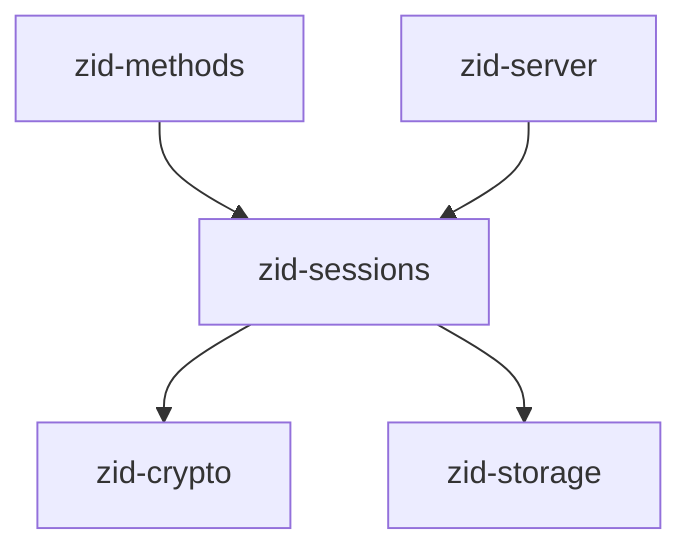
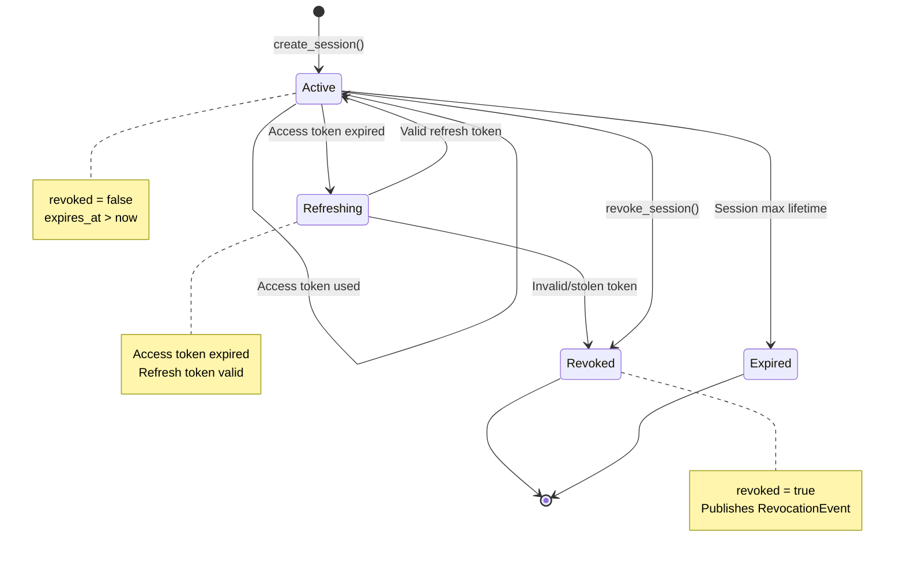
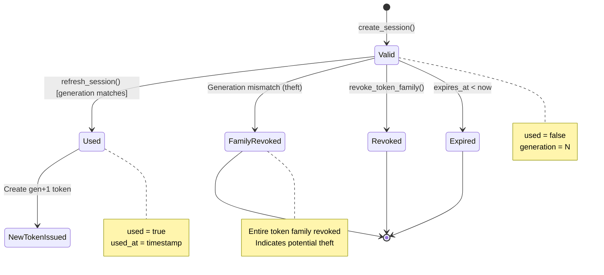
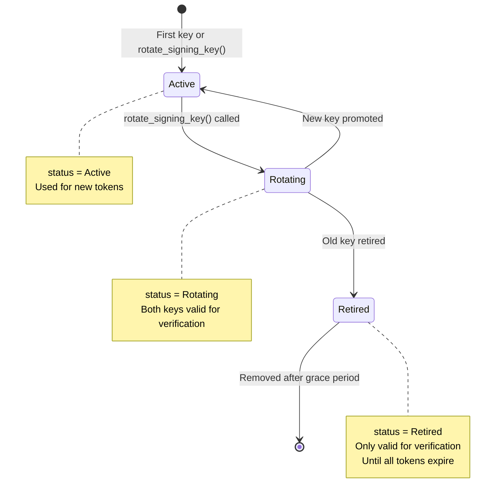
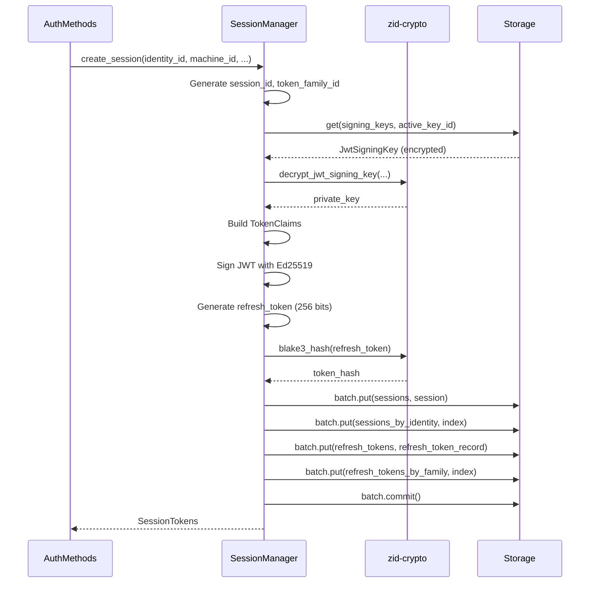
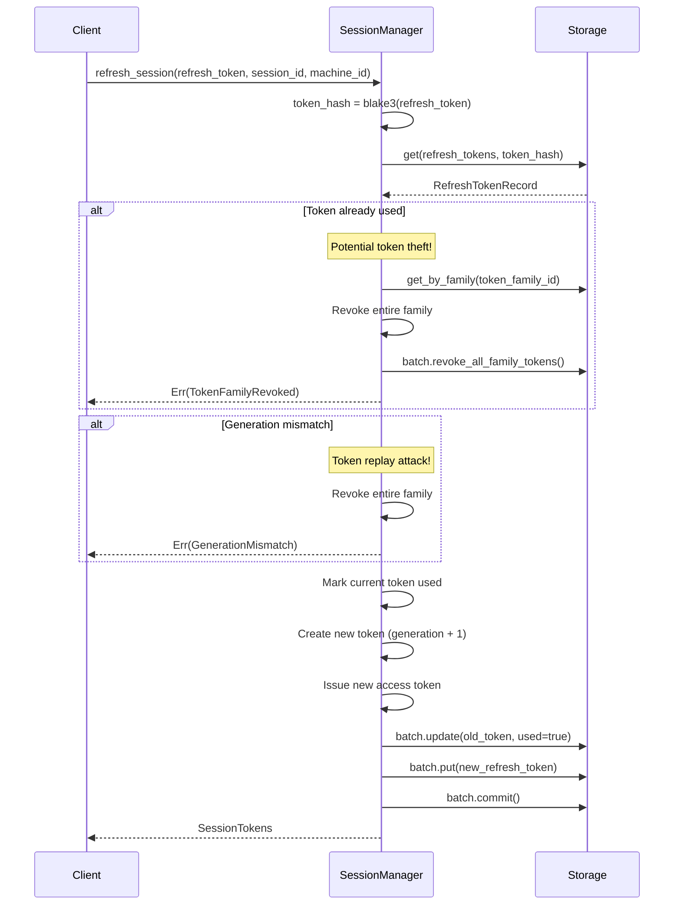
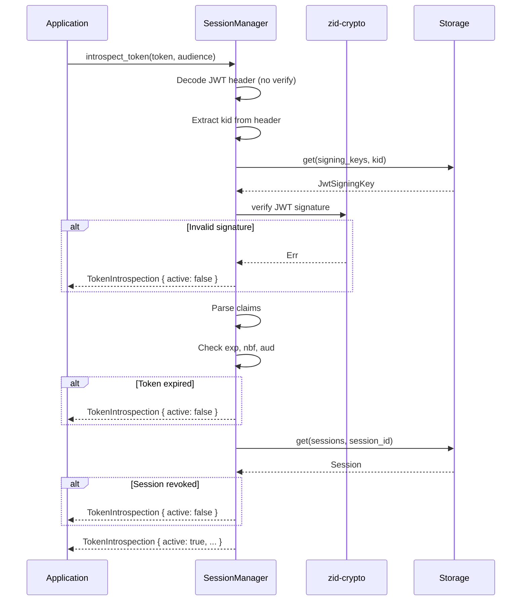
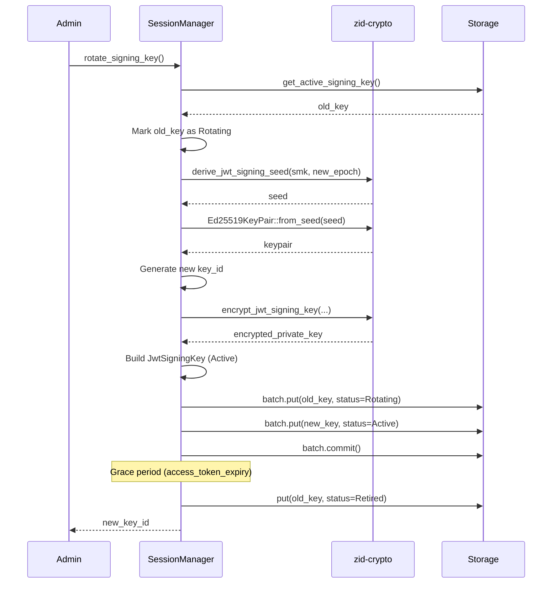

# zid-sessions Specification v0.1.1

## 1. Overview

The `zid-sessions` crate manages session lifecycle, JWT token issuance, refresh token handling, and token introspection for Zero-ID.

### 1.1 Purpose and Responsibilities

- **Session Management**: Create, refresh, and revoke sessions
- **JWT Issuance**: Issue EdDSA-signed access tokens
- **Refresh Tokens**: Manage refresh token lifecycle with generation tracking
- **Token Introspection**: Validate tokens for protected resources
- **JWKS Distribution**: Provide public keys for local validation
- **Key Rotation**: Rotate JWT signing keys

### 1.2 Position in Dependency Graph



---

## 2. Public Interface

### 2.1 SessionManager Trait

```rust
#[async_trait]
pub trait SessionManager: Send + Sync {
    /// Create a new session and issue initial tokens
    async fn create_session(
        &self,
        identity_id: Uuid,
        machine_id: Uuid,
        namespace_id: Uuid,
        mfa_verified: bool,
        capabilities: Vec<String>,
        scope: Vec<String>,
    ) -> Result<SessionTokens>;

    /// Refresh a session using a refresh token
    async fn refresh_session(
        &self,
        refresh_token: String,
        session_id: Uuid,
        machine_id: Uuid,
    ) -> Result<SessionTokens>;

    /// Revoke a specific session
    async fn revoke_session(&self, session_id: Uuid) -> Result<()>;

    /// Revoke all sessions for an identity
    async fn revoke_all_sessions(&self, identity_id: Uuid) -> Result<()>;

    /// Revoke a token family (security event)
    async fn revoke_token_family(&self, token_family_id: Uuid) -> Result<()>;

    /// Get session information
    async fn get_session(&self, session_id: Uuid) -> Result<Session>;

    /// Verify and introspect a JWT token
    async fn introspect_token(
        &self,
        token: String,
        audience: Option<String>,
    ) -> Result<TokenIntrospection>;

    /// Get JWKS for public key distribution
    async fn get_jwks(&self) -> Result<JwksResponse>;

    /// Rotate JWT signing key (admin operation)
    async fn rotate_signing_key(&self) -> Result<String>;
}
```

### 2.2 Types

#### Session

```rust
#[derive(Debug, Clone, Serialize, Deserialize)]
pub struct Session {
    pub session_id: Uuid,
    pub identity_id: Uuid,
    pub machine_id: Uuid,
    pub namespace_id: Uuid,
    pub token_family_id: Uuid,
    pub created_at: u64,
    pub expires_at: u64,
    pub last_activity_at: u64,
    pub revoked: bool,
    pub revoked_at: Option<u64>,
    pub revoked_reason: Option<String>,
}
```

#### SessionTokens

```rust
#[derive(Debug, Clone, Serialize, Deserialize)]
pub struct SessionTokens {
    pub access_token: String,
    pub refresh_token: String,
    pub session_id: Uuid,
    pub expires_in: u64,     // Seconds until access token expires
    pub token_type: String,  // "Bearer"
}
```

#### TokenClaims

```rust
#[derive(Debug, Clone, Serialize, Deserialize)]
pub struct TokenClaims {
    // Standard JWT claims
    pub iss: String,       // Issuer
    pub sub: String,       // Subject (identity_id)
    pub aud: Vec<String>,  // Audience
    pub iat: u64,          // Issued at
    pub exp: u64,          // Expiration
    pub nbf: u64,          // Not before
    pub jti: String,       // JWT ID

    // Custom claims
    pub machine_id: String,
    pub namespace_id: String,
    pub session_id: String,
    pub mfa_verified: bool,
    pub capabilities: Vec<String>,
    pub scope: Vec<String>,
    pub revocation_epoch: u64,
}
```

#### TokenIntrospection

```rust
#[derive(Debug, Clone, Serialize, Deserialize)]
pub struct TokenIntrospection {
    // Standard OAuth2 introspection fields
    pub active: bool,
    pub scope: Option<String>,
    pub client_id: Option<String>,
    pub username: Option<String>,
    pub token_type: Option<String>,
    pub exp: Option<u64>,
    pub iat: Option<u64>,
    pub nbf: Option<u64>,
    pub sub: Option<String>,
    pub aud: Option<Vec<String>>,
    pub iss: Option<String>,
    pub jti: Option<String>,

    // Zero-ID specific fields
    pub identity_id: Uuid,
    pub machine_id: Uuid,
    pub namespace_id: Uuid,
    pub session_id: Uuid,
    pub mfa_verified: bool,
    pub capabilities: Vec<String>,
    pub scopes: Vec<String>,
    pub revocation_epoch: u64,
    pub issued_at: u64,
    pub expires_at: u64,
}
```

#### RefreshTokenRecord

```rust
#[derive(Debug, Clone, Serialize, Deserialize)]
pub struct RefreshTokenRecord {
    pub token_hash: [u8; 32],
    pub session_id: Uuid,
    pub machine_id: Uuid,
    pub token_family_id: Uuid,
    pub generation: u32,
    pub created_at: u64,
    pub expires_at: u64,
    pub used: bool,
    pub used_at: Option<u64>,
    pub revoked: bool,
    pub revoked_at: Option<u64>,
    pub revoked_reason: Option<String>,
}
```

#### JwtSigningKey

```rust
#[derive(Debug, Clone, Serialize, Deserialize)]
pub struct JwtSigningKey {
    pub key_id: [u8; 16],
    pub epoch: u64,
    pub private_key_encrypted: Vec<u8>,  // XChaCha20-Poly1305 encrypted
    pub private_key_nonce: [u8; 24],
    pub public_key: [u8; 32],            // Ed25519 public key
    pub created_at: u64,
    pub expires_at: Option<u64>,
    pub status: KeyStatus,
}

#[repr(u8)]
pub enum KeyStatus {
    Active = 0x01,
    Rotating = 0x02,
    Retired = 0x03,
}
```

#### JWKS Types

```rust
#[derive(Debug, Clone, Serialize, Deserialize)]
pub struct JwksResponse {
    pub keys: Vec<JsonWebKey>,
}

#[derive(Debug, Clone, Serialize, Deserialize)]
pub struct JsonWebKey {
    pub kty: String,              // "OKP"
    pub use_: Option<String>,     // "sig"
    pub alg: Option<String>,      // "EdDSA"
    pub kid: Option<String>,      // Key ID (hex)
    pub crv: String,              // "Ed25519"
    pub x: String,                // Base64url encoded public key
}
```

### 2.3 Error Types

```rust
pub enum SessionError {
    SessionNotFound(Uuid),
    SessionRevoked(Uuid),
    SessionExpired(Uuid),
    
    TokenInvalid(String),
    TokenExpired,
    TokenRevoked,
    TokenFamilyRevoked,
    
    RefreshTokenNotFound,
    RefreshTokenUsed,
    RefreshTokenExpired,
    GenerationMismatch { expected: u32, actual: u32 },
    
    SigningKeyNotFound,
    SigningKeyExpired,
    
    Storage(StorageError),
    Crypto(CryptoError),
    Jwt(String),
}
```

---

## 3. State Machines

### 3.1 Session Lifecycle



### 3.2 Refresh Token Lifecycle



### 3.3 JWT Signing Key Lifecycle



---

## 4. Control Flow

### 4.1 Session Creation



### 4.2 Token Refresh with Theft Detection



### 4.3 Token Introspection



### 4.4 Signing Key Rotation



---

## 5. Data Structures

### 5.1 Storage Schema

| Column Family | Key | Value | Description |
|---------------|-----|-------|-------------|
| `sessions` | `session_id: Uuid` | `Session` | Session records |
| `sessions_by_identity` | `(identity_id, session_id)` | `()` | Index |
| `sessions_by_token_hash` | `token_hash: [u8; 32]` | `session_id: Uuid` | Token lookup |
| `refresh_tokens` | `token_hash: [u8; 32]` | `RefreshTokenRecord` | Refresh tokens |
| `refresh_tokens_by_family` | `(family_id, generation)` | `token_hash` | Family lookup |
| `signing_keys` | `key_id: [u8; 16]` | `JwtSigningKey` | Signing keys |

### 5.2 JWT Structure

```
Header:
{
  "alg": "EdDSA",
  "typ": "JWT",
  "kid": "0123456789abcdef0123456789abcdef"
}

Payload:
{
  "iss": "https://zid.zero.tech",
  "sub": "550e8400-e29b-41d4-a716-446655440000",
  "aud": ["zero-vault"],
  "iat": 1704067200,
  "exp": 1704068100,
  "nbf": 1704067200,
  "jti": "660f9511-e29b-41d4-a716-446655440001",
  
  "machine_id": "770g0622-e29b-41d4-a716-446655440002",
  "namespace_id": "880h1733-e29b-41d4-a716-446655440003",
  "session_id": "990i2844-e29b-41d4-a716-446655440004",
  "mfa_verified": true,
  "capabilities": ["authenticate", "sign"],
  "scope": ["read", "write"],
  "revocation_epoch": 0
}

Signature: Ed25519 (64 bytes, base64url encoded)
```

### 5.3 Token Family Generation Tracking

```
Token Family: abc123...
├── Generation 0: Initial token (created at session start)
├── Generation 1: After first refresh
├── Generation 2: After second refresh
└── ...

If Generation N is reused when Generation N+1 exists:
→ Token theft detected
→ Entire family revoked
```

---

## 6. Security Considerations

### 6.1 Token Security

| Property | Implementation |
|----------|----------------|
| Signing | EdDSA (Ed25519) |
| Token lifetime | 15 minutes (access), 30 days (refresh) |
| Theft detection | Generation tracking |
| Revocation | Immediate via session revocation |

### 6.2 Refresh Token Theft Detection

The generation tracking mechanism:

1. Each refresh token has a generation number (starting at 0)
2. When refreshed, generation increments
3. If a token with generation N is used when generation N+1 exists, theft is detected
4. On detection, entire token family is revoked

### 6.3 Key Management

- JWT signing keys are encrypted at rest with XChaCha20-Poly1305
- Key derivation uses service master key + epoch
- Key rotation maintains backward compatibility during grace period
- Retired keys remain valid for verification until all tokens expire

### 6.4 Introspection vs JWKS

| Method | Latency | Freshness | Use Case |
|--------|---------|-----------|----------|
| Introspection | Higher | Real-time revocation | Revocation-sensitive |
| JWKS validation | Lower | Cached keys | High-throughput |

---

## 7. Dependencies

### 7.1 Internal Crate Dependencies

| Crate | Purpose |
|-------|---------|
| `zid-crypto` | Key derivation, encryption, signing |
| `zid-storage` | Persistent storage |

### 7.2 External Dependencies

| Crate | Version | Purpose |
|-------|---------|---------|
| `jsonwebtoken` | 9.2 | JWT encoding/decoding |
| `tokio` | 1.35 | Async runtime |
| `async-trait` | 0.1 | Async trait support |
| `serde` | 1.0 | Serialization |
| `serde_json` | 1.0 | JSON serialization |
| `sha2` | 0.10 | SHA-256 for token hashing |
| `thiserror` | 1.0 | Error types |
| `uuid` | 1.6 | UUID handling |
| `tracing` | 0.1 | Logging |
| `base64` | 0.21 | Base64 encoding |

---

## 8. Constants

```rust
// Token lifetimes
pub const ACCESS_TOKEN_EXPIRY_SECONDS: u64 = 900;      // 15 minutes
pub const REFRESH_TOKEN_EXPIRY_SECONDS: u64 = 2_592_000; // 30 days

// Key rotation
pub const KEY_ROTATION_GRACE_PERIOD: u64 = 900;  // 15 minutes

// Token sizes
pub const REFRESH_TOKEN_BYTES: usize = 32;       // 256 bits
pub const TOKEN_HASH_SIZE: usize = 32;           // BLAKE3 output

// JWKS
pub const JWKS_CACHE_DURATION: u64 = 3600;       // 1 hour
```

---

## 9. JWKS Endpoint Format

```json
{
  "keys": [
    {
      "kty": "OKP",
      "use": "sig",
      "alg": "EdDSA",
      "kid": "0123456789abcdef0123456789abcdef",
      "crv": "Ed25519",
      "x": "base64url_encoded_public_key"
    }
  ]
}
```

Clients can fetch this from `/.well-known/jwks.json` to validate tokens locally without introspection calls.
