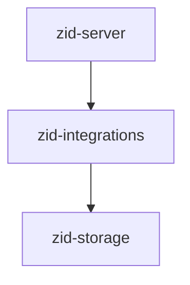
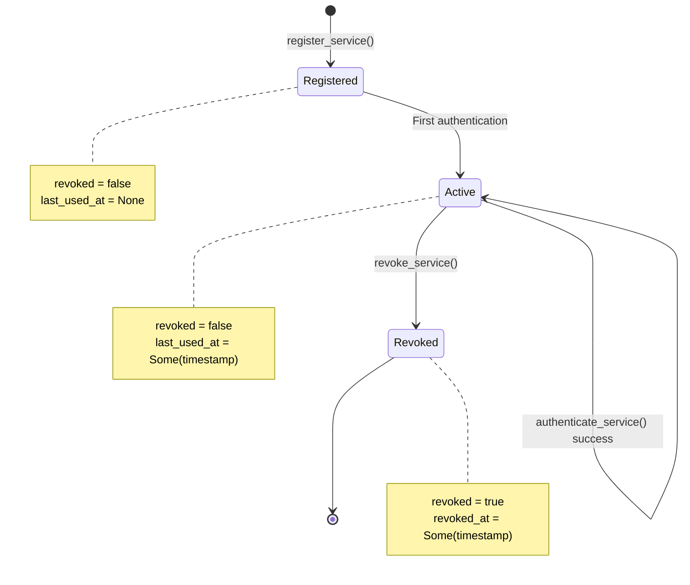
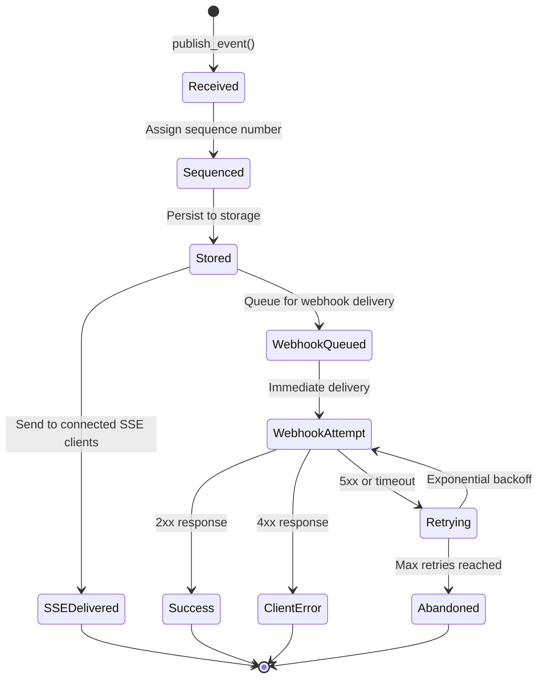
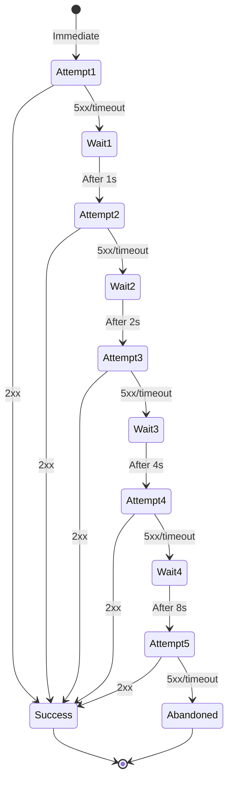
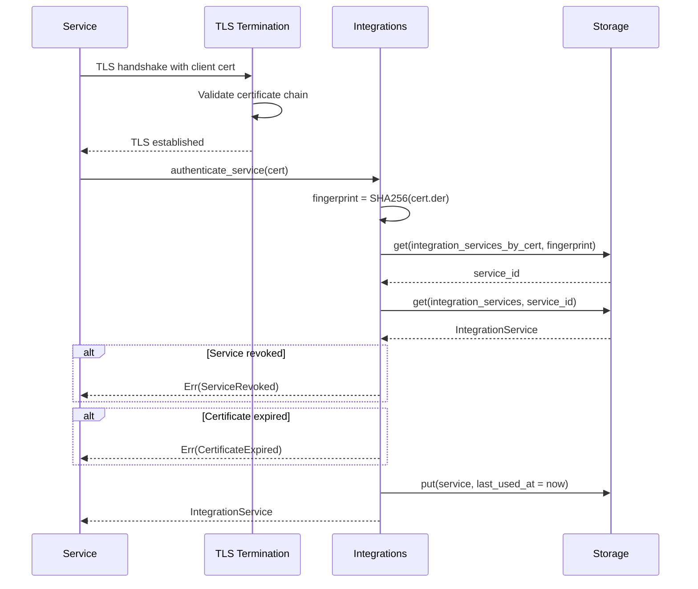
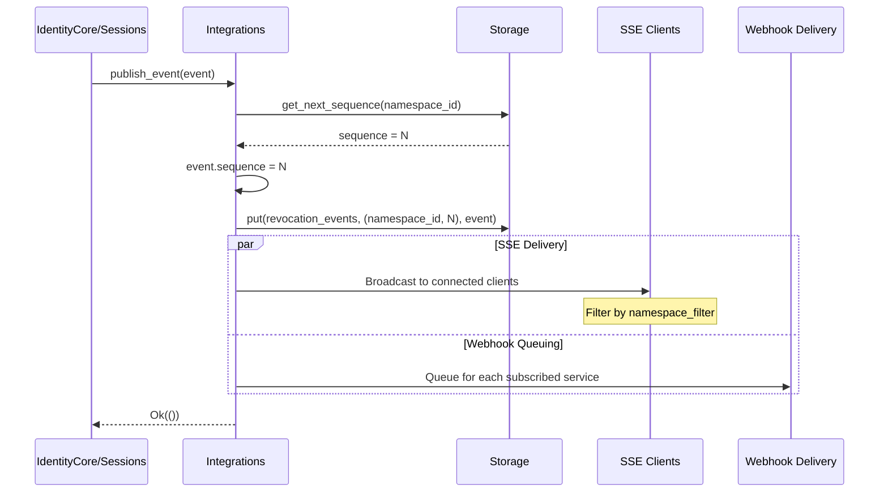
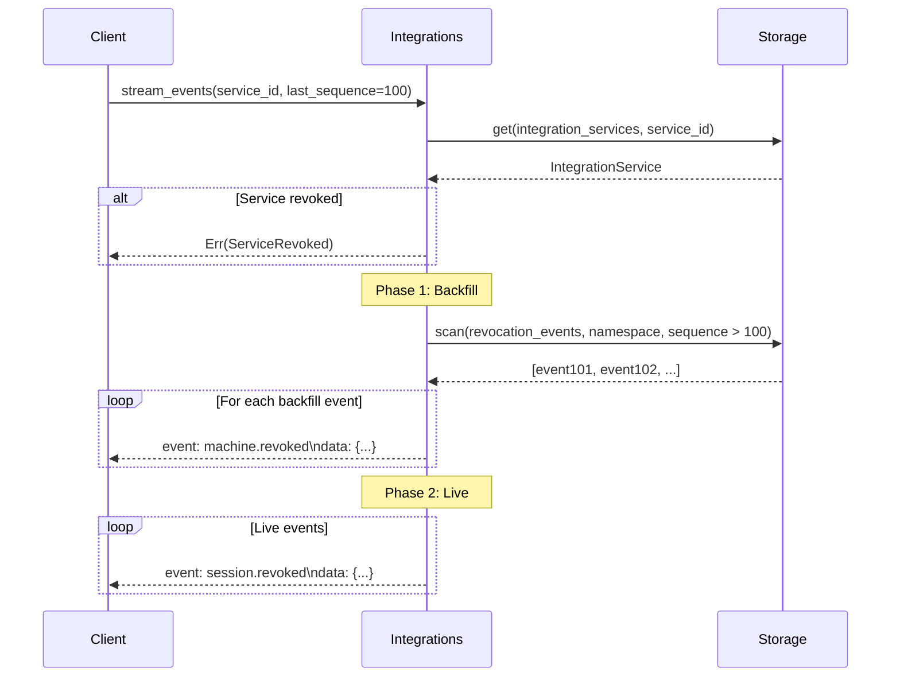
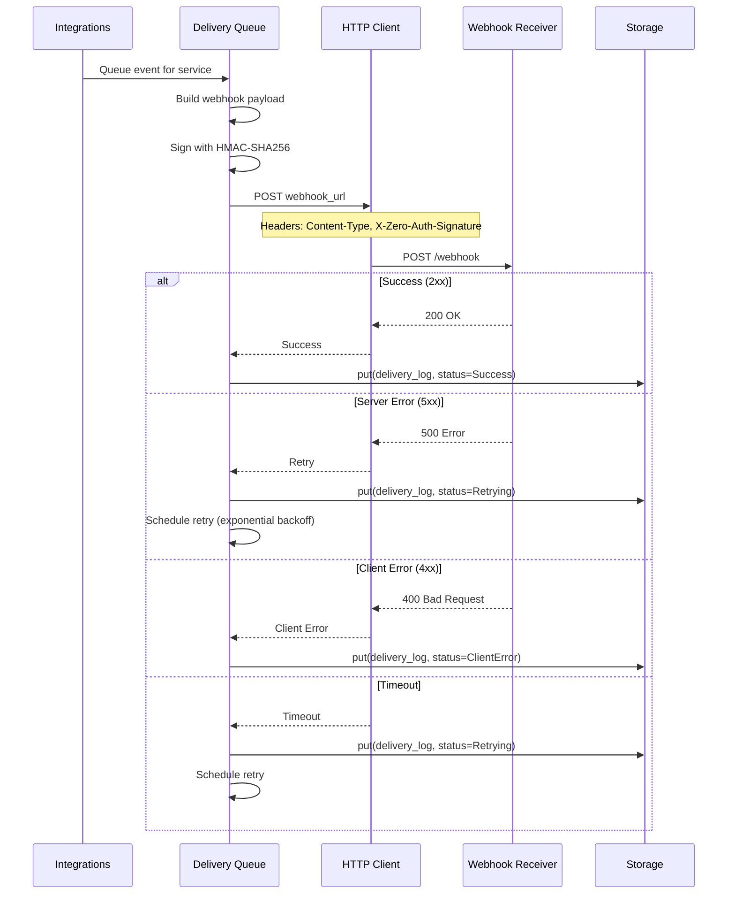

# zid-integrations Specification v0.1.1

## 1. Overview

The `zid-integrations` crate provides external service integration capabilities including mTLS authentication, Server-Sent Events (SSE) streaming, and webhook delivery for revocation events.

### 1.1 Purpose and Responsibilities

- **Service Authentication**: mTLS-based authentication for integration services
- **SSE Streaming**: Real-time event delivery via Server-Sent Events
- **Webhook Delivery**: Reliable webhook delivery with retries
- **Event Storage**: Persistent event log with sequence numbers
- **Namespace Filtering**: Scope event delivery to specific namespaces

### 1.2 Position in Dependency Graph



---

## 2. Public Interface

### 2.1 Integrations Trait

```rust
pub trait Integrations: Send + Sync {
    /// Authenticate integration service with mTLS
    fn authenticate_service(
        &self,
        client_cert: Certificate,
    ) -> impl Future<Output = Result<IntegrationService>> + Send;

    /// Register new integration service
    fn register_service(
        &self,
        request: RegisterServiceRequest,
    ) -> impl Future<Output = Result<Uuid>> + Send;

    /// Revoke integration service
    fn revoke_service(
        &self,
        service_id: Uuid,
    ) -> impl Future<Output = Result<()>> + Send;

    /// Publish revocation event
    fn publish_event(
        &self,
        event: RevocationEvent,
    ) -> impl Future<Output = Result<()>> + Send;

    /// Stream events via SSE (backfill + live)
    fn stream_events(
        &self,
        service_id: Uuid,
        last_sequence: u64,
    ) -> impl Future<Output = Result<impl Stream<Item = RevocationEvent> + Send>> + Send;

    /// Update webhook configuration
    fn update_webhook_config(
        &self,
        service_id: Uuid,
        webhook_config: Option<WebhookConfig>,
    ) -> impl Future<Output = Result<()>> + Send;

    /// Get integration service by ID
    fn get_service(
        &self,
        service_id: Uuid,
    ) -> impl Future<Output = Result<IntegrationService>> + Send;
}
```

### 2.2 Types

#### IntegrationService

```rust
#[derive(Debug, Clone, Serialize, Deserialize)]
pub struct IntegrationService {
    pub service_id: Uuid,
    pub service_name: String,
    pub client_cert_fingerprint: [u8; 32],  // SHA-256
    pub namespace_filter: Vec<Uuid>,         // Empty = all namespaces
    pub scopes: Vec<Scope>,
    pub webhook_config: Option<WebhookConfig>,
    pub created_at: u64,
    pub last_used_at: Option<u64>,
    pub revoked: bool,
    pub revoked_at: Option<u64>,
}
```

#### Scope

```rust
#[repr(u16)]
pub enum Scope {
    EventsMachineRevoked = 0x0001,
    EventsSessionRevoked = 0x0002,
    EventsIdentityFrozen = 0x0004,
    AuthIntrospect = 0x0008,
}
```

#### WebhookConfig

```rust
#[derive(Debug, Clone, Serialize, Deserialize)]
pub struct WebhookConfig {
    pub url: String,
    pub secret: [u8; 32],  // HMAC-SHA256 key
    pub enabled: bool,
}
```

#### RevocationEvent

```rust
#[derive(Debug, Clone, Serialize, Deserialize)]
pub struct RevocationEvent {
    pub event_id: Uuid,
    pub event_type: EventType,
    pub namespace_id: Uuid,
    pub identity_id: Uuid,
    pub machine_id: Option<Uuid>,
    pub session_id: Option<Uuid>,
    pub sequence: u64,          // Monotonic per namespace
    pub timestamp: u64,
    pub reason: String,
}

#[repr(u8)]
pub enum EventType {
    MachineRevoked = 0x01,
    SessionRevoked = 0x02,
    IdentityFrozen = 0x03,
    IdentityDisabled = 0x04,
}

impl EventType {
    pub fn event_name(&self) -> &'static str {
        match self {
            EventType::MachineRevoked => "machine.revoked",
            EventType::SessionRevoked => "session.revoked",
            EventType::IdentityFrozen => "identity.frozen",
            EventType::IdentityDisabled => "identity.disabled",
        }
    }
}
```

#### Certificate

```rust
#[derive(Debug, Clone)]
pub struct Certificate {
    pub der_bytes: Vec<u8>,
    pub not_after: u64,
    pub not_before: u64,
}

impl Certificate {
    pub fn fingerprint(&self) -> [u8; 32] {
        // SHA-256 of DER-encoded certificate
    }
}
```

#### RegisterServiceRequest

```rust
#[derive(Debug, Clone, Serialize, Deserialize)]
pub struct RegisterServiceRequest {
    pub service_name: String,
    pub client_cert_fingerprint: [u8; 32],
    pub namespace_filter: Vec<Uuid>,
    pub scopes: Vec<Scope>,
    pub webhook_config: Option<WebhookConfig>,
}
```

#### WebhookDeliveryLog

```rust
#[derive(Debug, Clone, Serialize, Deserialize)]
pub struct WebhookDeliveryLog {
    pub delivery_id: Uuid,
    pub service_id: Uuid,
    pub event_id: Uuid,
    pub attempt: u32,
    pub status: DeliveryStatus,
    pub attempted_at: u64,
    pub next_attempt_at: Option<u64>,
    pub abandoned_at: Option<u64>,
    pub http_status: Option<u16>,
    pub error_message: Option<String>,
}

#[repr(u8)]
pub enum DeliveryStatus {
    Queued = 0x01,
    Success = 0x02,
    ClientError = 0x03,
    ServerError = 0x04,
    Retrying = 0x05,
    Abandoned = 0x06,
}
```

### 2.3 Error Types

```rust
pub enum IntegrationError {
    UnknownService(Uuid),
    ServiceRevoked(Uuid),
    ServiceAlreadyRegistered([u8; 32]),
    CertificateExpired,
    CertificateNotYetValid,
    InvalidNamespaceFilter(Uuid),
    InvalidWebhookUrl(String),
    SequenceGenerationFailed,
    Storage(StorageError),
}
```

---

## 3. State Machines

### 3.1 Integration Service Lifecycle



### 3.2 Event Publishing Flow



### 3.3 Webhook Delivery Retry Flow



---

## 4. Control Flow

### 4.1 Service Authentication



### 4.2 Event Publishing



### 4.3 SSE Streaming with Backfill



### 4.4 Webhook Delivery



---

## 5. Data Structures

### 5.1 Storage Schema

| Column Family | Key | Value | Description |
|---------------|-----|-------|-------------|
| `integration_services` | `service_id: Uuid` | `IntegrationService` | Service records |
| `integration_services_by_cert` | `fingerprint: [u8; 32]` | `service_id: Uuid` | Cert lookup |
| `revocation_events` | `(namespace_id, sequence)` | `RevocationEvent` | Event log |
| `processed_event_ids` | `event_id: Uuid` | `processed_at: u64` | Deduplication |
| `webhook_delivery_log` | `(service_id, event_id)` | `WebhookDeliveryLog` | Delivery tracking |

### 5.2 SSE Event Format

```
event: machine.revoked
id: 550e8400-e29b-41d4-a716-446655440000
data: {"event_id":"550e8400...","event_type":"MachineRevoked","namespace_id":"...",
data: "identity_id":"...","machine_id":"...","sequence":42,"timestamp":1704067200,
data: "reason":"User revoked device"}

```

### 5.3 Webhook Payload

```json
{
  "event_id": "550e8400-e29b-41d4-a716-446655440000",
  "event_type": "machine.revoked",
  "namespace_id": "660f9511-e29b-41d4-a716-446655440001",
  "identity_id": "770g0622-e29b-41d4-a716-446655440002",
  "machine_id": "880h1733-e29b-41d4-a716-446655440003",
  "sequence": 42,
  "timestamp": 1704067200,
  "reason": "User revoked device"
}
```

### 5.4 Webhook Signature

```
X-Zero-Auth-Signature: sha256=<hex_encoded_hmac>

HMAC = HMAC-SHA256(webhook_secret, request_body)
```

---

## 6. Security Considerations

### 6.1 mTLS Authentication

- Services authenticate using X.509 client certificates
- Certificate fingerprint (SHA-256) is used for lookup
- Certificate validity period is checked
- Services can be revoked immediately

### 6.2 Namespace Filtering

- Services can subscribe to specific namespaces
- Empty filter = all namespaces (admin services only)
- Events outside filter are not delivered

### 6.3 Webhook Security

| Feature | Implementation |
|---------|----------------|
| Authentication | HMAC-SHA256 signature |
| Confidentiality | HTTPS required |
| Replay prevention | Event IDs are unique |
| Timeout | 30 seconds per request |

### 6.4 Event Deduplication

- Event IDs are UUIDs
- Processed event IDs are tracked (TTL: 1 hour)
- Prevents duplicate processing on retry

---

## 7. Dependencies

### 7.1 Internal Crate Dependencies

| Crate | Purpose |
|-------|---------|
| `zid-storage` | Persistent storage |

### 7.2 External Dependencies

| Crate | Version | Purpose |
|-------|---------|---------|
| `tokio` | 1.35 | Async runtime |
| `tokio-stream` | 0.1 | Async streams |
| `async-trait` | 0.1 | Async trait support |
| `reqwest` | 0.12 | HTTP client for webhooks |
| `hmac` | 0.12 | HMAC-SHA256 |
| `sha2` | 0.10 | SHA-256 for fingerprints |
| `serde` | 1.0 | Serialization |
| `serde_json` | 1.0 | JSON serialization |
| `thiserror` | 1.0 | Error types |
| `uuid` | 1.6 | UUID handling |
| `tracing` | 0.1 | Logging |

---

## 8. Constants

```rust
// Webhook delivery
pub const WEBHOOK_TIMEOUT_SECONDS: u64 = 30;
pub const WEBHOOK_MAX_RETRIES: u32 = 5;
pub const WEBHOOK_INITIAL_DELAY_MS: u64 = 1000;
pub const WEBHOOK_MAX_DELAY_MS: u64 = 32000;

// Retry backoff: 1s, 2s, 4s, 8s, 16s (max 32s)
fn backoff_delay(attempt: u32) -> u64 {
    min(WEBHOOK_INITIAL_DELAY_MS * 2u64.pow(attempt - 1), WEBHOOK_MAX_DELAY_MS)
}

// Event processing
pub const PROCESSED_EVENT_TTL_SECONDS: u64 = 3600;  // 1 hour

// SSE
pub const SSE_KEEPALIVE_INTERVAL_SECONDS: u64 = 30;
```
