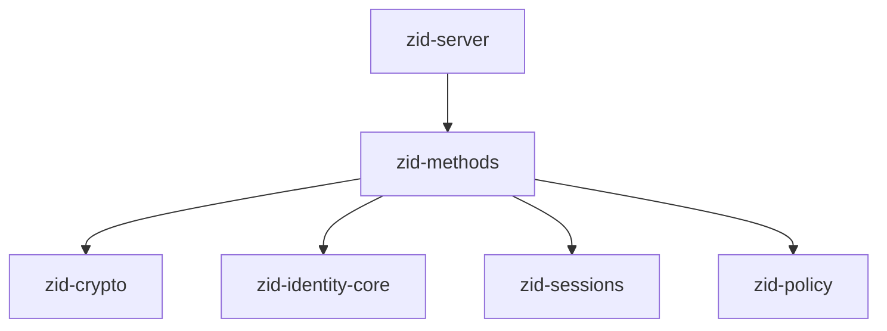
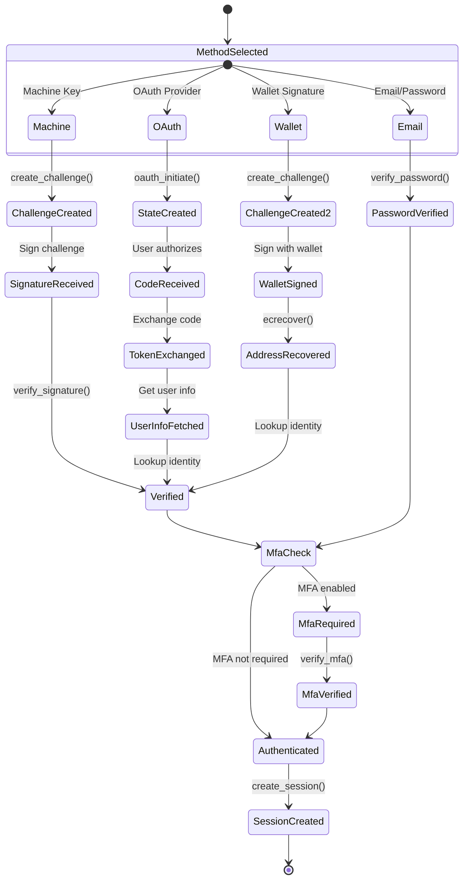
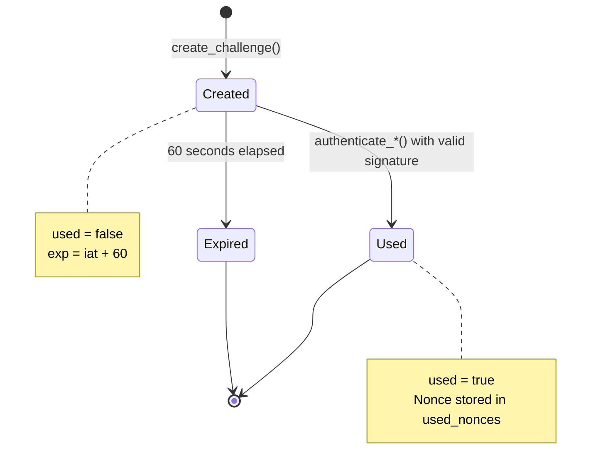
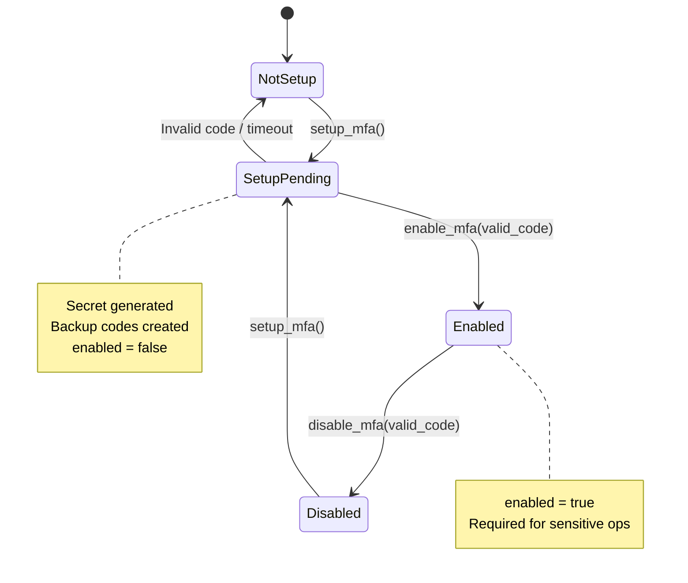
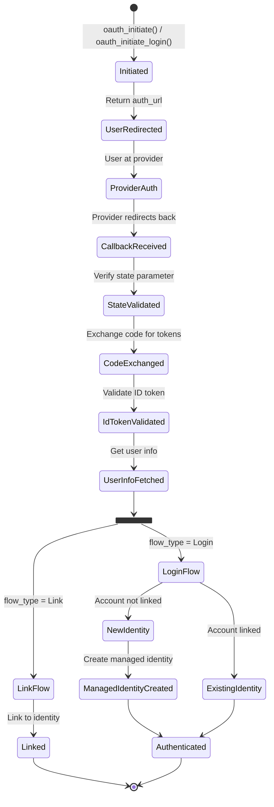
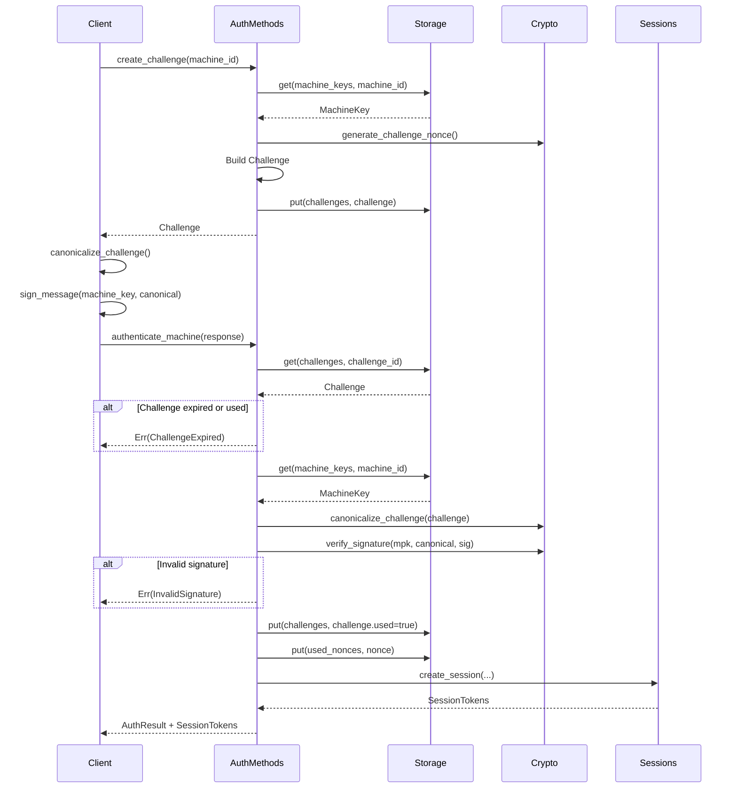
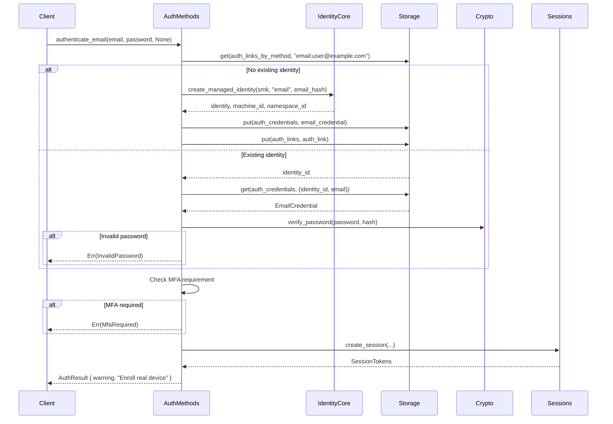
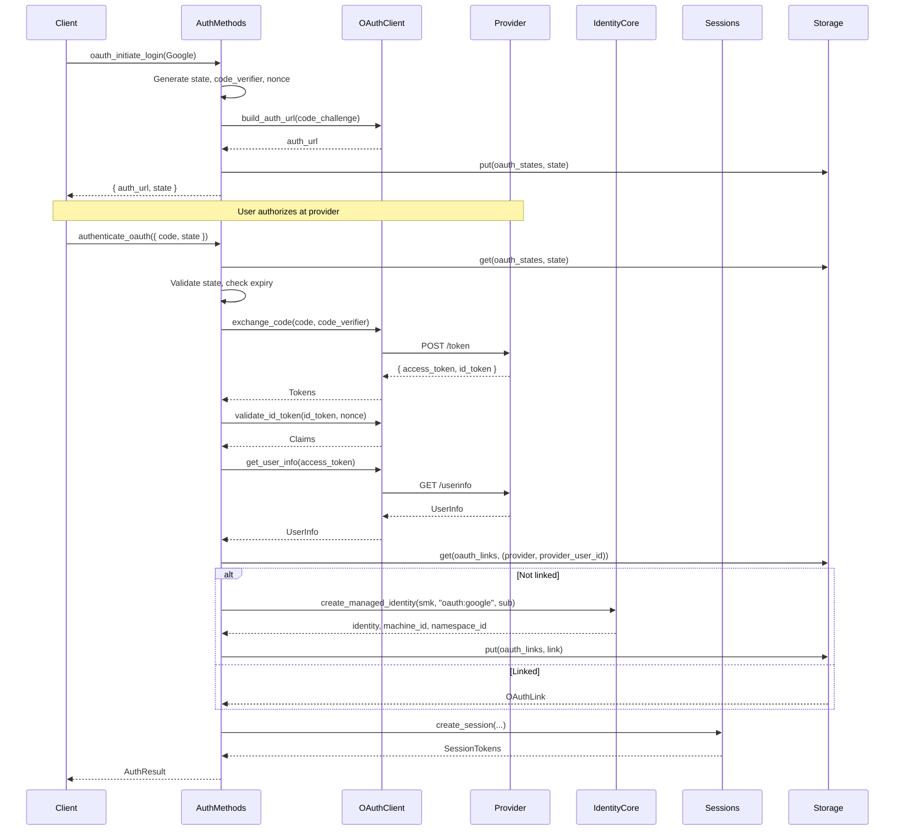

# zid-methods Specification v0.1.1

## 1. Overview

The `zid-methods` crate implements all authentication methods for Zero-ID, including machine key authentication, email/password, OAuth, wallet signatures, and MFA.

### 1.1 Purpose and Responsibilities

- **Machine Key Auth**: Challenge-response authentication with Ed25519
- **Email/Password Auth**: Argon2id password verification
- **OAuth Authentication**: Google, X, and Epic Games integration
- **Wallet Authentication**: EVM (SECP256k1) and Solana (Ed25519) signatures
- **MFA Management**: TOTP setup, verification, and backup codes
- **Credential Linking**: Attach multiple auth methods to identities

### 1.2 Position in Dependency Graph



---

## 2. Public Interface

### 2.1 AuthMethods Trait

```rust
#[async_trait]
pub trait AuthMethods: Send + Sync {
    // ===========================================
    // Challenge-Response
    // ===========================================
    
    /// Create an authentication challenge
    async fn create_challenge(&self, request: ChallengeRequest) -> Result<Challenge>;

    /// Authenticate with Machine Key challenge-response
    async fn authenticate_machine(
        &self,
        response: ChallengeResponse,
        ip_address: String,
        user_agent: String,
    ) -> Result<AuthResult>;

    // ===========================================
    // Email/Password
    // ===========================================

    /// Authenticate with email + password
    async fn authenticate_email(
        &self,
        request: EmailAuthRequest,
        ip_address: String,
        user_agent: String,
    ) -> Result<AuthResult>;

    /// Attach email credential to existing identity
    async fn attach_email_credential(
        &self,
        identity_id: Uuid,
        email: String,
        password: String,
    ) -> Result<()>;

    // ===========================================
    // MFA
    // ===========================================

    /// Setup MFA for identity
    async fn setup_mfa(&self, identity_id: Uuid) -> Result<MfaSetup>;

    /// Enable MFA after verification
    async fn enable_mfa(&self, identity_id: Uuid, verification_code: String) -> Result<()>;

    /// Disable MFA (requires MFA code)
    async fn disable_mfa(&self, identity_id: Uuid, mfa_code: String) -> Result<()>;

    /// Verify MFA code
    async fn verify_mfa(&self, identity_id: Uuid, code: String) -> Result<bool>;

    // ===========================================
    // OAuth
    // ===========================================

    /// Initiate OAuth link flow
    async fn oauth_initiate(
        &self,
        identity_id: Uuid,
        provider: OAuthProvider,
    ) -> Result<OAuthInitiateResponse>;

    /// Initiate OAuth login flow
    async fn oauth_initiate_login(
        &self,
        provider: OAuthProvider,
    ) -> Result<OAuthInitiateResponse>;

    /// Complete OAuth link flow
    async fn oauth_complete(
        &self,
        identity_id: Uuid,
        request: OAuthCompleteRequest,
    ) -> Result<Uuid>;

    /// Authenticate with OAuth
    async fn authenticate_oauth(
        &self,
        request: OAuthCompleteRequest,
        ip_address: String,
        user_agent: String,
    ) -> Result<AuthResult>;

    /// Revoke OAuth link
    async fn revoke_oauth_link(
        &self,
        identity_id: Uuid,
        provider: OAuthProvider,
    ) -> Result<()>;

    // ===========================================
    // Wallet
    // ===========================================

    /// Authenticate with EVM wallet signature
    async fn authenticate_wallet(
        &self,
        signature: WalletSignature,
        ip_address: String,
        user_agent: String,
    ) -> Result<AuthResult>;

    /// Authenticate with pre-verified wallet address
    async fn authenticate_wallet_by_address(
        &self,
        wallet_address: String,
        mfa_code: Option<String>,
        ip_address: String,
        user_agent: String,
    ) -> Result<AuthResult>;

    /// Attach wallet credential to existing identity
    async fn attach_wallet_credential(
        &self,
        identity_id: Uuid,
        wallet_address: String,
        chain: String,
    ) -> Result<()>;

    /// Revoke wallet credential
    async fn revoke_wallet_credential(
        &self,
        identity_id: Uuid,
        wallet_address: String,
    ) -> Result<()>;

    // ===========================================
    // Credential Management
    // ===========================================

    /// List credentials for identity
    async fn list_credentials(&self, identity_id: Uuid) -> Result<Vec<CredentialInfo>>;
}
```

### 2.2 Types

#### Challenge Types

```rust
// Re-exported from zid-crypto
pub struct Challenge {
    pub challenge_id: Uuid,
    pub entity_id: Uuid,
    pub entity_type: EntityType,
    pub purpose: String,
    pub aud: String,
    pub iat: u64,
    pub exp: u64,
    pub nonce: [u8; 32],
    pub used: bool,
}

#[repr(u8)]
pub enum EntityType {
    Machine = 0x01,
    Wallet = 0x02,
    Email = 0x03,
}

pub struct ChallengeRequest {
    pub machine_id: Uuid,
    pub purpose: Option<String>,
}

pub struct ChallengeResponse {
    pub challenge_id: Uuid,
    pub machine_id: Uuid,
    pub signature: Vec<u8>,      // Ed25519: 64 bytes
    pub mfa_code: Option<String>,
}
```

#### AuthResult

```rust
pub struct AuthResult {
    pub identity_id: Uuid,
    pub machine_id: Uuid,
    pub namespace_id: Uuid,
    pub mfa_verified: bool,
    pub auth_method: AuthMethod,
    pub warning: Option<String>,  // e.g., "Enroll real device"
}

// Re-exported from zid-policy
pub enum AuthMethod {
    MachineKey = 0x01,
    EmailPassword = 0x02,
    OAuth = 0x03,
    EvmWallet = 0x04,
}
```

#### Email Types

```rust
pub struct EmailAuthRequest {
    pub email: String,
    pub password: String,
    pub machine_id: Option<Uuid>,
    pub mfa_code: Option<String>,
}

pub struct EmailCredential {
    pub identity_id: Uuid,
    pub email: String,              // Lowercased
    pub password_hash: String,      // Argon2id
    pub created_at: u64,
    pub updated_at: u64,
    pub email_verified: bool,
    pub verification_token: Option<String>,
}
```

#### MFA Types

```rust
pub struct MfaSetup {
    pub secret: String,             // Base32 encoded
    pub qr_code_url: String,        // otpauth:// URL
    pub backup_codes: Vec<String>,  // 10 codes, shown once
}

pub struct MfaSecret {
    pub identity_id: Uuid,
    pub encrypted_secret: Vec<u8>,  // XChaCha20-Poly1305
    pub nonce: [u8; 24],
    pub backup_codes: Vec<String>,  // Hashed
    pub created_at: u64,
    pub enabled: bool,
}
```

#### OAuth Types

```rust
#[derive(Debug, Clone, Copy, PartialEq, Eq)]
pub enum OAuthProvider {
    Google,
    X,
    EpicGames,
}

pub struct OAuthInitiateResponse {
    pub auth_url: String,
    pub state: String,
}

pub struct OAuthCompleteRequest {
    pub provider: OAuthProvider,
    pub code: String,
    pub state: String,
}

pub struct OAuthState {
    pub state_id: String,
    pub provider: OAuthProvider,
    pub identity_id: Option<Uuid>,
    pub flow_type: OAuthFlowType,
    pub code_verifier: String,      // PKCE
    pub nonce: String,              // OIDC nonce
    pub redirect_uri: String,
    pub created_at: u64,
    pub expires_at: u64,
}

pub enum OAuthFlowType {
    Link,   // Linking to existing identity
    Login,  // Login or create new identity
}

pub struct OAuthLink {
    pub link_id: Uuid,
    pub identity_id: Uuid,
    pub provider: OAuthProvider,
    pub provider_user_id: String,
    pub email: Option<String>,
    pub created_at: u64,
    pub last_used_at: u64,
}

pub struct OAuthUserInfo {
    pub provider_user_id: String,
    pub email: Option<String>,
    pub name: Option<String>,
    pub picture: Option<String>,
}
```

#### Wallet Types

```rust
pub struct WalletSignature {
    pub challenge_id: Uuid,
    pub wallet_address: String,    // 0x...
    pub signature: Vec<u8>,        // 65 bytes (r, s, v)
    pub mfa_code: Option<String>,
}

#[derive(Debug, Clone, Copy)]
pub enum WalletType {
    Ethereum,
    Polygon,
    Arbitrum,
    Base,
    Solana,
}

pub struct WalletCredential {
    pub identity_id: Uuid,
    pub wallet_type: WalletType,
    pub wallet_address: String,
    pub public_key: Option<[u8; 32]>,
    pub chain: String,
    pub created_at: u64,
    pub last_used_at: u64,
    pub revoked: bool,
    pub revoked_at: Option<u64>,
}
```

#### Auth Link Types

```rust
#[repr(u8)]
pub enum AuthMethodType {
    Email = 0x01,
    OAuthGoogle = 0x02,
    OAuthX = 0x03,
    OAuthEpic = 0x04,
    WalletEvm = 0x10,
    WalletSolana = 0x11,
    MachineKey = 0x20,
}

pub struct AuthLinkRecord {
    pub identity_id: Uuid,
    pub method_type: AuthMethodType,
    pub method_id: String,          // email, provider:sub, address
    pub linked_at: u64,
    pub is_primary: bool,
    pub verified: bool,
    pub last_used_at: Option<u64>,
}

pub struct CredentialInfo {
    pub credential_type: CredentialType,
    pub identifier: String,
    pub created_at: u64,
    pub last_used_at: u64,
    pub revoked: bool,
}

pub enum CredentialType {
    Email,
    OAuth,
    Wallet,
}
```

### 2.3 Error Types

```rust
pub enum AuthMethodsError {
    // Challenge errors
    ChallengeNotFound(Uuid),
    ChallengeExpired,
    ChallengeAlreadyUsed,
    InvalidSignature,
    
    // Machine errors
    MachineNotFound(Uuid),
    MachineRevoked(Uuid),
    
    // Email errors
    EmailNotFound(String),
    EmailAlreadyExists(String),
    InvalidPassword,
    
    // MFA errors
    MfaNotSetup,
    MfaAlreadyEnabled,
    MfaNotEnabled,
    InvalidMfaCode,
    MfaRequired,
    
    // OAuth errors
    OAuthStateNotFound,
    OAuthStateExpired,
    OAuthStateMismatch,
    OAuthProviderError(String),
    OAuthAccountNotLinked,
    OAuthAccountAlreadyLinked,
    
    // Wallet errors
    WalletNotFound(String),
    WalletAlreadyLinked(String),
    InvalidWalletSignature,
    
    // General
    IdentityNotFound(Uuid),
    IdentityNotActive,
    PolicyDenied(String),
    Storage(StorageError),
    Crypto(CryptoError),
}
```

---

## 3. State Machines

### 3.1 Authentication Flow



### 3.2 Challenge Lifecycle



### 3.3 MFA Setup Flow



### 3.4 OAuth Flow



---

## 4. Control Flow

### 4.1 Machine Key Authentication



### 4.2 Email Authentication with Managed Identity



### 4.3 OAuth Authentication



---

## 5. Data Structures

### 5.1 Storage Schema

| Column Family | Key | Value | Description |
|---------------|-----|-------|-------------|
| `auth_credentials` | `(identity_id, "email")` | `EmailCredential` | Email credentials |
| `mfa_secrets` | `identity_id: Uuid` | `MfaSecret` | Encrypted TOTP secrets |
| `challenges` | `challenge_id: Uuid` | `Challenge` | Auth challenges (TTL: 5 min) |
| `used_nonces` | `nonce_hex: String` | `expiry: u64` | Replay prevention |
| `oauth_states` | `state_id: String` | `OAuthState` | OAuth flow state (TTL: 10 min) |
| `oauth_links` | `(provider, provider_user_id)` | `OAuthLink` | OAuth links |
| `oauth_links_by_identity` | `(identity_id, provider)` | `link_id` | Index |
| `oidc_nonces` | `nonce: String` | `created_at: u64` | OIDC nonces |
| `jwks_cache` | `provider: String` | `JwksKeySet` | Cached JWKS |
| `wallet_credentials` | `wallet_address: String` | `WalletCredential` | Wallet creds |
| `wallet_credentials_by_identity` | `(identity_id, address)` | `()` | Index |
| `auth_links` | `(identity_id, method_type)` | `AuthLinkRecord` | Method links |
| `auth_links_by_method` | `method_key: String` | `identity_id: Uuid` | Method index |
| `primary_auth_method` | `identity_id: Uuid` | `AuthMethodType` | Primary method |

### 5.2 TOTP Configuration

| Parameter | Value |
|-----------|-------|
| Algorithm | HMAC-SHA1 |
| Digits | 6 |
| Period | 30 seconds |
| Issuer | "Zero-ID" |
| Window | ±1 period (90 seconds total) |

### 5.3 Backup Codes

- Count: 10 codes
- Format: 8 alphanumeric characters
- Storage: Argon2id hashed
- Usage: Single-use, consumed on verification

---

## 6. Security Considerations

### 6.1 Password Security

- Hashing: Argon2id (64 MiB, 3 iterations)
- Verification: Constant-time comparison
- Storage: Only hash stored, never plaintext

### 6.2 Challenge Security

- Nonce: 32 bytes random
- Expiry: 60 seconds
- Replay prevention: Used nonces stored
- One-time use: Challenge marked used after verification

### 6.3 OAuth Security

| Mechanism | Implementation |
|-----------|----------------|
| State parameter | 32 bytes random, stored server-side |
| PKCE | code_challenge_method: S256 |
| ID Token validation | Signature, iss, aud, exp, nonce |
| State expiry | 10 minutes |

### 6.4 Wallet Signature Security

- EVM: EIP-191 personal_sign message format
- Recovery: ecrecover to derive address
- Verification: Compare recovered vs claimed address

### 6.5 MFA Security

- Secret encryption: XChaCha20-Poly1305 with identity-derived KEK
- Backup codes: Argon2id hashed
- Rate limiting: Policy engine enforcement

---

## 7. Dependencies

### 7.1 Internal Crate Dependencies

| Crate | Purpose |
|-------|---------|
| `zid-crypto` | Signatures, hashing, encryption |
| `zid-identity-core` | Identity and machine management |
| `zid-sessions` | Session creation |
| `zid-policy` | Policy evaluation |

### 7.2 External Dependencies

| Crate | Version | Purpose |
|-------|---------|---------|
| `reqwest` | 0.12 | OAuth HTTP client |
| `jsonwebtoken` | 9.2 | OIDC token validation |
| `totp-rs` | 5.0 | TOTP implementation |
| `tokio` | 1.35 | Async runtime |
| `async-trait` | 0.1 | Async trait support |
| `serde` | 1.0 | Serialization |
| `serde_json` | 1.0 | JSON serialization |
| `thiserror` | 1.0 | Error types |
| `uuid` | 1.6 | UUID handling |
| `tracing` | 0.1 | Logging |

---

## 8. OAuth Provider Configuration

### 8.1 Google

```
Authorization: https://accounts.google.com/o/oauth2/v2/auth
Token: https://oauth2.googleapis.com/token
UserInfo: https://openidconnect.googleapis.com/v1/userinfo
JWKS: https://www.googleapis.com/oauth2/v3/certs
Scopes: openid, email, profile
```

### 8.2 X (Twitter)

```
Authorization: https://twitter.com/i/oauth2/authorize
Token: https://api.twitter.com/2/oauth2/token
UserInfo: https://api.twitter.com/2/users/me
Scopes: users.read, tweet.read
```

### 8.3 Epic Games

```
Authorization: https://www.epicgames.com/id/authorize
Token: https://api.epicgames.dev/epic/oauth/v2/token
UserInfo: https://api.epicgames.dev/epic/id/v2/accounts
Scopes: basic_profile
```
