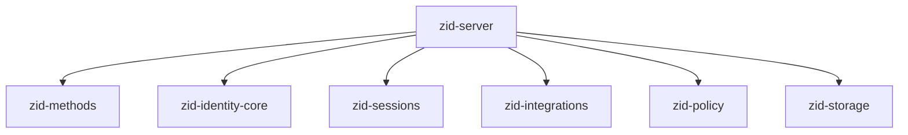
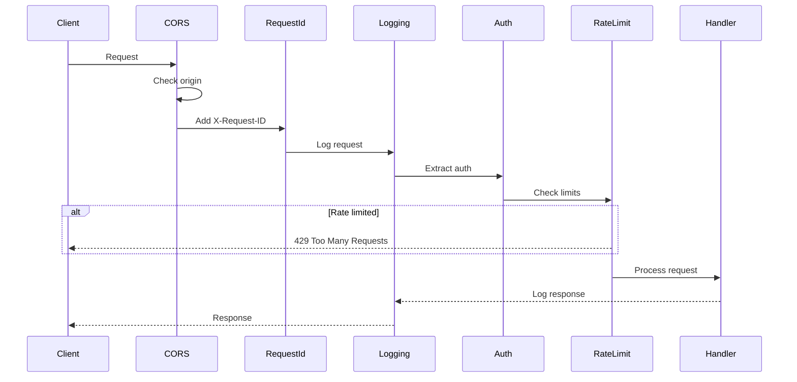
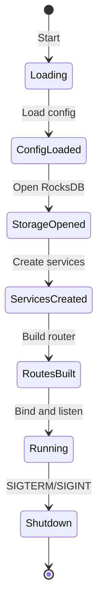

# zid-server Specification v0.1.1

## 1. Overview

The `zid-server` crate implements the HTTP API server for Zero-ID, providing RESTful endpoints for authentication, identity management, and integration services.

### 1.1 Purpose and Responsibilities

- **HTTP API**: RESTful endpoints for all operations
- **Request Handling**: Parse, validate, and route requests
- **Middleware**: CORS, logging, request context
- **Error Handling**: Consistent error responses
- **Configuration**: Environment-based configuration

### 1.2 Position in Dependency Graph



---

## 2. API Endpoints

### 2.1 Health Endpoints

| Method | Path | Purpose |
|--------|------|---------|
| GET | `/health` | Liveness probe |
| GET | `/health/ready` | Readiness probe (checks storage) |

### 2.2 Authentication Endpoints

| Method | Path | Purpose | Auth Required |
|--------|------|---------|---------------|
| GET | `/v1/auth/challenge` | Get challenge for machine auth | No |
| POST | `/v1/auth/login/machine` | Machine key authentication | No |
| POST | `/v1/auth/login/email` | Email/password authentication | No |
| POST | `/v1/auth/login/oauth` | OAuth authentication | No |
| POST | `/v1/auth/login/wallet` | Wallet signature authentication | No |
| POST | `/v1/auth/refresh` | Refresh access token | No (refresh token) |
| POST | `/v1/auth/introspect` | Token introspection | No (Bearer token) |
| GET | `/.well-known/jwks.json` | Public keys for JWT validation | No |

### 2.3 Identity Endpoints

| Method | Path | Purpose | Auth Required |
|--------|------|---------|---------------|
| POST | `/v1/identity` | Create identity (self-sovereign) | No |
| GET | `/v1/identity` | Get current identity | Yes |
| DELETE | `/v1/identity` | Disable identity | Yes |
| POST | `/v1/identity/freeze` | Freeze identity | Yes |
| POST | `/v1/identity/unfreeze` | Unfreeze identity | Yes |

### 2.4 Machine Endpoints

| Method | Path | Purpose | Auth Required |
|--------|------|---------|---------------|
| POST | `/v1/identity/machines` | Enroll machine | Yes |
| GET | `/v1/identity/machines` | List machines | Yes |
| GET | `/v1/identity/machines/{id}` | Get machine | Yes |
| DELETE | `/v1/identity/machines/{id}` | Revoke machine | Yes |

### 2.5 Credential Endpoints

| Method | Path | Purpose | Auth Required |
|--------|------|---------|---------------|
| POST | `/v1/credentials/email` | Attach email credential | Yes |
| POST | `/v1/credentials/wallet` | Attach wallet credential | Yes |
| GET | `/v1/credentials` | List all credentials | Yes |
| DELETE | `/v1/credentials/wallet/{address}` | Revoke wallet credential | Yes |

### 2.6 OAuth Endpoints

| Method | Path | Purpose | Auth Required |
|--------|------|---------|---------------|
| GET | `/v1/oauth/{provider}/initiate` | Start OAuth link flow | Yes |
| GET | `/v1/oauth/{provider}/login` | Start OAuth login flow | No |
| POST | `/v1/oauth/callback` | Complete OAuth flow | No |
| DELETE | `/v1/oauth/{provider}` | Revoke OAuth link | Yes |

### 2.7 MFA Endpoints

| Method | Path | Purpose | Auth Required |
|--------|------|---------|---------------|
| POST | `/v1/mfa/setup` | Setup MFA | Yes |
| POST | `/v1/mfa/enable` | Enable MFA (verify code) | Yes |
| POST | `/v1/mfa/disable` | Disable MFA | Yes |
| POST | `/v1/mfa/verify` | Verify MFA code | Yes |

### 2.8 Session Endpoints

| Method | Path | Purpose | Auth Required |
|--------|------|---------|---------------|
| GET | `/v1/sessions` | List sessions | Yes |
| DELETE | `/v1/sessions/{id}` | Revoke session | Yes |
| DELETE | `/v1/sessions` | Revoke all sessions | Yes |

### 2.9 Namespace Endpoints

| Method | Path | Purpose | Auth Required |
|--------|------|---------|---------------|
| GET | `/v1/namespaces` | List namespaces | Yes |
| POST | `/v1/namespaces` | Create namespace | Yes |
| GET | `/v1/namespaces/{id}` | Get namespace | Yes |
| PATCH | `/v1/namespaces/{id}` | Update namespace | Yes |
| DELETE | `/v1/namespaces/{id}` | Delete namespace | Yes |
| GET | `/v1/namespaces/{id}/members` | List members | Yes |
| POST | `/v1/namespaces/{id}/members` | Add member | Yes |
| PATCH | `/v1/namespaces/{id}/members/{identity_id}` | Update member | Yes |
| DELETE | `/v1/namespaces/{id}/members/{identity_id}` | Remove member | Yes |

### 2.10 Integration Endpoints

| Method | Path | Purpose | Auth Required |
|--------|------|---------|---------------|
| GET | `/v1/events/stream` | SSE event stream | mTLS |
| POST | `/v1/services` | Register service | Admin |
| DELETE | `/v1/services/{id}` | Revoke service | Admin |

---

## 3. Request/Response Formats

### 3.1 Challenge Request/Response

```http
GET /v1/auth/challenge?machine_id=550e8400-e29b-41d4-a716-446655440000
```

```json
{
  "challenge_id": "660f9511-e29b-41d4-a716-446655440001",
  "challenge": {
    "entity_id": "550e8400-e29b-41d4-a716-446655440000",
    "entity_type": "machine",
    "purpose": "login",
    "aud": "https://zid.zero.tech",
    "iat": 1704067200,
    "exp": 1704067260,
    "nonce": "base64_encoded_32_bytes"
  },
  "expires_at": 1704067260
}
```

### 3.2 Machine Login

```http
POST /v1/auth/login/machine
Content-Type: application/json
```

```json
{
  "challenge_id": "660f9511-e29b-41d4-a716-446655440001",
  "machine_id": "550e8400-e29b-41d4-a716-446655440000",
  "signature": "base64_encoded_64_bytes",
  "mfa_code": "123456"
}
```

Response:
```json
{
  "access_token": "eyJ...",
  "refresh_token": "base64_encoded_token",
  "session_id": "770g0622-e29b-41d4-a716-446655440002",
  "expires_in": 900,
  "token_type": "Bearer"
}
```

### 3.3 Email Login

```http
POST /v1/auth/login/email
Content-Type: application/json
```

```json
{
  "email": "user@example.com",
  "password": "secure_password",
  "machine_id": "550e8400-e29b-41d4-a716-446655440000",
  "mfa_code": "123456"
}
```

### 3.4 Create Identity

```http
POST /v1/identity
Content-Type: application/json
```

```json
{
  "identity_id": "550e8400-e29b-41d4-a716-446655440000",
  "identity_signing_public_key": "base64_encoded_32_bytes",
  "machine": {
    "machine_id": "660f9511-e29b-41d4-a716-446655440001",
    "signing_public_key": "base64_encoded_32_bytes",
    "encryption_public_key": "base64_encoded_32_bytes",
    "capabilities": 63,
    "device_name": "My Device",
    "device_platform": "macos",
    "key_scheme": "classical"
  },
  "authorization_signature": "base64_encoded_64_bytes",
  "namespace_name": "Personal",
  "created_at": 1704067200
}
```

Response:
```json
{
  "identity_id": "550e8400-e29b-41d4-a716-446655440000",
  "did": "did:key:z6MkhaXgBZDvotDkL5257faiztiGiC2QtKLGpbnnEGta2doK",
  "tier": "self_sovereign",
  "machine_id": "660f9511-e29b-41d4-a716-446655440001",
  "namespace_id": "550e8400-e29b-41d4-a716-446655440000"
}
```

### 3.5 Token Introspection

```http
POST /v1/auth/introspect
Content-Type: application/json
```

```json
{
  "token": "eyJ...",
  "audience": "my-app"
}
```

Response:
```json
{
  "active": true,
  "identity_id": "550e8400-e29b-41d4-a716-446655440000",
  "machine_id": "660f9511-e29b-41d4-a716-446655440001",
  "namespace_id": "770g0622-e29b-41d4-a716-446655440002",
  "session_id": "880h1733-e29b-41d4-a716-446655440003",
  "mfa_verified": true,
  "capabilities": ["authenticate", "sign"],
  "scopes": ["read", "write"],
  "issued_at": 1704067200,
  "expires_at": 1704068100
}
```

---

## 4. Error Responses

### 4.1 Error Format

```json
{
  "error": {
    "code": "AUTHENTICATION_FAILED",
    "message": "Invalid signature",
    "details": {
      "challenge_id": "550e8400-e29b-41d4-a716-446655440000"
    }
  }
}
```

### 4.2 Error Codes

| HTTP Status | Error Code | Description |
|-------------|------------|-------------|
| 400 | `INVALID_REQUEST` | Malformed request |
| 400 | `VALIDATION_ERROR` | Validation failed |
| 401 | `AUTHENTICATION_REQUIRED` | No auth provided |
| 401 | `AUTHENTICATION_FAILED` | Auth failed |
| 401 | `TOKEN_EXPIRED` | Token has expired |
| 401 | `TOKEN_INVALID` | Invalid token |
| 403 | `FORBIDDEN` | Insufficient permissions |
| 403 | `MFA_REQUIRED` | MFA verification needed |
| 403 | `IDENTITY_FROZEN` | Identity is frozen |
| 404 | `NOT_FOUND` | Resource not found |
| 409 | `CONFLICT` | Resource already exists |
| 429 | `RATE_LIMITED` | Too many requests |
| 500 | `INTERNAL_ERROR` | Server error |

---

## 5. Middleware

### 5.1 Request Flow



### 5.2 CORS Configuration

```rust
CorsLayer::new()
    .allow_origin(AllowOrigin::list(config.cors_allowed_origins))
    .allow_methods([Method::GET, Method::POST, Method::DELETE, Method::PATCH])
    .allow_headers([AUTHORIZATION, CONTENT_TYPE])
    .allow_credentials(true)
```

### 5.3 Request Context

```rust
pub struct RequestContext {
    pub request_id: Uuid,
    pub ip_address: String,
    pub user_agent: String,
    pub identity_id: Option<Uuid>,
    pub machine_id: Option<Uuid>,
    pub namespace_id: Option<Uuid>,
}
```

---

## 6. Configuration

### 6.1 Environment Variables

| Variable | Default | Description |
|----------|---------|-------------|
| `RUN_MODE` | `prod` | `dev` or `prod` |
| `BIND_ADDRESS` | `127.0.0.1:9999` | Server bind address |
| `DATABASE_PATH` | `./data/zid.db` | RocksDB path |
| `SERVICE_MASTER_KEY` | (required in prod) | 32-byte hex key |
| `JWT_ISSUER` | `https://zid.zero.tech` | JWT issuer claim |
| `JWT_AUDIENCE` | `zero-vault` | JWT audience |
| `ACCESS_TOKEN_EXPIRY_SECONDS` | `900` | Access token lifetime |
| `REFRESH_TOKEN_EXPIRY_SECONDS` | `2592000` | Refresh token lifetime |
| `CORS_ALLOWED_ORIGINS` | `http://localhost:3000` | Comma-separated origins |
| `TRUSTED_PROXIES` | (empty) | Trusted proxy IPs |

### 6.2 OAuth Configuration

| Variable | Description |
|----------|-------------|
| `OAUTH_GOOGLE_CLIENT_ID` | Google OAuth client ID |
| `OAUTH_GOOGLE_CLIENT_SECRET` | Google OAuth client secret |
| `OAUTH_GOOGLE_REDIRECT_URI` | Google OAuth redirect URI |
| `OAUTH_X_CLIENT_ID` | X OAuth client ID |
| `OAUTH_X_CLIENT_SECRET` | X OAuth client secret |
| `OAUTH_X_REDIRECT_URI` | X OAuth redirect URI |
| `OAUTH_EPIC_CLIENT_ID` | Epic Games OAuth client ID |
| `OAUTH_EPIC_CLIENT_SECRET` | Epic Games OAuth client secret |
| `OAUTH_EPIC_REDIRECT_URI` | Epic Games OAuth redirect URI |

---

## 7. State Management

### 7.1 Application State

```rust
pub struct AppState {
    pub storage: Arc<dyn Storage>,
    pub identity_core: Arc<dyn IdentityCore>,
    pub auth_methods: Arc<dyn AuthMethods>,
    pub sessions: Arc<dyn SessionManager>,
    pub integrations: Arc<dyn Integrations>,
    pub policy: Arc<dyn PolicyEngine>,
    pub config: Config,
}
```

### 7.2 Server Lifecycle



---

## 8. Security Considerations

### 8.1 Authentication

- Bearer token validation on protected endpoints
- mTLS for integration service endpoints
- Rate limiting by IP and identity

### 8.2 Input Validation

- All inputs validated before processing
- UUID format validation
- Signature format validation
- Email format validation

### 8.3 IP Address Handling

```rust
// Trust X-Forwarded-For only from trusted proxies
fn get_client_ip(
    request: &Request,
    trusted_proxies: &[IpAddr],
    socket_addr: SocketAddr,
) -> String {
    if trusted_proxies.contains(&socket_addr.ip()) {
        if let Some(forwarded_for) = request.headers().get("X-Forwarded-For") {
            // Parse and return first untrusted IP
        }
    }
    socket_addr.ip().to_string()
}
```

### 8.4 Secret Redaction

- Service master key never logged
- OAuth client secrets redacted in debug output
- Passwords never stored or logged

---

## 9. Dependencies

### 9.1 Internal Crate Dependencies

| Crate | Purpose |
|-------|---------|
| `zid-crypto` | Cryptographic operations |
| `zid-storage` | Storage backend |
| `zid-policy` | Policy evaluation |
| `zid-identity-core` | Identity management |
| `zid-methods` | Authentication methods |
| `zid-sessions` | Session management |
| `zid-integrations` | External integrations |

### 9.2 External Dependencies

| Crate | Version | Purpose |
|-------|---------|---------|
| `axum` | 0.7 | HTTP framework |
| `tower-http` | 0.5 | HTTP middleware |
| `tokio` | 1.35 | Async runtime |
| `tokio-stream` | 0.1 | SSE streaming |
| `futures` | 0.3 | Async utilities |
| `serde` | 1.0 | Serialization |
| `serde_json` | 1.0 | JSON serialization |
| `tracing` | 0.1 | Logging |
| `tracing-subscriber` | 0.3 | Log formatting |
| `anyhow` | 1.0 | Error handling |
| `thiserror` | 1.0 | Error types |
| `uuid` | 1.6 | UUID handling |
| `chrono` | 0.4 | Time handling |
| `hex` | 0.4 | Hex encoding |
| `base64` | 0.21 | Base64 encoding |
| `rand` | 0.8 | Random generation |
| `urlencoding` | 2.1 | URL encoding |

---

## 10. Usage

### 10.1 Starting the Server

```bash
# Development mode (auto-generates service master key)
RUN_MODE=dev cargo run -p zid-server

# Production mode (requires SERVICE_MASTER_KEY)
SERVICE_MASTER_KEY=<64_hex_chars> cargo run -p zid-server

# Generate a service master key
cargo run -p zid-server -- --generate-key
```

### 10.2 Health Check

```bash
# Liveness
curl http://localhost:9999/health

# Readiness
curl http://localhost:9999/health/ready
```
