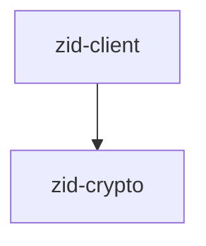
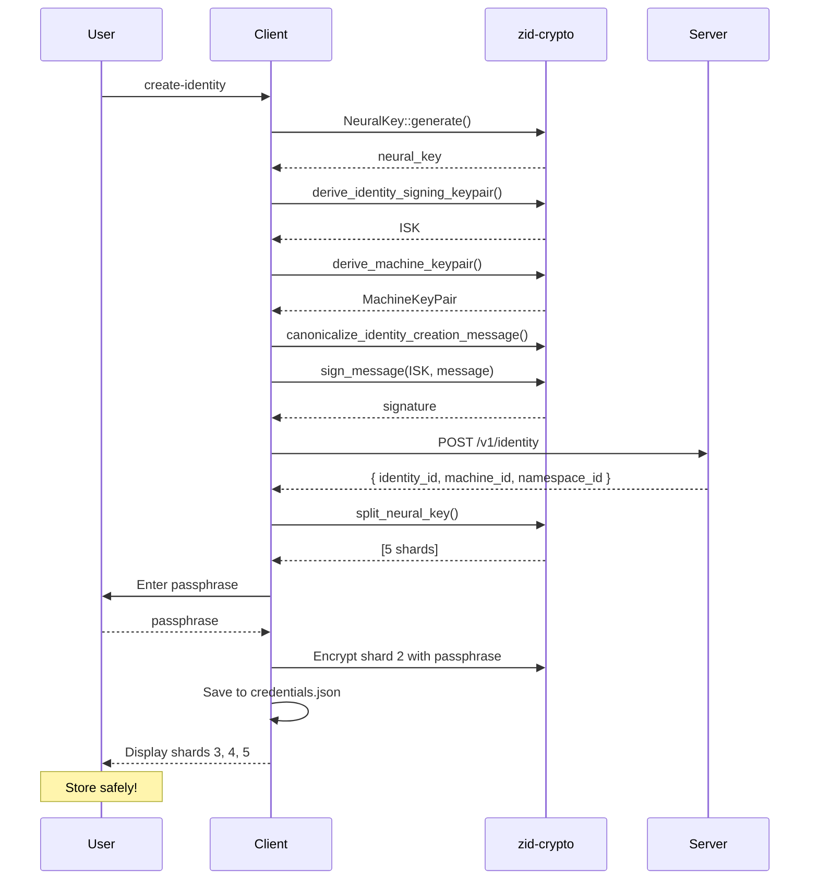
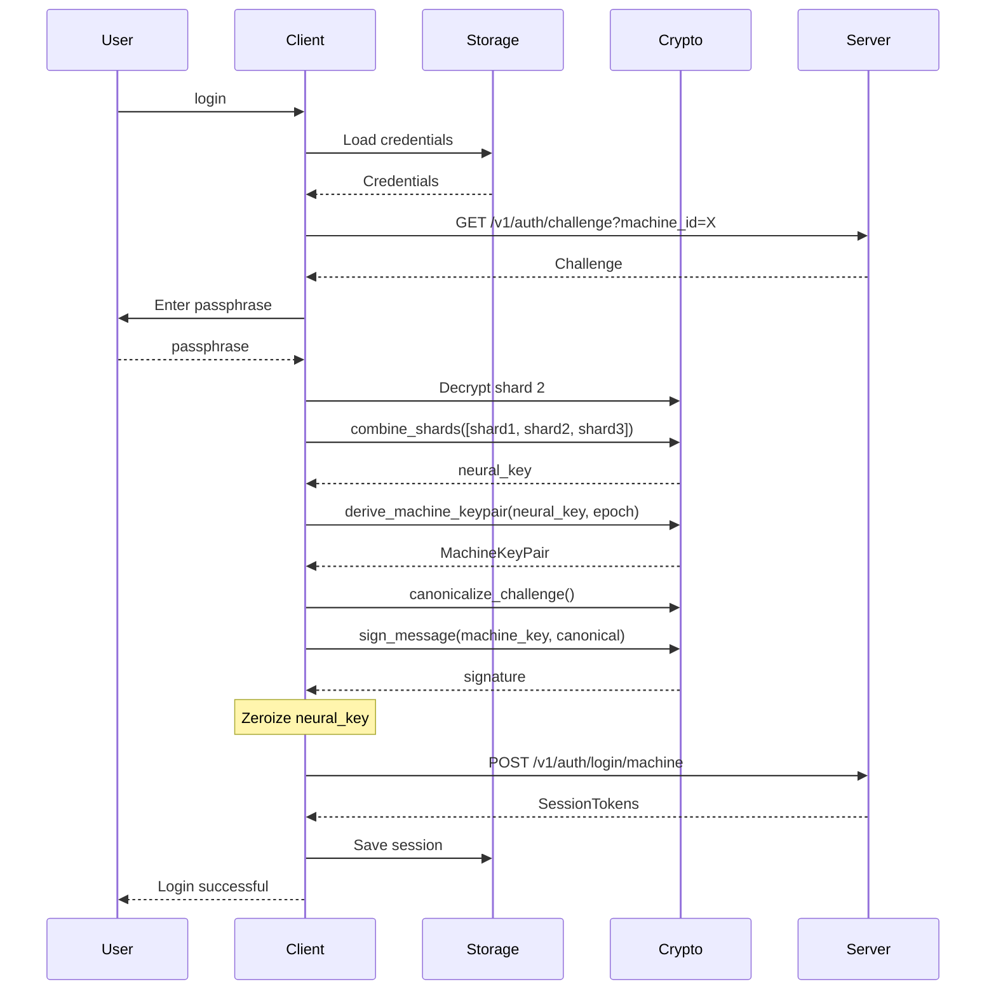
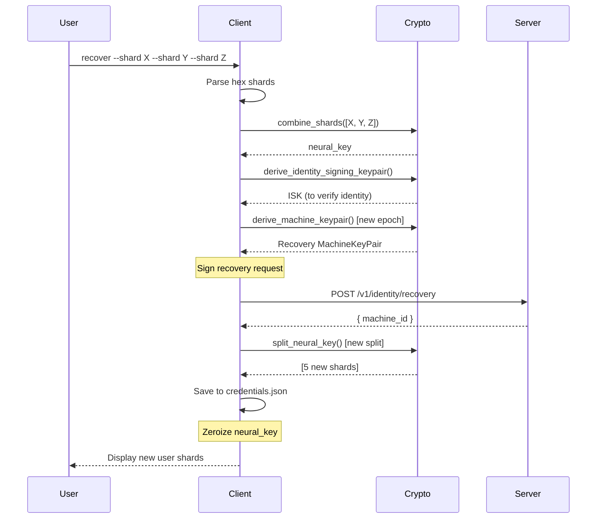
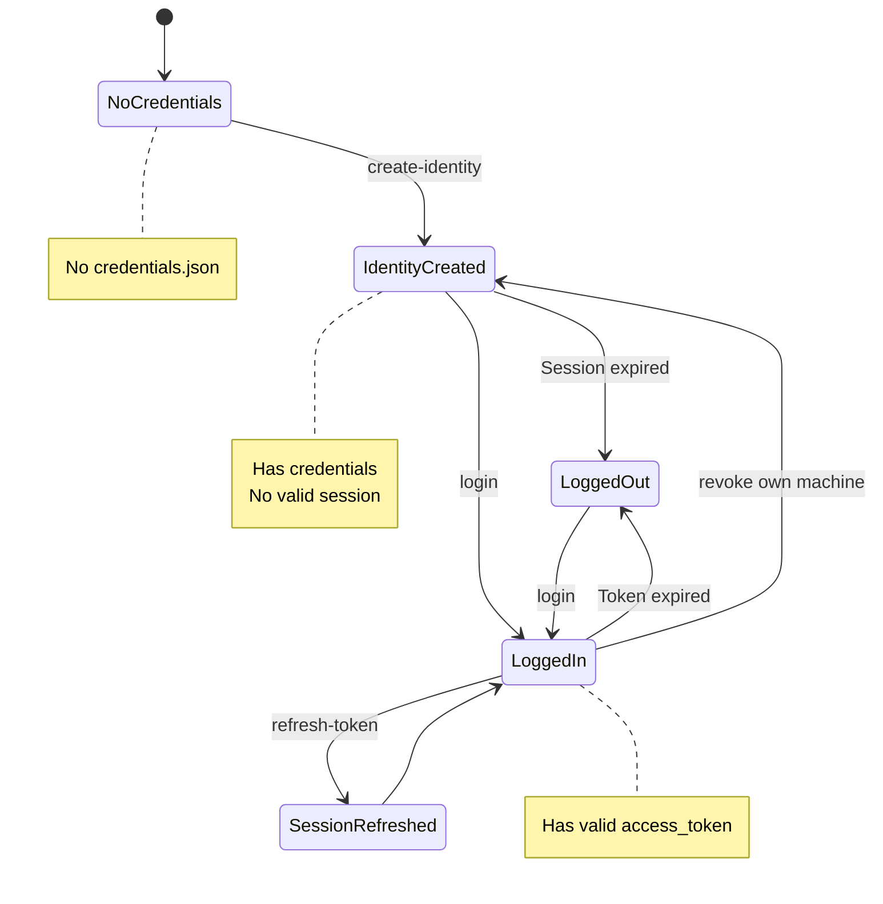
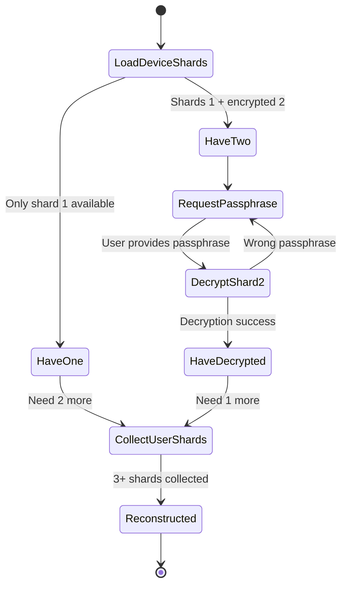

# zid-client Specification v0.1.1

## 1. Overview

The `zid-client` crate provides the command-line interface (CLI) for interacting with Zero-ID, including identity creation, authentication, and device management.

### 1.1 Purpose and Responsibilities

- **Identity Creation**: Client-side Neural Key generation and identity registration
- **Authentication**: Challenge-response login with machine keys
- **Device Management**: Enroll and revoke machines
- **Credential Management**: Add email/password credentials
- **Recovery**: Reconstruct Neural Key from shards
- **Local Storage**: Secure credential storage

### 1.2 Position in Dependency Graph



---

## 2. CLI Commands

### 2.1 Command Structure

```
client [OPTIONS] <COMMAND>

Options:
  -s, --server <URL>    Zero-ID server URL [default: http://127.0.0.1:9999]

Commands:
  create-identity    Create a new identity
  login              Login with machine key
  add-email          Add email credential
  login-email        Login with email/password
  validate-token     Validate a JWT token
  refresh-token      Refresh access token
  show-credentials   Show stored credentials
  test-protected     Test protected endpoint
  enroll-machine     Enroll a new machine
  list-machines      List enrolled machines
  revoke-machine     Revoke a machine
  recover            Recover identity from shards
```

### 2.2 Command Details

#### create-identity

```
client create-identity [OPTIONS]

Options:
  -d, --device-name <NAME>     Device name [default: "Example Client Device"]
  -p, --platform <PLATFORM>    Device platform [default: "rust-app"]
  -k, --key-scheme <SCHEME>    Key scheme [default: classical]
                               [possible values: classical, pq-hybrid]
```

Creates a new self-sovereign identity:
1. Generates Neural Key
2. Derives Identity Signing Key
3. Derives Machine Key
4. Signs identity creation message
5. Registers with server
6. Splits Neural Key into 5 shards
7. Encrypts 2 shards with passphrase
8. Saves to local credentials file
9. Displays 3 user shards for backup

#### login

```
client login
```

Authenticates using stored machine key:
1. Loads credentials from storage
2. Requests challenge from server
3. Reconstructs Neural Key
4. Derives machine key
5. Signs challenge
6. Exchanges for session tokens
7. Stores tokens locally

#### add-email

```
client add-email --email <EMAIL> --password <PASSWORD>
```

Attaches email credential to existing identity.

#### login-email

```
client login-email --email <EMAIL> --password <PASSWORD> [--machine-id <ID>]
```

Authenticates with email/password:
- If `machine-id` provided, uses that machine
- Otherwise, lists available machines to choose from

#### enroll-machine

```
client enroll-machine [OPTIONS]

Options:
  -d, --device-name <NAME>     Device name [default: "New Device"]
  -p, --platform <PLATFORM>    Device platform [default: "rust-app"]
  -k, --key-scheme <SCHEME>    Key scheme [default: classical]
```

Enrolls a new machine for the identity.

#### list-machines

```
client list-machines
```

Lists all enrolled machines for the identity.

#### revoke-machine

```
client revoke-machine <MACHINE_ID> [--reason <REASON>]
```

Revokes a machine.

#### recover

```
client recover --shard <SHARD1> --shard <SHARD2> --shard <SHARD3> [OPTIONS]

Options:
  -S, --shard <SHARD>          Neural shard (hex, 3-5 required)
  -d, --device-name <NAME>     Device name [default: "Recovery Device"]
  -p, --platform <PLATFORM>    Device platform [default: "rust-app"]
```

Recovers identity from Neural Shards.

---

## 3. Local Storage

### 3.1 Storage Location

```
~/.zid/credentials.json
```

### 3.2 Credentials File Format

```json
{
  "identity_id": "550e8400-e29b-41d4-a716-446655440000",
  "machine_id": "660f9511-e29b-41d4-a716-446655440001",
  "namespace_id": "770g0622-e29b-41d4-a716-446655440002",
  "device_shards": [
    {
      "index": 1,
      "data": "base64_encoded_32_bytes"
    },
    {
      "index": 2,
      "data_encrypted": "base64_encrypted",
      "nonce": "base64_24_bytes"
    }
  ],
  "epoch": 0,
  "session": {
    "access_token": "eyJ...",
    "refresh_token": "base64...",
    "session_id": "880h1733-e29b-41d4-a716-446655440003",
    "expires_at": 1704068100
  }
}
```

### 3.3 Shard Storage Strategy

The 5 Neural Shards are distributed as follows:

| Shard | Location | Protection |
|-------|----------|------------|
| 1 | Device (credentials.json) | None (cleartext) |
| 2 | Device (credentials.json) | Passphrase encrypted |
| 3 | User custody | Paper/hardware backup |
| 4 | User custody | Paper/hardware backup |
| 5 | User custody | Paper/hardware backup |

To reconstruct (3 of 5 needed):
- **Normal use**: Shard 1 + Shard 2 (with passphrase) + 1 user shard
- **Device loss**: Any 3 user shards

### 3.4 Passphrase Encryption

Device shard #2 is encrypted with:
- Key derivation: Argon2id from passphrase
- Encryption: XChaCha20-Poly1305
- AAD: "cypher:share-backup:v1" || identity_id || shard_index

---

## 4. Control Flow

### 4.1 Identity Creation Flow



### 4.2 Login Flow



### 4.3 Recovery Flow



---

## 5. State Machines

### 5.1 Client Credentials State



### 5.2 Neural Key Reconstruction



---

## 6. Data Structures

### 6.1 Storage Module Types

```rust
pub struct StoredCredentials {
    pub identity_id: Uuid,
    pub machine_id: Uuid,
    pub namespace_id: Uuid,
    pub device_shards: Vec<StoredShard>,
    pub epoch: u64,
    pub session: Option<StoredSession>,
}

pub struct StoredShard {
    pub index: u8,
    pub data: Option<[u8; 32]>,           // Cleartext (shard 1)
    pub data_encrypted: Option<Vec<u8>>,   // Encrypted (shard 2)
    pub nonce: Option<[u8; 24]>,           // For encrypted shards
}

pub struct StoredSession {
    pub access_token: String,
    pub refresh_token: String,
    pub session_id: Uuid,
    pub expires_at: u64,
}
```

### 6.2 KEK Derivation for Shard Encryption

```rust
// Domain: "cypher:share-backup-kek:v1" || identity_id
fn derive_shard_encryption_kek(
    passphrase: &str,
    identity_id: Uuid,
) -> [u8; 32] {
    let salt = format!("cypher:share-backup-kek:v1:{}", identity_id);
    argon2id_derive(passphrase.as_bytes(), salt.as_bytes())
}

// AAD: "cypher:share-backup:v1" || identity_id || shard_index
fn shard_encryption_aad(identity_id: Uuid, shard_index: u8) -> Vec<u8> {
    format!("cypher:share-backup:v1:{}:{}", identity_id, shard_index).into_bytes()
}
```

---

## 7. Security Considerations

### 7.1 Neural Key Protection

- Neural Key reconstructed only when needed
- Immediately zeroized after use
- Never written to disk in full
- Split storage: device + passphrase + user shards

### 7.2 Passphrase Security

- Passphrase used to derive KEK for shard encryption
- KEK derivation uses Argon2id
- Passphrase never stored

### 7.3 Credentials File Security

- Stored in user's home directory
- File permissions should be 0600 (Unix)
- Contains sensitive data (shard 1, encrypted shard 2, tokens)

### 7.4 Session Token Handling

- Access tokens cached locally
- Refresh tokens stored for renewal
- Tokens cleared on explicit logout

---

## 8. Dependencies

### 8.1 Internal Crate Dependencies

| Crate | Purpose |
|-------|---------|
| `zid-crypto` | All cryptographic operations |

### 8.2 External Dependencies

| Crate | Version | Purpose |
|-------|---------|---------|
| `clap` | 4.x | CLI argument parsing |
| `tokio` | 1.35 | Async runtime |
| `reqwest` | 0.12 | HTTP client |
| `serde` | 1.0 | Serialization |
| `serde_json` | 1.0 | JSON serialization |
| `anyhow` | 1.0 | Error handling |
| `uuid` | 1.6 | UUID handling |
| `dirs` | 5.0 | Home directory detection |
| `rpassword` | 7.0 | Secure passphrase input |

---

## 9. Usage Examples

### 9.1 Full Workflow

```bash
# Create a new identity
$ client create-identity --device-name "My Laptop" --platform macos

Creating identity...
Neural Key generated
Identity Signing Key derived
Machine Key derived
Identity registered!

Identity ID: 550e8400-e29b-41d4-a716-446655440000
DID: did:key:z6MkhaXgBZDvotDkL5257faiztiGiC2QtKLGpbnnEGta2doK
Machine ID: 660f9511-e29b-41d4-a716-446655440001
Namespace ID: 550e8400-e29b-41d4-a716-446655440000

Enter a passphrase to protect your device shards: ********
Confirm passphrase: ********

IMPORTANT: Store these recovery shards safely!
Each shard should be stored in a different location.

Shard 3: 03a1b2c3d4e5f6...
Shard 4: 04a1b2c3d4e5f6...
Shard 5: 05a1b2c3d4e5f6...

Credentials saved to ~/.zid/credentials.json

# Login
$ client login
Enter passphrase: ********
Requesting challenge...
Signing challenge...
Authenticating...

Login successful!
Access token expires in 15 minutes

# Add email credential
$ client add-email --email user@example.com --password mypassword
Email credential added successfully!

# Enroll another device
$ client enroll-machine --device-name "My Phone" --platform ios
Enter passphrase: ********
Machine enrolled!
Machine ID: 770g0622-e29b-41d4-a716-446655440002

# List machines
$ client list-machines
ID                                   Name        Platform  Created
----------------------------------------------------------------------
660f9511-e29b-41d4-a716-446655440001 My Laptop   macos     2024-01-01
770g0622-e29b-41d4-a716-446655440002 My Phone    ios       2024-01-02

# Recovery (on new device, with 3 shards)
$ client recover \
    --shard 03a1b2c3d4e5f6... \
    --shard 04a1b2c3d4e5f6... \
    --shard 05a1b2c3d4e5f6... \
    --device-name "Recovery Device"

Reconstructing Neural Key...
Identity verified!
Enrolling recovery machine...

Recovery successful!
New credentials saved to ~/.zid/credentials.json

IMPORTANT: Store these NEW recovery shards safely!
Shard 3: 03b2c3d4e5f6a1...
Shard 4: 04b2c3d4e5f6a1...
Shard 5: 05b2c3d4e5f6a1...
```
