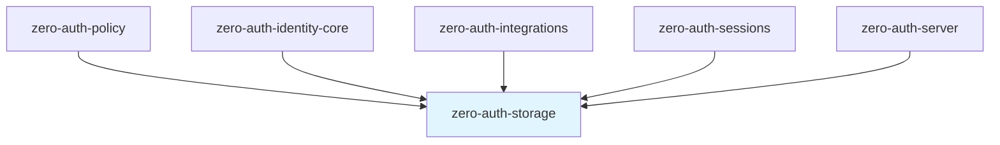
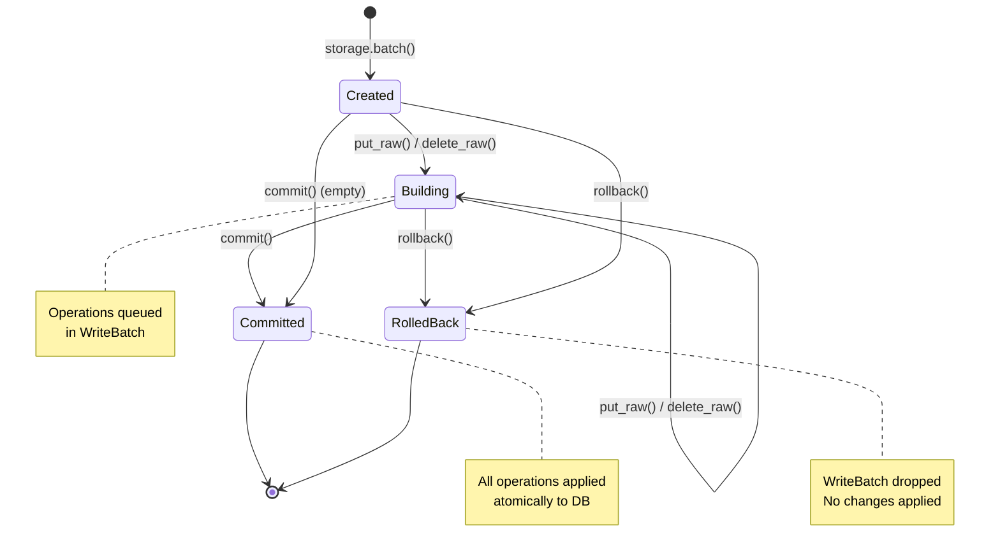
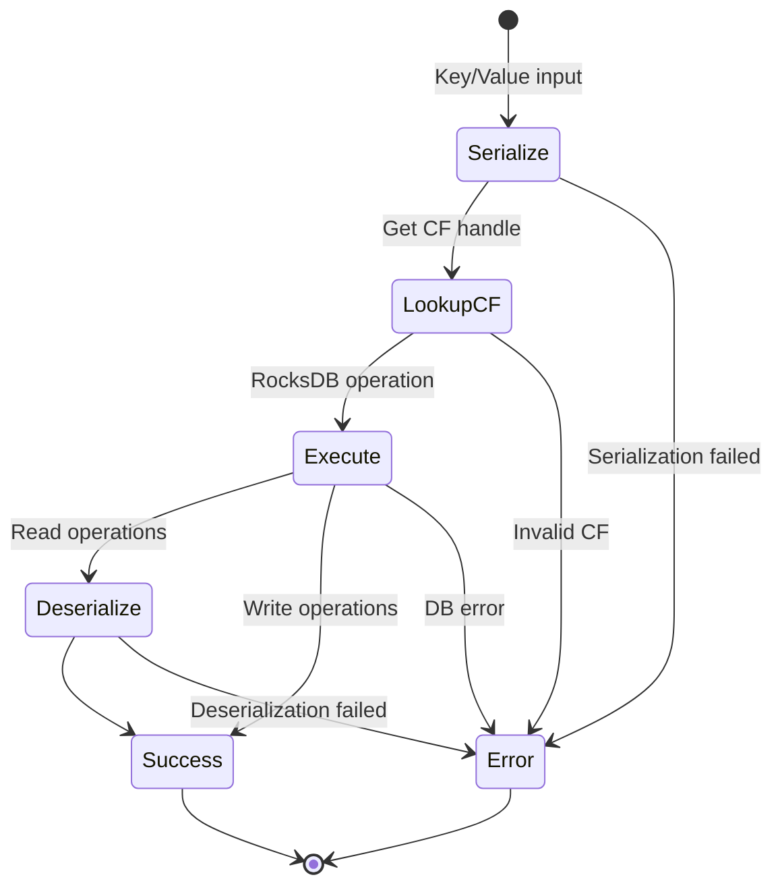
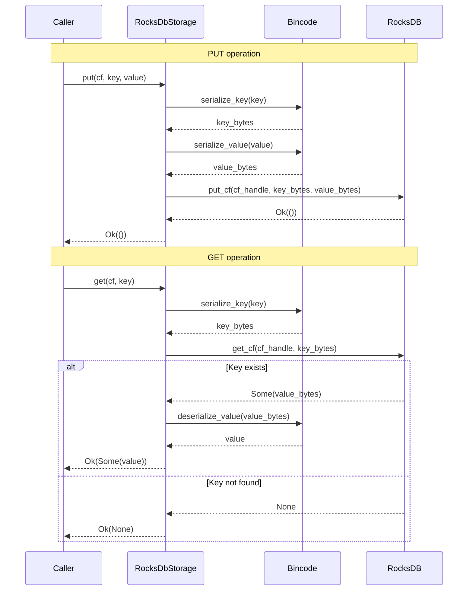
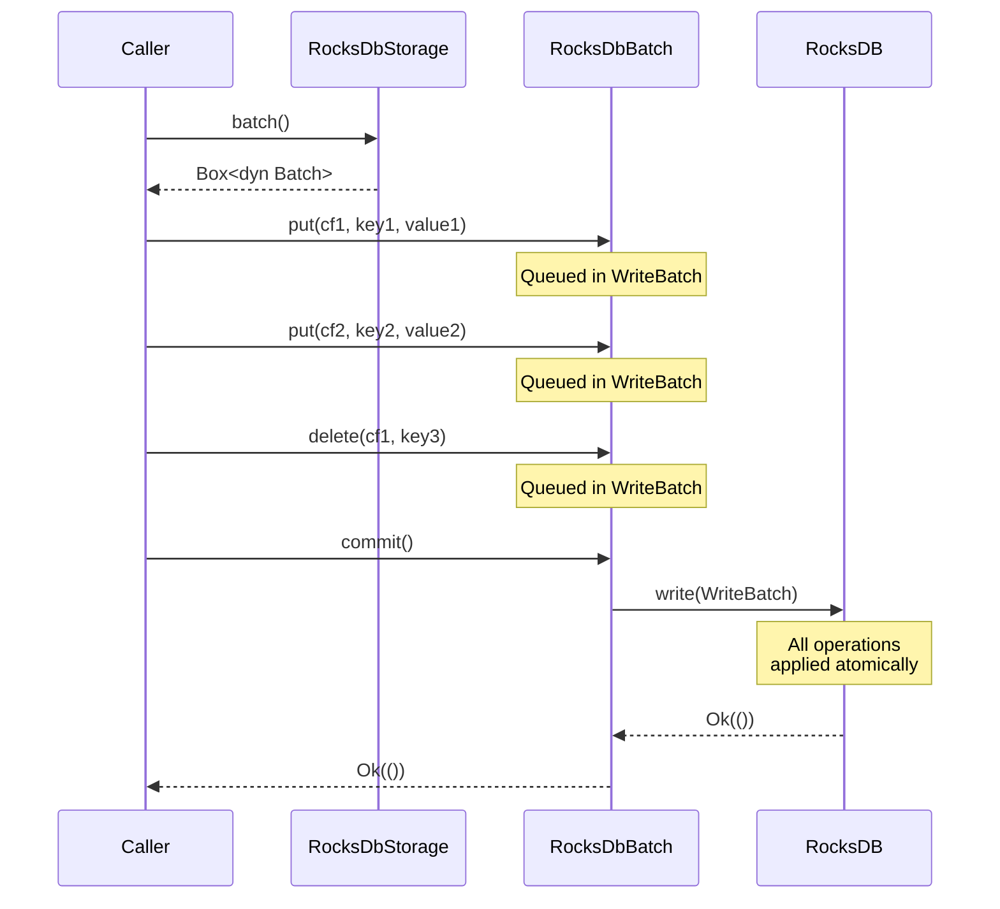
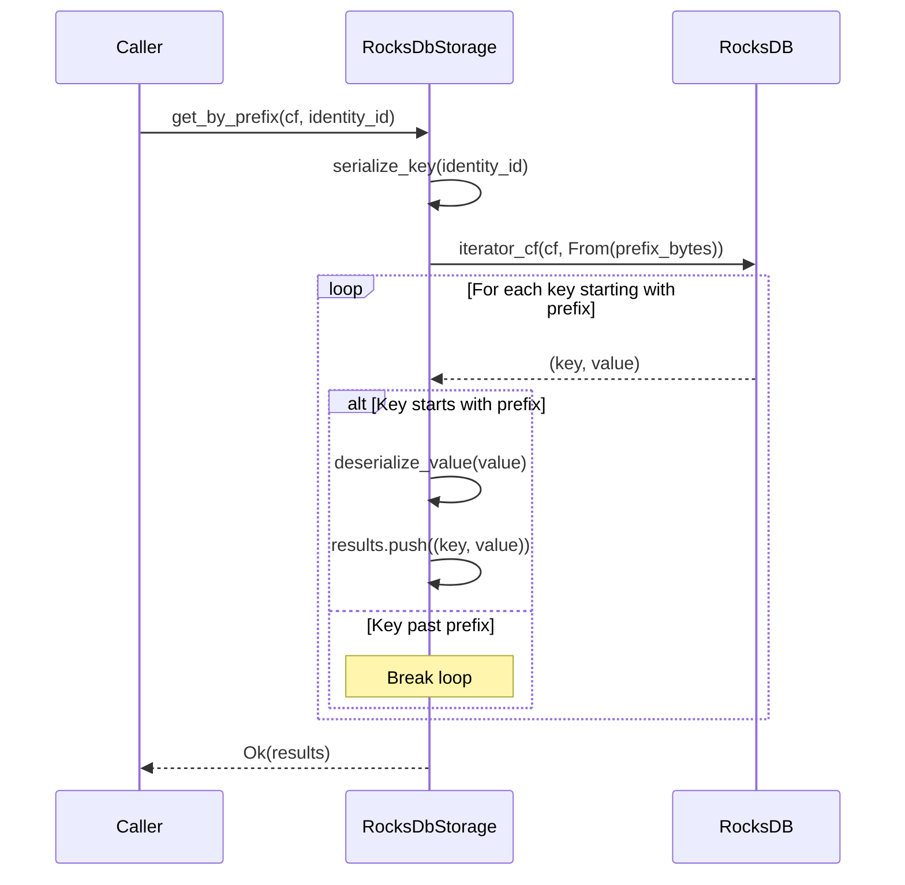

# zero-auth-storage Specification v0.1

## 1. Overview

The `zero-auth-storage` crate provides the storage abstraction layer for Zero-Auth, with a RocksDB implementation. It defines traits for key-value operations and batch/transaction support, enabling both production use and mock implementations for testing.

### 1.1 Purpose and Responsibilities

- **Storage Abstraction**: Define traits for key-value storage operations
- **Column Family Management**: Organize data into logical partitions (29 column families)
- **Batch Operations**: Support atomic multi-key operations
- **Prefix Queries**: Enable efficient range scans for index lookups
- **Serialization**: Automatic bincode serialization/deserialization

### 1.2 Key Design Decisions

- **RocksDB Backend**: High-performance embedded key-value store with column families
- **Async Trait Interface**: All operations are async for compatibility with Tokio runtime
- **Bincode Serialization**: Fast, compact binary serialization for keys and values
- **Trait-Based Abstraction**: Enables mock implementations for testing

### 1.3 Position in Dependency Graph



---

## 2. Public Interface

### 2.1 Storage Trait

The primary interface for all storage operations.

```rust
#[async_trait]
pub trait Storage: Send + Sync {
    /// Get a value by key from a column family
    /// Returns Ok(Some(value)) if found, Ok(None) if not found
    async fn get<K, V>(&self, cf: &str, key: &K) -> Result<Option<V>>
    where
        K: Serialize + Send + Sync,
        V: DeserializeOwned;

    /// Put a key-value pair into a column family
    async fn put<K, V>(&self, cf: &str, key: &K, value: &V) -> Result<()>
    where
        K: Serialize + Send + Sync,
        V: Serialize + Send + Sync;

    /// Delete a key from a column family
    async fn delete<K>(&self, cf: &str, key: &K) -> Result<()>
    where
        K: Serialize + Send + Sync;

    /// Check if a key exists in a column family
    async fn exists<K>(&self, cf: &str, key: &K) -> Result<bool>
    where
        K: Serialize + Send + Sync;

    /// Get all key-value pairs where keys start with the given prefix
    async fn get_by_prefix<K, V>(&self, cf: &str, prefix: &K) -> Result<Vec<(Vec<u8>, V)>>
    where
        K: Serialize + Send + Sync,
        V: DeserializeOwned;

    /// Scan all entries in a column family
    /// WARNING: Use with caution on large column families
    async fn scan_all<V>(&self, cf: &str) -> Result<Vec<(Vec<u8>, V)>>
    where
        V: DeserializeOwned;

    /// Create a new batch for atomic operations
    fn batch(&self) -> Box<dyn Batch>;

    /// Begin a transaction (for multi-CF atomic operations)
    async fn begin_transaction(&self) -> Result<Box<dyn Batch>>;
}
```

### 2.2 Batch Trait

Interface for atomic batch operations. Works with pre-serialized bytes for object safety.

```rust
#[async_trait]
pub trait Batch: Send {
    /// Put a pre-serialized key-value pair in the batch
    fn put_raw(&mut self, cf: &str, key: Vec<u8>, value: Vec<u8>) -> Result<()>;

    /// Delete a pre-serialized key in the batch
    fn delete_raw(&mut self, cf: &str, key: Vec<u8>) -> Result<()>;

    /// Commit the batch atomically
    async fn commit(self: Box<Self>) -> Result<()>;

    /// Rollback the batch (drop without committing)
    fn rollback(self: Box<Self>);
}
```

### 2.3 BatchExt Trait

Extension trait providing type-safe methods that automatically serialize.

```rust
pub trait BatchExt: Batch {
    /// Put a key-value pair in the batch (type-safe)
    fn put<K, V>(&mut self, cf: &str, key: &K, value: &V) -> Result<()>
    where
        K: Serialize,
        V: Serialize;

    /// Delete a key in the batch (type-safe)
    fn delete<K>(&mut self, cf: &str, key: &K) -> Result<()>
    where
        K: Serialize;
}

// Automatically implemented for all types that implement Batch
impl<T: Batch + ?Sized> BatchExt for T {}
```

### 2.4 RocksDbStorage Implementation

```rust
pub struct RocksDbStorage {
    db: Arc<DB>,
}

impl RocksDbStorage {
    /// Open RocksDB database at the specified path
    /// Creates all required column families if they don't exist
    pub fn open<P: AsRef<Path>>(path: P) -> Result<Self>;

    /// Open RocksDB database for testing (temp directory)
    pub fn open_test() -> Result<Self>;
}
```

### 2.5 Error Types

```rust
pub enum StorageError {
    /// Database error (RocksDB-level)
    Database(String),
    
    /// Serialization error (bincode)
    Serialization(String),
    
    /// Deserialization error (bincode)
    Deserialization(String),
    
    /// Key not found
    NotFound,
    
    /// Key already exists
    AlreadyExists,
    
    /// Invalid column family name
    InvalidColumnFamily(String),
    
    /// Transaction error
    TransactionError(String),
    
    /// IO error
    IoError(std::io::Error),
}

pub type Result<T> = std::result::Result<T, StorageError>;
```

---

## 3. State Machines

### 3.1 Batch Lifecycle



### 3.2 Storage Operation Flow



---

## 4. Control Flow

### 4.1 Basic CRUD Operations



### 4.2 Batch Operations



### 4.3 Prefix Query



---

## 5. Data Structures

### 5.1 Column Families

The storage layer defines 30 column families organized by domain.

#### Core Identity (3)

| Column Family | Key Format | Value Type | Description |
|---------------|------------|------------|-------------|
| `identities` | `identity_id: Uuid` | `Identity` | Identity records |
| `machine_keys` | `machine_id: Uuid` | `MachineKey` | Machine key records |
| `namespaces` | `namespace_id: Uuid` | `Namespace` | Namespace records |

#### Index Tables (4)

| Column Family | Key Format | Value Type | Description |
|---------------|------------|------------|-------------|
| `machine_keys_by_identity` | `(identity_id, machine_id)` | `()` | Machines per identity |
| `machine_keys_by_namespace` | `(namespace_id, machine_id)` | `()` | Machines per namespace |
| `namespaces_by_identity` | `(identity_id, namespace_id)` | `()` | Namespaces per identity |
| `identity_namespace_memberships` | `(identity_id, namespace_id)` | `Membership` | Membership records |

#### Authentication (4)

| Column Family | Key Format | Value Type | TTL | Description |
|---------------|------------|------------|-----|-------------|
| `auth_credentials` | `(identity_id, cred_type)` | `Credential` | — | Auth credentials |
| `mfa_secrets` | `identity_id: Uuid` | `EncryptedMfaSecret` | — | MFA TOTP secrets |
| `challenges` | `challenge_id: Uuid` | `Challenge` | 5 min | Auth challenges |
| `used_nonces` | `nonce_hex: String` | `u64` (expiry) | ~6 min | Replay protection |

#### OAuth/OIDC (5)

| Column Family | Key Format | Value Type | TTL | Description |
|---------------|------------|------------|-----|-------------|
| `oauth_states` | `state_id: String` | `OAuthState` | 10 min | OAuth flow state |
| `oauth_links` | `(provider, provider_user_id)` | `OAuthLink` | — | Provider links |
| `oauth_links_by_identity` | `(identity_id, provider)` | `link_id` | — | Links per identity |
| `oidc_nonces` | `nonce: String` | `u64` (created_at) | 10 min | OIDC nonces |
| `jwks_cache` | `provider: String` | `JwksKeySet` | 1 hour | Cached JWKS |

#### Wallet (2)

| Column Family | Key Format | Value Type | Description |
|---------------|------------|------------|-------------|
| `wallet_credentials` | `wallet_address: String` | `WalletCredential` | Wallet credentials |
| `wallet_credentials_by_identity` | `(identity_id, wallet_address)` | `()` | Wallets per identity |

#### Sessions (6)

| Column Family | Key Format | Value Type | Description |
|---------------|------------|------------|-------------|
| `sessions` | `session_id: Uuid` | `Session` | Session records |
| `sessions_by_identity` | `(identity_id, session_id)` | `()` | Sessions per identity |
| `sessions_by_token_hash` | `token_hash: [u8; 32]` | `session_id: Uuid` | Token lookup |
| `refresh_tokens` | `token_hash: [u8; 32]` | `RefreshToken` | Refresh tokens |
| `refresh_tokens_by_family` | `(family_id, generation)` | `token_hash` | Token family index |
| `signing_keys` | `key_id: [u8; 16]` | `JwtSigningKey` | JWT signing keys |

#### Integrations (5)

| Column Family | Key Format | Value Type | TTL | Description |
|---------------|------------|------------|-----|-------------|
| `integration_services` | `service_id: Uuid` | `IntegrationService` | — | Service registrations |
| `integration_services_by_cert` | `cert_fingerprint: String` | `service_id: Uuid` | — | Cert → service lookup |
| `revocation_events` | `(namespace_id, sequence)` | `RevocationEvent` | — | Event log |
| `processed_event_ids` | `event_id: Uuid` | `u64` (processed_at) | 1 hour | Deduplication |
| `webhook_delivery_log` | `(service_id, event_id)` | `DeliveryStatus` | — | Delivery tracking |

#### Policy (1)

| Column Family | Key Format | Value Type | Description |
|---------------|------------|------------|-------------|
| `reputation` | `identity_id: Uuid` | `ReputationRecord` | Reputation scores |

### 5.2 Key Serialization Format

Keys are serialized using **bincode** with the following characteristics:

- **UUIDs**: 16 bytes (raw bytes, no length prefix)
- **Strings**: Length-prefixed (u64 length + UTF-8 bytes)
- **Tuples**: Concatenated serialized elements
- **Integers**: Little-endian fixed-width

#### Composite Key Examples

```
(identity_id, machine_id) tuple:
┌──────────────────┬──────────────────┐
│   identity_id    │    machine_id    │
│    (16 bytes)    │    (16 bytes)    │
└──────────────────┴──────────────────┘
Total: 32 bytes

(identity_id, cred_type) tuple where cred_type is enum:
┌──────────────────┬──────────┐
│   identity_id    │ cred_type│
│    (16 bytes)    │ (4 bytes)│
└──────────────────┴──────────┘
Total: 20 bytes
```

### 5.3 Value Serialization Format

Values are serialized using **bincode** with default configuration:
- Little-endian byte order
- Variable-length integers for collection lengths
- No schema versioning (handled at application level)

---

## 6. Security Considerations

### 6.1 Data Protection

| Concern | Mitigation |
|---------|------------|
| Data at rest | RocksDB supports encryption (not enabled by default) |
| Sensitive values | Encrypted at application layer before storage |
| Key material | Never stored in plaintext (MFA secrets encrypted) |

### 6.2 Atomicity Guarantees

- **Single operations**: Atomic by RocksDB guarantee
- **Batch operations**: All-or-nothing via WriteBatch
- **Cross-CF atomicity**: Supported via WriteBatch spanning multiple CFs

### 6.3 TTL Enforcement

Column families with TTL requirements must be enforced at the application layer:

| Column Family | TTL | Enforcement |
|---------------|-----|-------------|
| `challenges` | 5 min | Check `exp` field on read |
| `used_nonces` | ~6 min | Check expiry timestamp on read |
| `oauth_states` | 10 min | Check `expires_at` on read |
| `oidc_nonces` | 10 min | Check `created_at` + 600s |
| `jwks_cache` | 1 hour | Check `cached_at` + 3600s |
| `processed_event_ids` | 1 hour | Check `processed_at` + 3600s |

### 6.4 Input Validation

- Column family names are validated against the known set
- Invalid CF names return `StorageError::InvalidColumnFamily`
- Key/value serialization errors return appropriate error types

---

## 7. Dependencies

### 7.1 Internal Crate Dependencies

None. This is a foundational crate alongside `zero-auth-crypto`.

### 7.2 External Dependencies

| Crate | Version | Purpose |
|-------|---------|---------|
| `rocksdb` | workspace | Embedded key-value database |
| `tokio` | workspace | Async runtime |
| `async-trait` | workspace | Async trait support |
| `bincode` | workspace | Binary serialization |
| `serde` | workspace | Serialization framework |
| `thiserror` | workspace | Error types |
| `uuid` | workspace | UUID handling |
| `tracing` | workspace | Logging |
| `tempfile` | workspace | Test utilities |

---

## 8. Column Family Constants

```rust
// Core Identity
pub const CF_IDENTITIES: &str = "identities";
pub const CF_MACHINE_KEYS: &str = "machine_keys";
pub const CF_NAMESPACES: &str = "namespaces";

// Indexes
pub const CF_MACHINE_KEYS_BY_IDENTITY: &str = "machine_keys_by_identity";
pub const CF_MACHINE_KEYS_BY_NAMESPACE: &str = "machine_keys_by_namespace";
pub const CF_NAMESPACES_BY_IDENTITY: &str = "namespaces_by_identity";
pub const CF_IDENTITY_NAMESPACE_MEMBERSHIPS: &str = "identity_namespace_memberships";

// Authentication
pub const CF_AUTH_CREDENTIALS: &str = "auth_credentials";
pub const CF_MFA_SECRETS: &str = "mfa_secrets";
pub const CF_CHALLENGES: &str = "challenges";
pub const CF_USED_NONCES: &str = "used_nonces";

// OAuth/OIDC
pub const CF_OAUTH_STATES: &str = "oauth_states";
pub const CF_OAUTH_LINKS: &str = "oauth_links";
pub const CF_OAUTH_LINKS_BY_IDENTITY: &str = "oauth_links_by_identity";
pub const CF_OIDC_NONCES: &str = "oidc_nonces";
pub const CF_JWKS_CACHE: &str = "jwks_cache";

// Wallet
pub const CF_WALLET_CREDENTIALS: &str = "wallet_credentials";
pub const CF_WALLET_CREDENTIALS_BY_IDENTITY: &str = "wallet_credentials_by_identity";

// Sessions
pub const CF_SESSIONS: &str = "sessions";
pub const CF_SESSIONS_BY_IDENTITY: &str = "sessions_by_identity";
pub const CF_SESSIONS_BY_TOKEN_HASH: &str = "sessions_by_token_hash";
pub const CF_REFRESH_TOKENS: &str = "refresh_tokens";
pub const CF_REFRESH_TOKENS_BY_FAMILY: &str = "refresh_tokens_by_family";
pub const CF_SIGNING_KEYS: &str = "signing_keys";

// Integrations
pub const CF_INTEGRATION_SERVICES: &str = "integration_services";
pub const CF_INTEGRATION_SERVICES_BY_CERT: &str = "integration_services_by_cert";
pub const CF_REVOCATION_EVENTS: &str = "revocation_events";
pub const CF_PROCESSED_EVENT_IDS: &str = "processed_event_ids";
pub const CF_WEBHOOK_DELIVERY_LOG: &str = "webhook_delivery_log";

// Policy
pub const CF_REPUTATION: &str = "reputation";

/// Get all column family names (29 total)
pub fn all_column_families() -> Vec<&'static str>;
```

---

## 9. Usage Examples

### 9.1 Basic Operations

```rust
use zero_auth_storage::{RocksDbStorage, Storage, CF_IDENTITIES};

// Open database
let storage = RocksDbStorage::open("/path/to/db")?;

// Store an identity
let identity_id = Uuid::new_v4();
let identity = Identity { /* ... */ };
storage.put(CF_IDENTITIES, &identity_id, &identity).await?;

// Retrieve an identity
let result: Option<Identity> = storage.get(CF_IDENTITIES, &identity_id).await?;

// Check existence
if storage.exists(CF_IDENTITIES, &identity_id).await? {
    // Identity exists
}

// Delete an identity
storage.delete(CF_IDENTITIES, &identity_id).await?;
```

### 9.2 Batch Operations

```rust
use zero_auth_storage::{RocksDbStorage, Storage, BatchExt, CF_IDENTITIES, CF_MACHINE_KEYS};

let storage = RocksDbStorage::open("/path/to/db")?;

// Create batch
let mut batch = storage.batch();

// Queue multiple operations
batch.put(CF_IDENTITIES, &identity_id, &identity)?;
batch.put(CF_MACHINE_KEYS, &machine_id, &machine_key)?;
batch.put(CF_MACHINE_KEYS_BY_IDENTITY, &(identity_id, machine_id), &())?;

// Commit atomically
batch.commit().await?;
```

### 9.3 Prefix Queries

```rust
use zero_auth_storage::{RocksDbStorage, Storage, CF_MACHINE_KEYS_BY_IDENTITY};

let storage = RocksDbStorage::open("/path/to/db")?;

// Get all machine keys for an identity
let identity_id = Uuid::parse_str("...")?;
let results: Vec<(Vec<u8>, ())> = storage
    .get_by_prefix(CF_MACHINE_KEYS_BY_IDENTITY, &identity_id)
    .await?;

// Extract machine IDs from composite keys
for (key_bytes, _) in results {
    // Key is (identity_id, machine_id) - extract machine_id
    let machine_id_bytes = &key_bytes[16..32];
    // ...
}
```
