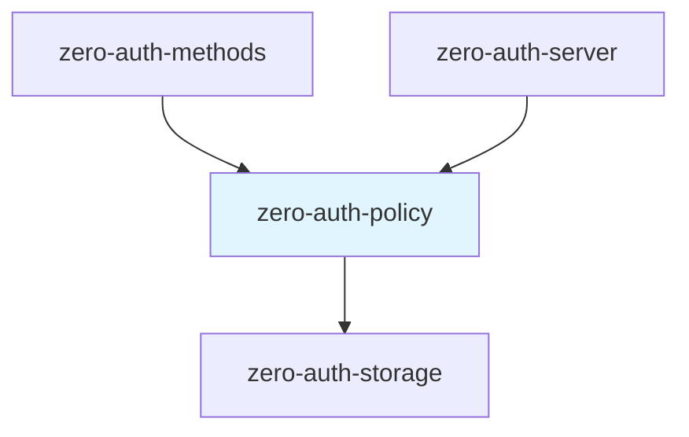
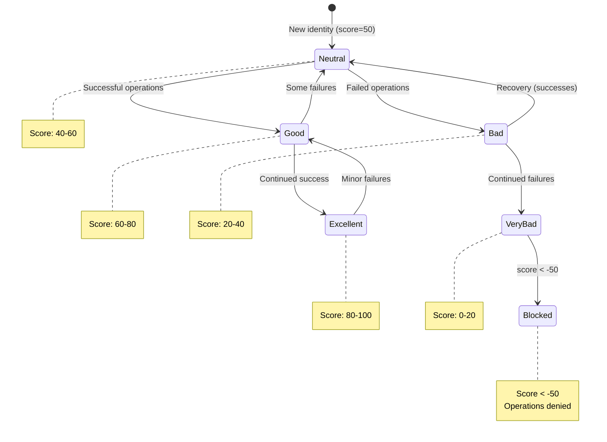
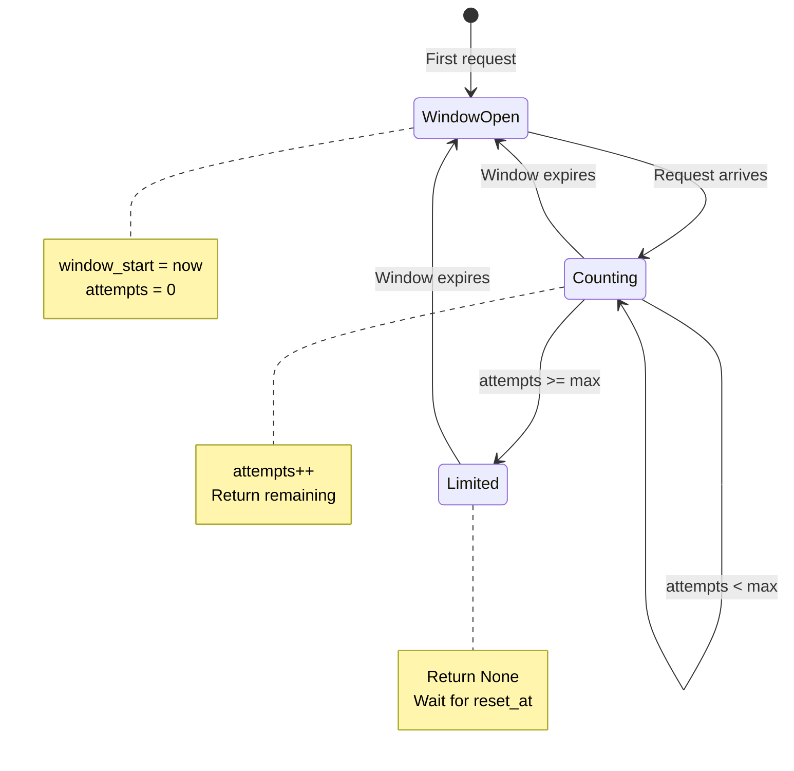
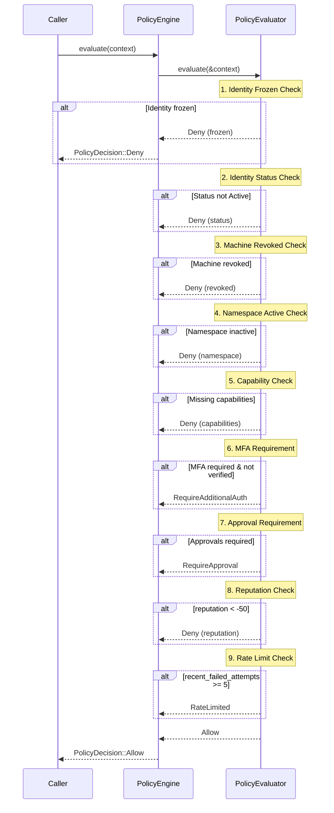
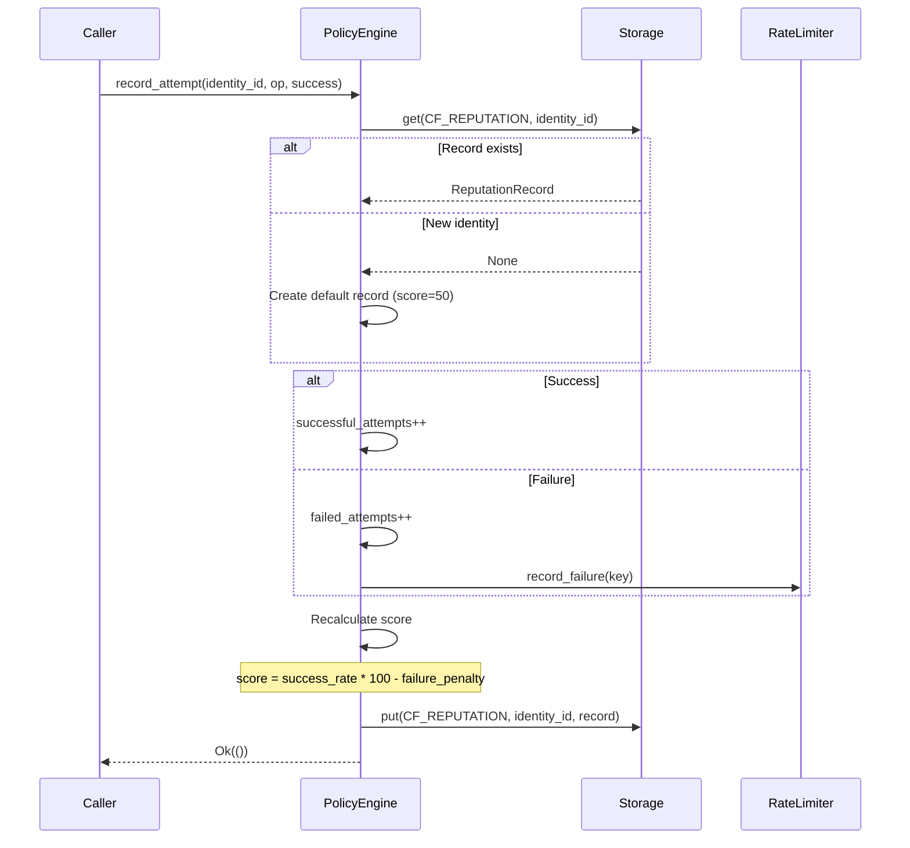
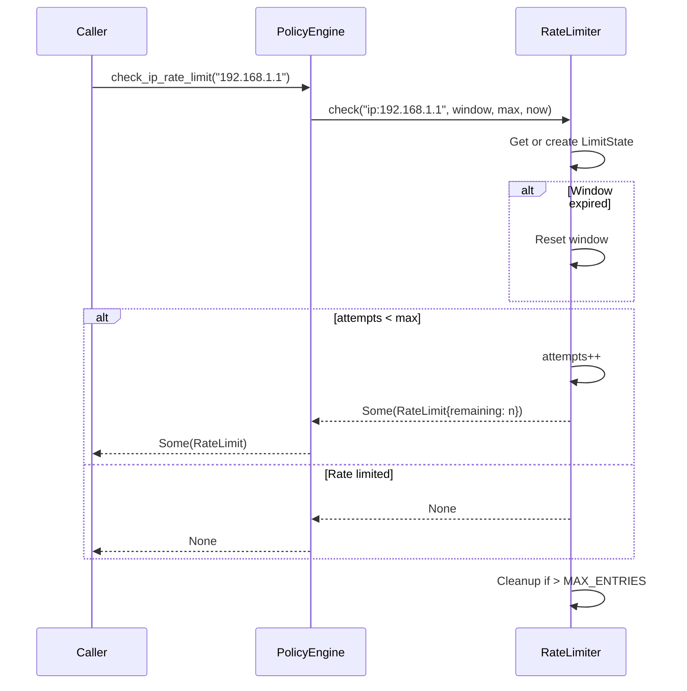

# zero-auth-policy Specification v0.1

## 1. Overview

The `zero-auth-policy` crate provides the Policy Engine for authorization decisions, rate limiting, and approval requirements. It evaluates operation contexts against a set of rules to produce allow/deny verdicts with optional requirements for MFA or approvals.

### 1.1 Purpose and Responsibilities

- **Authorization Evaluation**: Determine if an operation should be allowed based on context
- **Rate Limiting**: Track and enforce per-IP and per-identity request limits
- **Reputation Tracking**: Maintain identity reputation scores based on success/failure history
- **Capability Checking**: Verify machine keys have required capabilities for operations
- **MFA Requirements**: Determine when multi-factor authentication is required
- **Approval Requirements**: Determine when multi-party approval is required

### 1.2 Key Design Decisions

- **Stateless Evaluation**: `PolicyEvaluator` performs pure evaluation; state is injected via context
- **Persistent Reputation**: Reputation scores are persisted to storage for durability
- **In-Memory Rate Limiting**: Rate limits tracked in memory with cleanup for scalability
- **Context Enrichment**: Caller is responsible for populating entity states in `PolicyContext`

### 1.3 Position in Dependency Graph



---

## 2. Public Interface

### 2.1 PolicyEngine Trait

The primary interface for policy evaluation and rate limiting.

```rust
#[async_trait]
pub trait PolicyEngine: Send + Sync {
    /// Evaluate policy for an operation
    async fn evaluate(&self, context: PolicyContext) -> Result<PolicyDecision>;

    /// Record operation attempt (for rate limiting and reputation)
    async fn record_attempt(
        &self,
        identity_id: Uuid,
        operation: Operation,
        success: bool,
    ) -> Result<()>;

    /// Get reputation score for an identity (0-100, 50 = neutral)
    async fn get_reputation(&self, identity_id: Uuid) -> Result<i32>;

    /// Check rate limit for an IP address
    /// Returns Some(RateLimit) if allowed, None if rate limited
    fn check_ip_rate_limit(&self, ip_address: &str) -> Option<RateLimit>;

    /// Check rate limit for an identity
    /// Returns Some(RateLimit) if allowed, None if rate limited
    fn check_identity_rate_limit(&self, identity_id: Uuid) -> Option<RateLimit>;
}
```

### 2.2 PolicyEngineImpl

Concrete implementation with persistent reputation storage.

```rust
pub struct PolicyEngineImpl<S: Storage> {
    storage: Arc<S>,
    rate_limiter: Arc<RateLimiter>,
    config: RateLimitConfig,
}

impl<S: Storage> PolicyEngineImpl<S> {
    /// Create with default configuration
    pub fn new(storage: Arc<S>) -> Self;

    /// Create with custom rate limit configuration
    pub fn with_config(storage: Arc<S>, config: RateLimitConfig) -> Self;

    /// Get the current rate limit configuration
    pub fn config(&self) -> &RateLimitConfig;
}
```

### 2.3 PolicyEvaluator

Stateless policy evaluation logic.

```rust
pub struct PolicyEvaluator;

impl PolicyEvaluator {
    /// Evaluate a policy context and return a decision
    pub fn evaluate(context: &PolicyContext) -> PolicyDecision;
}
```

### 2.4 RateLimiter

In-memory rate limiting with sliding windows.

```rust
pub struct RateLimiter {
    limits: Arc<Mutex<HashMap<String, LimitState>>>,
}

impl RateLimiter {
    pub fn new() -> Self;

    /// Check if a key is rate limited
    /// Returns Some(RateLimit) with remaining attempts, or None if limited
    pub fn check(
        &self,
        key: &str,
        window_seconds: u64,
        max_attempts: u32,
        current_time: u64,
    ) -> Option<RateLimit>;

    /// Record a failed attempt
    pub fn record_failure(
        &self,
        key: &str,
        window_seconds: u64,
        max_attempts: u32,
        current_time: u64,
    );

    /// Reset rate limit for a key
    pub fn reset(&self, key: &str);
}
```

### 2.5 Types

#### PolicyContext

Complete context for policy evaluation. Caller must populate entity states.

```rust
pub struct PolicyContext {
    // Identity & Auth
    pub identity_id: Uuid,
    pub machine_id: Option<Uuid>,
    pub namespace_id: Uuid,
    pub auth_method: AuthMethod,
    pub mfa_verified: bool,

    // Operation
    pub operation: Operation,
    pub resource: Option<Resource>,

    // Request Context
    pub ip_address: String,
    pub user_agent: String,
    pub timestamp: u64,

    // Reputation
    pub reputation_score: i32,        // -100 to +100
    pub recent_failed_attempts: u32,

    // Entity States (populated by caller)
    pub identity_status: Option<IdentityStatus>,
    pub machine_revoked: Option<bool>,
    pub machine_capabilities: Option<u32>,
    pub namespace_active: Option<bool>,
}
```

#### PolicyDecision

Result of policy evaluation.

```rust
pub struct PolicyDecision {
    pub verdict: Verdict,
    pub required_factors: Vec<AuthFactor>,
    pub required_approvals: u8,
    pub rate_limit: Option<RateLimit>,
    pub audit_tags: Vec<String>,
    pub reason: String,
}
```

#### Verdict

```rust
#[repr(u8)]
pub enum Verdict {
    Allow = 0x01,
    Deny = 0x02,
    RequireAdditionalAuth = 0x03,
    RequireApproval = 0x04,
    RateLimited = 0x05,
}
```

#### Operation

24 operations organized by category.

```rust
#[repr(u16)]
pub enum Operation {
    // Authentication (0x01xx)
    Login = 0x0100,
    RefreshToken = 0x0101,

    // Identity Management (0x02xx)
    CreateIdentity = 0x0200,
    DisableIdentity = 0x0201,
    FreezeIdentity = 0x0202,
    UnfreezeIdentity = 0x0203,

    // Machine Keys (0x03xx)
    EnrollMachine = 0x0300,
    RevokeMachine = 0x0301,

    // Neural Key (0x04xx)
    RotateNeuralKey = 0x0400,
    RecoverNeuralKey = 0x0401,
    InitiateRecovery = 0x0402,

    // Credentials (0x05xx)
    ChangePassword = 0x0500,
    ResetPassword = 0x0501,
    AttachEmail = 0x0502,
    AttachWallet = 0x0503,

    // MFA (0x06xx)
    EnableMfa = 0x0600,
    DisableMfa = 0x0601,
    VerifyMfa = 0x0602,

    // Sessions (0x07xx)
    RevokeSession = 0x0700,
    RevokeAllSessions = 0x0701,
}
```

#### Other Types

```rust
#[repr(u8)]
pub enum IdentityStatus {
    Active = 0x01,
    Disabled = 0x02,
    Frozen = 0x03,
    Deleted = 0x04,
}

#[repr(u8)]
pub enum AuthMethod {
    MachineKey = 0x01,
    EmailPassword = 0x02,
    OAuth = 0x03,
    EvmWallet = 0x04,
}

#[repr(u8)]
pub enum AuthFactor {
    Password = 0x01,
    MfaTotp = 0x02,
    MfaBackupCode = 0x03,
    MachineKey = 0x04,
    WalletSignature = 0x05,
    EmailVerification = 0x06,
}

pub enum Resource {
    Identity(Uuid),
    Machine(Uuid),
    Session(Uuid),
    Namespace(Uuid),
}

pub struct RateLimit {
    pub window_seconds: u64,
    pub max_attempts: u32,
    pub remaining: u32,
    pub reset_at: u64,
}

pub struct RateLimitConfig {
    pub ip_window_seconds: u64,        // Default: 60
    pub ip_max_requests: u32,          // Default: 100
    pub identity_window_seconds: u64,  // Default: 3600
    pub identity_max_requests: u32,    // Default: 1000
    pub failure_window_seconds: u64,   // Default: 900
    pub failure_max_attempts: u32,     // Default: 5
}

pub struct ReputationRecord {
    pub identity_id: Uuid,
    pub score: i32,
    pub successful_attempts: u32,
    pub failed_attempts: u32,
    pub last_updated: u64,
}
```

#### Policy Operation Requirements

These capability flags define what permissions are required to perform specific operations. They are checked against the machine's granted capabilities during policy evaluation.

> **Note**: These are distinct from `MachineKeyCapabilities` in `zero-auth-crypto`, which define what cryptographic operations a key can perform. Policy capabilities define authorization requirements.

```rust
pub mod capabilities {
    pub const AUTHENTICATE: u32 = 0x01;  // Can sign challenges
    pub const SIGN: u32 = 0x02;          // Can sign messages
    pub const DECRYPT: u32 = 0x04;       // Can decrypt messages
    pub const ENROLL: u32 = 0x08;        // Can enroll new machines
    pub const REVOKE: u32 = 0x10;        // Can revoke machines
    pub const APPROVE: u32 = 0x20;       // Can approve sensitive ops
}
```

### 2.6 Error Types

```rust
pub enum PolicyError {
    PolicyDenied(String),
    IdentityFrozen(String),
    MachineRevoked,
    RateLimitExceeded(String),
    MfaRequired,
    InsufficientCapabilities(Vec<String>),
    ApprovalRequired { required: u8, provided: u8 },
    Internal(String),
}

pub type Result<T> = std::result::Result<T, PolicyError>;
```

---

## 3. State Machines

### 3.1 Reputation Score

Reputation ranges from -100 to +100, with 50 as the neutral starting point for new identities. Scores below 0 indicate poor reputation due to repeated failures.



### 3.2 Rate Limit Window



---

## 4. Control Flow

### 4.1 Policy Evaluation Order

Evaluation proceeds in strict priority order. The first failing check determines the verdict.



### 4.2 Reputation Update Flow



### 4.3 Rate Limit Check Flow



---

## 5. Data Structures

### 5.1 Storage Schema

| Column Family | Key | Value | Description |
|---------------|-----|-------|-------------|
| `reputation` | `identity_id: Uuid` | `ReputationRecord` | Persistent reputation |

### 5.2 ReputationRecord Format

```rust
struct ReputationRecord {
    identity_id: Uuid,           // 16 bytes
    score: i32,                  // 4 bytes (0-100)
    successful_attempts: u32,    // 4 bytes
    failed_attempts: u32,        // 4 bytes
    last_updated: u64,           // 8 bytes (Unix timestamp)
}
// Serialized with bincode
```

### 5.3 In-Memory Rate Limit State

```rust
struct LimitState {
    attempts: u32,        // Current attempt count
    window_start: u64,    // Window start timestamp
    window_seconds: u64,  // Window duration
    max_attempts: u32,    // Maximum allowed
    last_seen: u64,       // For LRU eviction
}
// MAX_ENTRIES = 10,000
```

---

## 6. Security Considerations

### 6.1 Operation Risk Levels

| Operation | High Risk | Requires MFA | Required Approvals |
|-----------|-----------|--------------|-------------------|
| `Login` | No | No | 0 |
| `DisableIdentity` | Yes | Yes | 0 |
| `FreezeIdentity` | Yes | No | 0 |
| `UnfreezeIdentity` | No | No | 2 |
| `RotateNeuralKey` | Yes | Yes | 2 |
| `DisableMfa` | Yes | Yes | 0 |
| `ChangePassword` | No | Yes | 0 |
| `RevokeAllSessions` | Yes | Yes | 0 |
| `EnrollMachine` | No | No | 0 |
| `RevokeMachine` | No | No | 0 |

### 6.2 Capability Requirements by Operation

| Operation | AUTHENTICATE | SIGN | ENROLL | REVOKE | APPROVE |
|-----------|--------------|------|--------|--------|---------|
| `Login` | ✓ | | | | |
| `CreateIdentity` | ✓ | ✓ | | | |
| `EnrollMachine` | ✓ | ✓ | ✓ | | |
| `RevokeMachine` | ✓ | ✓ | | ✓ | |
| `RotateNeuralKey` | ✓ | ✓ | | | ✓ |
| `UnfreezeIdentity` | ✓ | ✓ | | | ✓ |
| `RevokeAllSessions` | ✓ | ✓ | | ✓ | |

### 6.3 Rate Limit Defaults

| Limit Type | Window | Max Requests | Purpose |
|------------|--------|--------------|---------|
| IP | 60s | 100 | Prevent DDoS |
| Identity | 3600s | 1000 | Prevent abuse |
| Failure | 900s | 5 | Account lockout |

### 6.4 Reputation Scoring

```
score = (success_rate * 100) - min(failed_attempts, 50)

where:
  success_rate = successful_attempts / total_attempts
  failure_penalty = min(failed_attempts, 50)  // Cap penalty at 50

score is clamped to [0, 100]
New identities start at 50 (neutral)
```

### 6.5 Evaluation Priority

Checks are ordered by security criticality:

1. **Identity Frozen** — Highest priority, immediate deny
2. **Identity Status** — Disabled/Deleted cannot operate
3. **Machine Revoked** — Compromised keys blocked
4. **Namespace Active** — Organizational control
5. **Capabilities** — Permission enforcement
6. **MFA** — Step-up authentication
7. **Approvals** — Multi-party authorization
8. **Reputation** — Historical behavior
9. **Rate Limits** — Abuse prevention

---

## 7. Dependencies

### 7.1 Internal Crate Dependencies

| Crate | Purpose |
|-------|---------|
| `zero-auth-storage` | Persistent reputation storage |

### 7.2 External Dependencies

| Crate | Version | Purpose |
|-------|---------|---------|
| `tokio` | workspace | Async runtime |
| `async-trait` | workspace | Async trait support |
| `serde` | workspace | Serialization |
| `thiserror` | workspace | Error types |
| `uuid` | workspace | UUID handling |
| `tracing` | workspace | Logging |

---

## 8. Configuration Reference

### 8.1 RateLimitConfig Defaults

```rust
impl Default for RateLimitConfig {
    fn default() -> Self {
        Self {
            ip_window_seconds: 60,          // 1 minute
            ip_max_requests: 100,           // 100 requests per minute per IP
            identity_window_seconds: 3600,  // 1 hour
            identity_max_requests: 1000,    // 1000 requests per hour per identity
            failure_window_seconds: 900,    // 15 minutes
            failure_max_attempts: 5,        // 5 failures before lockout
        }
    }
}
```

### 8.2 Constants

```rust
// Rate limiter memory limit
const MAX_ENTRIES: usize = 10_000;

// Reputation score range
const MIN_REPUTATION: i32 = 0;
const MAX_REPUTATION: i32 = 100;
const NEUTRAL_REPUTATION: i32 = 50;
const REPUTATION_BLOCK_THRESHOLD: i32 = -50;

// Failure threshold for rate limiting
const FAILURE_THRESHOLD: u32 = 5;
```
