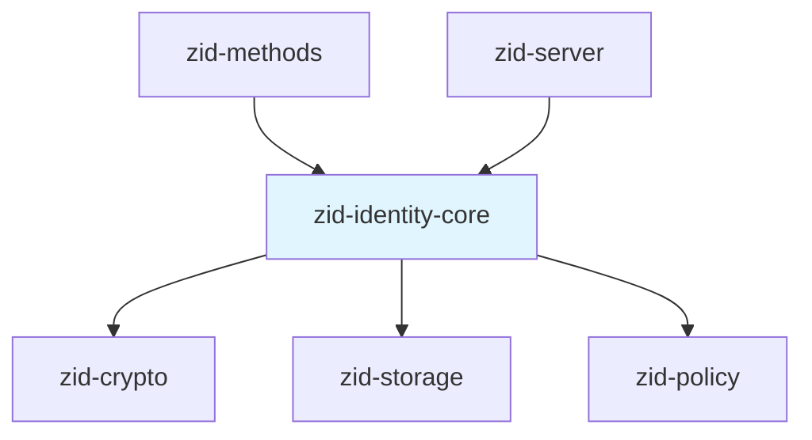
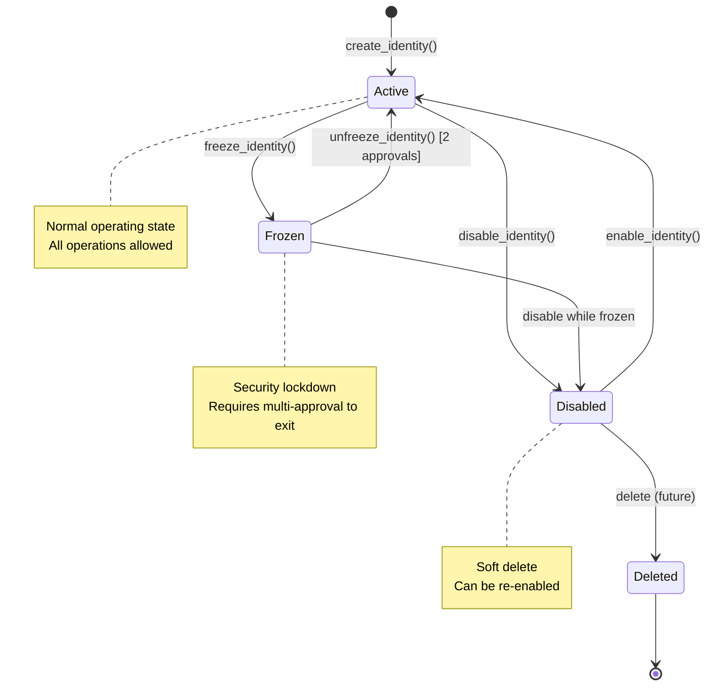
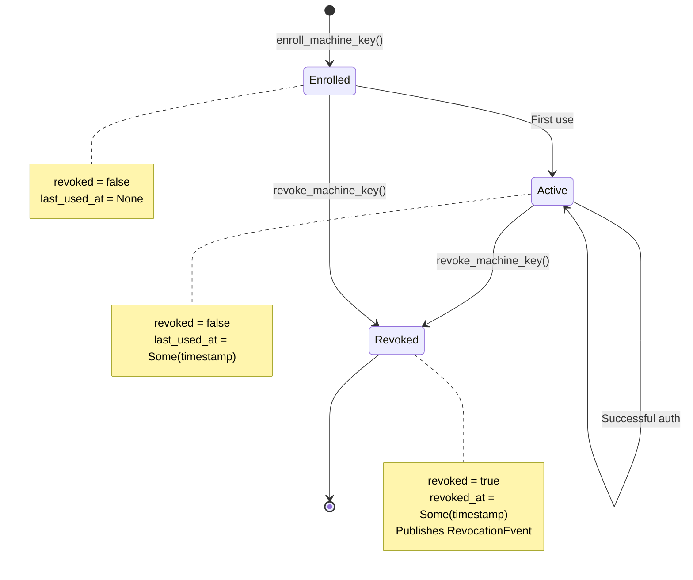
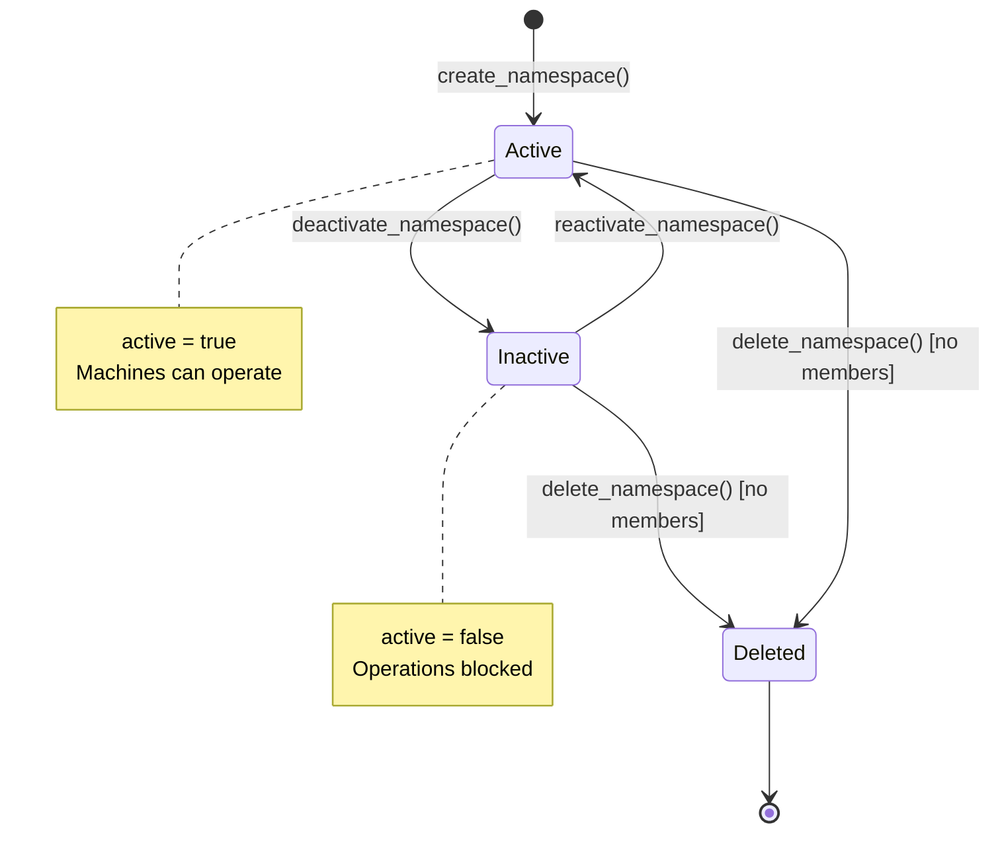
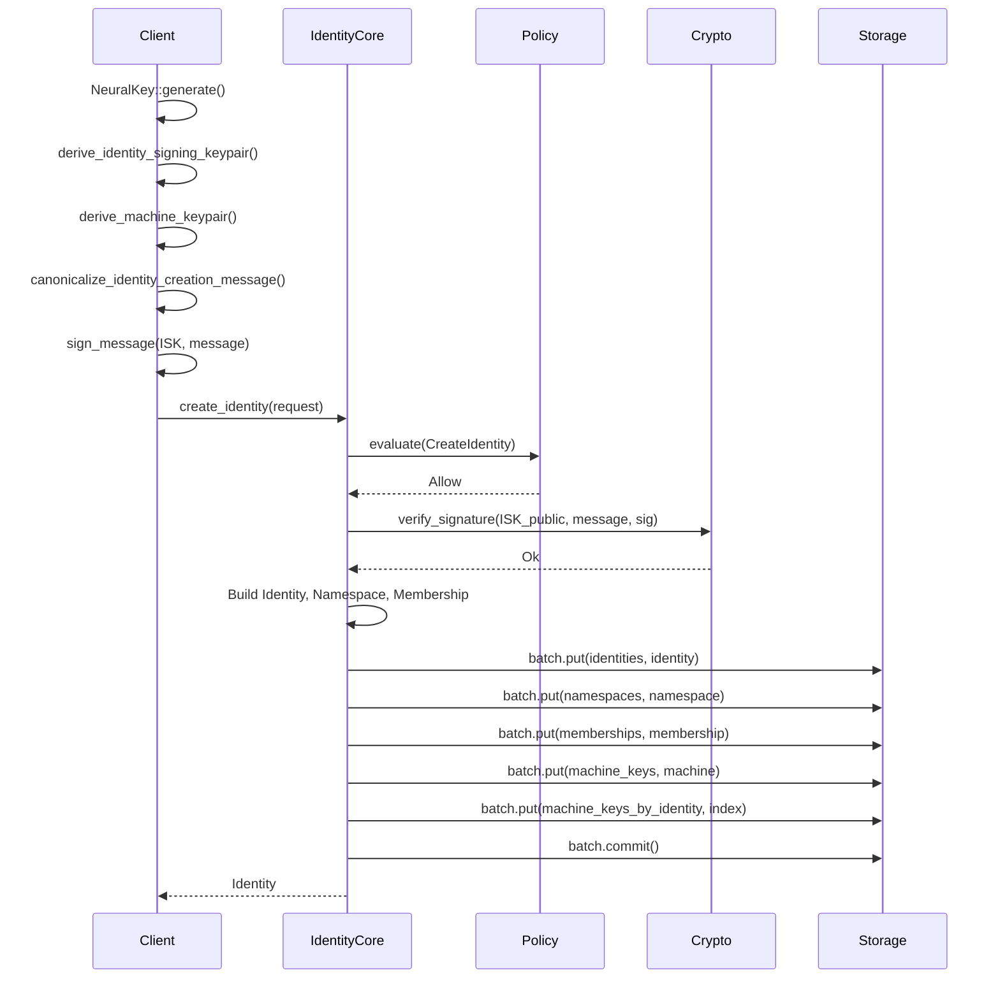
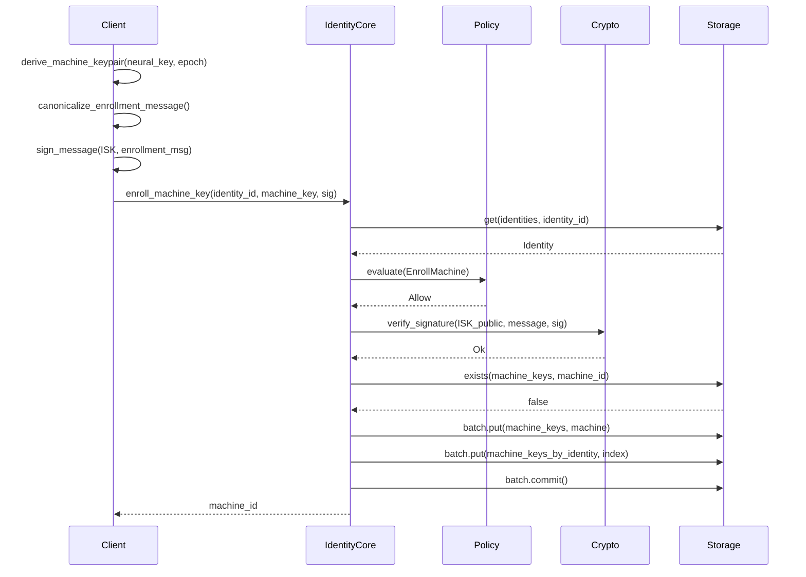
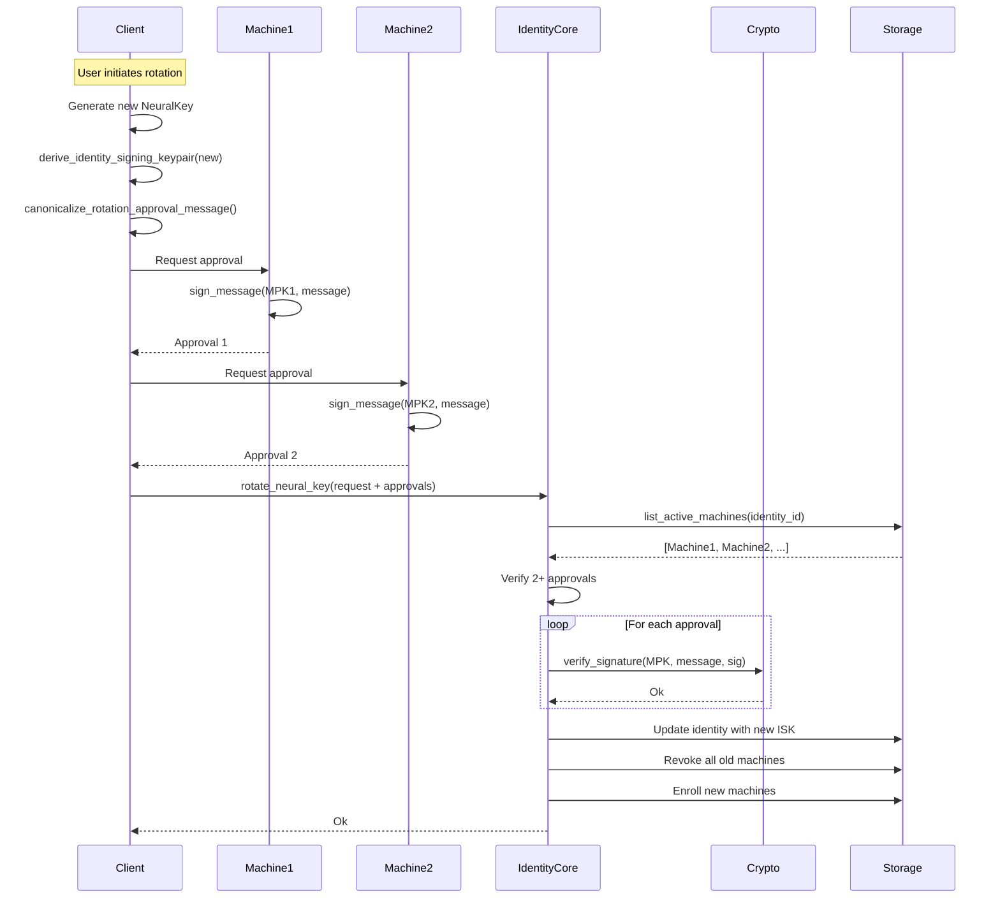
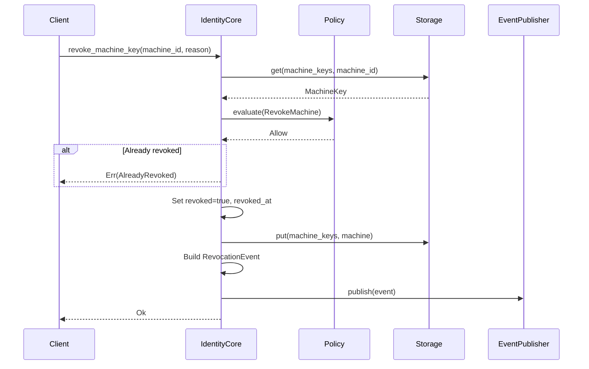

# zid-identity-core Specification v0.1

## 1. Overview

The `zid-identity-core` crate is the foundational subsystem for cryptographic identity management. It handles identity creation, machine key enrollment, namespace management, and sensitive ceremonies like Neural Key rotation and recovery.

### 1.1 Purpose and Responsibilities

- **Identity Lifecycle**: Create, disable, freeze, and manage identity records
- **Machine Key Registry**: Enroll, list, and revoke machine keys
- **Namespace Management**: Create and manage organizational namespaces
- **Membership Management**: Control who belongs to which namespaces
- **Ceremonies**: Multi-approval operations for sensitive actions
- **Event Publishing**: Publish revocation events for downstream consumers

### 1.2 Key Design Decisions

- **ISK Signature Verification**: All machine enrollments require Identity Signing Key signature
- **Multi-Approval Ceremonies**: Sensitive operations require signatures from multiple machines
- **Namespace-Scoped Machines**: Machine keys belong to exactly one namespace
- **Event-Driven Revocation**: Publishes events for SSE streaming and webhook delivery
- **Policy Integration**: All operations go through policy engine evaluation

### 1.3 Position in Dependency Graph



---

## 2. Public Interface

### 2.1 IdentityCore Trait

The primary trait for identity operations (20+ methods).

```rust
#[async_trait]
pub trait IdentityCore: Send + Sync {
    // Identity CRUD
    async fn create_identity(&self, request: CreateIdentityRequest) -> Result<Identity>;
    async fn get_identity(&self, identity_id: Uuid) -> Result<Identity>;
    async fn disable_identity(&self, identity_id: Uuid) -> Result<()>;
    async fn enable_identity(&self, identity_id: Uuid) -> Result<()>;
    
    // Freeze/Unfreeze (security lockdown)
    async fn freeze_identity(
        &self,
        identity_id: Uuid,
        reason: FreezeReason,
        approvals: Vec<Approval>,
    ) -> Result<()>;
    async fn unfreeze_identity(
        &self,
        identity_id: Uuid,
        approvals: Vec<Approval>,
    ) -> Result<()>;

    // Machine Key Management
    async fn enroll_machine_key(
        &self,
        identity_id: Uuid,
        machine_key: MachineKey,
        authorization_signature: Vec<u8>,
        mfa_verified: bool,
        ip_address: String,
        user_agent: String,
    ) -> Result<Uuid>;
    async fn get_machine_key(&self, machine_id: Uuid) -> Result<MachineKey>;
    async fn list_machines(
        &self,
        identity_id: Uuid,
        namespace_id: Uuid,
    ) -> Result<Vec<MachineKey>>;
    async fn revoke_machine_key(
        &self,
        machine_id: Uuid,
        revoked_by: Uuid,
        reason: String,
        mfa_verified: bool,
        ip_address: String,
        user_agent: String,
    ) -> Result<()>;

    // Neural Key Ceremonies
    async fn rotate_neural_key(&self, request: RotationRequest) -> Result<()>;
    async fn initiate_recovery(
        &self,
        identity_id: Uuid,
        recovery_machine_key: MachineKey,
        approvals: Vec<Approval>,
    ) -> Result<Uuid>;

    // Namespace CRUD
    async fn create_namespace(
        &self,
        namespace_id: Uuid,
        name: String,
        owner_identity_id: Uuid,
    ) -> Result<Namespace>;
    async fn get_namespace(&self, namespace_id: Uuid) -> Result<Namespace>;
    async fn list_namespaces(&self, identity_id: Uuid) -> Result<Vec<Namespace>>;
    async fn update_namespace(
        &self,
        namespace_id: Uuid,
        name: String,
        requester_id: Uuid,
    ) -> Result<Namespace>;
    async fn deactivate_namespace(
        &self,
        namespace_id: Uuid,
        requester_id: Uuid,
    ) -> Result<()>;
    async fn reactivate_namespace(
        &self,
        namespace_id: Uuid,
        requester_id: Uuid,
    ) -> Result<()>;
    async fn delete_namespace(
        &self,
        namespace_id: Uuid,
        requester_id: Uuid,
    ) -> Result<()>;

    // Namespace Membership
    async fn get_namespace_membership(
        &self,
        identity_id: Uuid,
        namespace_id: Uuid,
    ) -> Result<Option<IdentityNamespaceMembership>>;
    async fn list_namespace_members(
        &self,
        namespace_id: Uuid,
        requester_id: Uuid,
    ) -> Result<Vec<IdentityNamespaceMembership>>;
    async fn add_namespace_member(
        &self,
        namespace_id: Uuid,
        identity_id: Uuid,
        role: NamespaceRole,
        requester_id: Uuid,
    ) -> Result<IdentityNamespaceMembership>;
    async fn update_namespace_member(
        &self,
        namespace_id: Uuid,
        identity_id: Uuid,
        role: NamespaceRole,
        requester_id: Uuid,
    ) -> Result<IdentityNamespaceMembership>;
    async fn remove_namespace_member(
        &self,
        namespace_id: Uuid,
        identity_id: Uuid,
        requester_id: Uuid,
    ) -> Result<()>;
}
```

### 2.2 EventPublisher Trait

Injected interface for publishing revocation events.

```rust
#[async_trait]
pub trait EventPublisher: Send + Sync {
    async fn publish(&self, event: RevocationEvent) -> Result<()>;
}
```

### 2.3 IdentityCoreService

Concrete implementation with storage, policy, and event publisher.

```rust
pub struct IdentityCoreService<P, E, S>
where
    P: PolicyEngine,
    E: EventPublisher,
    S: Storage,
{
    policy: Arc<P>,
    event_publisher: Arc<E>,
    storage: Arc<S>,
}

impl<P, E, S> IdentityCoreService<P, E, S> {
    pub fn new(
        policy: Arc<P>,
        event_publisher: Arc<E>,
        storage: Arc<S>,
    ) -> Self;
}
```

### 2.4 Types

#### Identity

```rust
pub struct Identity {
    pub identity_id: Uuid,
    pub identity_signing_public_key: [u8; 32],
    pub status: IdentityStatus,
    pub created_at: u64,
    pub updated_at: u64,
    pub frozen_at: Option<u64>,
    pub frozen_reason: Option<String>,
}

#[repr(u8)]
pub enum IdentityStatus {
    Active = 0x01,
    Disabled = 0x02,
    Frozen = 0x03,
    Deleted = 0x04,
}
```

#### MachineKey

```rust
pub struct MachineKey {
    pub machine_id: Uuid,
    pub identity_id: Uuid,
    pub namespace_id: Uuid,
    pub signing_public_key: [u8; 32],
    pub encryption_public_key: [u8; 32],
    pub capabilities: MachineKeyCapabilities,
    pub epoch: u64,
    pub created_at: u64,
    pub expires_at: Option<u64>,
    pub last_used_at: Option<u64>,
    pub device_name: String,
    pub device_platform: String,
    pub revoked: bool,
    pub revoked_at: Option<u64>,
}
```

#### Namespace

```rust
pub struct Namespace {
    pub namespace_id: Uuid,
    pub name: String,
    pub created_at: u64,
    pub owner_identity_id: Uuid,
    pub active: bool,
}

#[repr(u8)]
pub enum NamespaceRole {
    Owner = 0x01,
    Admin = 0x02,
    Member = 0x03,
}

pub struct IdentityNamespaceMembership {
    pub identity_id: Uuid,
    pub namespace_id: Uuid,
    pub role: NamespaceRole,
    pub joined_at: u64,
}
```

#### Ceremonies

```rust
pub struct CreateIdentityRequest {
    pub identity_id: Uuid,
    pub identity_signing_public_key: [u8; 32],
    pub machine_key: MachineKey,
    pub authorization_signature: Vec<u8>,
    pub namespace_name: Option<String>,
    pub created_at: u64,
}

pub struct Approval {
    pub machine_id: Uuid,
    pub signature: Vec<u8>,
    pub timestamp: u64,
}

pub struct RotationRequest {
    pub identity_id: Uuid,
    pub new_identity_signing_public_key: [u8; 32],
    pub approvals: Vec<Approval>,
    pub new_machines: Vec<MachineKey>,
}

pub enum FreezeReason {
    SecurityIncident,
    SuspiciousActivity,
    UserRequested,
    Administrative,
}
```

#### Events

Revocation events for the integrations subsystem (SSE streaming, webhooks). These events are published when security-relevant state changes occur and are delivered to external services.

> **Note**: The sessions crate has a separate internal `RevocationEvent` type for session-specific events. This is the canonical type for external event delivery via `zid-integrations`.

```rust
#[repr(u8)]
pub enum EventType {
    MachineRevoked = 0x01,
    SessionRevoked = 0x02,
    IdentityFrozen = 0x03,
    IdentityDisabled = 0x04,
}

pub struct RevocationEvent {
    pub event_id: Uuid,
    pub event_type: EventType,
    pub namespace_id: Uuid,
    pub identity_id: Uuid,
    pub machine_id: Option<Uuid>,
    pub session_id: Option<Uuid>,
    pub sequence: u64,
    pub timestamp: u64,
    pub reason: String,
}
```

### 2.5 Error Types

```rust
pub enum IdentityCoreError {
    NotFound(Uuid),
    IdentityNotActive { status: IdentityStatus, reason: String },
    InvalidAuthorizationSignature,
    MachineAlreadyExists(Uuid),
    MachineNotFound(Uuid),
    InsufficientApprovals { required: usize, provided: usize },
    ApprovalExpired,
    InvalidApprovalSignature,
    InvalidApprovingMachine,
    DuplicateApproval(Uuid),
    PolicyDenied(String),
    MfaRequired(Vec<AuthFactor>),
    
    // Namespace errors
    NamespaceNotFound(Uuid),
    NamespaceAlreadyExists(Uuid),
    NamespaceNotActive(Uuid),
    NamespaceHasMembers(Uuid),
    NotNamespaceMember { identity_id: Uuid, namespace_id: Uuid },
    InsufficientPermissions { role: NamespaceRole, action: String },
    CannotRemoveOwner,
    MemberAlreadyExists { identity_id: Uuid, namespace_id: Uuid },
    MemberNotFound { identity_id: Uuid, namespace_id: Uuid },
    
    // Freeze errors
    IdentityFrozen(Uuid),
    AlreadyFrozen(Uuid),
    NotFrozen(Uuid),
    AlreadyRevoked(Uuid),
    InsufficientMachinesForUnfreeze { available: usize, message: String },
    NoMachinesForUnfreeze { message: String },
    
    // Wrapped errors
    Storage(StorageError),
    Crypto(CryptoError),
    Policy(PolicyError),
    Other(String),
}

pub type Result<T> = std::result::Result<T, IdentityCoreError>;
```

---

## 3. State Machines

### 3.1 Identity Lifecycle



### 3.2 Machine Key Lifecycle



### 3.3 Namespace Lifecycle



---

## 4. Control Flow

### 4.1 Identity Creation Ceremony



### 4.2 Machine Enrollment



### 4.3 Neural Key Rotation (Multi-Approval)



### 4.4 Machine Revocation



---

## 5. Data Structures

### 5.1 Storage Schema

| Column Family | Key | Value | Description |
|---------------|-----|-------|-------------|
| `identities` | `identity_id: Uuid` | `Identity` | Identity records |
| `machine_keys` | `machine_id: Uuid` | `MachineKey` | Machine key records |
| `machine_keys_by_identity` | `(identity_id, machine_id)` | `()` | Index |
| `machine_keys_by_namespace` | `(namespace_id, machine_id)` | `()` | Index |
| `namespaces` | `namespace_id: Uuid` | `Namespace` | Namespace records |
| `namespaces_by_identity` | `(identity_id, namespace_id)` | `()` | Index |
| `identity_namespace_memberships` | `(identity_id, namespace_id)` | `Membership` | Membership records |

### 5.2 Authorization Message Formats

See `01-crypto.md` Section 5.1 for binary layouts:

- **Identity Creation**: 137 bytes
- **Machine Enrollment**: 109 bytes
- **Recovery Approval**: 73 bytes
- **Rotation Approval**: 57 bytes

### 5.3 Approval Requirements

| Operation | Required Approvals | Notes |
|-----------|-------------------|-------|
| `rotate_neural_key` | 2 | From different active machines |
| `unfreeze_identity` | 2 | From different active machines |
| `freeze_identity` | 0 | Can be done by any authorized machine |
| Other operations | 0 | Policy-based authorization |

---

## 6. Security Considerations

### 6.1 Authorization Verification

All sensitive operations verify cryptographic signatures:

| Operation | Signature Required | Signer |
|-----------|-------------------|--------|
| Create Identity | ISK signature on creation message | New ISK |
| Enroll Machine | ISK signature on enrollment message | Identity's ISK |
| Rotate Neural Key | Multiple MPK signatures on approval | Active machines |
| Initiate Recovery | Multiple MPK signatures on approval | Active machines |

### 6.2 Approval Validation

```rust
// Approval validation rules:
// 1. Signature must verify against approving machine's MPK
// 2. Approving machine must be active (not revoked)
// 3. Approval timestamp must be within APPROVAL_EXPIRY_SECONDS (900s)
// 4. No duplicate approvals from same machine
// 5. Minimum required approvals must be met
```

### 6.3 Freeze Semantics

When an identity is frozen:
- All machine authentications fail
- No new machines can be enrolled
- Existing sessions continue until refresh
- Requires 2+ approvals to unfreeze

### 6.4 Namespace Permissions

| Role | Create | Read | Update | Delete | Add Members | Remove Members |
|------|--------|------|--------|--------|-------------|----------------|
| Owner | — | ✓ | ✓ | ✓ | ✓ | ✓ |
| Admin | — | ✓ | ✓ | ✗ | ✓ | ✓ (not Owner) |
| Member | — | ✓ | ✗ | ✗ | ✗ | Self only |

### 6.5 Event Publication

Revocation events are published for:
- Machine revocation (`MachineRevoked`)
- Session revocation (`SessionRevoked`)
- Identity freeze (`IdentityFrozen`)
- Identity disable (`IdentityDisabled`)

---

## 7. Dependencies

### 7.1 Internal Crate Dependencies

| Crate | Purpose |
|-------|---------|
| `zid-crypto` | Signature verification, key types |
| `zid-storage` | Persistent storage |
| `zid-policy` | Policy evaluation |

### 7.2 External Dependencies

| Crate | Version | Purpose |
|-------|---------|---------|
| `tokio` | workspace | Async runtime |
| `async-trait` | workspace | Async trait support |
| `serde` | workspace | Serialization |
| `thiserror` | workspace | Error types |
| `uuid` | workspace | UUID handling |
| `tracing` | workspace | Logging |

---

## 8. Constants Reference

```rust
// Approval expiry time (15 minutes)
const APPROVAL_EXPIRY_SECONDS: u64 = 900;

// Required approvals for ceremonies
const ROTATION_REQUIRED_APPROVALS: usize = 2;
const UNFREEZE_REQUIRED_APPROVALS: usize = 2;

// Identity status values
const STATUS_ACTIVE: u8 = 0x01;
const STATUS_DISABLED: u8 = 0x02;
const STATUS_FROZEN: u8 = 0x03;
const STATUS_DELETED: u8 = 0x04;

// Namespace role values
const ROLE_OWNER: u8 = 0x01;
const ROLE_ADMIN: u8 = 0x02;
const ROLE_MEMBER: u8 = 0x03;

// Event type values
const EVENT_MACHINE_REVOKED: u8 = 0x01;
const EVENT_SESSION_REVOKED: u8 = 0x02;
const EVENT_IDENTITY_FROZEN: u8 = 0x03;
const EVENT_IDENTITY_DISABLED: u8 = 0x04;
```
