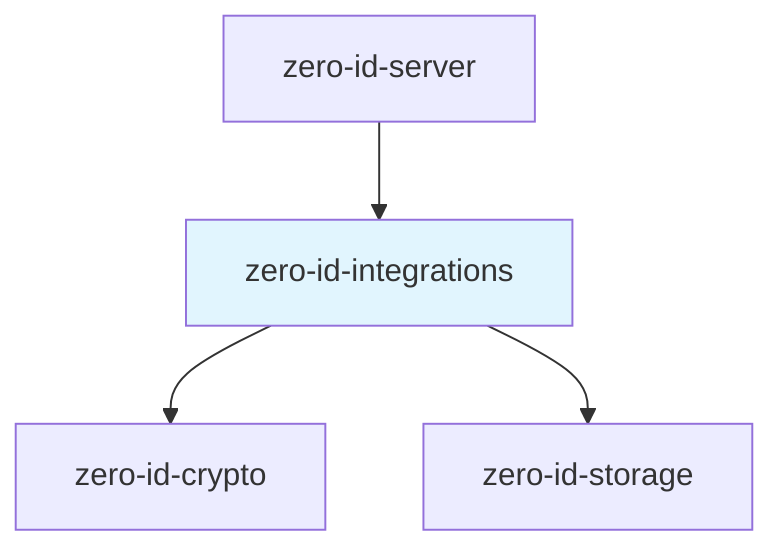
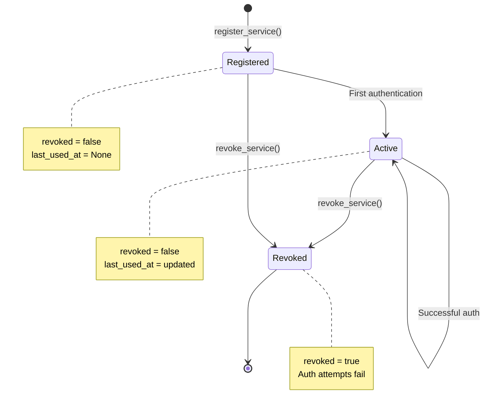
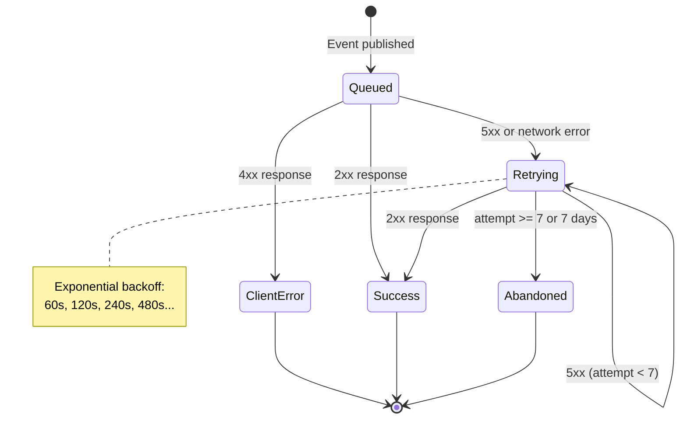
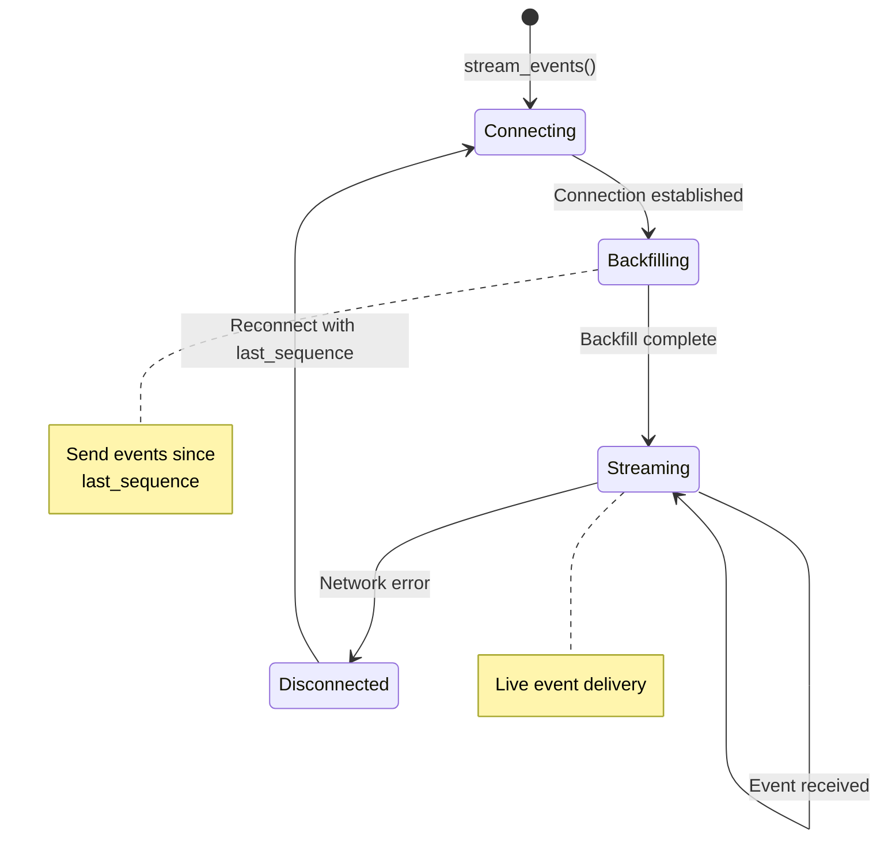
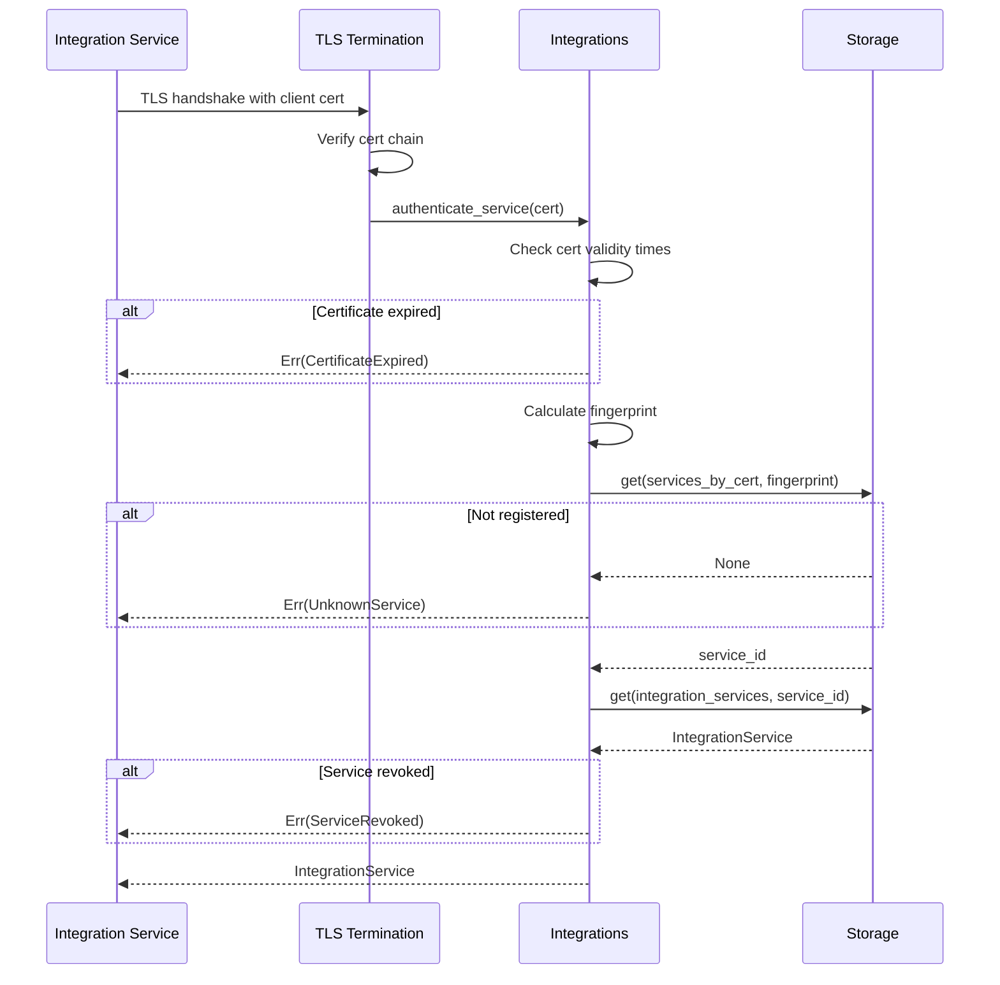
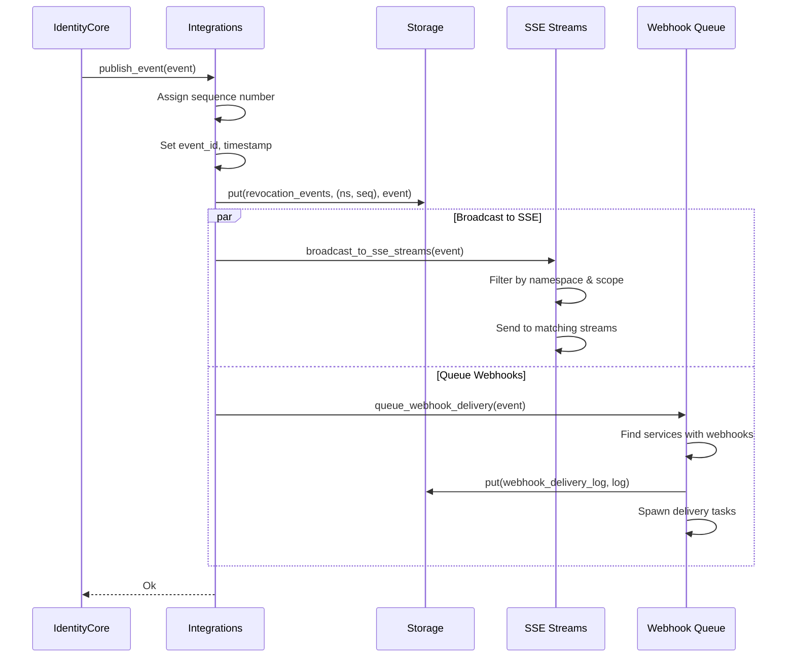
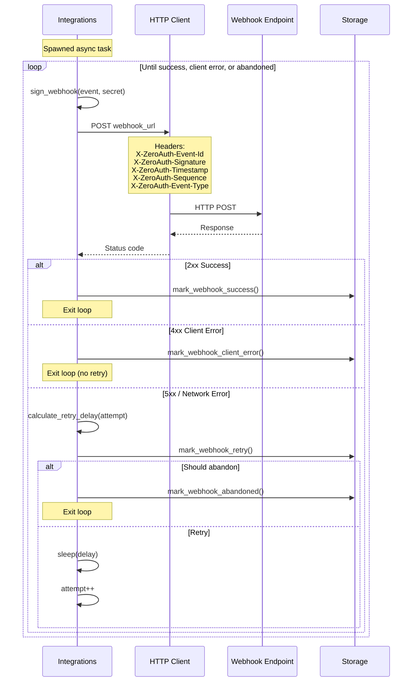

# zero-id-integrations Specification v0.1

## 1. Overview

The `zero-id-integrations` crate provides the Integrations & Events subsystem for Zero-Auth. It enables external services to receive real-time revocation events via SSE streaming or webhooks, authenticated with mTLS certificates.

### 1.1 Purpose and Responsibilities

- **Service Registration**: Register external services with mTLS certificates
- **mTLS Authentication**: Validate client certificates for service authentication
- **SSE Streaming**: Server-Sent Events for real-time event delivery
- **Webhook Delivery**: HTTP POST with HMAC-SHA256 signing and exponential retry
- **Namespace Filtering**: Deliver events only for subscribed namespaces
- **Scope-Based Access**: Control which event types a service can receive

### 1.2 Key Design Decisions

- **mTLS for Service Auth**: Services authenticate via client certificates, not API keys
- **Certificate Fingerprint Mapping**: SHA-256 fingerprint → service ID lookup
- **Push-Based Delivery**: Events pushed to services (SSE/webhooks), not polled
- **At-Least-Once Delivery**: Webhooks retry with exponential backoff
- **Namespace Scoping**: Events filtered by namespace for multi-tenant isolation

### 1.3 Position in Dependency Graph



---

## 2. Public Interface

### 2.1 Integrations Trait

```rust
pub trait Integrations: Send + Sync {
    /// Authenticate service with mTLS certificate
    async fn authenticate_service(
        &self,
        client_cert: Certificate,
    ) -> Result<IntegrationService>;

    /// Register new integration service
    async fn register_service(
        &self,
        request: RegisterServiceRequest,
    ) -> Result<Uuid>;

    /// Revoke integration service
    async fn revoke_service(&self, service_id: Uuid) -> Result<()>;

    /// Publish revocation event
    async fn publish_event(&self, event: RevocationEvent) -> Result<()>;

    /// Stream events via SSE (backfill + live)
    async fn stream_events(
        &self,
        service_id: Uuid,
        last_sequence: u64,
    ) -> Result<impl Stream<Item = RevocationEvent> + Send>;

    /// Update webhook configuration
    async fn update_webhook_config(
        &self,
        service_id: Uuid,
        webhook_config: Option<WebhookConfig>,
    ) -> Result<()>;

    /// Get integration service by ID
    async fn get_service(&self, service_id: Uuid) -> Result<IntegrationService>;
}
```

### 2.2 IntegrationsService

```rust
pub struct IntegrationsService<S: Storage> {
    storage: Arc<S>,
    sequences: Arc<RwLock<HashMap<Uuid, u64>>>,
    sse_streams: Arc<RwLock<HashMap<Uuid, Vec<SseStream>>>>,
}

impl<S: Storage + 'static> IntegrationsService<S> {
    pub fn new(storage: Arc<S>) -> Self;
    
    /// Check if event was already processed (deduplication)
    pub async fn is_event_processed(
        &self,
        service_id: Uuid,
        event_id: Uuid,
    ) -> Result<bool>;
    
    /// Mark event as processed
    pub async fn mark_event_processed(
        &self,
        service_id: Uuid,
        event_id: Uuid,
    ) -> Result<()>;
}
```

### 2.3 Types

#### IntegrationService

```rust
pub struct IntegrationService {
    pub service_id: Uuid,
    pub service_name: String,
    pub client_cert_fingerprint: [u8; 32],
    pub namespace_filter: Vec<Uuid>,   // Empty = all namespaces
    pub scopes: Vec<Scope>,
    pub webhook_config: Option<WebhookConfig>,
    pub created_at: u64,
    pub last_used_at: Option<u64>,
    pub revoked: bool,
    pub revoked_at: Option<u64>,
}
```

#### Scope

```rust
#[repr(u16)]
pub enum Scope {
    EventsMachineRevoked = 0x0001,
    EventsSessionRevoked = 0x0002,
    EventsIdentityFrozen = 0x0004,
    AuthIntrospect = 0x0008,
}
```

#### WebhookConfig

```rust
pub struct WebhookConfig {
    pub url: String,           // Must be HTTPS
    pub secret: [u8; 32],      // HMAC-SHA256 key
    pub enabled: bool,
}
```

#### RevocationEvent

```rust
pub struct RevocationEvent {
    pub event_id: Uuid,
    pub event_type: EventType,
    pub namespace_id: Uuid,
    pub identity_id: Uuid,
    pub machine_id: Option<Uuid>,
    pub session_id: Option<Uuid>,
    pub sequence: u64,          // Monotonic per namespace
    pub timestamp: u64,
    pub reason: String,
}

#[repr(u8)]
pub enum EventType {
    MachineRevoked = 0x01,
    SessionRevoked = 0x02,
    IdentityFrozen = 0x03,
    IdentityDisabled = 0x04,
}

impl EventType {
    pub fn event_name(&self) -> &'static str {
        match self {
            EventType::MachineRevoked => "machine.revoked",
            EventType::SessionRevoked => "session.revoked",
            EventType::IdentityFrozen => "identity.frozen",
            EventType::IdentityDisabled => "identity.disabled",
        }
    }
}
```

#### WebhookDeliveryLog

```rust
pub struct WebhookDeliveryLog {
    pub delivery_id: Uuid,
    pub service_id: Uuid,
    pub event_id: Uuid,
    pub attempt: u32,
    pub status: DeliveryStatus,
    pub attempted_at: u64,
    pub next_attempt_at: Option<u64>,
    pub abandoned_at: Option<u64>,
    pub http_status: Option<u16>,
    pub error_message: Option<String>,
}

#[repr(u8)]
pub enum DeliveryStatus {
    Queued = 0x01,
    Success = 0x02,
    ClientError = 0x03,
    ServerError = 0x04,
    Retrying = 0x05,
    Abandoned = 0x06,
}
```

#### Certificate

```rust
pub struct Certificate {
    pub der_bytes: Vec<u8>,
    pub not_after: u64,
    pub not_before: u64,
}

impl Certificate {
    /// Get SHA-256 fingerprint
    pub fn fingerprint(&self) -> [u8; 32];
}
```

#### RegisterServiceRequest

```rust
pub struct RegisterServiceRequest {
    pub service_name: String,              // Max 128 chars
    pub client_cert_fingerprint: [u8; 32],
    pub namespace_filter: Vec<Uuid>,       // Max 100 namespaces
    pub scopes: Vec<Scope>,
    pub webhook_config: Option<WebhookConfig>,
}
```

### 2.4 Webhook Functions

```rust
/// Sign webhook payload with HMAC-SHA256
/// Format: sha256=<hex>
/// Covers: {event_id}.{timestamp}.{json_payload}
pub fn sign_webhook(
    event: &RevocationEvent,
    webhook_secret: &[u8; 32],
) -> Result<String>;

/// Verify webhook signature (constant-time)
pub fn verify_webhook_signature(
    event: &RevocationEvent,
    signature: &str,
    webhook_secret: &[u8; 32],
) -> bool;

/// Deliver webhook with HTTP POST
pub async fn deliver_webhook(
    event: &RevocationEvent,
    webhook_config: &WebhookConfig,
) -> Result<DeliveryStatus>;

/// Calculate exponential backoff delay
/// delay = 60 * 2^(attempt - 1)
pub fn calculate_retry_delay(attempt: u32) -> u64;

/// Check abandonment criteria (7 attempts or 7 days)
pub fn should_abandon_webhook(
    attempt: u32,
    first_attempt_at: u64,
    current_time: u64,
) -> bool;
```

### 2.5 Helper Functions

```rust
/// Check if event should be delivered to service (namespace filter)
pub fn should_deliver_event(
    service: &IntegrationService,
    event: &RevocationEvent,
) -> bool;

/// Check if service has scope for event type
pub fn has_event_scope(
    service: &IntegrationService,
    event_type: EventType,
) -> bool;
```

### 2.6 Error Types

```rust
pub enum Error {
    Storage(StorageError),
    UnknownService,
    ServiceRevoked,
    CertificateExpired,
    InvalidCertificateFingerprint,
    CertificateValidationFailed(String),
    ServiceAlreadyRegistered,
    NoWebhookConfigured,
    WebhookDeliveryFailed(String),
    InvalidWebhookSignature,
    WebhookTooOld,
    EventAlreadyProcessed,
    InvalidNamespaceFilter,
    InvalidScope,
    HttpError(reqwest::Error),
    Serialization(String),
    Bincode(bincode::Error),
    InvalidEventSequence,
    SequenceGenerationFailed,
    ServiceNameTooLong,
    InvalidWebhookUrl(String),
    TooManyNamespaces,
    Other(String),
}

pub type Result<T> = std::result::Result<T, Error>;
```

---

## 3. State Machines

### 3.1 Integration Service Lifecycle



### 3.2 Webhook Delivery Lifecycle



### 3.3 SSE Connection Lifecycle



---

## 4. Control Flow

### 4.1 mTLS Authentication



### 4.2 Event Publishing



### 4.3 Webhook Delivery



---

## 5. Data Structures

### 5.1 Storage Schema

| Column Family | Key | Value | TTL | Description |
|---------------|-----|-------|-----|-------------|
| `integration_services` | `service_id` | `IntegrationService` | — | Service records |
| `integration_services_by_cert` | `fingerprint` | `service_id` | — | Cert → service lookup |
| `revocation_events` | `(namespace_id, sequence)` | `RevocationEvent` | — | Event log |
| `processed_event_ids` | `(service_id, event_id)` | `timestamp` | 1h | Deduplication |
| `webhook_delivery_log` | `(service_id, event_id)` | `WebhookDeliveryLog` | — | Delivery tracking |

### 5.2 Webhook HTTP Headers

| Header | Value | Description |
|--------|-------|-------------|
| `Content-Type` | `application/json` | Payload format |
| `X-ZeroAuth-Event-Id` | UUID string | Unique event identifier |
| `X-ZeroAuth-Signature` | `sha256=<hex>` | HMAC-SHA256 signature |
| `X-ZeroAuth-Timestamp` | Unix seconds | Event timestamp |
| `X-ZeroAuth-Sequence` | u64 | Namespace sequence number |
| `X-ZeroAuth-Event-Type` | Event name | e.g., `machine.revoked` |

### 5.3 Webhook Signature Format

```
Signature = HMAC-SHA256(secret, payload)
Payload = "{event_id}.{timestamp}.{json_body}"
Header = "sha256=" + hex(Signature)
```

### 5.4 SSE Event Format

```
event: machine.revoked
id: <sequence>
data: {"event_id":"...","event_type":"MachineRevoked",...}

```

---

## 6. Security Considerations

### 6.1 mTLS Requirements

- Client certificates must be valid (not expired, not before valid)
- Certificate fingerprint (SHA-256 of DER) used for lookup
- Certificates validated at TLS termination layer
- Service must not be revoked

### 6.2 Webhook Security

| Requirement | Implementation |
|-------------|----------------|
| Transport security | HTTPS required (no HTTP) |
| Payload integrity | HMAC-SHA256 signature |
| Replay protection | Timestamp + event_id |
| Constant-time verify | `subtle::ConstantTimeEq` |

### 6.3 Namespace Isolation

- Services can only receive events for filtered namespaces
- Empty filter = all namespaces (admin services)
- Filter checked before SSE broadcast and webhook queue

### 6.4 Scope Enforcement

| Scope | Events Received |
|-------|-----------------|
| `EventsMachineRevoked` | `machine.revoked` |
| `EventsSessionRevoked` | `session.revoked` |
| `EventsIdentityFrozen` | `identity.frozen`, `identity.disabled` |
| `AuthIntrospect` | Token introspection API access |

### 6.5 Rate Limiting & Abuse Prevention

| Limit | Value | Purpose |
|-------|-------|---------|
| Service name length | 128 chars | Prevent storage abuse |
| Namespace filter size | 100 namespaces | Prevent filter abuse |
| Webhook timeout | 30 seconds | Prevent hanging connections |
| Max retry attempts | 7 | Prevent infinite retries |
| Max retention | 7 days | Prevent queue buildup |

---

## 7. Dependencies

### 7.1 Internal Crate Dependencies

| Crate | Purpose |
|-------|---------|
| `zero-id-crypto` | Timestamps |
| `zero-id-storage` | Persistent storage |

### 7.2 External Dependencies

| Crate | Version | Purpose |
|-------|---------|---------|
| `tokio` | 1.40 | Async runtime |
| `tokio-stream` | 0.1 | Stream utilities |
| `serde` | 1.0 | Serialization |
| `serde_json` | 1.0 | JSON serialization |
| `bincode` | 1.3 | Binary serialization |
| `uuid` | 1.11 | UUID handling |
| `reqwest` | 0.12 | HTTP client |
| `hmac` | 0.12 | HMAC computation |
| `sha2` | 0.10 | SHA-256 hashing |
| `hex` | 0.4 | Hex encoding |
| `subtle` | 2.6 | Constant-time comparison |
| `thiserror` | 2.0 | Error types |

---

## 8. Constants Reference

```rust
// Webhook retry configuration
const BASE_DELAY_SECONDS: u64 = 60;
const MAX_ATTEMPTS: u32 = 7;
const MAX_RETENTION_SECONDS: u64 = 7 * 24 * 3600;  // 7 days

// Service registration limits
const MAX_SERVICE_NAME_LENGTH: usize = 128;
const MAX_NAMESPACE_FILTER_SIZE: usize = 100;

// HTTP configuration
const WEBHOOK_TIMEOUT_SECONDS: u64 = 30;

// Event type codes
const EVENT_MACHINE_REVOKED: u8 = 0x01;
const EVENT_SESSION_REVOKED: u8 = 0x02;
const EVENT_IDENTITY_FROZEN: u8 = 0x03;
const EVENT_IDENTITY_DISABLED: u8 = 0x04;

// Scope codes
const SCOPE_EVENTS_MACHINE_REVOKED: u16 = 0x0001;
const SCOPE_EVENTS_SESSION_REVOKED: u16 = 0x0002;
const SCOPE_EVENTS_IDENTITY_FROZEN: u16 = 0x0004;
const SCOPE_AUTH_INTROSPECT: u16 = 0x0008;

// Delivery status codes
const STATUS_QUEUED: u8 = 0x01;
const STATUS_SUCCESS: u8 = 0x02;
const STATUS_CLIENT_ERROR: u8 = 0x03;
const STATUS_SERVER_ERROR: u8 = 0x04;
const STATUS_RETRYING: u8 = 0x05;
const STATUS_ABANDONED: u8 = 0x06;
```

### 8.1 Retry Schedule

| Attempt | Delay | Cumulative |
|---------|-------|------------|
| 1 | 60s | 1 min |
| 2 | 120s | 3 min |
| 3 | 240s | 7 min |
| 4 | 480s | 15 min |
| 5 | 960s | 31 min |
| 6 | 1920s | ~63 min |
| 7 | — | Abandoned |
