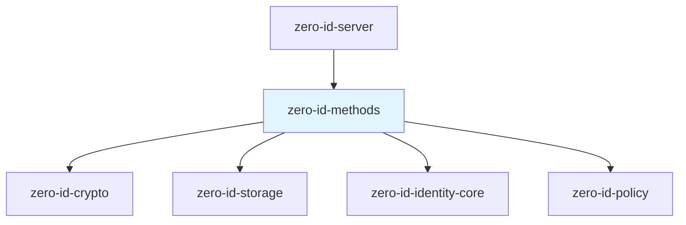
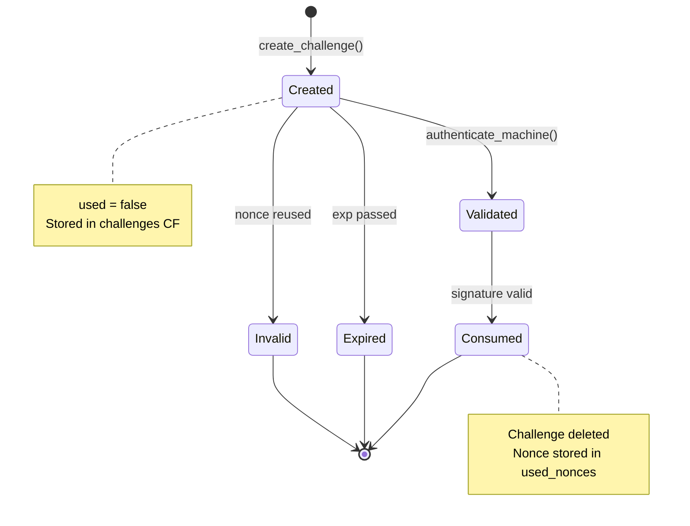
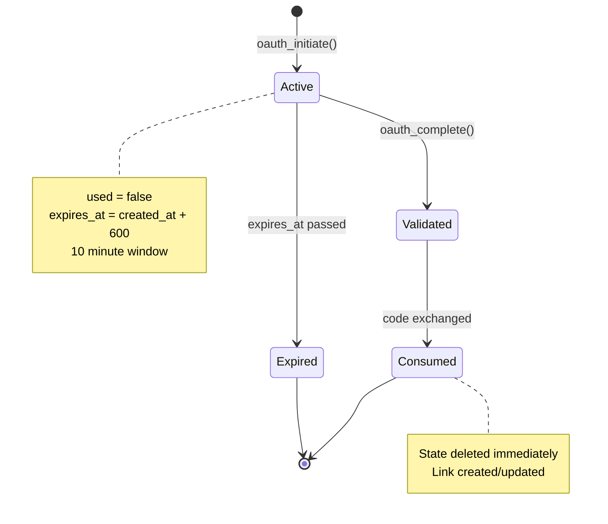
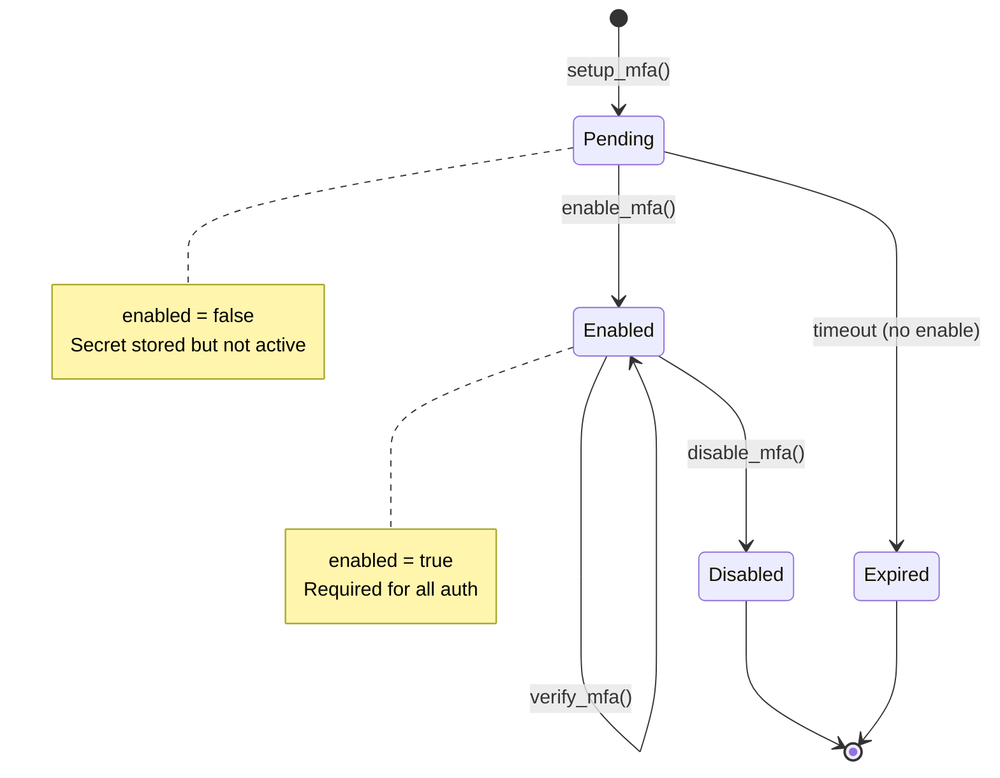
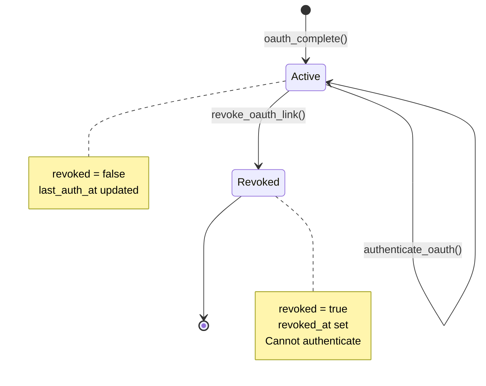
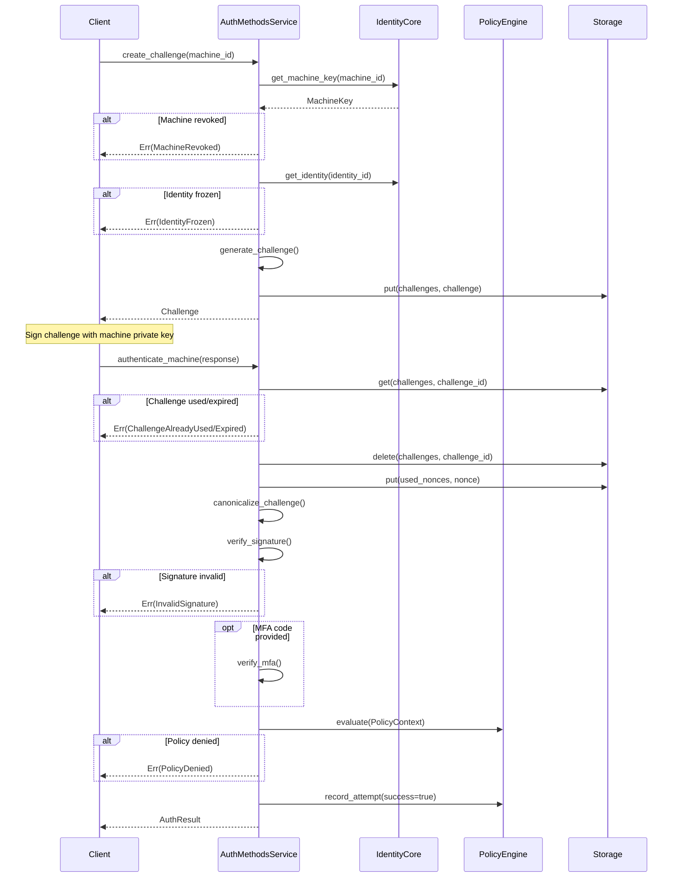
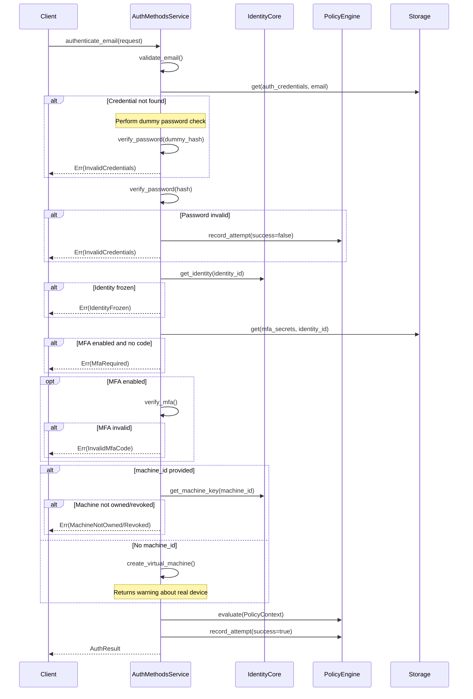
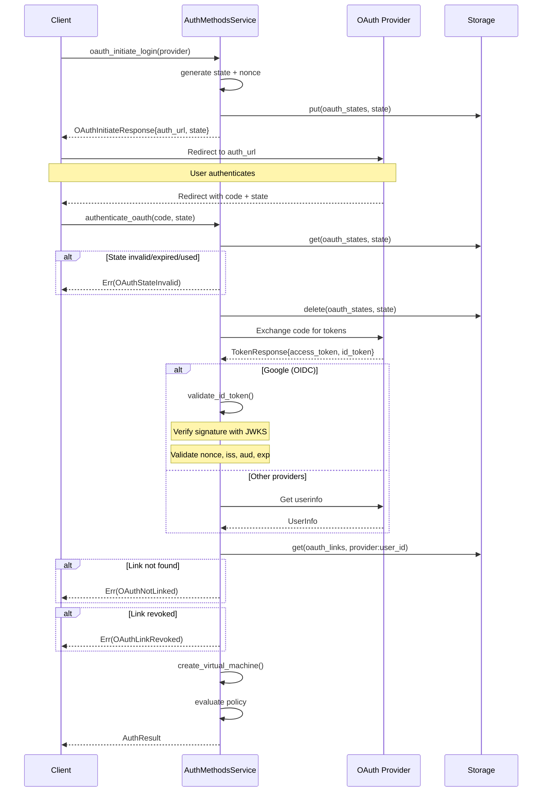
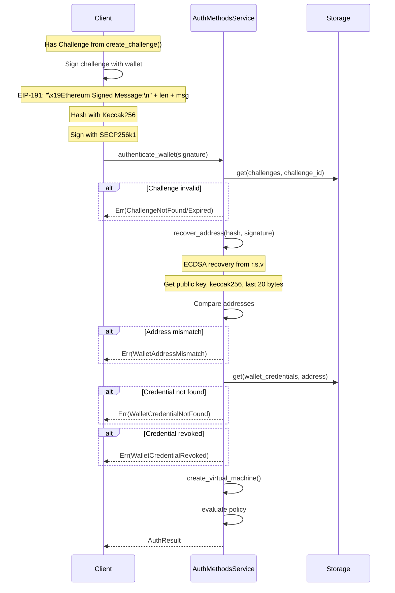
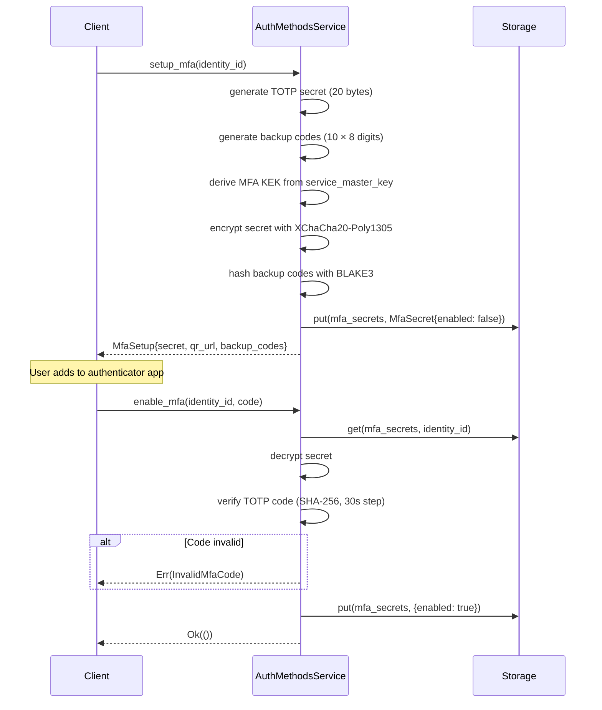

# zero-id-methods Specification v0.1

## 1. Overview

The `zero-id-methods` crate provides multiple authentication mechanisms for Zero-Auth. It supports five distinct authentication methods: machine key challenge-response, email+password, OAuth/OIDC providers, EVM wallet signatures, and multi-factor authentication (TOTP).

### 1.1 Purpose and Responsibilities

- **Machine Key Authentication**: Cryptographic challenge-response with Ed25519 signatures
- **Email+Password Authentication**: Traditional credentials with Argon2id hashing
- **OAuth/OIDC Authentication**: Third-party identity providers (Google, X, Epic Games)
- **Wallet Authentication**: EVM wallet signatures using SECP256k1 (EIP-191)
- **Multi-Factor Authentication**: TOTP-based second factor with backup codes
- **Virtual Machines**: Automatic machine creation for non-device-based auth
- **Credential Management**: Attach, list, and revoke authentication credentials

### 1.2 Key Design Decisions

- **Policy Integration**: All authentication methods enforce policy decisions before returning success
- **MFA Enforcement**: MFA verification integrated into all primary auth flows when enabled
- **Virtual Machines**: Email/OAuth/wallet auth creates short-lived virtual machines for session binding
- **Constant-Time Auth**: Email authentication uses constant-time comparison to prevent timing attacks
- **OIDC Validation**: Google OAuth uses full OIDC ID token validation with JWKS caching
- **Encrypted MFA Secrets**: TOTP secrets encrypted with per-user KEK derived from service master key

### 1.3 Position in Dependency Graph



---

## 2. Public Interface

### 2.1 AuthMethods Trait

```rust
#[async_trait]
pub trait AuthMethods: Send + Sync {
    // Challenge-Response Authentication
    async fn create_challenge(&self, request: ChallengeRequest) -> Result<Challenge>;
    async fn authenticate_machine(
        &self,
        response: ChallengeResponse,
        ip_address: String,
        user_agent: String,
    ) -> Result<AuthResult>;

    // Email+Password Authentication
    async fn authenticate_email(
        &self,
        request: EmailAuthRequest,
        ip_address: String,
        user_agent: String,
    ) -> Result<AuthResult>;
    async fn attach_email_credential(
        &self,
        identity_id: Uuid,
        email: String,
        password: String,
    ) -> Result<()>;

    // MFA (TOTP)
    async fn setup_mfa(&self, identity_id: Uuid) -> Result<MfaSetup>;
    async fn enable_mfa(&self, identity_id: Uuid, verification_code: String) -> Result<()>;
    async fn disable_mfa(&self, identity_id: Uuid, mfa_code: String) -> Result<()>;
    async fn verify_mfa(&self, identity_id: Uuid, code: String) -> Result<bool>;

    // OAuth/OIDC
    async fn oauth_initiate(
        &self,
        identity_id: Uuid,
        provider: OAuthProvider,
    ) -> Result<OAuthInitiateResponse>;
    async fn oauth_initiate_login(&self, provider: OAuthProvider) -> Result<OAuthInitiateResponse>;
    async fn oauth_complete(
        &self,
        identity_id: Uuid,
        request: OAuthCompleteRequest,
    ) -> Result<Uuid>;
    async fn authenticate_oauth(
        &self,
        request: OAuthCompleteRequest,
        ip_address: String,
        user_agent: String,
    ) -> Result<AuthResult>;
    async fn revoke_oauth_link(&self, identity_id: Uuid, provider: OAuthProvider) -> Result<()>;

    // EVM Wallet
    async fn authenticate_wallet(
        &self,
        signature: WalletSignature,
        ip_address: String,
        user_agent: String,
    ) -> Result<AuthResult>;
    async fn attach_wallet_credential(
        &self,
        identity_id: Uuid,
        wallet_address: String,
        chain: String,
    ) -> Result<()>;
    async fn revoke_wallet_credential(
        &self,
        identity_id: Uuid,
        wallet_address: String,
    ) -> Result<()>;

    // Credential Management
    async fn list_credentials(&self, identity_id: Uuid) -> Result<Vec<CredentialInfo>>;
}
```

### 2.2 AuthMethodsService

```rust
pub struct AuthMethodsService<I, P, S>
where
    I: IdentityCore,
    P: PolicyEngine,
    S: Storage,
{
    identity_core: Arc<I>,
    policy: Arc<P>,
    storage: Arc<S>,
    jwks_cache: Arc<RwLock<HashMap<OAuthProvider, JwksCacheEntry>>>,
    oauth_configs: OAuthConfigs,
    service_master_key: Zeroizing<[u8; 32]>,
}

impl<I, P, S> AuthMethodsService<I, P, S> {
    pub fn new(
        identity_core: Arc<I>,
        policy: Arc<P>,
        storage: Arc<S>,
        service_master_key: [u8; 32],
    ) -> Self;

    pub fn with_oauth_configs(
        identity_core: Arc<I>,
        policy: Arc<P>,
        storage: Arc<S>,
        service_master_key: [u8; 32],
        oauth_configs: OAuthConfigs,
    ) -> Self;
}
```

### 2.3 Types

#### Challenge Types

```rust
pub struct Challenge {
    pub challenge_id: Uuid,
    pub entity_id: Uuid,           // Machine ID or entity ID
    pub entity_type: EntityType,
    pub purpose: String,
    pub aud: String,               // Audience (service URL)
    pub iat: u64,                  // Issued at
    pub exp: u64,                  // Expiry
    pub nonce: [u8; 32],           // Random nonce
    pub used: bool,                // Replay protection
}

#[repr(u8)]
pub enum EntityType {
    Machine = 0x01,
    Wallet = 0x02,
    Email = 0x03,
}

pub struct ChallengeRequest {
    pub machine_id: Uuid,
    pub purpose: Option<String>,
}

pub struct ChallengeResponse {
    pub challenge_id: Uuid,
    pub machine_id: Uuid,
    pub signature: Vec<u8>,        // Ed25519 signature (64 bytes)
    pub mfa_code: Option<String>,
}
```

#### Authentication Result

```rust
pub struct AuthResult {
    pub identity_id: Uuid,
    pub machine_id: Uuid,          // Always present (real or virtual)
    pub namespace_id: Uuid,
    pub mfa_verified: bool,
    pub auth_method: AuthMethod,
    pub warning: Option<String>,   // e.g., "Enroll real device"
}

// Re-exported from policy crate
pub enum AuthMethod {
    MachineKey,
    EmailPassword,
    OAuth,
    Wallet,
}
```

#### Email Credential

```rust
pub struct EmailCredential {
    pub identity_id: Uuid,
    pub email: String,             // Lowercased
    pub password_hash: String,     // Argon2id hash
    pub created_at: u64,
    pub updated_at: u64,
    pub email_verified: bool,
    pub verification_token: Option<String>,
}

pub struct EmailAuthRequest {
    pub email: String,
    pub password: String,
    pub machine_id: Option<Uuid>,  // Optional for existing devices
    pub mfa_code: Option<String>,
}
```

#### MFA Types

```rust
pub struct MfaSecret {
    pub identity_id: Uuid,
    pub encrypted_secret: Vec<u8>, // XChaCha20-Poly1305
    pub nonce: [u8; 24],
    pub backup_codes: Vec<String>, // BLAKE3 hashed
    pub created_at: u64,
    pub enabled: bool,
}

pub struct MfaSetup {
    pub secret: String,            // Base32 encoded TOTP secret
    pub qr_code_url: String,       // OTPAuth URL
    pub backup_codes: Vec<String>, // Plaintext (shown once)
}
```

#### OAuth Types

```rust
#[derive(Hash, Eq, PartialEq)]
pub enum OAuthProvider {
    Google,
    X,
    EpicGames,
}

pub struct OAuthState {
    pub state: String,             // Random CSRF token
    pub nonce: String,             // OIDC replay protection
    pub identity_id: Option<Uuid>, // For linking flows
    pub provider: OAuthProvider,
    pub created_at: u64,
    pub expires_at: u64,           // 10 minutes
    pub used: bool,
}

pub struct OAuthLink {
    pub link_id: Uuid,
    pub identity_id: Uuid,
    pub provider: OAuthProvider,
    pub provider_user_id: String,  // sub claim
    pub provider_email: Option<String>,
    pub email_verified: Option<bool>,
    pub display_name: Option<String>,
    pub linked_at: u64,
    pub last_auth_at: u64,
    pub revoked: bool,
    pub revoked_at: Option<u64>,
}

pub struct OAuthInitiateResponse {
    pub auth_url: String,
    pub state: String,
}

pub struct OAuthCompleteRequest {
    pub provider: OAuthProvider,
    pub code: String,
    pub state: String,
}

pub struct OAuthUserInfo {
    pub id: String,
    pub email: Option<String>,
    pub name: Option<String>,
    pub picture: Option<String>,
}

pub struct OAuthTokenResponse {
    pub access_token: String,
    pub token_type: String,
    pub refresh_token: Option<String>,
    pub expires_in: Option<u64>,
    pub id_token: Option<String>,  // OIDC only
}
```

#### Wallet Types

```rust
pub struct WalletSignature {
    pub challenge_id: Uuid,
    pub wallet_address: String,    // 0x-prefixed
    pub signature: Vec<u8>,        // 65 bytes: r(32) + s(32) + v(1)
    pub mfa_code: Option<String>,
}

pub struct WalletCredential {
    pub identity_id: Uuid,
    pub wallet_address: String,    // Lowercased, 0x-prefixed
    pub chain: String,             // e.g., "ethereum", "polygon"
    pub created_at: u64,
    pub last_used_at: u64,
    pub revoked: bool,
    pub revoked_at: Option<u64>,
}
```

#### Credential Info

```rust
pub struct CredentialInfo {
    pub credential_type: CredentialType,
    pub identifier: String,
    pub created_at: u64,
    pub last_used_at: u64,
    pub revoked: bool,
}

pub enum CredentialType {
    Email,
    OAuth,
    Wallet,
}
```

#### OAuth Configuration

```rust
pub struct OAuthProviderConfig {
    pub client_id: String,
    pub client_secret: String,
    pub redirect_uri: String,
}

pub struct OAuthConfigs {
    pub google: Option<OAuthProviderConfig>,
    pub x: Option<OAuthProviderConfig>,
    pub epic_games: Option<OAuthProviderConfig>,
}
```

### 2.4 Error Types

```rust
pub enum AuthMethodsError {
    // Challenge errors
    ChallengeNotFound(Uuid),
    ChallengeAlreadyUsed(Uuid),
    ChallengeExpired,

    // Signature errors
    InvalidSignature,

    // Machine errors
    MachineRevoked(Uuid),
    MachineNotFound(Uuid),
    MachineNotOwned { machine_id: Uuid, identity_id: Uuid },
    MachineIdRequired { hint: String, available_machines: Vec<AvailableMachine> },

    // Identity errors
    IdentityFrozen { identity_id: Uuid, reason: Option<String> },

    // Credential errors
    InvalidCredentials,
    EmailCredentialNotFound(String),
    CredentialNotFound,

    // MFA errors
    MfaRequired,
    InvalidMfaCode,
    MfaNotEnabled(Uuid),
    MfaAlreadyEnabled(Uuid),

    // Policy errors
    PolicyDenied(String),
    RateLimitExceeded,

    // OAuth/OIDC errors
    OAuthConfigInvalid(String),
    OAuthProviderError(String),
    OAuthStateNotFound,
    OAuthStateInvalid,
    OAuthStateAlreadyUsed,
    OAuthNotLinked,
    OAuthLinkRevoked,
    MissingIdToken,
    InvalidJwtSignature(String),
    JwtDecodeError(String),
    NonceMismatch { expected: String, got: String },
    MissingNonce,
    InvalidNonce(String),
    IssuerMismatch { expected: String, got: String },
    AudienceMismatch { expected: String, got: String },
    TokenExpired { expired_at: u64, current_time: u64 },
    TokenIssuedInFuture { issued_at: u64, current_time: u64 },
    KeyNotFound { kid: String },
    InvalidAlgorithm { expected: String, got: String },
    OidcDiscoveryFailed(String),
    InvalidBase64(String),
    InvalidRsaKey(String),
    EmailMismatch { stored: String, token: String },

    // Wallet errors
    WalletSignatureInvalid(String),
    WalletAddressMismatch { expected: String, recovered: String },
    WalletCredentialNotFound(String),
    WalletCredentialRevoked,

    // Wrapped errors
    IdentityCore(IdentityCoreError),
    Storage(StorageError),
    Crypto(CryptoError),
    Policy(PolicyError),
    PasswordHash(String),
    TotpError(String),
    Other(String),
}

pub type Result<T> = std::result::Result<T, AuthMethodsError>;
```

---

## 3. State Machines

### 3.1 Challenge Lifecycle



### 3.2 OAuth State Lifecycle



### 3.3 MFA Secret Lifecycle



### 3.4 OAuth Link Lifecycle



---

## 4. Control Flow

### 4.1 Machine Key Authentication



### 4.2 Email+Password Authentication



### 4.3 OAuth Authentication Flow



### 4.4 Wallet Authentication Flow



### 4.5 MFA Setup and Verification



---

## 5. Data Structures

### 5.1 Storage Schema

| Column Family | Key | Value | Description |
|---------------|-----|-------|-------------|
| `challenges` | `challenge_id` | `Challenge` | Active authentication challenges |
| `used_nonces` | `hex(nonce)` | `u64` (expiry) | Replay prevention |
| `auth_credentials` | `email` (lowercase) | `EmailCredential` | Email+password credentials |
| `mfa_secrets` | `identity_id` | `MfaSecret` | Encrypted TOTP secrets |
| `oauth_states` | `state` | `OAuthState` | CSRF protection states |
| `oauth_links` | `provider:user_id` | `OAuthLink` | OAuth account links |
| `oauth_links_by_identity` | `identity_id:provider` | `link_id` | Index |
| `wallet_credentials` | `wallet_address` | `WalletCredential` | Wallet credentials |
| `wallet_credentials_by_identity` | `identity_id:address` | `()` | Index |

### 5.2 Challenge Binary Format

```
Challenge Canonical Form (130 bytes):
┌─────────────────────────────────────────────────────────────┐
│ version (1)           │ 0x01                                │
├───────────────────────┼─────────────────────────────────────┤
│ challenge_id (16)     │ UUID bytes                          │
├───────────────────────┼─────────────────────────────────────┤
│ entity_id (16)        │ UUID bytes                          │
├───────────────────────┼─────────────────────────────────────┤
│ entity_type (1)       │ 0x01=Machine, 0x02=Wallet, 0x03=Email│
├───────────────────────┼─────────────────────────────────────┤
│ purpose (16)          │ UTF-8 padded with 0x00              │
├───────────────────────┼─────────────────────────────────────┤
│ aud (32)              │ UTF-8 padded with 0x00              │
├───────────────────────┼─────────────────────────────────────┤
│ iat (8)               │ u64 big-endian                      │
├───────────────────────┼─────────────────────────────────────┤
│ exp (8)               │ u64 big-endian                      │
├───────────────────────┼─────────────────────────────────────┤
│ nonce (32)            │ Random bytes                        │
└─────────────────────────────────────────────────────────────┘
Total: 1 + 16 + 16 + 1 + 16 + 32 + 8 + 8 + 32 = 130 bytes
```

### 5.3 EIP-191 Wallet Message Format

```
Personal Sign Format:
"\x19Ethereum Signed Message:\n" + len(message) + message

Example:
"\x19Ethereum Signed Message:\n42{\"challenge_id\":\"...\",\"nonce\":...}"

Signature Format (65 bytes):
┌─────────────────────────────────────────────────────────────┐
│ r (32)                │ ECDSA r value                       │
├───────────────────────┼─────────────────────────────────────┤
│ s (32)                │ ECDSA s value                       │
├───────────────────────┼─────────────────────────────────────┤
│ v (1)                 │ Recovery ID (27 or 28)              │
└─────────────────────────────────────────────────────────────┘
```

### 5.4 MFA Secret Encryption

```
Encrypted MFA Secret:
┌─────────────────────────────────────────────────────────────┐
│ KEK Derivation                                              │
│   ikm = service_master_key || identity_id                   │
│   kek = HKDF-SHA256(ikm, "cypher:id:mfa-kek:v1")         │
├─────────────────────────────────────────────────────────────┤
│ Encryption                                                  │
│   nonce = random(24)  // XChaCha20 nonce                   │
│   ciphertext = XChaCha20-Poly1305(kek, nonce, secret)      │
└─────────────────────────────────────────────────────────────┘
```

---

## 6. Security Considerations

### 6.1 Authentication Security

| Aspect | Implementation |
|--------|----------------|
| Challenge Replay | Nonce tracked in `used_nonces`, challenge deleted on use |
| Challenge Expiry | 60-second TTL, validated before signature verification |
| Timing Attacks | Constant-time password verification for email auth |
| Password Storage | Argon2id (64 MiB, 3 iterations, 1 thread) |
| MFA Secret Storage | XChaCha20-Poly1305 with per-user KEK |

### 6.2 OAuth Security

| Aspect | Implementation |
|--------|----------------|
| CSRF Protection | Random 32-byte state parameter |
| Replay Protection | OIDC nonce for Google, state single-use for all |
| State Expiry | 10-minute window (600 seconds) |
| ID Token Validation | Full OIDC validation with JWKS caching |
| Token Binding | Provider user ID bound to identity |

### 6.3 Wallet Security

| Aspect | Implementation |
|--------|----------------|
| Signature Standard | EIP-191 personal sign |
| Address Recovery | SECP256k1 ECDSA recovery |
| Address Comparison | Case-insensitive, 0x-prefix normalized |

### 6.4 Virtual Machine Security

```
Virtual Machine Properties:
- Deterministic derivation from service_master_key + identity_id
- Short-lived: expires after 24 hours
- Limited capabilities: AUTHENTICATE only
- Warning returned to encourage real device enrollment

Key Derivation:
  machine_id = HKDF(identity_id, "cypher:id:virtual-machine-id:v1")[..16]
  signing_seed = HKDF(service_master_key || identity_id, 
                      "cypher:id:virtual-machine-signing:v1")
  encryption_seed = HKDF(service_master_key || identity_id,
                         "cypher:id:virtual-machine-encryption:v1")
```

### 6.5 Input Validation

| Field | Validation |
|-------|------------|
| Email | RFC 5321 compliant, max 254 chars, local 1-64, domain 1-253 with dot |
| Password | 12-128 chars, uppercase, lowercase, digit, special char required |
| Wallet Address | 0x-prefixed, 40 hex characters, lowercased |
| TOTP Code | 6 digits or 8-digit backup code |

### 6.6 Constant-Time Email Authentication

```rust
// SECURITY: Prevent timing attacks on email enumeration
let (password_valid, credential) = if let Some(cred) = credential_opt {
    // Email exists - verify actual password
    let valid = verify_password(&password, &cred.password_hash).is_ok();
    (valid, Some(cred))
} else {
    // Email doesn't exist - perform dummy verification
    let dummy_hash = "$argon2id$v=19$m=19456,t=2,p=1$...";
    let _ = verify_password(&password, dummy_hash);
    (false, None)
};

// Return generic error regardless of which check failed
if !password_valid || credential.is_none() {
    return Err(AuthMethodsError::InvalidCredentials);
}
```

---

## 7. Dependencies

### 7.1 Internal Crate Dependencies

| Crate | Purpose |
|-------|---------|
| `zero-id-crypto` | Key derivation, encryption, signatures, timestamps |
| `zero-id-storage` | Persistent storage for challenges, credentials |
| `zero-id-policy` | Policy evaluation, rate limiting |
| `zero-id-identity-core` | Identity and machine lookup |

### 7.2 External Dependencies

| Crate | Version | Purpose |
|-------|---------|---------|
| `totp-rs` | 5.6 | TOTP generation and verification |
| `k256` | 0.13 | SECP256k1 ECDSA for wallet signatures |
| `sha3` | 0.10 | Keccak-256 for Ethereum addresses |
| `reqwest` | 0.11 | HTTP client for OAuth token exchange |
| `jsonwebtoken` | 9.2 | OIDC ID token validation |
| `url` | 2.5 | URL building for OAuth |
| `serde` | 1.0 | Serialization |
| `serde_json` | 1.0 | JSON serialization |
| `uuid` | 1.0 | UUID handling |
| `rand` | 0.8 | Random generation |
| `hex` | — | Hex encoding |
| `tokio` | 1 | Async runtime |
| `async-trait` | 0.1 | Async trait support |
| `thiserror` | 1.0 | Error types |
| `tracing` | 0.1 | Logging |
| `zeroize` | 1.7 | Secure memory clearing |

---

## 8. Constants Reference

```rust
// Challenge configuration
const CHALLENGE_EXPIRY_SECONDS: u64 = 60;
const DEFAULT_AUDIENCE: &str = "zero-id.cypher.io";

// TOTP configuration
const TOTP_DIGITS: usize = 6;
const TOTP_STEP: u64 = 30;           // 30 seconds
const TOTP_ALGORITHM: Algorithm = Algorithm::SHA256;

// Backup codes
const BACKUP_CODE_COUNT: usize = 10;
const BACKUP_CODE_LENGTH: usize = 8;

// OAuth state
const OAUTH_STATE_EXPIRY: u64 = 600; // 10 minutes

// Virtual machine
const VIRTUAL_MACHINE_EXPIRY: u64 = 86400; // 24 hours

// Entity type codes
const ENTITY_TYPE_MACHINE: u8 = 0x01;
const ENTITY_TYPE_WALLET: u8 = 0x02;
const ENTITY_TYPE_EMAIL: u8 = 0x03;

// Challenge canonical size
const CHALLENGE_CANONICAL_SIZE: usize = 130;

// Nonce sizes
const CHALLENGE_NONCE_SIZE: usize = 32;
const MFA_NONCE_SIZE: usize = 24;    // XChaCha20

// Wallet signature size
const WALLET_SIGNATURE_SIZE: usize = 65;

// TOTP secret size
const TOTP_SECRET_SIZE: usize = 20;  // 160 bits
```
