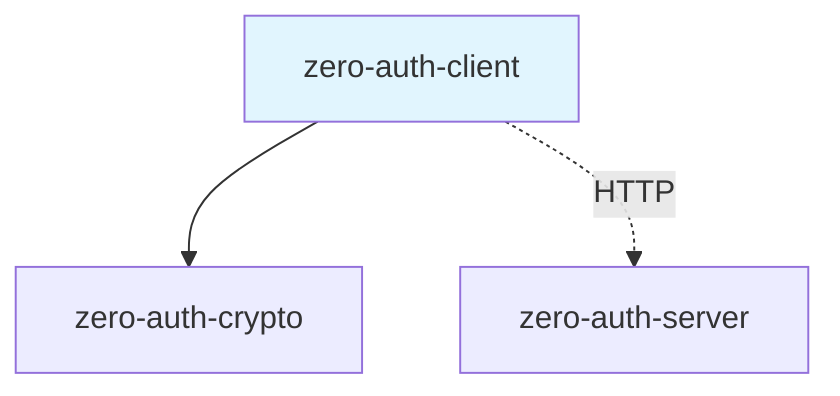
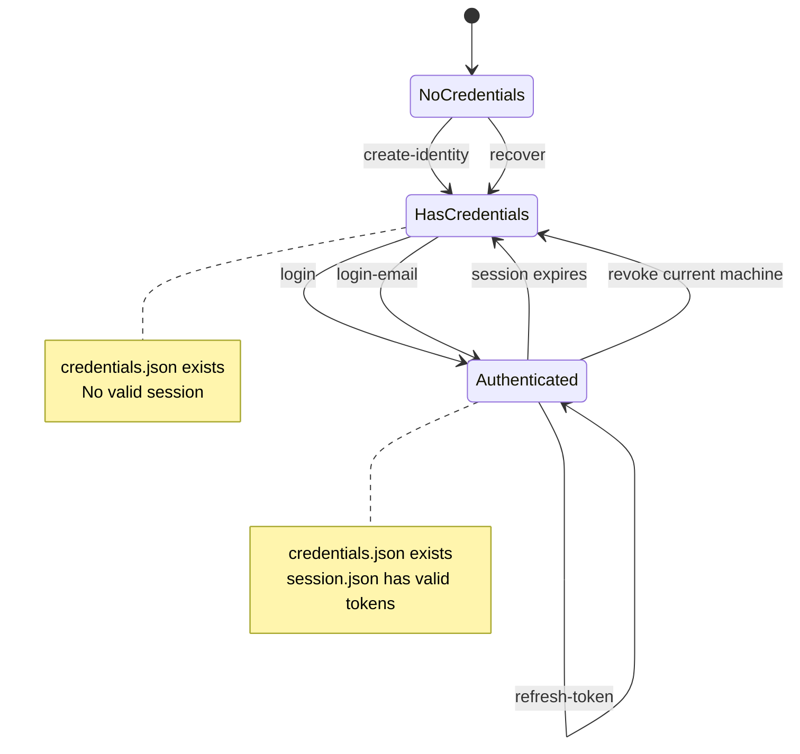
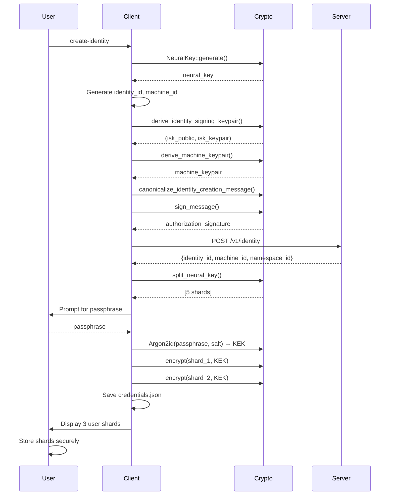
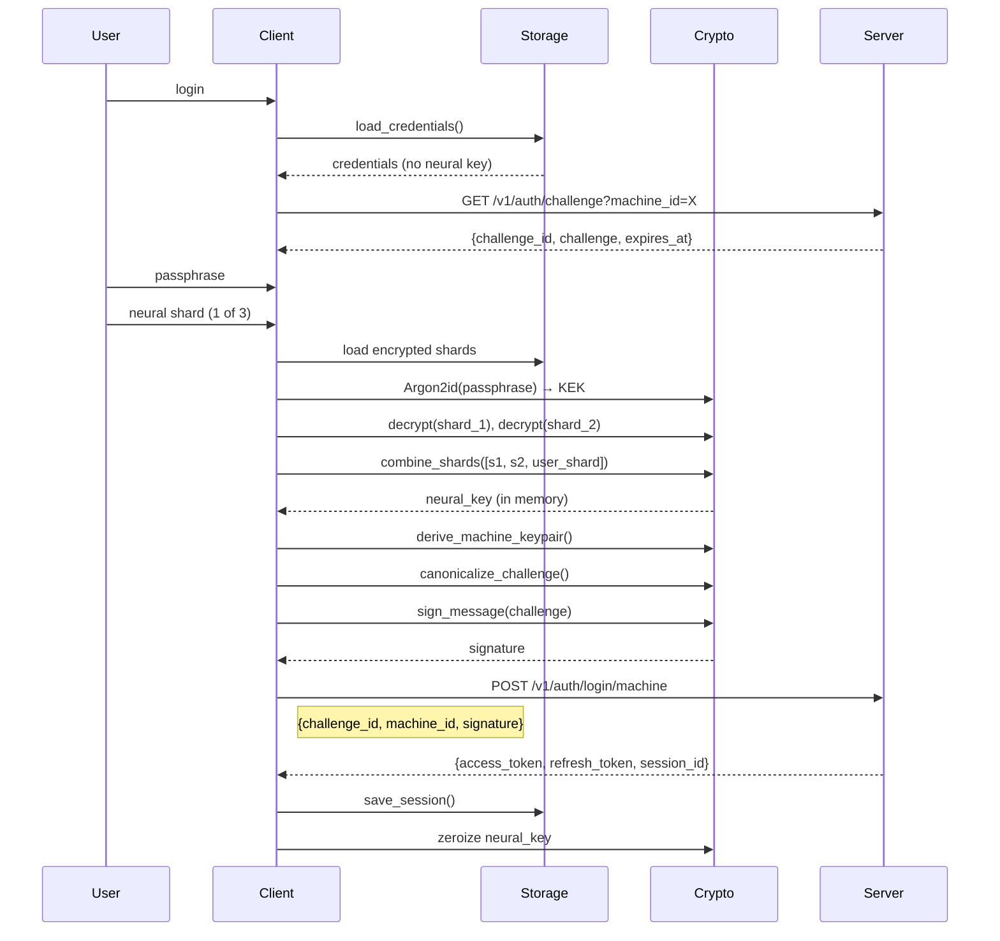
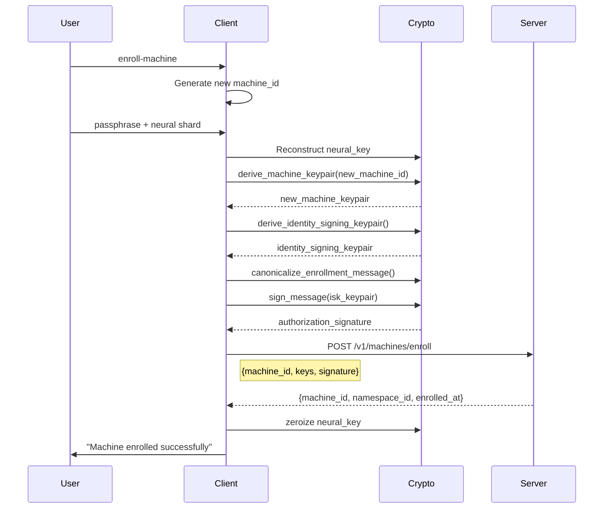
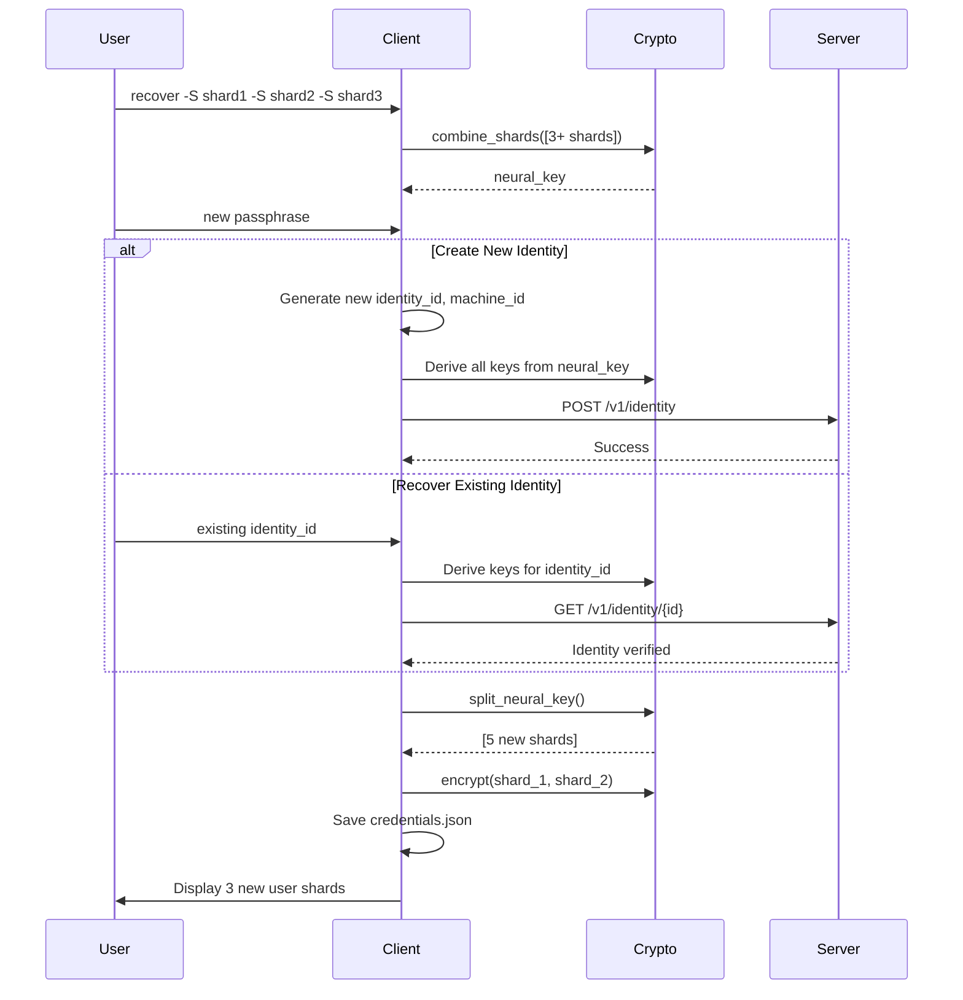

# zero-auth-client Specification v0.1

## 1. Overview

The `zero-auth-client` crate provides a command-line interface (CLI) for interacting with Zero-Auth. It demonstrates the complete client-side workflow including identity creation, machine key authentication, token management, and Neural Key recovery using the 2+1 Neural Shard split storage model.

### 1.1 Purpose and Responsibilities

- **Identity Management**: Create new identities with client-side cryptography
- **Authentication**: Machine key challenge-response and email/password login
- **Token Management**: Validate, refresh, and store JWT access tokens
- **Machine Management**: Enroll new devices, list machines, revoke compromised devices
- **Credential Storage**: Secure local storage with Neural Shard encryption
- **Recovery**: Reconstruct Neural Key from 3+ Neural Shards

### 1.2 Key Design Decisions

- **Client-Side Cryptography**: Neural Key generation and all key derivations happen locally
- **2+1 Neural Shard Split**: 2 shards encrypted on device + 1 user shard required for login
- **No Persistent Neural Key**: Neural Key is NEVER written to disk, only reconstructed in memory
- **Passphrase Protection**: KEK derived via Argon2id from user passphrase
- **HTTP Client**: Uses `reqwest` for async HTTP communication with server

### 1.3 Position in Dependency Graph



---

## 2. Public Interface

### 2.1 CLI Structure

```rust
#[derive(Parser)]
#[command(name = "client")]
#[command(about = "Official client for zero-auth integration")]
struct Cli {
    #[command(subcommand)]
    command: Commands,

    /// Zero-auth server URL
    #[arg(short, long, default_value = "http://127.0.0.1:9999")]
    server: String,
}

#[derive(Subcommand)]
enum Commands {
    // Identity & Authentication
    CreateIdentity { device_name: String, platform: String },
    Login,
    LoginEmail { email: String, password: String, machine_id: Option<String> },
    
    // Token Management
    ValidateToken { token: String },
    RefreshToken,
    TestProtected,
    
    // Credential Management
    AddEmail { email: String, password: String },
    ShowCredentials,
    
    // Machine Management
    EnrollMachine { device_name: String, platform: String },
    ListMachines,
    RevokeMachine { machine_id: String, reason: String },
    
    // Recovery
    Recover { shard: Vec<String>, device_name: String, platform: String },
}
```

### 2.2 Local Storage Types

```rust
/// Client credentials with 2+1 Neural Shard split storage
#[derive(Serialize, Deserialize, Zeroize, ZeroizeOnDrop)]
pub struct ClientCredentials {
    /// Encrypted Neural Shard 1 (XChaCha20-Poly1305)
    pub encrypted_shard_1: Vec<u8>,      // 33 + 16 = 49 bytes
    /// Encrypted Neural Shard 2 (XChaCha20-Poly1305)
    pub encrypted_shard_2: Vec<u8>,      // 33 + 16 = 49 bytes
    /// Nonce for shard encryption (24 bytes)
    pub shards_nonce: Vec<u8>,           // 24 bytes
    /// Salt for Argon2id KEK derivation (32 bytes)
    pub kek_salt: Vec<u8>,               // 32 bytes
    
    pub identity_id: Uuid,
    pub machine_id: Uuid,
    pub identity_signing_public_key: String,   // hex
    pub machine_signing_public_key: String,    // hex
    pub machine_encryption_public_key: String, // hex
    pub device_name: String,
    pub device_platform: String,
}

/// Session data stored after login
#[derive(Serialize, Deserialize, Zeroize, ZeroizeOnDrop)]
pub struct SessionData {
    pub access_token: String,
    pub refresh_token: String,
    pub session_id: Uuid,
    pub expires_at: String,
}
```

### 2.3 API Response Types

```rust
pub struct CreateIdentityResponse {
    pub identity_id: Uuid,
    pub machine_id: Uuid,
    pub namespace_id: Uuid,
    pub created_at: String,
}

pub struct ChallengeResponse {
    pub challenge_id: Uuid,
    pub challenge: String,      // Base64-encoded challenge
    pub expires_at: String,
}

pub struct LoginResponse {
    pub access_token: String,
    pub refresh_token: String,
    pub session_id: Uuid,
    pub machine_id: Uuid,
    pub expires_at: String,
    pub warning: Option<String>,
}

pub struct IntrospectResponse {
    pub active: bool,
    pub identity_id: Option<Uuid>,
    pub machine_id: Option<Uuid>,
    pub mfa_verified: Option<bool>,
    pub capabilities: Option<Vec<String>>,
    pub revocation_epoch: Option<u32>,
    pub exp: Option<i64>,
}

pub struct RefreshResponse {
    pub access_token: String,
    pub refresh_token: String,
    pub expires_at: String,
}
```

---

## 3. State Machines

### 3.1 Client State Machine



### 3.2 Neural Key Lifecycle

```mermaid
stateDiagram-v2
    [*] --> Generated: NeuralKey::generate()
    
    Generated --> Split: split_neural_key()
    Split --> Stored: save_credentials_with_shards()
    Split --> UserShards: 3 shards given to user
    
    Stored --> Reconstructed: load_and_reconstruct()
    UserShards --> Reconstructed: 1 shard provided
    
    Reconstructed --> InMemory: combine_shards()
    InMemory --> Zeroized: operation complete
    Zeroized --> [*]
    
    note right of Stored
        2 shards encrypted
        on device
    end note
    
    note right of UserShards
        User stores securely
        offline
    end note
    
    note right of InMemory
        Neural Key reconstructed
        ONLY in memory
    end note
```

---

## 4. Control Flow

### 4.1 Identity Creation Flow



### 4.2 Machine Key Login Flow



### 4.3 Machine Enrollment Flow



### 4.4 Recovery Flow



---

## 5. Data Structures

### 5.1 Local File Storage

| File | Location | Purpose |
|------|----------|---------|
| `credentials.json` | `.session/credentials.json` | Encrypted shards + public keys |
| `session.json` | `.session/session.json` | Active session tokens |

### 5.2 Credentials File Format

```json
{
  "encrypted_shard_1": "hex-encoded ciphertext (49 bytes)",
  "encrypted_shard_2": "hex-encoded ciphertext (49 bytes)",
  "shards_nonce": "hex-encoded nonce (24 bytes)",
  "kek_salt": "hex-encoded salt (32 bytes)",
  "identity_id": "uuid",
  "machine_id": "uuid",
  "identity_signing_public_key": "hex (64 chars)",
  "machine_signing_public_key": "hex (64 chars)",
  "machine_encryption_public_key": "hex (64 chars)",
  "device_name": "string",
  "device_platform": "string"
}
```

### 5.3 Session File Format

```json
{
  "access_token": "JWT string",
  "refresh_token": "opaque token",
  "session_id": "uuid",
  "expires_at": "ISO8601 timestamp"
}
```

### 5.4 Neural Shard Storage Model

```
Neural Key (32 bytes, client-generated)
    │
    └── split_neural_key() → 5 Neural Shards (Shamir 3-of-5)
            │
            ├── Shard 0: Encrypted on device
            ├── Shard 1: Encrypted on device
            ├── Shard 2: User Shard A (displayed once)
            ├── Shard 3: User Shard B (displayed once)
            └── Shard 4: User Shard C (displayed once)

Login requires:
    Passphrase (decrypts shards 0,1)
  + 1 User Shard
  = 3 shards (threshold met)
```

---

## 6. Security Considerations

### 6.1 Neural Key Protection

| Threat | Mitigation |
|--------|------------|
| Device compromise | 2 shards alone reveal nothing (information-theoretic security) |
| Memory scraping | KEK and Neural Key zeroized immediately after use |
| Passphrase brute-force | Argon2id with 64 MiB memory, 3 iterations |
| Nonce reuse | Unique 24-byte random nonce per encryption |

### 6.2 Argon2id Parameters

```rust
const ARGON2_M_COST: u32 = 65536;  // 64 MiB memory
const ARGON2_T_COST: u32 = 3;      // 3 iterations
const ARGON2_P_COST: u32 = 4;      // 4 parallelism
```

### 6.3 Domain Separation

```rust
const SHARD_ENCRYPTION_DOMAIN: &[u8] = b"zero-auth:client:neural-shard-encryption:v1";
```

### 6.4 Password Requirements

For email credentials:
- Length: 12-128 characters
- Must contain: uppercase, lowercase, digit, special character

### 6.5 Secure Memory Handling

All sensitive types implement `Zeroize` and `ZeroizeOnDrop`:

```rust
#[derive(Zeroize, ZeroizeOnDrop)]
pub struct ClientCredentials { ... }

#[derive(Zeroize, ZeroizeOnDrop)]
pub struct SessionData { ... }
```

### 6.6 Legacy Migration

The client supports migration from older format (encrypted whole Neural Key):

```rust
pub fn migrate_legacy_credentials(passphrase: &str) -> Result<[NeuralShard; 3]>;
```

Detection:
```rust
pub fn is_legacy_credentials() -> bool {
    // Check for "encrypted_neural_key" field in credentials.json
}
```

---

## 7. Dependencies

### 7.1 Internal Dependencies

| Crate | Version | Purpose |
|-------|---------|---------|
| `zero-auth-crypto` | path | Client-side cryptography |

### 7.2 External Dependencies

| Crate | Version | Purpose |
|-------|---------|---------|
| `reqwest` | 0.11 | HTTP client |
| `tokio` | 1.35 | Async runtime |
| `serde` | 1.0 | Serialization |
| `serde_json` | 1.0 | JSON format |
| `uuid` | 1.6 | UUID generation |
| `clap` | 4.4 | CLI framework |
| `anyhow` | 1.0 | Error handling |
| `chrono` | 0.4 | Time handling |
| `hex` | 0.4 | Hex encoding |
| `base64` | 0.22 | Base64 encoding |
| `colored` | 2.1 | Terminal colors |
| `zeroize` | 1.7 | Secure memory |
| `rpassword` | 7.3 | Hidden password input |
| `argon2` | 0.5 | KEK derivation |
| `rand` | 0.8 | Random generation |

---

## 8. Command Reference

### 8.1 Identity & Authentication

| Command | Description | Requires Auth |
|---------|-------------|---------------|
| `create-identity` | Create new identity with Neural Key | No |
| `login` | Machine key challenge-response auth | No (needs credentials) |
| `login-email` | Email/password authentication | No |
| `recover` | Reconstruct from 3+ Neural Shards | No |

### 8.2 Token Management

| Command | Description | Requires Auth |
|---------|-------------|---------------|
| `validate-token` | Introspect a JWT token | No |
| `refresh-token` | Get new access token | No (needs session) |
| `test-protected` | Test token validation flow | No (needs session) |

### 8.3 Credential Management

| Command | Description | Requires Auth |
|---------|-------------|---------------|
| `add-email` | Add email credential to identity | Yes |
| `show-credentials` | Display stored credentials | No (needs credentials) |

### 8.4 Machine Management

| Command | Description | Requires Auth |
|---------|-------------|---------------|
| `enroll-machine` | Enroll new device | Yes |
| `list-machines` | List all enrolled machines | Yes |
| `revoke-machine` | Revoke a machine | Yes |

---

## 9. API Endpoint Mapping

| Command | HTTP Method | Endpoint |
|---------|-------------|----------|
| `create-identity` | POST | `/v1/identity` |
| `login` (challenge) | GET | `/v1/auth/challenge` |
| `login` (complete) | POST | `/v1/auth/login/machine` |
| `login-email` | POST | `/v1/auth/login/email` |
| `validate-token` | POST | `/v1/auth/introspect` |
| `refresh-token` | POST | `/v1/auth/refresh` |
| `add-email` | POST | `/v1/credentials/email` |
| `enroll-machine` | POST | `/v1/machines/enroll` |
| `list-machines` | GET | `/v1/machines` |
| `revoke-machine` | DELETE | `/v1/machines/{id}` |
