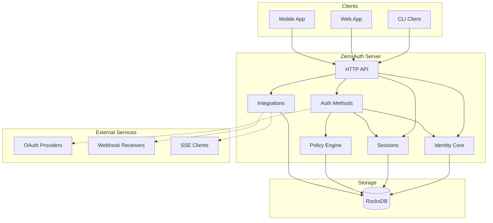
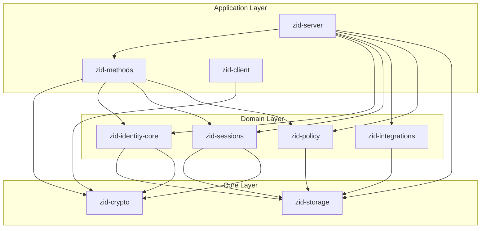
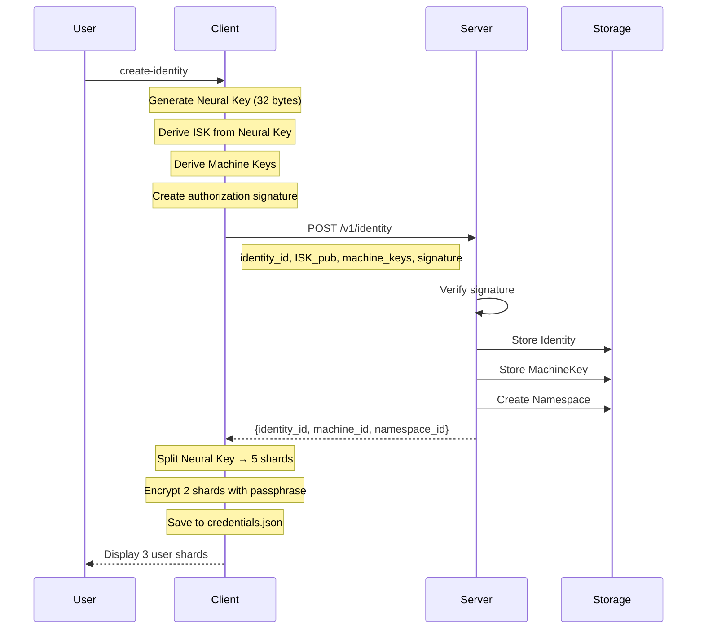
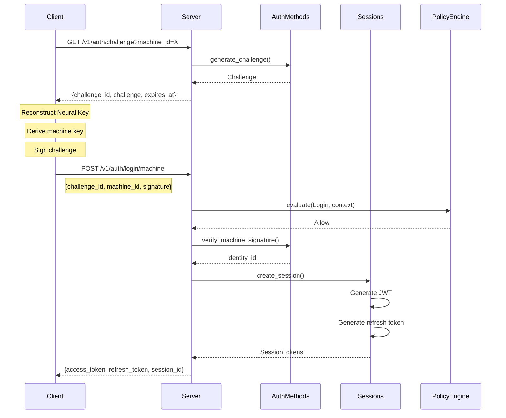
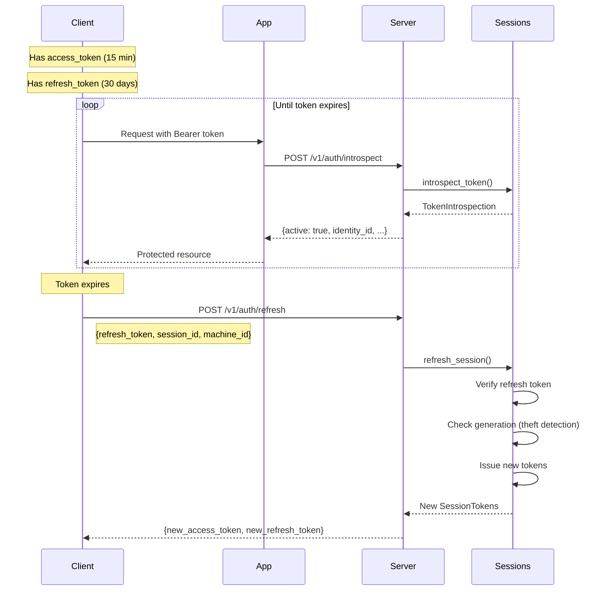
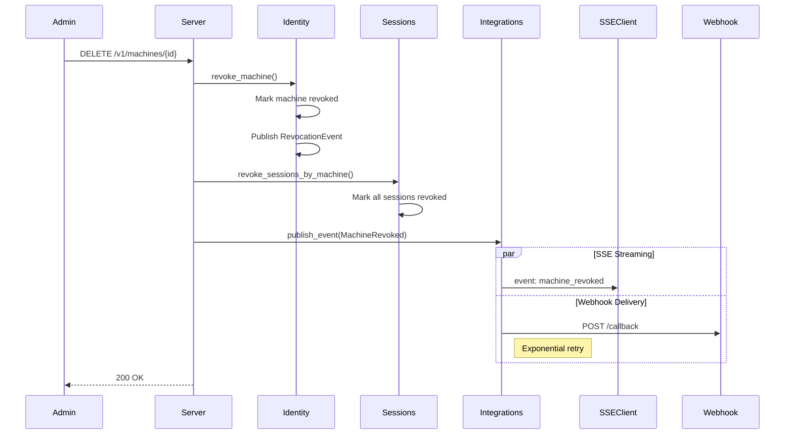
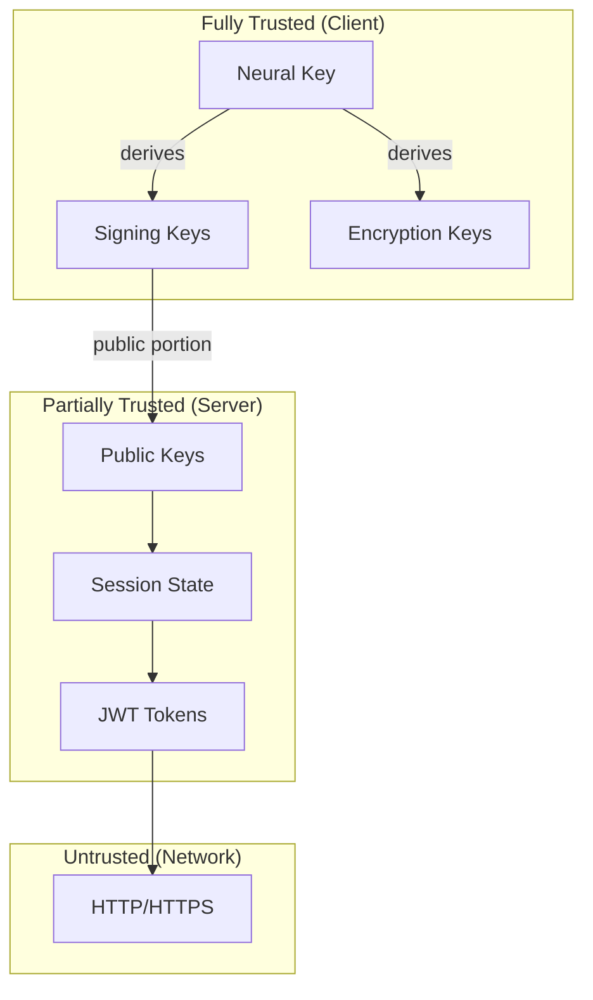
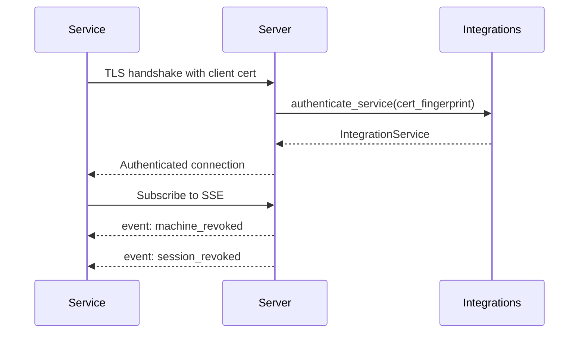

# Zero-Auth System Overview v0.1

## 1. Introduction

Zero-Auth is a cryptographic identity and authentication system built on the principle of **neural keys** — client-generated root secrets that never leave the user's device. This document provides a comprehensive overview of the entire system architecture, data flows, and security model.

### 1.1 Design Philosophy

- **Zero-Knowledge Server**: Server never sees the Neural Key or private keys
- **Client-Side Cryptography**: All key generation and signing happens on the client
- **Machine-Based Authentication**: Devices authenticate via cryptographic challenge-response
- **Hierarchical Key Derivation**: All keys derived deterministically from the Neural Key
- **Revocation Propagation**: Real-time notification of security events to integrations

### 1.2 Core Concepts

| Concept | Description |
|---------|-------------|
| **Neural Key** | 32-byte root secret, client-generated, never transmitted |
| **Identity** | A cryptographic entity identified by its signing public key |
| **Machine** | A device authorized to act on behalf of an identity |
| **Namespace** | Logical grouping for access control and multi-tenancy |
| **Session** | Time-bound authentication state with JWT tokens |

---

## 2. Architecture

### 2.1 System Components



### 2.2 Crate Dependency Graph



### 2.3 Crate Responsibilities

| Crate | Responsibility |
|-------|----------------|
| `zid-crypto` | Key derivation, encryption, signatures, Shamir secret sharing |
| `zid-storage` | Storage abstraction, RocksDB implementation, column families |
| `zid-policy` | Rate limiting, reputation scoring, authorization decisions |
| `zid-identity-core` | Identity, machine, and namespace lifecycle management |
| `zid-integrations` | mTLS service auth, SSE streaming, webhook delivery |
| `zid-sessions` | JWT issuance, token refresh, introspection, key rotation |
| `zid-methods` | Machine, email, OAuth, wallet, and MFA authentication |
| `zid-server` | HTTP API, middleware, request handling |
| `zid-client` | CLI interface, local credential storage |

---

## 3. Key Hierarchy

### 3.1 Derivation Tree

```
NeuralKey (32 bytes, client-generated, never leaves device)
│
├─── Identity Signing Key (ISK)
│    ├── Algorithm: Ed25519
│    ├── Derivation: HKDF("cypher:id:identity:v1" || identity_id)
│    └── Purpose: Signs machine enrollments, key rotations
│
├─── Machine Keys (per machine_id, epoch)
│    ├── Machine Seed: HKDF("cypher:shared:machine:v1" || identity_id || machine_id || epoch)
│    │
│    ├── Signing Key (Ed25519)
│    │   ├── Derivation: HKDF(seed, "cypher:shared:machine:sign:v1" || machine_id)
│    │   └── Purpose: Signs authentication challenges
│    │
│    └── Encryption Key (X25519)
│        ├── Derivation: HKDF(seed, "cypher:shared:machine:encrypt:v1" || machine_id)
│        └── Purpose: ECDH key agreement, data encryption
│
└─── MFA KEK
     ├── Derivation: HKDF("cypher:id:mfa-kek:v1" || identity_id)
     └── Purpose: Encrypts MFA TOTP secrets at rest
```

### 3.2 Domain Separation Strings

All domain strings follow the format: `cypher:{service}:{purpose}:v{version}`

| Domain String | Purpose |
|---------------|---------|
| `cypher:id:identity:v1` | Identity signing key derivation |
| `cypher:shared:machine:v1` | Machine seed derivation |
| `cypher:shared:machine:sign:v1` | Machine signing key |
| `cypher:shared:machine:encrypt:v1` | Machine encryption key |
| `cypher:id:mfa-kek:v1` | MFA secret encryption |
| `cypher:shared:session:encryption:v1` | Session key encryption |

---

## 4. Data Flow

### 4.1 Identity Creation



### 4.2 Authentication Flow



### 4.3 Token Lifecycle



### 4.4 Revocation Propagation



---

## 5. Storage Schema

### 5.1 Column Families

Zero-Auth uses RocksDB with 29 column families for data isolation:

| Category | Column Families | Purpose |
|----------|-----------------|---------|
| **Core** | `identities`, `machine_keys`, `namespaces` | Primary entities |
| **Indexes** | `machine_keys_by_identity`, `machine_keys_by_namespace`, `namespaces_by_identity` | Efficient lookups |
| **Auth** | `auth_credentials`, `mfa_secrets`, `challenges`, `used_nonces` | Authentication state |
| **OAuth** | `oauth_states`, `oauth_links`, `oauth_links_by_identity`, `oidc_nonces`, `jwks_cache` | OAuth/OIDC |
| **Sessions** | `sessions`, `sessions_by_identity`, `sessions_by_token_hash`, `refresh_tokens`, `refresh_tokens_by_family`, `signing_keys` | Session management |
| **Integrations** | `integration_services`, `integration_services_by_cert`, `revocation_events`, `webhook_delivery_log` | External integrations |
| **Wallet** | `wallet_credentials`, `wallet_credentials_by_identity` | Crypto wallet auth |
| **Policy** | `reputation` | Rate limiting state |

### 5.2 Key Format Conventions

```
Primary key:     {entity_type}:{id}
Index key:       {entity}:by_{field}:{field_value}:{id}
Composite key:   {type}:{parent_id}:{child_id}

Examples:
  identity:550e8400-e29b-41d4-a716-446655440000
  machine_key:by_identity:550e8400-...:660f9511-...
  session:by_token_hash:blake3(token)
```

---

## 6. Security Model

### 6.1 Trust Boundaries



### 6.2 Cryptographic Guarantees

| Property | Implementation |
|----------|----------------|
| **Signing** | Ed25519 (128-bit security) |
| **Key Exchange** | X25519 ECDH |
| **Encryption** | XChaCha20-Poly1305 (256-bit key, 192-bit nonce) |
| **Hashing** | BLAKE3 (fast), SHA-256 (compatibility) |
| **Password Hashing** | Argon2id (64 MiB, 3 iterations) |
| **Secret Sharing** | Shamir's 3-of-5 over GF(256) |
| **JWT Signing** | EdDSA with Ed25519 |

### 6.3 Attack Mitigations

| Attack | Mitigation |
|--------|------------|
| Neural Key theft | 2+1 Neural Shard split (need device + passphrase + user shard) |
| Replay attacks | Challenge nonces with 60-second expiry |
| Token theft | Short-lived access tokens (15 min), token binding |
| Refresh token theft | Generation tracking, family revocation |
| Brute force | Argon2id, rate limiting, reputation system |
| Machine compromise | Per-device keys, immediate revocation, epoch rotation |

### 6.4 Rate Limiting

| Resource | Limit | Window |
|----------|-------|--------|
| Login attempts (IP) | 10 | 1 minute |
| Login attempts (identity) | 5 | 1 minute |
| Challenge requests | 20 | 1 minute |
| Token refresh | 60 | 1 minute |
| Identity creation | 5 | 1 hour |

---

## 7. Authentication Methods

### 7.1 Supported Methods

| Method | Primary Factor | Second Factor | Use Case |
|--------|----------------|---------------|----------|
| **Machine Key** | Ed25519 signature | Optional TOTP | Device authentication |
| **Email/Password** | Argon2id hash | Optional TOTP | Cross-device login |
| **OAuth** | Provider token | Optional TOTP | Social login (Google, X, Epic) |
| **Wallet** | SECP256k1 signature | Optional TOTP | Web3 authentication |

### 7.2 MFA Support

- **TOTP**: RFC 6238 compliant, 6-digit codes, 30-second step
- **Recovery Codes**: 8 single-use codes, generated at setup
- **Enforcement**: Per-namespace policy configuration

---

## 8. Integration Points

### 8.1 Service Authentication

External services authenticate via mTLS with X.509 client certificates:



### 8.2 Event Types

| Event | Payload | Triggered By |
|-------|---------|--------------|
| `machine_revoked` | machine_id, identity_id, reason | Machine revocation |
| `session_revoked` | session_id, machine_id | Session revocation |
| `identity_frozen` | identity_id, reason | Identity freeze |
| `key_rotated` | identity_id, epoch | Key rotation |

### 8.3 Webhook Delivery

- **Retry Policy**: Exponential backoff (1s, 2s, 4s, 8s, 16s, max 32s)
- **Max Retries**: 5 attempts
- **Signature**: HMAC-SHA256 in `X-Zero-Auth-Signature` header
- **Timeout**: 30 seconds per request

---

## 9. Operational Considerations

### 9.1 Configuration

| Setting | Environment Variable | Default |
|---------|---------------------|---------|
| Server bind address | `BIND_ADDRESS` | `127.0.0.1:9999` |
| Database path | `DATABASE_PATH` | `./data/zid.db` |
| Service master key | `SERVICE_MASTER_KEY` | Required in prod |
| JWT issuer | `JWT_ISSUER` | `https://zid.cypher.io` |
| Access token expiry | `ACCESS_TOKEN_EXPIRY` | 900 (15 min) |
| Refresh token expiry | `REFRESH_TOKEN_EXPIRY` | 2592000 (30 days) |

### 9.2 Monitoring Endpoints

| Endpoint | Purpose |
|----------|---------|
| `GET /health` | Liveness probe |
| `GET /health/ready` | Readiness probe (checks storage) |

### 9.3 JWKS Endpoint

```
GET /.well-known/jwks.json
```

Returns public keys for local JWT validation by clients.

---

## 10. Client Integration

### 10.1 Token Validation Options

| Method | Latency | Freshness | Use Case |
|--------|---------|-----------|----------|
| **Introspection** | Higher (network) | Real-time | Revocation-sensitive |
| **JWKS Validation** | Lower (local) | Cached keys | High-throughput APIs |

### 10.2 Integration Flow

```mermaid
graph LR
    subgraph "Your Application"
        HANDLER[Request Handler]
        VALIDATOR[Token Validator]
    end
    
    subgraph "Zero-Auth"
        INTROSPECT[/v1/auth/introspect]
        JWKS[/.well-known/jwks.json]
    end
    
    CLIENT[Client] -->|Bearer token| HANDLER
    HANDLER --> VALIDATOR
    
    VALIDATOR -->|Option 1| INTROSPECT
    VALIDATOR -->|Option 2| JWKS
    
    INTROSPECT -->|{active, identity_id}| VALIDATOR
    JWKS -->|Public keys| VALIDATOR
    
    VALIDATOR -->|identity_id| HANDLER
```

### 10.3 SDK Patterns

```rust
// Pattern 1: Introspection
async fn validate_via_introspection(token: &str) -> Result<Claims> {
    let response = client
        .post("http://zid:9999/v1/auth/introspect")
        .json(&json!({"token": token, "operation_type": "read"}))
        .send()
        .await?;
    
    let introspection: IntrospectResponse = response.json().await?;
    if introspection.active {
        Ok(introspection.into())
    } else {
        Err(AuthError::InvalidToken)
    }
}

// Pattern 2: Local JWKS validation
async fn validate_via_jwks(token: &str, jwks: &JwkSet) -> Result<Claims> {
    let header = decode_header(token)?;
    let key = jwks.find(&header.kid)?;
    let claims = decode(token, &key, &Validation::new(Algorithm::EdDSA))?;
    Ok(claims)
}
```

---

## 11. Version History

| Version | Date | Changes |
|---------|------|---------|
| 0.1 | 2026-01 | Initial specification |
