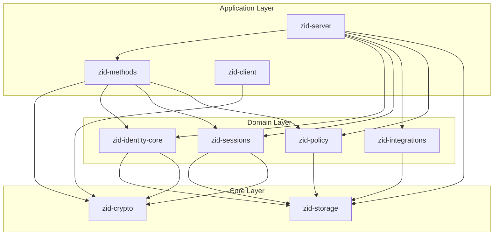

# Zero-Auth Specification v0.1

This directory contains the comprehensive specification for Zero-Auth v0.1, a cryptographic identity and authentication system built on neural keys and machine-based authentication.

## Document Index

The specifications are organized by dependency order, starting with the most fundamental crates.

| # | Document | Crate | Description |
|---|----------|-------|-------------|
| 01 | [01-crypto.md](./01-crypto.md) | `zid-crypto` | Cryptographic primitives: key derivation, encryption, signatures, Shamir |
| 02 | [02-storage.md](./02-storage.md) | `zid-storage` | Storage abstraction: traits, column families, batch operations |
| 03 | [03-policy.md](./03-policy.md) | `zid-policy` | Policy engine: rate limiting, reputation, authorization decisions |
| 04 | [04-identity-core.md](./04-identity-core.md) | `zid-identity-core` | Identity management: identities, machines, namespaces, revocation |
| 05 | [05-integrations.md](./05-integrations.md) | `zid-integrations` | External integrations: mTLS auth, SSE streaming, webhooks |
| 06 | [06-sessions.md](./06-sessions.md) | `zid-sessions` | Session management: JWT issuance, refresh tokens, introspection |
| 07 | [07-methods.md](./07-methods.md) | `zid-methods` | Authentication methods: machine, email, OAuth, wallet, MFA |
| 08 | [08-server.md](./08-server.md) | `zid-server` | HTTP API server: endpoints, middleware, request handling |
| 09 | [09-client.md](./09-client.md) | `zid-client` | CLI client: commands, local storage, user workflows |
| 10 | [10-system-overview.md](./10-system-overview.md) | — | System architecture: dependency graph, data flows, security model |
| 11 | [11-crypto-primitives.md](./11-crypto-primitives.md) | — | Cryptographic primitives: algorithms, libraries, binary formats |

## Dependency Graph

## Canonical Specification Structure

Each crate specification follows this standardized structure to ensure consistency and completeness:

### 1. Overview
- Purpose and responsibilities of the crate
- Position in the dependency graph
- Key design decisions

### 2. Public Interface
- Traits with complete method signatures
- Types (structs, enums) with field definitions
- Error types and error handling patterns

### 3. State Machines
- Entity state diagrams (using Mermaid `stateDiagram-v2`)
- Valid state transitions with triggers
- Invariants that must be maintained

### 4. Control Flow
- Key operation flows (using Mermaid `sequenceDiagram`)
- Decision points and branching logic
- Error handling and recovery paths

### 5. Data Structures
- Storage schemas (column families, key formats)
- Binary message formats with byte layouts
- Serialization formats (CBOR, JSON)

### 6. Security Considerations
- Cryptographic requirements and guarantees
- Input validation rules
- Threat model and mitigations

### 7. Dependencies
- Internal crate dependencies with version constraints
- External library dependencies with versions
- Feature flags and optional dependencies

## Version History

| Version | Date | Description |
|---------|------|-------------|
| 0.1 | 2026-01 | Initial specification |

## Reading Order

For newcomers to the codebase, we recommend this reading order:

1. **[10-system-overview.md](./10-system-overview.md)** — Start here for the big picture
2. **[11-crypto-primitives.md](./11-crypto-primitives.md)** — Understand the cryptographic foundations
3. **[01-crypto.md](./01-crypto.md)** — Deep dive into the crypto crate
4. **[04-identity-core.md](./04-identity-core.md)** — Core identity concepts
5. **[07-methods.md](./07-methods.md)** — Authentication flows
6. **[06-sessions.md](./06-sessions.md)** — Session and token management
7. **[08-server.md](./08-server.md)** — API reference

For those focused on specific areas:

- **Storage implementers**: [02-storage.md](./02-storage.md)
- **Policy configuration**: [03-policy.md](./03-policy.md)
- **Integration developers**: [05-integrations.md](./05-integrations.md)
- **CLI users**: [09-client.md](./09-client.md)

## Conventions

### Diagrams

All diagrams use [Mermaid](https://mermaid.js.org/) syntax for portability:

- **Dependency graphs**: `graph TD` (top-down) or `graph LR` (left-right)
- **State machines**: `stateDiagram-v2`
- **Sequence diagrams**: `sequenceDiagram`
- **Class diagrams**: `classDiagram`

### Code Examples

- Rust code examples are provided for all public interfaces
- Examples are self-contained and can be verified against the implementation
- Error handling is shown explicitly

### Terminology

| Term | Definition |
|------|------------|
| **Neural Key** | 32-byte root secret from which all identity keys are derived |
| **Identity** | A unique entity in the system, identified by its signing public key |
| **Machine** | A device/client authorized to act on behalf of an identity |
| **ISK** | Identity Signing Key — Ed25519 keypair derived from neural key |
| **MPK** | Machine Public Key — The public portion of a machine's signing key |
| **Namespace** | A logical grouping for access control and policy application |
| **Epoch** | Version counter for key rotation (starts at 0) |

## Contributing

When updating specifications:

1. Follow the canonical structure outlined above
2. Include Mermaid diagrams for complex flows
3. Provide concrete examples with actual byte sizes
4. Update this README if adding new documents
5. Increment version numbers for breaking changes
